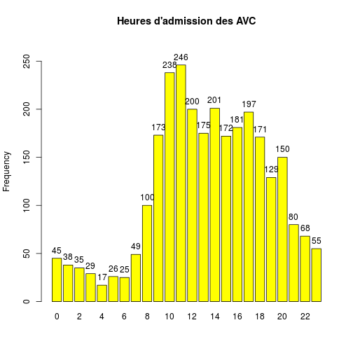
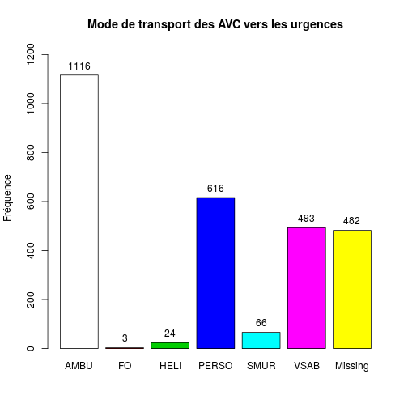
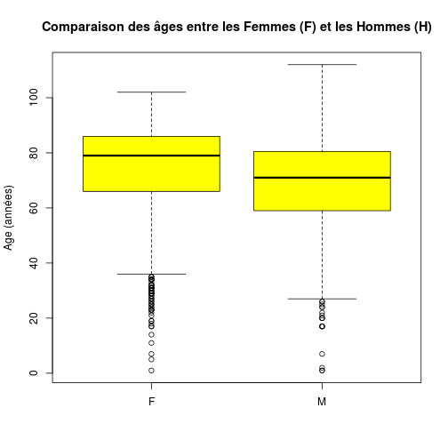
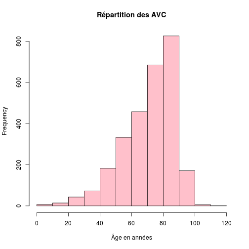
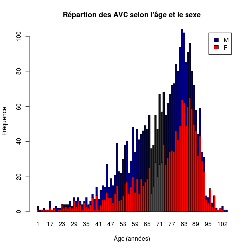
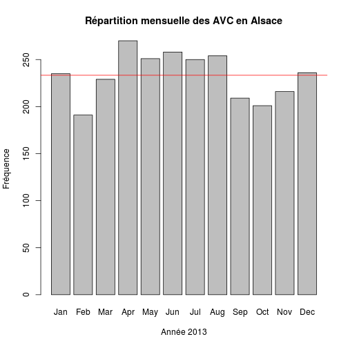
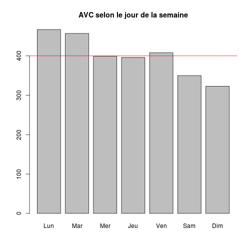
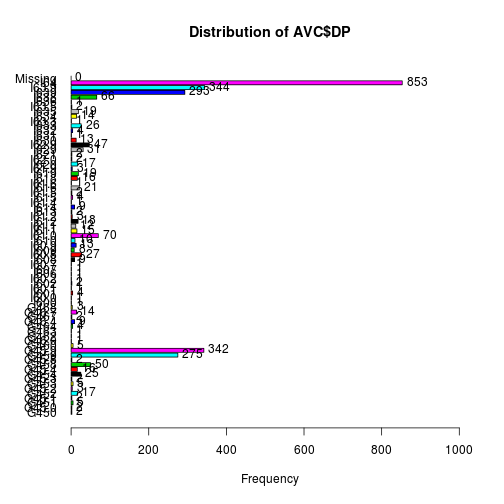

CIM 10 - Etude des AVC
========================================================

```{}
source("../Chapitres/prologue.R")
load("../../rpu2013d0112.Rda")
nrow(d1)

# Création d'un dataframe DP
dpr<-d1[!is.na(d1$DP),c("DP","CODE_POSTAL","ENTREE","FINESS","GRAVITE","ORIENTATION","MODE_SORTIE","AGE","SEXE","TRANSPORT","DESTINATION")]

AVC<-dpr[substr(dpr$DP,1,3)>="I60" & substr(dpr$DP,1,3)<"I65" | substr(dpr$DP,1,3)=="G46" | substr(dpr$DP,1,3)=="G45" ,]
getwd()
save(AVC, file="avc.Rda")
```

AVC
---

On travaille uniquement sur le fichier AVC

  

```
h : 
        Frequency Percent Cum. percent
0              45     1.6          1.6
1              38     1.4          3.0
2              35     1.2          4.2
3              29     1.0          5.2
4              17     0.6          5.9
5              26     0.9          6.8
6              25     0.9          7.7
7              49     1.8          9.4
8             100     3.6         13.0
9             173     6.2         19.2
10            238     8.5         27.7
11            246     8.8         36.5
12            200     7.1         43.6
13            175     6.2         49.9
14            201     7.2         57.0
15            172     6.1         63.2
16            181     6.5         69.6
17            197     7.0         76.7
18            171     6.1         82.8
19            129     4.6         87.4
20            150     5.4         92.8
21             80     2.9         95.6
22             68     2.4         98.0
23             55     2.0        100.0
  Total      2800   100.0        100.0
```

```
 AMBU    FO  HELI PERSO  SMUR  VSAB  NA's 
 1116     3    24   616    66   493   482 
```

 

```
Mode.transport : 
        Frequency   %(NA+)   %(NA-)
AMBU         1116     39.9     48.1
FO              3      0.1      0.1
HELI           24      0.9      1.0
PERSO         616     22.0     26.6
SMUR           66      2.4      2.8
VSAB          493     17.6     21.3
NA's          482     17.2      0.0
  Total      2800    100.0    100.0
```

 

```
       NA  Mutation Transfert  Domicile     Décès      NA's 
        0      1986       147       353         0       314 
```

```
       NA  Mutation Transfert  Domicile     Décès 
       NA     71.82     68.63     70.30        NA 
```

 

```
Call:
   aov(formula = AVC$AGE ~ AVC$MODE_SORTIE)

Terms:
                AVC$MODE_SORTIE Residuals
Sum of Squares             1907    634720
Deg. of Freedom               2      2483

Residual standard error: 15.99
Estimated effects may be unbalanced
314 observations deleted due to missingness
```

```
                  Df Sum Sq Mean Sq F value Pr(>F)  
AVC$MODE_SORTIE    2   1907     953    3.73  0.024 *
Residuals       2483 634720     256                 
---
Signif. codes:  0 '***' 0.001 '**' 0.01 '*' 0.05 '.' 0.1 ' ' 1
314 observations deleted due to missingness
```

```
[1] "AVC par étalissement"
```

```
3Fr Alk Col Dia Geb Hag Hus Mul Odi Sel Wis Sav 
 68  32 677   0  25 543 432 659   1 266  97   0 
```

```
[1] "Devenir des AVC par établissement"
```

```
     
       NA Mutation Transfert Domicile Décès
  3Fr   0        1         1       27     0
  Alk   0       23         2        6     0
  Col   0      599        23       52     0
  Dia   0        0         0        0     0
  Geb   0        1         3        4     0
  Hag   0      331       106       66     0
  Hus   0      381         0       11     0
  Mul   0      362         9      115     0
  Odi   0        0         0        1     0
  Sel   0      206         0       60     0
  Wis   0       82         3       11     0
  Sav   0        0         0        0     0
```

```
[1] "taux de transfert par établissement (en %)"
```

```
  3Fr   Alk   Col   Dia   Geb   Hag   Hus   Mul   Odi   Sel   Wis   Sav 
50.00  8.00  3.70   NaN 75.00 24.26  0.00  2.43   NaN  0.00  3.53   NaN 
```

```
[1] "Saverne ne cote pas la CIM 10"
```

```
[1] "Sélestat ne transfère pas ?"
```

  


- Nombre d'AVC ayant fait l'objet d'un RPU en 2013: 2800
- sex-ratio 0.897
- age moyen: 71.4 ans, médiane 75 ans, écart inter-quartile 62-84 ans.
- L'age moyen des femmes (

```

Error in eval(expr, envir, enclos) : objet 'w' introuvable

```

 ans) est plus élevé que celui des hommes (

```

Error in eval(expr, envir, enclos) : objet 'w' introuvable

```

 ans) (p = 

```

Error in eval(expr, envir, enclos) : objet 'w' introuvable

```

).
- taux hospitalisation brut (NA inclus): 0.7618
- taux hospitalisation corrigé (NA exclus): 0.858
- % d'arrivée en journée (8h-20h) 77.96 %

Différence AGE selon le SEXE
----------------------------


```r
w <- t.test(AVC$AGE ~ factor(AVC$SEXE), alternative = "two.sided")
w
```

```
## 
## 	Welch Two Sample t-test
## 
## data:  AVC$AGE by factor(AVC$SEXE)
## t = 8.991, df = 2795, p-value < 2.2e-16
## alternative hypothesis: true difference in means is not equal to 0
## 95 percent confidence interval:
##  4.229 6.589
## sample estimates:
## mean in group F mean in group M 
##           73.96           68.55
```

- age moyen des femmes 73.958
- age moyen des hommes 68.5491
- t = 8.991 (p < 4.4089 &times; 10<sup>-19</sup>)

Par mois
--------

```r
m <- month(AVC$ENTREE, label = TRUE)
summary(m)
```

```
## Jan Feb Mar Apr May Jun Jul Aug Sep Oct Nov Dec 
## 235 191 229 270 251 258 250 254 209 201 216 236
```

```r
barplot(summary(m), main = "Répartition mensuelle des AVC en Alsace", xlab = "Année 2013", 
    ylab = "Fréquence")
abline(h = mean(summary(m)), col = "red")
```

 

```r
mean(summary(m))
```

```
## [1] 233.3
```


Selon le jour de la semaine
---------------------------


```r
library("gdata")
```

```
## gdata: read.xls support for 'XLS' (Excel 97-2004) files ENABLED.
## 
## gdata: read.xls support for 'XLSX' (Excel 2007+) files ENABLED.
## 
## Attaching package: 'gdata'
## 
## L'objet suivant est masqué from 'package:stats':
## 
##     nobs
## 
## L'objet suivant est masqué from 'package:utils':
## 
##     object.size
```

```r
w <- wday(AVC$ENTREE, label = TRUE)
levels(w) <- c("Dim", "Lun", "Mar", "Mer", "Jeu", "Ven", "Sam")
table(w)
```

```
## w
## Dim Lun Mar Mer Jeu Ven Sam 
## 323 467 457 399 396 408 350
```

```r
round(prop.table(table(w)) * 100, 2)
```

```
## w
##   Dim   Lun   Mar   Mer   Jeu   Ven   Sam 
## 11.54 16.68 16.32 14.25 14.14 14.57 12.50
```

```r


# plot(w,main='AVC selon le jour de la semaine')
# abline(h=nrow(AVC)/7,col='red') on rordonne pour que la semaine commence
# le lundi
w2 <- reorder(w, new.order = c("Lun", "Mar", "Mer", "Jeu", "Ven", "Sam", "Dim"))
plot(w2, main = "AVC selon le jour de la semaine")
abline(h = nrow(AVC)/7, col = "red")
```

 

Proportion théorique = 14.28\% par jour de la semaine.

Selon le type
-------------

```r
x <- tab1(AVC$DP, horiz = TRUE)
```

 

```r
x
```

```
## AVC$DP : 
##         Frequency Percent Cum. percent
## G450            2     0.1          0.1
## G45.0           2     0.1          0.1
## G451            5     0.2          0.3
## G45.1           2     0.1          0.4
## G452           17     0.6          1.0
## G45.2           3     0.1          1.1
## G453            5     0.2          1.3
## G45.3           2     0.1          1.4
## G454           25     0.9          2.2
## G45.4          16     0.6          2.8
## G458           50     1.8          4.6
## G45.8           2     0.1          4.7
## G459          275     9.8         14.5
## G45.9         342    12.2         26.7
## G460            5     0.2         26.9
## G46.0           1     0.0         26.9
## G462            1     0.0         27.0
## G463            1     0.0         27.0
## G464            4     0.1         27.1
## G46.4           9     0.3         27.5
## G467            2     0.1         27.5
## G46.7          14     0.5         28.0
## G468            3     0.1         28.1
## I600            1     0.0         28.2
## I60.0           1     0.0         28.2
## I601            4     0.1         28.4
## I60.1           1     0.0         28.4
## I602            2     0.1         28.5
## I60.2           1     0.0         28.5
## I606            1     0.0         28.5
## I607            1     0.0         28.6
## I60.7           1     0.0         28.6
## I608            9     0.3         28.9
## I60.8          27     1.0         29.9
## I609            8     0.3         30.2
## I60.9          13     0.5         30.6
## I610           10     0.4         31.0
## I61.0          70     2.5         33.5
## I611           15     0.5         34.0
## I61.1          12     0.4         34.5
## I612           18     0.6         35.1
## I61.2           3     0.1         35.2
## I613            2     0.1         35.3
## I614            9     0.3         35.6
## I61.4           1     0.0         35.6
## I615            4     0.1         35.8
## I61.5           2     0.1         35.9
## I616           21     0.8         36.6
## I61.6           1     0.0         36.6
## I618           16     0.6         37.2
## I619           19     0.7         37.9
## I61.9           3     0.1         38.0
## I620           17     0.6         38.6
## I62.0           2     0.1         38.7
## I621            2     0.1         38.8
## I629           31     1.1         39.9
## I62.9          47     1.7         41.5
## I630           13     0.5         42.0
## I631            1     0.0         42.0
## I632            4     0.1         42.2
## I633           26     0.9         43.1
## I63.3           1     0.0         43.1
## I634           14     0.5         43.6
## I635           19     0.7         44.3
## I63.5           2     0.1         44.4
## I636            1     0.0         44.4
## I638           66     2.4         46.8
## I639          293    10.5         57.2
## I63.9         344    12.3         69.5
## I64           853    30.5        100.0
##   Total      2800   100.0        100.0
```


