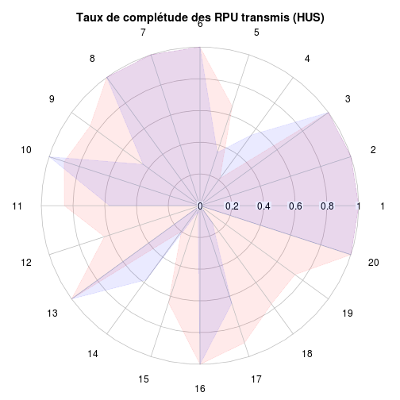

acteurs
========================================================

On s'intéresse au taux de complétude des données. Pour cela on compte le nombre de non-réponses (NA) pour chacun des 20 items. Le résultat est stocké dans le vecteur **a**. On obtient un vecteur de pourcentage correspondant aux taux de non réponses. On affiche l'inverse, 1-a, correspondant au taux de complétude des RPU transmis. Le tout est présenté sous forme d'un diagramme en *radar* à 20 branches.
-**a** matrice de 20 colonnes et *n* lignes, *n* = nombre de RPU
-**b**matrice identique mais pour le mis de septembre


```r
getwd()
```

```
## [1] "/home/jcb/Documents/Resural/Stat Resural/RPU2013/Chapitres"
```

```r
source("prologue.R")
```

```
## gdata: read.xls support for 'XLS' (Excel 97-2004) files ENABLED.
## 
## gdata: read.xls support for 'XLSX' (Excel 2007+) files ENABLED.
## 
## Attaching package: 'gdata'
## 
## L'objet suivant est masqué from 'package:stats':
## 
##     nobs
## 
## L'objet suivant est masqué from 'package:utils':
## 
##     object.size
## 
## Loading required package: questionr
## Loading required namespace: car
## 
## Attaching package: 'rgrs'
## 
## Les objets suivants sont masqués from 'package:questionr':
## 
##     copie, copie.default, copie.proptab, cprop, cramer.v,
##     format.proptab, freq, lprop, print.proptab, prop, quant.cut,
##     renomme.variable, residus, wtd.mean, wtd.table, wtd.var
## 
## Rattle : une interface graphique gratuite pour l'exploration de données avec R.
## Version 2.6.26 r77 Copyright (c) 2006-2013 Togaware Pty Ltd.
## Entrez 'rattle()' pour secouer, faire vibrer, et faire défiler vos données.
## Loading required package: foreign
## Loading required package: survival
## Loading required package: splines
## Loading required package: MASS
## Loading required package: nnet
## 
## Attaching package: 'zoo'
## 
## Les objets suivants sont masqués from 'package:base':
## 
##     as.Date, as.Date.numeric
## 
## Please visit openintro.org for free statistics materials
## 
## Attaching package: 'openintro'
## 
## L'objet suivant est masqué from 'package:MASS':
## 
##     mammals
## 
## L'objet suivant est masqué from 'package:datasets':
## 
##     cars
```

```
## [1] "Fichier courant: rpu2013d0110.Rda"
```

```r
d1 <- foo("../")

a <- apply(is.na(d1), 2, mean)
round(a * 100, 2)
```

```
##            id   CODE_POSTAL       COMMUNE   DESTINATION            DP 
##          0.00          0.00          0.00         78.86         33.60 
##        ENTREE       EXTRACT        FINESS       GRAVITE   MODE_ENTREE 
##          0.00          0.00          0.00         14.30         10.15 
##   MODE_SORTIE         MOTIF     NAISSANCE   ORIENTATION    PROVENANCE 
##         14.60         36.52          0.00         80.07         35.36 
##          SEXE        SORTIE     TRANSPORT TRANSPORT_PEC           AGE 
##          0.00          9.24         22.78         25.75          0.00
```

```r
radial.plot(1 - a, rp.type = "p", radial.pos = NULL, labels = c(1:20), line.col = "red", 
    radial.lim = c(0, 1), main = "Taux de complétude des RPU transmis")
```

 

Deux ou plusieurs polygones
---------------------------
On compare les résultats de lannée à ceux du mois de septembre:
- on dessinne une première grille comme précédemment.Le polygone est tracé en rouge.
- on trace un second polygone en bleu qui représente lesdonnées du mois de septembre. Pour qe le second polygone vienne en surimpression sans effacer lepremier, on ajoute l'instruction **add=TRUE**. Il faut également laisser **radial.lim** pour que les deux polygones soient à la même échelle.

```r
radial.plot(1 - a, rp.type = "p", radial.pos = NULL, labels = c(1:20), line.col = "red", 
    radial.lim = c(0, 1), main = "Taux de complétude des RPU transmis")
```

 

```r

load("../rpu2013d09.Rda")
```

```
## Warning: impossible d'ouvrir le fichier compressé '../rpu2013d09.Rda',
## cause probable : 'Aucun fichier ou dossier de ce type'
```

```
## Error: impossible d'ouvrir la connexion
```

```r
b <- apply(is.na(d09), 2, mean)
```

```
## Error: objet 'd09' introuvable
```

```r
radial.plot(1 - b, rp.type = "p", radial.pos = NULL, labels = c(1:20), line.col = "blue", 
    radial.lim = c(0, 1), add = T)
```

```
## Error: objet 'b' introuvable
```

Comparaison par hôpital:

```r
fadeBlue <- fadeColor("blue", fade = "15")
fadeRed <- fadeColor("red", fade = "15")

hus <- d1[d1$FINESS == "Hus", ]
b <- apply(is.na(hus), 2, mean)

radial.plot(1 - a, rp.type = "p", radial.pos = NULL, labels = c(1:20), line.col = fadeRed, 
    radial.lim = c(0, 1), main = "Taux de complétude des RPU transmis (HUS)", 
    poly.col = fadeRed)
radial.plot(1 - b, rp.type = "p", radial.pos = NULL, labels = c(1:20), line.col = fadeBlue, 
    poly.col = fadeBlue, radial.lim = c(0, 1), add = T)
```

 

```r

# Wissembourg

wis <- d1[d1$FINESS == "Wis", ]
b <- apply(is.na(wis), 2, mean)

radial.plot(1 - a, rp.type = "p", radial.pos = NULL, labels = c(1:20), line.col = fadeRed, 
    radial.lim = c(0, 1), main = "Taux de complétude des RPU transmis (Wissembourg)", 
    poly.col = fadeRed)
radial.plot(1 - b, rp.type = "p", radial.pos = NULL, labels = c(1:20), line.col = fadeBlue, 
    poly.col = fadeBlue, radial.lim = c(0, 1), add = T)
```

 

```r

# Colmar

col <- d1[d1$FINESS == "Col", ]
b <- apply(is.na(col), 2, mean)

radial.plot(1 - a, rp.type = "p", radial.pos = NULL, labels = c(1:20), line.col = fadeRed, 
    radial.lim = c(0, 1), main = "Taux de complétude des RPU transmis (Colmar)", 
    poly.col = fadeRed)
radial.plot(1 - b, rp.type = "p", radial.pos = NULL, labels = c(1:20), line.col = fadeBlue, 
    poly.col = fadeBlue, radial.lim = c(0, 1), add = T)
```

 

