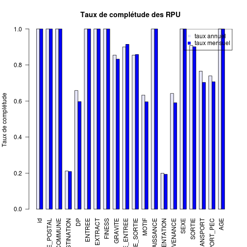

acteurs
========================================================

On s'intéresse au taux de complétude des données. Pour cela on compte le nombre de non-réponses (NA) pour chacun des 20 items. Le résultat est stocké dans le vecteur **a**. On obtient un vecteur de pourcentage correspondant aux taux de non réponses. On affiche l'inverse, 1-a, correspondant au taux de complétude des RPU transmis. Le tout est présenté sous forme d'un diagramme en *radar* à 20 branches.
-**a** matrice de 20 colonnes et *n* lignes, *n* = nombre de RPU
-**b**matrice identique mais pour le mis de septembre


```r
getwd()
```

```
## [1] "/home/jcb/Documents/Resural/Stat Resural/RPU_2013/Analyse/Chapitres/Acteurs"
```

```r
source("../prologue.R")
```

```
## Loading required package: questionr
## 
## Attaching package: 'rgrs'
## 
## Les objets suivants sont masqués from 'package:questionr':
## 
##     copie, copie.default, copie.proptab, cprop, cramer.v,
##     format.proptab, freq, lprop, print.proptab, prop, quant.cut,
##     renomme.variable, residus, wtd.mean, wtd.table, wtd.var
## 
## Rattle : une interface graphique gratuite pour l'exploration de données avec R.
## Version 2.6.26 r77 Copyright (c) 2006-2013 Togaware Pty Ltd.
## Entrez 'rattle()' pour secouer, faire vibrer, et faire défiler vos données.
## Loading required package: foreign
## Loading required package: survival
## Loading required package: splines
## Loading required package: MASS
## Loading required package: nnet
## 
## Attaching package: 'zoo'
## 
## Les objets suivants sont masqués from 'package:base':
## 
##     as.Date, as.Date.numeric
## 
## Please visit openintro.org for free statistics materials
## 
## Attaching package: 'openintro'
## 
## L'objet suivant est masqué from 'package:MASS':
## 
##     mammals
## 
## L'objet suivant est masqué from 'package:datasets':
## 
##     cars
```

```
## [1] "Fichier courant: rpu2013d0111.Rda"
```

```r

a <- apply(is.na(d1), 2, mean)
round(a * 100, 2)
```

```
##            id   CODE_POSTAL       COMMUNE   DESTINATION            DP 
##          0.00          0.00          0.00         78.81         34.17 
##        ENTREE       EXTRACT        FINESS       GRAVITE   MODE_ENTREE 
##          0.00          0.00          0.00         14.50         10.01 
##   MODE_SORTIE         MOTIF     NAISSANCE   ORIENTATION    PROVENANCE 
##         14.53         36.72          0.00         80.04         35.81 
##          SEXE        SORTIE     TRANSPORT TRANSPORT_PEC           AGE 
##          0.00          9.15         23.43         26.05          0.00
```

```r
radial.plot(1 - a, rp.type = "p", radial.pos = NULL, labels = c(1:20), line.col = "red", 
    radial.lim = c(0, 1), main = "Taux de complétude des RPU transmis")
```

```
## Warning: 'x' is NULL so the result will be NULL
## Warning: 'x' is NULL so the result will be NULL
## Warning: 'x' is NULL so the result will be NULL
```

 


Deux ou plusieurs polygones
---------------------------
On compare les résultats de lannée à ceux du mois de septembre:
- on dessine une première grille comme précédemment.Le polygone est tracé en rouge.
- on trace un second polygone en bleu qui représente lesdonnées du mois de septembre. Pour qe le second polygone vienne en surimpression sans effacer lepremier, on ajoute l'instruction **add=TRUE**. Il faut également laisser **radial.lim** pour que les deux polygones soient à la même échelle.

```r
radial.plot(1 - a, rp.type = "p", radial.pos = NULL, labels = c(1:20), line.col = "red", 
    radial.lim = c(0, 1), main = "Taux de complétude des RPU transmis")
```

```
## Warning: 'x' is NULL so the result will be NULL
## Warning: 'x' is NULL so the result will be NULL
## Warning: 'x' is NULL so the result will be NULL
```

```r

# load('../rpu2013d09.Rda')
d09 <- d1[d1$ENTREE >= "2013-09-01" & d1$ENTREE <= "2013-09-30", ]
b <- apply(is.na(d09), 2, mean)
radial.plot(1 - b, rp.type = "p", radial.pos = NULL, labels = c(1:20), line.col = "blue", 
    radial.lim = c(0, 1), add = T)
```

```
## Warning: 'x' is NULL so the result will be NULL
## Warning: 'x' is NULL so the result will be NULL
## Warning: 'x' is NULL so the result will be NULL
```

 

Taux de comolétude du mois
--------------------------

```r
c <- rbind(a, b)
c
```

```
##   id CODE_POSTAL   COMMUNE DESTINATION     DP ENTREE EXTRACT FINESS
## a  0           0 1.326e-05      0.7881 0.3417      0       0      0
## b  0           0 0.000e+00      0.7908 0.4032      0       0      0
##   GRAVITE MODE_ENTREE MODE_SORTIE  MOTIF NAISSANCE ORIENTATION PROVENANCE
## a  0.1450     0.10007      0.1453 0.3672         0      0.8004     0.3581
## b  0.1676     0.08547      0.1416 0.4042         0      0.8063     0.4098
##   SEXE  SORTIE TRANSPORT TRANSPORT_PEC       AGE
## a    0 0.09154    0.2343        0.2605 3.314e-05
## b    0 0.09890    0.2966        0.2932 0.000e+00
```

```r
barplot(1 - c, beside = T, las = 2, col = c("lavender", "blue"), ylab = "Taux de complétude", 
    main = "Taux de complétude des RPU")
legend("topright", legend = c("taux annuel", "taux mensuel"), col = c("lavender", 
    "blue"), pch = 15)
```

 


Comparaison par hôpital:

```r
fadeBlue <- fadeColor("blue", fade = "15")
fadeRed <- fadeColor("red", fade = "15")

hus <- d1[d1$FINESS == "Hus", ]
b <- apply(is.na(hus), 2, mean)

radial.plot(1 - a, rp.type = "p", radial.pos = NULL, labels = c(1:20), line.col = fadeRed, 
    radial.lim = c(0, 1), main = "Taux de complétude des RPU transmis (HUS)", 
    poly.col = fadeRed)
```

```
## Warning: 'x' is NULL so the result will be NULL
## Warning: 'x' is NULL so the result will be NULL
```

```r
radial.plot(1 - b, rp.type = "p", radial.pos = NULL, labels = c(1:20), line.col = fadeBlue, 
    poly.col = fadeBlue, radial.lim = c(0, 1), add = T)
```

```
## Warning: 'x' is NULL so the result will be NULL
## Warning: 'x' is NULL so the result will be NULL
```

 

```r

# Wissembourg

wis <- d1[d1$FINESS == "Wis", ]
b <- apply(is.na(wis), 2, mean)

radial.plot(1 - a, rp.type = "p", radial.pos = NULL, labels = c(1:20), line.col = fadeRed, 
    radial.lim = c(0, 1), main = "Taux de complétude des RPU transmis (Wissembourg)", 
    poly.col = fadeRed)
```

```
## Warning: 'x' is NULL so the result will be NULL
## Warning: 'x' is NULL so the result will be NULL
```

```r
radial.plot(1 - b, rp.type = "p", radial.pos = NULL, labels = c(1:20), line.col = fadeBlue, 
    poly.col = fadeBlue, radial.lim = c(0, 1), add = T)
```

```
## Warning: 'x' is NULL so the result will be NULL
## Warning: 'x' is NULL so the result will be NULL
```

 

```r

# Colmar

col <- d1[d1$FINESS == "Col", ]
b <- apply(is.na(col), 2, mean)

radial.plot(1 - a, rp.type = "p", radial.pos = NULL, labels = c(1:20), line.col = fadeRed, 
    radial.lim = c(0, 1), main = "Taux de complétude des RPU transmis (Colmar)", 
    poly.col = fadeRed)
```

```
## Warning: 'x' is NULL so the result will be NULL
## Warning: 'x' is NULL so the result will be NULL
```

```r
radial.plot(1 - b, rp.type = "p", radial.pos = NULL, labels = c(1:20), line.col = fadeBlue, 
    poly.col = fadeBlue, radial.lim = c(0, 1), add = T)
```

```
## Warning: 'x' is NULL so the result will be NULL
## Warning: 'x' is NULL so the result will be NULL
```

 

