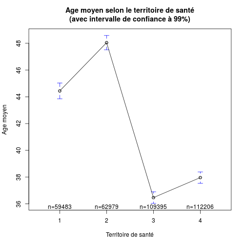
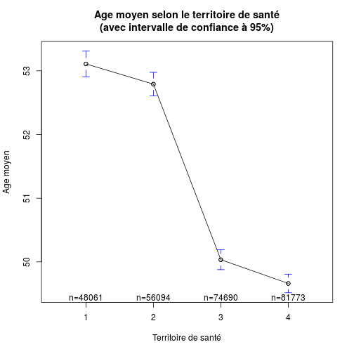
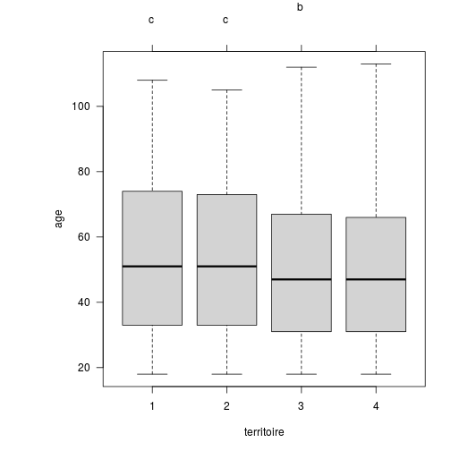

Analyse des données Par Territoire de santé (ex.secteur sanitaires)
===================================================================

Variables globales:
-------------------

```r
source("../prologue.R")
```

```
## [1] "Fichier courant: rpu2013d0112.Rda"
```

```
## Error: impossible d'ouvrir la connexion
```

```r
library("gplots")
library("multcomp")
```

entrées par Territoire de santé
-------------------------------
On creé une colonne supplémentaire *secteur* qui indique à quel secteur sanitaire correspond le RPU:

Nombre de RPU par secteur de santé

```r
tapply(d1$ENTREE,d1$secteur,length)
```

```
##      1      2      3      4 
##  59484  62981 109395 112213
```
Remarques:
- en 2013: secteur 2, manque St Anne, pediatrie HTP, une partie des RPU HUS adultes. Secteur 4, manque CH Thann.
- en 2014: en cours d'année apparaissent St Anne, pédiatrie HUS (avril 2014), Diaconat Roosvelt (), Diaconat Strasbourg (). La clinique des 3 frontières deveint propriété du CH de Mulhouse et change de Finess (Mai 2014). CH Thann en attente absobtion par Mulhouse (2015) ne fornit pas de RPU.

Age moyen
----------

```
    1     2     3     4 
44.44 48.05 36.47 37.97 
```

```
    1     2     3     4 
27.06 25.10 26.95 26.58 
```

```
 1  2  3  4 
43 47 32 35 
```

 

```
Call:
   aov(formula = age ~ territoire)

Terms:
                territoire Residuals
Sum of Squares     7009240 241978093
Deg. of Freedom          3    344059

Residual standard error: 26.52
Estimated effects may be unbalanced
10 observations deleted due to missingness
```

```
                Df   Sum Sq Mean Sq F value Pr(>F)    
territoire       3 7.01e+06 2336413    3322 <2e-16 ***
Residuals   344059 2.42e+08     703                   
---
Signif. codes:  0 '***' 0.001 '**' 0.01 '*' 0.05 '.' 0.1 ' ' 1
10 observations deleted due to missingness
```

 

```
  Tukey multiple comparisons of means
    95% family-wise confidence level

Fit: aov(formula = age ~ territoire)

$territoire
       diff     lwr     upr p adj
2-1   3.607   3.218   3.997     0
3-1  -7.972  -8.320  -7.625     0
4-1  -6.474  -6.819  -6.128     0
3-2 -11.580 -11.920 -11.239     0
4-2 -10.081 -10.420  -9.742     0
4-3   1.499   1.209   1.788     0
```

  

L'intervalle de confiance a été augmenté à  p=0.9999999 pour qu'il soit visible. A p = 0.95 on ne les voit âs car inférieurs à 1 et des messages d'avertissement sont générés. La méthode __plotCI__ fait la même chose (voir notamment le premier exemple de cette méthode).

Age moyen des adultes
---------------------

Une critique de l'analyse précédente est que l'absence de la pédiatrie strasbourgeoise explique la moyenne d'age plus élevée dans le secteur 2. On refait la même analyse uniquement avec les 18 ans et plus:


```
    1     2     3     4 
44.44 48.05 36.47 37.97 
```

```
    1     2     3     4 
27.06 25.10 26.95 26.58 
```

```
 1  2  3  4 
43 47 32 35 
```

 

```
Call:
   aov(formula = age ~ territoire)

Terms:
                territoire Residuals
Sum of Squares      608272 124526395
Deg. of Freedom          3    260614

Residual standard error: 21.86
Estimated effects may be unbalanced
10 observations deleted due to missingness
```

```
                Df   Sum Sq Mean Sq F value Pr(>F)    
territoire       3 6.08e+05  202757     424 <2e-16 ***
Residuals   260614 1.25e+08     478                   
---
Signif. codes:  0 '***' 0.001 '**' 0.01 '*' 0.05 '.' 0.1 ' ' 1
10 observations deleted due to missingness
```

 

```
  Tukey multiple comparisons of means
    95% family-wise confidence level

Fit: aov(formula = age ~ territoire)

$territoire
       diff     lwr     upr  p adj
2-1 -0.3167 -0.6658  0.0323 0.0910
3-1 -3.0743 -3.4027 -2.7459 0.0000
4-1 -3.4467 -3.7694 -3.1239 0.0000
3-2 -2.7576 -3.0713 -2.4438 0.0000
4-2 -3.1299 -3.4378 -2.8220 0.0000
4-3 -0.3723 -0.6566 -0.0881 0.0043
```

  

