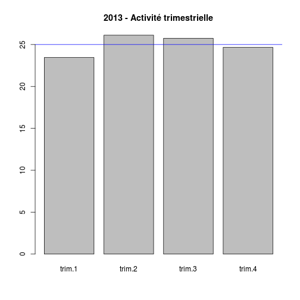
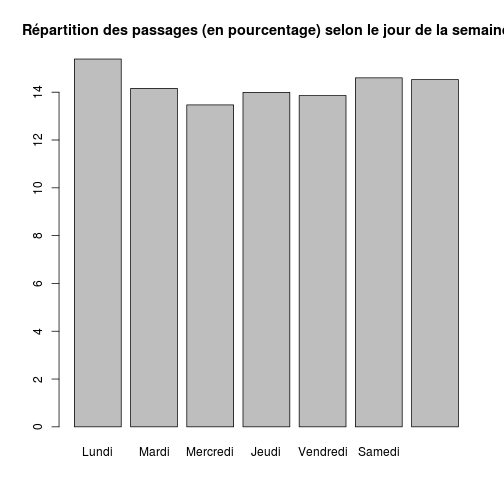

Répartition de l'activité
========================================================

```r
date()
```

```
## [1] "Thu Jan  2 19:05:07 2014"
```

```r
wd <- getwd()
wd
```

```
## [1] "/home/jcb/Documents/Resural/Stat Resural/RPU_2013/Analyse/Chapitres/Activite_mensuelle"
```

Variables globales:
-------------------

```r
source("../prologue.R")
```

```
## Loading required package: questionr
## 
## Attaching package: 'rgrs'
## 
## Les objets suivants sont masqués from 'package:questionr':
## 
##     copie, copie.default, copie.proptab, cprop, cramer.v,
##     format.proptab, freq, lprop, print.proptab, prop, quant.cut,
##     renomme.variable, residus, wtd.mean, wtd.table, wtd.var
## 
## Rattle : une interface graphique gratuite pour l'exploration de données avec R.
## Version 2.6.26 r77 Copyright (c) 2006-2013 Togaware Pty Ltd.
## Entrez 'rattle()' pour secouer, faire vibrer, et faire défiler vos données.
## Loading required package: foreign
## Loading required package: survival
## Loading required package: splines
## Loading required package: MASS
## Loading required package: nnet
## 
## Attaching package: 'zoo'
## 
## Les objets suivants sont masqués from 'package:base':
## 
##     as.Date, as.Date.numeric
## 
## Please visit openintro.org for free statistics materials
## 
## Attaching package: 'openintro'
## 
## L'objet suivant est masqué from 'package:MASS':
## 
##     mammals
## 
## L'objet suivant est masqué from 'package:datasets':
## 
##     cars
```

```
## [1] "Fichier courant: rpu2013d0111.Rda"
```

```r
N <- nrow(d1)
N
```

```
## [1] 301767
```

```r

mois_f <- c("Janvier", "Février", "Mars", "Avril", "Mai", "Juin", "Juillet", 
    "Août", "Septembre", "Octobre", "Novembre", "Décembre")
mois_c <- c("Jan", "Fév", "Mar", "Avr", "Mai", "Jui", "Jul", "Aou", "Sep", 
    "Oct", "Nov", "Déc")
trimestre_f <- c("trim.1", "trim.2", "trim.3", "trim.4")
semaine_f <- c("Lundi", "Mardi", "Mercredi", "Jeudi", "Vendredi", "Samedi", 
    "Dimanche")
```


Activité mensuelle
--------------------


```r
m <- month(d1$ENTREE, label = TRUE, abbr = F)
tm <- table(m)

nb_mois <- length(tm[tm > 0])
mois_mean <- N/nb_mois

names(tm) <- mois_f
tm
```

```
##   Janvier   Février      Mars     Avril       Mai      Juin   Juillet 
##     25609     25004     26937     28428     27899     30038     30103 
##      Août Septembre   Octobre  Novembre  Décembre 
##     28333     26688     27413     25315         0
```

```r
barplot(tm, las = 2, ylab = "")
```

 

```r

which.max(tm)
```

```
## Juillet 
##       7
```

```r
mois_max <- names(which.max(tm))

which.min(tm[tm > 0])
```

```
## Février 
##       2
```

```r
mois_min <- names(which.min(tm[tm > 0]))
```

- Mois le plus actif: Juillet (30103)
- Mois le moins actif: Février (25004)
- Moyenne mensuelle: 2.7433 &times; 10<sup>4</sup>

Activité trimesrielle
---------------------


```r
q <- quarter(d1$ENTREE)
tq <- table(q)
names(tq) <- trimestre_f
tq
```

```
## trim.1 trim.2 trim.3 trim.4 
##  77550  86365  85124  52728
```

```r
barplot(prop.table(tq) * 100, main = "2013 - Activité trimestrielle")
abline(h = 25, col = "blue")
```

 

- moyenne trimestrielle théorique: 7.5442 &times; 10<sup>4</sup>

Activité par jour de semaine
----------------------------

```r
s <- wday(d1$ENTREE)
sf <- s
sf[s == "1"] <- 7
sf[s == "2"] <- 1
sf[s == "3"] <- 2
sf[s == "4"] <- 3
sf[s == "5"] <- 4
sf[s == "6"] <- 5
sf[s == "7"] <- 6

ts <- table(sf)
names(ts) <- semaine_f
ts
```

```
##    Lundi    Mardi Mercredi    Jeudi Vendredi   Samedi Dimanche 
##    45693    42301    41089    42434    42004    44697    43549
```

```r
barplot(ts)
```

 

```r

boxplot(as.numeric(as.Date(d1$ENTREE)) ~ sf, las = 2, col = "yellow", names = semaine_f, 
    main = "Activité selon le jour de la semaine", notch = TRUE)
```

 


