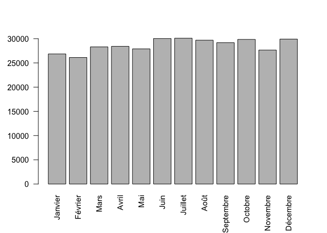
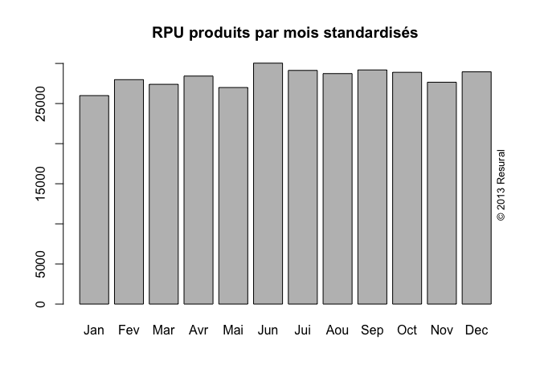
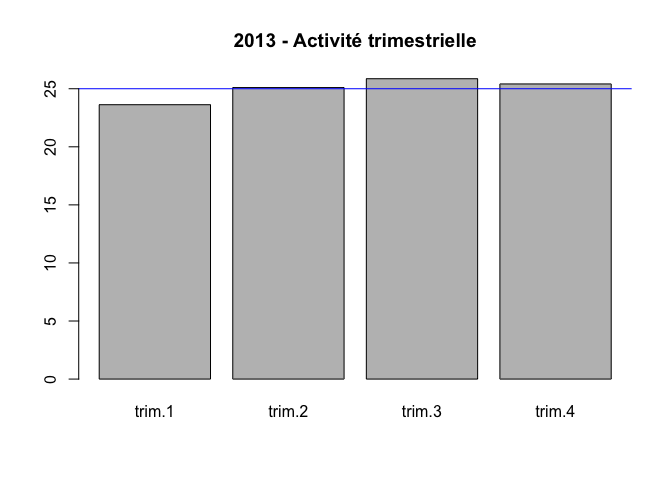
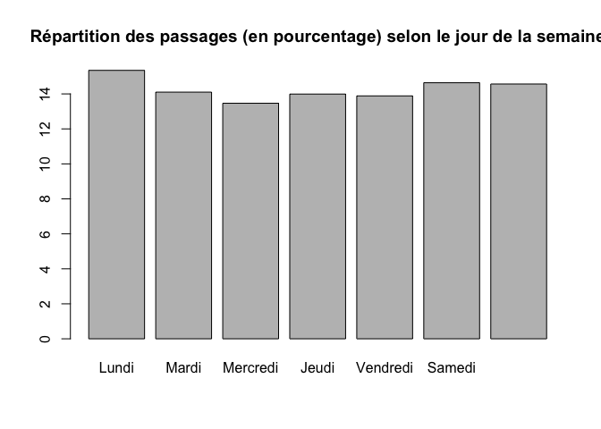
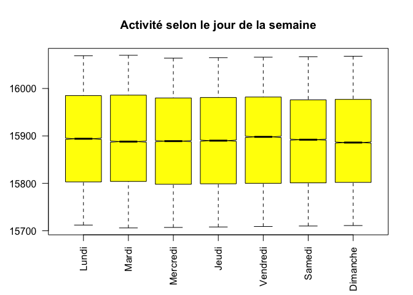
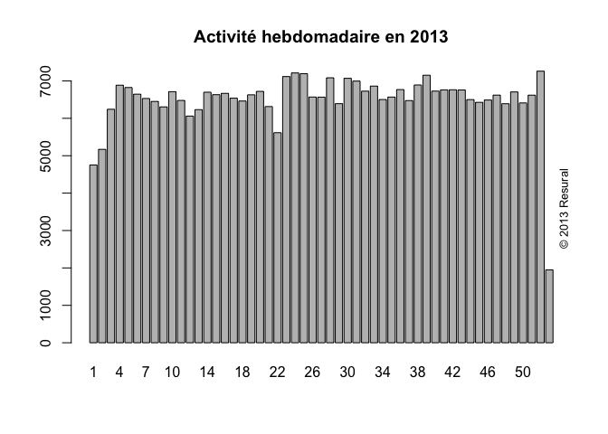

# Activité mensuelle
jcb  
16 janvier 2015  

Répartition de l'activité
========================================================

```r
date()
```

```
## [1] "Fri Jan 16 17:44:43 2015"
```

```r
wd<-getwd()
wd
```

```
## [1] "/Users/jcb/Documents/Stat Resural/RPU_2013/Analyse/Chapitres/Activite_mensuelle"
```
Variables globales:
-------------------

```r
source("../prologue.R")
```

```
## Loading required package: foreign
## Loading required package: survival
## Loading required package: splines
## Loading required package: MASS
## Loading required package: nnet
## 
## Attaching package: 'zoo'
## 
## The following objects are masked from 'package:base':
## 
##     as.Date, as.Date.numeric
```

```
## [1] "Fichier courant: rpu2013d0112.Rda"
```

```r
N <- nrow(d1)
N
```

```
## [1] 344073
```

```r
mois_f <- c("Janvier","Février","Mars","Avril","Mai","Juin","Juillet","Août","Septembre","Octobre","Novembre","Décembre")
mois_c <- c("Jan","Fév","Mar","Avr","Mai","Jui","Jul","Aou","Sep","Oct","Nov","Déc")
trimestre_f <- c("trim.1","trim.2","trim.3","trim.4")
semaine_f <- c("Lundi","Mardi","Mercredi","Jeudi","Vendredi","Samedi","Dimanche")

anc <- "2013"
```
Activité globale
----------------

```r
b <- as.Date(max(d1$ENTREE))
a <- as.Date(min(d1$ENTREE))
n_jours <- as.numeric(b-a)
moyenne_passages <- N/n_jours
```
- Nombre de passages: **344073**
- Nombre de passages par jour: **945**

Activité par établissement
--------------------------

```r
t <- table(d1$FINESS)
t
```

```
## 
##   3Fr   Alk   Col   Dia   Geb   Hag   Hus   Mul   Odi   Sel   Wis   Sav 
## 15688 10861 64758 29469 15103 34414 37018 56195 25963 29534 12646 12424
```

```r
# par établissement et par mois
t2 <- table(d1$FINESS, month(as.Date(d1$ENTREE)))
t2
```

```
##      
##          1    2    3    4    5    6    7    8    9   10   11   12
##   3Fr 1333 1255 1318 1306 1320 1466 1428 1326 1261 1237 1181 1257
##   Alk 1249 1111 1375  891  842 1026 1056  737  774  681  450  669
##   Col 5486 5214 5484 5657 5550 5762 5745 5373 4825 5421 4986 5255
##   Dia 2445 2205 2466 2489 2473 2617 2543 2461 2444 2480 2353 2493
##   Geb 1216 1070 1239 1282 1081 1481 1537 1301 1244 1292 1157 1203
##   Hag 2993 2656 2979 2999 2873 3033 3082 2927 2765 2877 2650 2580
##   Hus 3408 2993 3423 3271 3203 3052 3174 2974 2795 2782 2832 3111
##   Mul 3188 4606 4082 4914 4702 5419 4786 4922 4935 4989 4439 5213
##   Odi 2106 1889 2258 2161 2241 2302 2313 2057 2201 2182 2037 2216
##   Sel 2444 2181 2634 2426 2520 2715 2650 2292 2502 2445 2342 2383
##   Wis  990  935 1054 1032 1094 1165 1199 1052 1055 1062  975 1033
##   Sav    0    0    0    0    0    0  590 2271 2389 2410 2255 2509
```

Activité mensuelle
--------------------


```r
m <- month(d1$ENTREE, label=TRUE, abbr=F)
tm <- table(m)

nb_mois <- length(tm[tm>0])
mois_mean <- N/nb_mois

names(tm) <- mois_f
tm
```

```
##   Janvier   Février      Mars     Avril       Mai      Juin   Juillet 
##     26858     26115     28312     28428     27899     30038     30103 
##      Août Septembre   Octobre  Novembre  Décembre 
##     29693     29190     29858     27657     29922
```

```r
barplot(tm, las=2, ylab="")
```

 

```r
which.max(tm)
```

```
## Juillet 
##       7
```

```r
mois_max <- names(which.max(tm))

which.min(tm[tm>0])
```

```
## Février 
##       2
```

```r
mois_min <- names(which.min(tm[tm>0]))
```
- Mois le plus actif: Juillet (30103)
- Mois le moins actif: Février (26115)
- Moyenne mensuelle: 2.867275\times 10^{4}

Nombre de RPU par mois standards de 30 jours.
--------------------------------------------


```r
RPU.mois <- month(d1$ENTREE,label=TRUE)

nb.jour.mois <- as.numeric(diff(seq(as.Date("2013-01-01"), as.Date("2014-01-01"), by = "month"))) # source: https://stat.ethz.ch/pipermail/r-help/2007-August/138113.html
mois.normalise <- round(30 * table(RPU.mois) / nb.jour.mois, 0)
names(mois.normalise) <- mois.short
main <- paste0(anc, " - Nombre de RPU par mois standardisés de 30 jours")
barplot(mois.normalise, main="RPU produits par mois standardisés")
copyright()
```

 


Activité trimesrielle
---------------------


```r
q <- quarter(d1$ENTREE)
tq <- table(q)
names(tq) <- trimestre_f
tq
```

```
## trim.1 trim.2 trim.3 trim.4 
##  81285  86365  88986  87437
```

```r
barplot(prop.table(tq)*100, main="2013 - Activité trimestrielle")
abline(h=25, col="blue")
```

 
- moyenne trimestrielle théorique: 8.601825\times 10^{4}

Activité par jour de semaine
----------------------------

```r
s <- wday(d1$ENTREE)
sf <- s
sf[s=="1"] <- 7
sf[s=="2"] <- 1
sf[s=="3"] <- 2
sf[s=="4"] <- 3
sf[s=="5"] <- 4
sf[s=="6"] <- 5
sf[s=="7"] <- 6

ts <- table(sf)
names(ts) <- semaine_f
ts
```

```
##    Lundi    Mardi Mercredi    Jeudi Vendredi   Samedi Dimanche 
##    52804    48522    46335    48142    47782    50368    50120
```

```r
barplot(prop.table(ts) * 100, main="Répartition des passages (en pourcentage) selon le jour de la semaine")
```

 

```r
boxplot(as.numeric(as.Date(d1$ENTREE)) ~ sf, las=2, col="yellow", names=semaine_f, main="Activité selon le jour de la semaine", notch=TRUE)
```

 

Activité par semaine
--------------------


```r
m<-week(d1$ENTREE)
main <- paste0("Activité hebdomadaire en ", anc)
barplot(table(m), main=main)
copyright()
```

 

