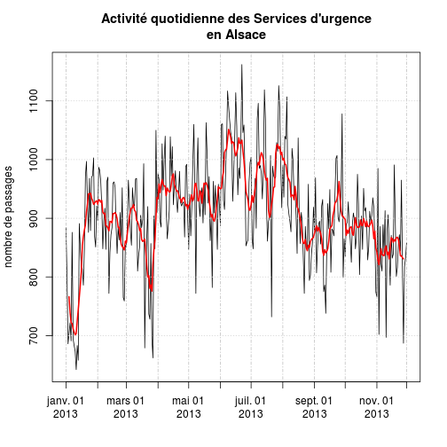
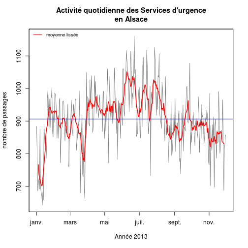
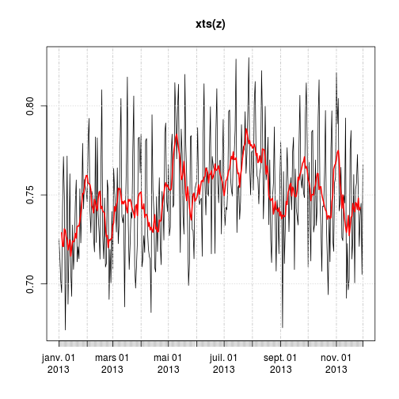
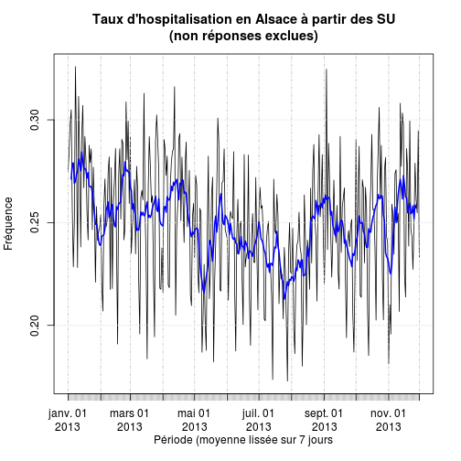

RPU 2013 Analyse
========================================================

```r
date()
```

```
## [1] "Thu Jan  2 14:00:55 2014"
```

source: RPU2013
Ce document exploite le fichier RData préparé à partir de la table *RPU__* de Sagec. Voir le document *RPU_2013_Preparation.Rmd* du dossier Resural.

EN FONCTION DU MOIS MODIFIER LES LIGNES 12, 38, 39, 40 ET 66 

Variables globales:
-------------------

```r
source("../prologue.R")
```

```
## Loading required package: questionr
## 
## Attaching package: 'rgrs'
## 
## Les objets suivants sont masqués from 'package:questionr':
## 
##     copie, copie.default, copie.proptab, cprop, cramer.v,
##     format.proptab, freq, lprop, print.proptab, prop, quant.cut,
##     renomme.variable, residus, wtd.mean, wtd.table, wtd.var
## 
## Rattle : une interface graphique gratuite pour l'exploration de données avec R.
## Version 2.6.26 r77 Copyright (c) 2006-2013 Togaware Pty Ltd.
## Entrez 'rattle()' pour secouer, faire vibrer, et faire défiler vos données.
## Loading required package: foreign
## Loading required package: survival
## Loading required package: splines
## Loading required package: MASS
## Loading required package: nnet
## 
## Attaching package: 'zoo'
## 
## Les objets suivants sont masqués from 'package:base':
## 
##     as.Date, as.Date.numeric
## 
## Please visit openintro.org for free statistics materials
## 
## Attaching package: 'openintro'
## 
## L'objet suivant est masqué from 'package:MASS':
## 
##     mammals
## 
## L'objet suivant est masqué from 'package:datasets':
## 
##     cars
```

```
## [1] "Fichier courant: rpu2013d0111.Rda"
```


Activité régionale
-----------------------------

```r
wd <- getwd()
# setwd('~/Documents/Resural/Stat
# Resural/RPU2013/Chapitres/Activite_regionale')
# source(paste(path,'mes_fonctions.R',sep=''))
```

Librairies nécessaires:
-----------------------

```r
load_libraries()
```

```
## Error: impossible de trouver la fonction "load_libraries"
```


Lecture du fichier des données
---------------------------------------
On lit le fichier de travail créé:

```r
d1 <- foo(path)

# if(!exists('d1')) { load(paste(path,'rpu2013d0109.Rda',sep='')) d1<-d0109
# rm(d0109) }
```

Analyse des données
===================

entrées par secteur sanitaire
-----------------------------
On creé une colonne supplémentaire *secteur* qui indique à quel secteur sanitaire correspond le RPU:


Nombre de RPU par secteur de santé

```r
tapply(d1$ENTREE, d1$secteur, length)
```

```
##     1     2     3     4 
## 53362 57654 91905 98846
```

Remarques:
- secteur 2, manque St Anne, pediatrie HTP, une partie des RPU HUS adulte


entrées totales
---------------

```r
# d1<-d1[d1$ENTREE<'2013-10-01',]

e <- as.Date(d1$ENTREE)
q <- tapply(e, yday(e), length)
mean(q)  # nb moyen de passages
```

```
## [1] 906.2
```

```r
plot(q, type = "l")
```

 

```r

z <- zoo(q, unique(as.Date(d1$ENTREE)))
plot(z)
```

 

```r

plot(xts(z), main = "Activité quotidienne des Services d'urgence\nen Alsace", 
    ylab = "nombre de passages", minor.ticks = FALSE)
lines(rollmean(xts(z), 7), col = "red", lwd = 2)
```

 

```r
copyright()
```

```
## Error: impossible de trouver la fonction "copyright"
```

```r

plot(z, col = "gray45", main = "Activité quotidienne des Services d'urgence\nen Alsace", 
    ylab = "nombre de passages", xlab = "Année 2013")
lines(rollmean(z, 7), col = "red", lwd = 2)
abline(h = mean(q), col = "blue")
copyright()
```

```
## Error: impossible de trouver la fonction "copyright"
```

```r
legend("topleft", legend = "moyenne lissée", col = "red", lty = 1, cex = 0.8, 
    bty = "n")
```

 

Variables:
- *e* vecteur contenant les dates d'entrées depuis le début de l'année
- *q* vecteur contenant le nombre d'entrées par jour depuis le début de l'année
- *q2* vecteur contenant le nombre de retours à domiciles par jour
- *q3* vecteur contenant la proportion de retours à domicile par rapport au nombre d'entrées, par jour (taux)
- *q4* vecteur contenant le nombre de retours à domiciles par jour en excluant les non réponses (NA)
- *q5* vecteur contenant la proportion de retours à domicile par rapport au nombre d'entrées, par jour (taux), en excluant les non réponses (NA)
- *q6* taux de non réponses
- *q7* vecteur contenant le taux d'hospitalisation par jour (miroir de q5)

Retour à domicile
-----------------
Les variation du retour journalier à domicile sont calculés de la manière suivante:
- numérateur = somme quotidienne où MODE_SOTIE == Domicile
- dénominateur = somme quotidienne des ENTREE (correspod à q)

```r
q2 <- tapply(d1[d1$MODE_SORTIE == "Domicile", 6], yday(d1[d1$MODE_SORTIE == 
    "Domicile", 6]), length)
head(q2)
```

```
##   1   2   3   4   5   6 
## 560 503 419 424 457 466
```

```r
q3 <- q2/q
summary(q3)
```

```
##    Min. 1st Qu.  Median    Mean 3rd Qu.    Max. 
##   0.568   0.618   0.638   0.642   0.662   0.772
```

```r
plot(q3, type = "l")
```

 

```r
copyright()
```

```
## Error: impossible de trouver la fonction "copyright"
```

On refait le calcul de q en tenant compte des non réponses:

```r
q4 <- tapply(d1[!is.na(d1$MODE_SORTIE), 6], yday(d1[!is.na(d1$MODE_SORTIE), 
    6]), length)
head(q4)
```

```
##   1   2   3   4   5   6 
## 772 703 597 610 615 604
```

```r
q5 <- q2/q4
head(q5)
```

```
##      1      2      3      4      5      6 
## 0.7254 0.7155 0.7018 0.6951 0.7431 0.7715
```

```r
summary(q5)
```

```
##    Min. 1st Qu.  Median    Mean 3rd Qu.    Max. 
##   0.674   0.727   0.749   0.750   0.772   0.827
```

```r
plot(q5, type = "l", main = "Taux de retour à domicile\n(non réponses exclues)", 
    ylab = "Fréquence", xlab = "Jours")
```

 

```r
copyright()
```

```
## Error: impossible de trouver la fonction "copyright"
```

```r

z <- zoo(q5, unique(as.Date(d1$ENTREE)))
plot(z, main = "Taux de retour à domicile\n(non réponses exclues)", ylab = "Fréquence", 
    xlab = "Période (moyenne lissée sur 7 jours")
```

 

```r
plot(xts(z))
lines(rollmean(xts(z), 7), col = "red", lwd = 2)
```

 

```r
copyright()
```

```
## Error: impossible de trouver la fonction "copyright"
```

Taux d'hospitalisation
----------------------
c'est le complément (miroir) du précédent:

```r
q7 <- 1 - q2/q4
head(q7)
```

```
##      1      2      3      4      5      6 
## 0.2746 0.2845 0.2982 0.3049 0.2569 0.2285
```

```r
summary(q7)
```

```
##    Min. 1st Qu.  Median    Mean 3rd Qu.    Max. 
##   0.173   0.228   0.251   0.250   0.273   0.326
```

```r
z <- zoo(q7, unique(as.Date(d1$ENTREE)))
plot(xts(z), main = "Taux d'hospitalisation en Alsace à partir des SU\n(non réponses exclues)", 
    ylab = "Fréquence", xlab = "Période (moyenne lissée sur 7 jours")
lines(rollmean(xts(z), 7), col = "blue", lwd = 2)
```

 

```r
copyright()
```

```
## Error: impossible de trouver la fonction "copyright"
```


Taux de non réponses:

```r
q6 <- q4/q
head(q6)
```

```
##      1      2      3      4      5      6 
## 0.8733 0.8777 0.8703 0.8665 0.8518 0.8741
```

```r
summary(q6)
```

```
##    Min. 1st Qu.  Median    Mean 3rd Qu.    Max. 
##   0.783   0.835   0.854   0.855   0.872   0.949
```

Vendenheim1

