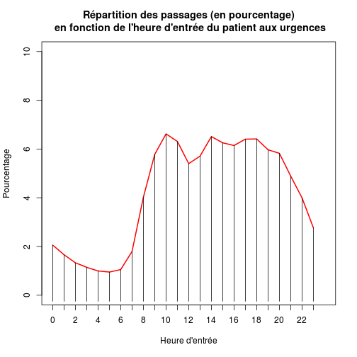
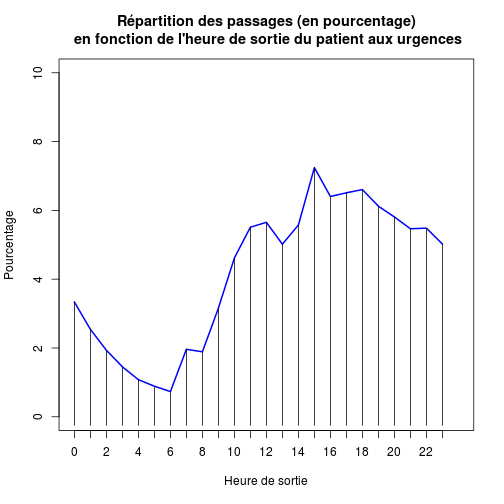
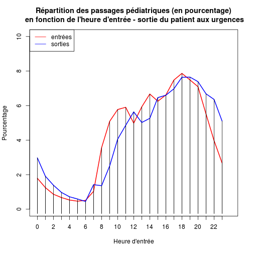
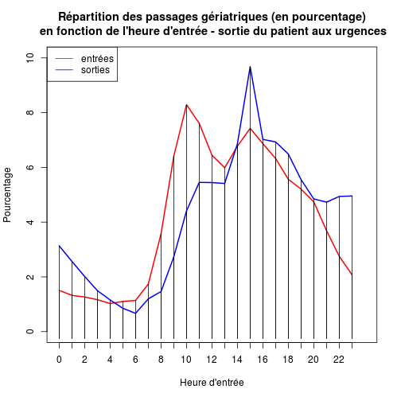
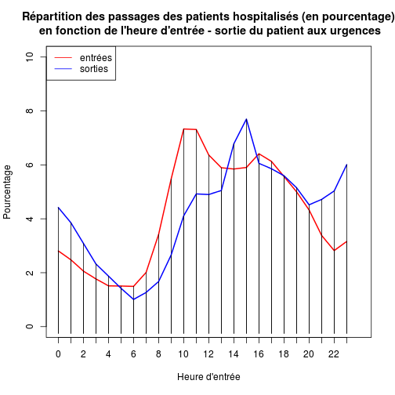
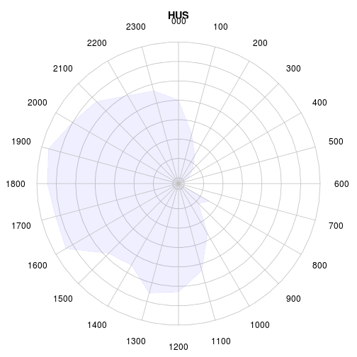
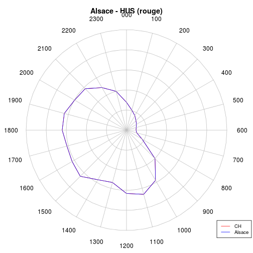
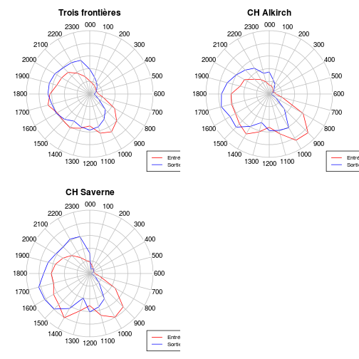

Attente au SU
========================================================

```r
date()
```

```
## [1] "Thu Jan  9 18:19:00 2014"
```

Variables globales:
-------------------
Charge le fichier source **d1**

```r
source("../prologue.R")
```

```
## Loading required package: questionr
## 
## Attaching package: 'rgrs'
## 
## Les objets suivants sont masqués from 'package:questionr':
## 
##     copie, copie.default, copie.proptab, cprop, cramer.v,
##     format.proptab, freq, lprop, print.proptab, prop, quant.cut,
##     renomme.variable, residus, wtd.mean, wtd.table, wtd.var
## 
## Rattle : une interface graphique gratuite pour l'exploration de données avec R.
## Version 2.6.26 r77 Copyright (c) 2006-2013 Togaware Pty Ltd.
## Entrez 'rattle()' pour secouer, faire vibrer, et faire défiler vos données.
## Loading required package: foreign
## Loading required package: survival
## Loading required package: splines
## Loading required package: MASS
## Loading required package: nnet
## 
## Attaching package: 'zoo'
## 
## Les objets suivants sont masqués from 'package:base':
## 
##     as.Date, as.Date.numeric
## 
## Please visit openintro.org for free statistics materials
## 
## Attaching package: 'openintro'
## 
## L'objet suivant est masqué from 'package:MASS':
## 
##     mammals
## 
## L'objet suivant est masqué from 'package:datasets':
## 
##     cars
```

```
## [1] "Fichier courant: rpu2013d0112.Rda"
```

```r
wd
```

```
## [1] "/home/jcb/Documents/Resural/Stat Resural/RPU_2013/Analyse/Chapitres/Attente SU"
```

```r
N <- nrow(d1)
N
```

```
## [1] 330594
```

Librairies nécessaires:
-----------------------

```r
load_libraries()
```

```
## Error: impossible de trouver la fonction "load_libraries"
```

Heure d'arrivée aux urgences
----------------------------
Inspiré du rapport activité de l'OruLim


```r

e <- ymd_hms(d1$ENTREE)
h <- hour(e)
sh <- table(as.factor(h))
sh
```

```
## 
##     0     1     2     3     4     5     6     7     8     9    10    11 
##  6832  5509  4412  3781  3309  3149  3477  5911 13268 19066 21900 20872 
##    12    13    14    15    16    17    18    19    20    21    22    23 
## 17877 18791 21530 20719 20293 21134 21157 19668 19317 16185 13265  9172
```

```r
psh <- plot(prop.table(sh) * 100, type = "l", col = "red", xlim = c(0, 24), 
    ylab = "Pourcentage", xlab = "Heure d'entrée", main = "Répartition des passages (en pourcentage)\n en fonction de l'heure d'entrée du patient aux urgences", 
    ylim = c(0, 10))
prsh <- prop.table(sh) * 100
for (i in 1:24) {
    segments(psh[i], -0.25, psh[i], prsh[i])
}
```

 


```r
# Sorties
s <- ymd_hms(d1$SORTIE)
h <- hour(s)
sh <- table(as.factor(h))
sh
```

```
## 
##     0     1     2     3     4     5     6     7     8     9    10    11 
##  9912  7517  5783  4417  3269  2664  2216  6033  5737  9571 13941 16639 
##    12    13    14    15    16    17    18    19    20    21    22    23 
## 17067 15116 16750 21811 19197 19456 19823 18317 17423 16288 16461 15060
```

```r
psh <- plot(prop.table(sh) * 100, type = "l", col = "blue", xlim = c(0, 24), 
    ylab = "Pourcentage", xlab = "Heure de sortie", main = "Répartition des passages (en pourcentage)\n en fonction de l'heure de sortie du patient aux urgences", 
    ylim = c(0, 10))
prsh <- prop.table(sh) * 100
for (i in 1:24) {
    segments(psh[i], -0.25, psh[i], prsh[i])
}
```

 


```r
# Entées et sorties
h <- hour(e)
sh <- table(as.factor(h))
psh <- plot(prop.table(sh) * 100, type = "l", col = "red", xlim = c(0, 24), 
    ylab = "Pourcentage", xlab = "Heure d'entrée", main = "Répartition des passages (en pourcentage)\n en fonction de l'heure d'entrée - sortie du patient aux urgences", 
    ylim = c(0, 10))
prsh <- prop.table(sh) * 100
for (i in 1:24) {
    segments(psh[i], -0.25, psh[i], prsh[i])
}

h <- hour(s)
sh <- table(as.factor(h))
lines(prop.table(sh) * 100, type = "l", col = "blue", xlim = c(0, 24), , ylim = c(0, 
    10))
prsh <- prop.table(sh) * 100
for (i in 1:24) {
    segments(psh[i], -0.25, psh[i], prsh[i])
}

legend("topleft", legend = c("entrées", "sorties"), col = c("red", "blue"), 
    lty = 1)
```

 


Diurne - Nocturne
-----------------------
- diurne: 8h - 19h59
- nocturne: 20h - 7h59

```r
h <- hour(e)
t <- table(h)  # t[1] correspond à t0
e_nocturne <- sum(t[1:8]) + sum(t[21:24])
e_diurne <- sum(t[9:20])
n <- e_diurne + e_nocturne
admission_diurne <- round(e_diurne * 100/n, 2)

h <- hour(s)
t <- table(h)  # t[1] correspond à t0
s_nocturne <- sum(t[1:8]) + sum(t[21:24])
s_diurne <- sum(t[9:20])
n <- s_diurne + s_nocturne
sortie_diurne <- round(s_diurne * 100/n, 2)
```

admission diurne: 71.47 %

**Recours nocturne: 28.53 %**

sortie diurne: 64.37 %

ratio entrée/sortie diurne: 1.22

ratio entrée/sortie nocturne: 0.88

Entrée - sorties pédiatriques
-----------------------------

NOTE: faire une fonction gébérique


```r
e <- ymd_hms(d1$ENTREE[d1$AGE < 18])
h <- hour(e)
sh <- table(as.factor(h))
psh <- plot(prop.table(sh) * 100, type = "l", col = "red", xlim = c(0, 24), 
    ylab = "Pourcentage", xlab = "Heure d'entrée", main = "Répartition des passages pédiatriques (en pourcentage)\n en fonction de l'heure d'entrée - sortie du patient aux urgences", 
    ylim = c(0, 10))
prsh <- prop.table(sh) * 100
for (i in 1:24) {
    segments(psh[i], -0.25, psh[i], prsh[i])
}

s <- ymd_hms(d1$SORTIE[d1$AGE < 18])
h <- hour(s)
sh <- table(as.factor(h))
lines(prop.table(sh) * 100, type = "l", col = "blue", xlim = c(0, 24), , ylim = c(0, 
    10))
prsh <- prop.table(sh) * 100
for (i in 1:24) {
    segments(psh[i], -0.25, psh[i], prsh[i])
}

legend("topleft", legend = c("entrées", "sorties"), col = c("red", "blue"), 
    lty = 1)
```

 


Entrée - sorties adultes
-----------------------------

NOTE: faire une fonction gébérique


```r
e <- ymd_hms(d1$ENTREE[d1$AGE >= 18 & d1$AGE < 75])
h <- hour(e)
sh <- table(as.factor(h))
psh <- plot(prop.table(sh) * 100, type = "l", col = "red", xlim = c(0, 24), 
    ylab = "Pourcentage", xlab = "Heure d'entrée", main = "Répartition des passages adultes (en pourcentage)\n en fonction de l'heure d'entrée - sortie du patient aux urgences", 
    ylim = c(0, 10))
prsh <- prop.table(sh) * 100
for (i in 1:24) {
    segments(psh[i], -0.25, psh[i], prsh[i])
}

s <- ymd_hms(d1$SORTIE[d1$AGE >= 18 & d1$AGE < 75])
h <- hour(s)
sh <- table(as.factor(h))
lines(prop.table(sh) * 100, type = "l", col = "blue", xlim = c(0, 24), , ylim = c(0, 
    10))
prsh <- prop.table(sh) * 100
for (i in 1:24) {
    segments(psh[i], -0.25, psh[i], prsh[i])
}

legend("topleft", legend = c("entrées", "sorties"), col = c("red", "blue"), 
    lty = 1)
```

 


Entrée - sorties gériatriques
-----------------------------

NOTE: faire une fonction générique


```r
e <- ymd_hms(d1$ENTREE[d1$AGE > 74])
h <- hour(e)
sh <- table(as.factor(h))
psh <- plot(prop.table(sh) * 100, type = "l", col = "red", xlim = c(0, 24), 
    ylab = "Pourcentage", xlab = "Heure d'entrée", main = "Répartition des passages gériatriques (en pourcentage)\n en fonction de l'heure d'entrée - sortie du patient aux urgences", 
    ylim = c(0, 10))
prsh <- prop.table(sh) * 100
for (i in 1:24) {
    segments(psh[i], -0.25, psh[i], prsh[i])
}

s <- ymd_hms(d1$SORTIE[d1$AGE > 74])
h <- hour(s)
sh <- table(as.factor(h))
lines(prop.table(sh) * 100, type = "l", col = "blue", xlim = c(0, 24), , ylim = c(0, 
    10))
prsh <- prop.table(sh) * 100
for (i in 1:24) {
    segments(psh[i], -0.25, psh[i], prsh[i])
}

legend("topleft", legend = c("entrées", "sorties"), col = c("red", "blue"), 
    lty = 1)
```

 


Semaine - Week-end
--------------------
- semaine: du lundi 8h au vendredi 19h59
- week-end: du vendredi 20h au lundi 7h59


```r
e_dom
```

```
## Error: objet 'e_dom' introuvable
```

```r
# admissions
semaine <- e[wday(e) %in% c(3:5) | (wday(e) == 2 & hour(e) > 7) | (wday(e) == 
    6 & hour(e) < 20)]
weekend <- e[wday(e) %in% c(7, 1) | (wday(e) == 6 & hour(e) > 19) | (wday(e) == 
    2 & hour(e) < 8)]
n_se <- length(semaine)
n_we <- length(weekend)

# sorties
s_semaine <- s[wday(s) %in% c(3:5) | (wday(s) == 2 & hour(s) > 7) | (wday(s) == 
    6 & hour(s) < 20)]
s_weekend <- s[wday(s) %in% c(7, 1) | (wday(s) == 6 & hour(s) > 19) | (wday(s) == 
    2 & hour(s) < 8)]
n_sse <- length(s_semaine)
n_swe <- length(s_weekend)

# graphe entrées semaine/we

h <- hour(semaine)
sh <- table(as.factor(h))
psh <- plot(prop.table(sh) * 100, type = "l", col = "red", xlim = c(0, 24), 
    ylab = "Pourcentage", xlab = "Heure d'entrée", main = "Répartition des passages en semaine (en pourcentage)\n en fonction de l'heure d'entrée - sortie du patient aux urgences", 
    ylim = c(0, 10))
prsh <- prop.table(sh) * 100
for (i in 1:24) {
    segments(psh[i], -0.25, psh[i], prsh[i])
}

h <- hour(weekend)
sh <- table(as.factor(h))
lines(prop.table(sh) * 100, type = "l", col = "blue", xlim = c(0, 24), , ylim = c(0, 
    10))
prsh <- prop.table(sh) * 100
for (i in 1:24) {
    segments(psh[i], -0.25, psh[i], prsh[i])
}

legend("topleft", legend = c("entrées", "sorties"), col = c("red", "blue"), 
    lty = 1)
```

 

```r

# graphue des sorties semaine/we

h <- hour(s_semaine)
sh <- table(as.factor(h))
psh <- plot(prop.table(sh) * 100, type = "l", col = "red", xlim = c(0, 24), 
    ylab = "Pourcentage", xlab = "Heure d'entrée", main = "Répartition des passages le week-end (en pourcentage)\n en fonction de l'heure d'entrée - sortie du patient aux urgences", 
    ylim = c(0, 10))
prsh <- prop.table(sh) * 100
for (i in 1:24) {
    segments(psh[i], -0.25, psh[i], prsh[i])
}

h <- hour(s_weekend)
sh <- table(as.factor(h))
lines(prop.table(sh) * 100, type = "l", col = "blue", xlim = c(0, 24), , ylim = c(0, 
    10))
prsh <- prop.table(sh) * 100
for (i in 1:24) {
    segments(psh[i], -0.25, psh[i], prsh[i])
}

legend("topleft", legend = c("entrées", "sorties"), col = c("red", "blue"), 
    lty = 1)
```

 

- entrées en semaine 36277
- entrées le weekend: 14919
- pourcentage des entrées en semaine: 70.86 %
- **Part d'activité de week-end: 

```

Error in base::parse(text = code, srcfile = NULL) : 
  1:31: entrée inattendu(e)
1: round(n_we*100/(n_se+n_we),2) %
                                  ^

```

***
- sorties en semaine 37650
- sorties le weekend: 20656
- pourcentage de sorties en semaine: 64.57

Entrées sorties des hospitalisés
--------------------------------

```r
e_hosp <- d1$ENTREE[d1$MODE_SORTIE %in% c("Mutation", "Transfert")]
s_hosp <- d1$SORTIE[d1$MODE_SORTIE %in% c("Mutation", "Transfert")]

h <- hour(e_hosp)
sh <- table(as.factor(h))
psh <- plot(prop.table(sh) * 100, type = "l", col = "red", xlim = c(0, 24), 
    ylab = "Pourcentage", xlab = "Heure d'entrée", main = "Répartition des passages des patients hospitalisés (en pourcentage)\n en fonction de l'heure d'entrée - sortie du patient aux urgences", 
    ylim = c(0, 10))
prsh <- prop.table(sh) * 100
for (i in 1:24) {
    segments(psh[i], -0.25, psh[i], prsh[i])
}

h <- hour(s_hosp)
sh <- table(as.factor(h))
lines(prop.table(sh) * 100, type = "l", col = "blue", xlim = c(0, 24), , ylim = c(0, 
    10))
prsh <- prop.table(sh) * 100
for (i in 1:24) {
    segments(psh[i], -0.25, psh[i], prsh[i])
}

legend("topleft", legend = c("entrées", "sorties"), col = c("red", "blue"), 
    lty = 1)
```

 


Entrées sorties des retours à domicile
--------------------------------------

```r
e_dom <- d1$ENTREE[d1$MODE_SORTIE %in% c("Domicile")]
s_dom <- d1$SORTIE[d1$MODE_SORTIE %in% c("Domicile")]

h <- hour(e_dom)
sh <- table(as.factor(h))
psh <- plot(prop.table(sh) * 100, type = "l", col = "red", xlim = c(0, 24), 
    ylab = "Pourcentage", xlab = "Heure d'entrée", main = "Répartition des passages des retours à domicile (en pourcentage)\n en fonction de l'heure d'entrée - sortie du patient aux urgences", 
    ylim = c(0, 10))
prsh <- prop.table(sh) * 100
for (i in 1:24) {
    segments(psh[i], -0.25, psh[i], prsh[i])
}

h <- hour(s_dom)
sh <- table(as.factor(h))
lines(prop.table(sh) * 100, type = "l", col = "blue", xlim = c(0, 24), , ylim = c(0, 
    10))
prsh <- prop.table(sh) * 100
for (i in 1:24) {
    segments(psh[i], -0.25, psh[i], prsh[i])
}

legend("topleft", legend = c("entrées", "sorties"), col = c("red", "blue"), 
    lty = 1)
```

 


CHU
----

```r
hist(h, breaks = 23, xlab = "Heures", main = "CH HUS - Horaire de fréquentation du SU")
```

 

```r
t <- table(h)
t2 <- as.integer(t)
c <- clock24.plot(t2, clock.pos = 1:24, lwd = 3)
```

```
## Warning: 'x' is NULL so the result will be NULL
## Warning: 'x' is NULL so the result will be NULL
## Warning: 'x' is NULL so the result will be NULL
```

 

```r
c <- clock24.plot(t2, clock.pos = 1:24, rp.type = "p", main = "HUS", xlab = "Heures d'arrivée aux urgences", 
    show.grid.labels = F)
```

```
## Warning: 'x' is NULL so the result will be NULL
## Warning: 'x' is NULL so the result will be NULL
## Warning: 'x' is NULL so the result will be NULL
```

 

```r
# nécessite la librairie openintro
clock24.plot(t2, clock.pos = 1:24, rp.type = "p", main = "HUS", xlab = "Heures d'arrivée aux urgences", 
    show.grid.labels = F, poly.col = fadeColor("blue", fade = "10"))
```

```
## Warning: 'x' is NULL so the result will be NULL
## Warning: 'x' is NULL so the result will be NULL
```

 

```r
clock24.plot(t2, clock.pos = 1:24, rp.type = "p", main = "HUS", xlab = "Heures d'arrivée aux urgences", 
    show.grid.labels = F, poly.col = fadeColor("blue", fade = "10"), line.col = fadeColor("blue", 
        fade = "10"))
```

```
## Warning: 'x' is NULL so the result will be NULL
## Warning: 'x' is NULL so the result will be NULL
```

 

Idem pour les sorties

```r
s <- ymd_hms(geb$SORTIE)
```

```
## Error: objet 'geb' introuvable
```

```r
t3 <- as.integer(table(hour(s)))
clock24.plot(t3, clock.pos = 1:24, rp.type = "p", main = "HUS", xlab = "Heures de sortie des urgences", 
    show.grid.labels = F)
```

```
## Warning: 'x' is NULL so the result will be NULL
## Warning: 'x' is NULL so the result will be NULL
## Warning: 'x' is NULL so the result will be NULL
```

 

Durée de présence
-----------------
La durée de présence est calculée en secondes. Il faut la diviser par 60 pour avoir des minutes:

```r
e <- ymd_hms(d1$ENTREE)
s <- ymd_hms(d1$SORTIE)
d1$presence <- s - e
d1$presence <- (s - e)/60
summary(as.numeric(d1$presence))
```

```
##    Min. 1st Qu.  Median    Mean 3rd Qu.    Max.    NA's 
##    -247      54     110     163     204    9870   30126
```

```r
# suppression des valeurs négatives
d1$presence[d1$presence < 0] <- NA
# suppression des valeurs supérieures à 4 jours (5760 minutes)
d1$presence[d1$presence > 5760] <- NA
d1$presence <- as.numeric(d1$presence)
sdp <- summary(d1$presence)
sdp
```

```
##    Min. 1st Qu.  Median    Mean 3rd Qu.    Max.    NA's 
##       0      54     110     163     204    5710   30132
```

```r
hist(log10(as.numeric(d1$presence)), ylab = "nombre", xlab = "Logarithme de la durée de présence en mn", 
    main = "Durée de présence au SU en 2013")
```

 

```r

# la transformation log produit une courbe normale où lamajorité des
# consultants ont une durée de présence comprise entre 10 et 1000 minutes
# (environ 17 heures). On nettoie les données en supprimant les
# enregistrements où presence = NA, puis on forme 3 sous-groupes: - a moins
# de 10 mn - b de 10 à 1000 mn - c plus de 1000 mn
d2 <- d1[!is.na(d1$presence), ]
a <- d2$presence[d2$presence < 10]
c <- d2$presence[d2$presence > 1000]
b <- d2$presence[d2$presence > 9 & d2$presence < 1001]
length(a)
```

```
## [1] 23384
```

```r
length(b)
```

```
## [1] 274356
```

```r
length(c)
```

```
## [1] 2722
```

```r

summary(b)
```

```
##    Min. 1st Qu.  Median    Mean 3rd Qu.    Max. 
##      10      65     119     164     211    1000
```

```r
hist(b, ylab = "nombre", xlab = "Durée de présence (mn)", main = paste("Durée de présence au SU (2013) n =", 
    length(b)), sub = "Sont exclus les patients présents moins de 10 mn ou plus de 1000 mn")
```

 

```r

# Origine despatients restants moins de 10 mn: ils proviennent
# majoritairement des HUS:
a <- d2[d2$presence < 10, "FINESS"]
rbind(table(a), round(prop.table(table(a)) * 100, 2))
```

```
##         3Fr   Alk    Col    Dia    Geb    Hag      Hus    Mul    Odi   Sel
## [1,] 179.00 64.00 283.00 246.00 108.00 165.00 21430.00 442.00 108.00 29.00
## [2,]   0.77  0.27   1.21   1.05   0.46   0.71    91.64   1.89   0.46  0.12
##         Wis    Sav
## [1,] 151.00 179.00
## [2,]   0.65   0.77
```

```r
# Plus de 90% proviennent des HUS
```

**Durée moyenne de présence: 163 mn**  
**Durée médiane de présence: 110 mn**

Moyenne des durées de passages par jour
---------------------------------------

```r
# On ne garde que les passages > 10 mn et < 1000 mn
b <- d2[d2$presence > 9 & d2$presence < 1001, c("ENTREE", "presence")]
# on calcule la moyenne des passages par jour
c <- tapply(b$presence, as.Date(b$ENTREE), mean)
# on fabrique un vecteur de date
d <- unique(as.Date(b$ENTREE))
a <- zoo(c, d)
plot(a, ylab = "durée (minutes)", main = "Durée moyenne de passage - 2013", 
    xlab = "Année 2013", col = "lightblue")
lines(rollmean(a, 7), col = "blue")
lines(rollapply(a, 7, function(x) mean(x) + sd(x)), col = "red")
lines(rollapply(a, 7, function(x) mean(x) - sd(x)), col = "red")
```

 


Combinaison entrée-sortie

```r
t4 <- rbind(t2, t3)
clock24.plot(t4, clock.pos = 1:24, rp.type = "p", main = "HUS", xlab = "Heures d'arrivée aux urgences", 
    show.grid.labels = F)
```

```
## Warning: 'x' is NULL so the result will be NULL
## Warning: 'x' is NULL so the result will be NULL
## Warning: 'x' is NULL so the result will be NULL
```

 

```r
clock24.plot(t4, clock.pos = 1:24, rp.type = "p", main = "HUS", xlab = "Heures d'arrivée aux urgences", 
    show.grid.labels = F, line.col = c("red", "blue"))
```

```
## Warning: 'x' is NULL so the result will be NULL
## Warning: 'x' is NULL so the result will be NULL
## Warning: 'x' is NULL so the result will be NULL
```

 

```r
fadeBlue <- fadeColor("blue", fade = "15")
fadeRed <- fadeColor("red", fade = "15")
clock24.plot(t4, clock.pos = 1:24, rp.type = "p", main = "HUS", xlab = "Heures d'arrivée aux urgences", 
    show.grid.labels = F, line.col = c(fadeRed, fadeBlue), poly.col = c(fadeRed, 
        fadeBlue))
```

```
## Warning: 'x' is NULL so the result will be NULL
## Warning: 'x' is NULL so the result will be NULL
```

 

Entrées selon la période du jour: nuit profonde NP (0h-8h = 1), journée JO (8h-20h = 2), soir SR (20h-24h = 3). La date/heure d'entrée est transformée en heure entière par la fonction *hour*. hest à son tour segmenté en 3 périodes.

```r
e <- ymd_hms(geb$ENTREE)
```

```
## Error: objet 'geb' introuvable
```

```r
h <- hour(e)
b <- cut(h, c(0, 8, 20, 24), labels = c("NP", "JO", "SR"))
bp <- summary(as.factor(b))
barplot(bp)
```

 

```r
round(prop.table(bp) * 100, 2)
```

```
##    NP    JO    SR  NA's 
## 12.95 73.30 11.68  2.07
```

```r
barplot(round(prop.table(bp) * 100, 2), ylab = "% des passages", sub = "NP = 0h-8h", 
    ylim = c(0, 100), main = "CH HUS\n Passages nuit profonde - jour - soirée")
```

 

```r
t <- table(geb$GRAVITE, b)
```

```
## Error: objet 'geb' introuvable
```

```r
t
```

```
## h
##     0     1     2     3     4     5     6     7     8     9    10    11 
##  6391  4513  3389  2546  1777  1489  1380  5033  4233  7200 10347 12183 
##    12    13    14    15    16    17    18    19    20    21    22    23 
## 12673 10738 11166 14279 13982 14359 14743 13492 12880 11355 10907  9653
```

```r
barplot(t, beside = T, col = 1:7)
```

 

Mode sortie en fonction de la période

```r
t <- table(geb$MODE_SORTIE, b)
```

```
## Error: objet 'geb' introuvable
```

```r
t
```

```
## h
##     0     1     2     3     4     5     6     7     8     9    10    11 
##  6391  4513  3389  2546  1777  1489  1380  5033  4233  7200 10347 12183 
##    12    13    14    15    16    17    18    19    20    21    22    23 
## 12673 10738 11166 14279 13982 14359 14743 13492 12880 11355 10907  9653
```

```r
t <- table(geb$ORIENTATION, b)
```

```
## Error: objet 'geb' introuvable
```

CCL: à HUS tout le monde rentre à la maison !

#### Calcul des heures d'arrivées pour l'ensemble des établissements

```r
e <- ymd_hms(d1$ENTREE)
h <- hour(e)
summary(h)
```

```
##    Min. 1st Qu.  Median    Mean 3rd Qu.    Max. 
##     0.0    10.0    14.0    13.9    18.0    23.0
```

```r
hist(h, breaks = 23, xlab = "Heures", main = "Alsace - Horaire de fréquentation du SU")
```

 

```r
t <- table(h)
als_entree <- as.integer(t)
c <- clock24.plot(als_entree, clock.pos = 1:24, lwd = 3, show.grid.labels = F)
```

```
## Warning: 'x' is NULL so the result will be NULL
## Warning: 'x' is NULL so the result will be NULL
## Warning: 'x' is NULL so the result will be NULL
```

 

```r
c <- clock24.plot(als_entree, clock.pos = 1:24, rp.type = "p", main = "Alsace", 
    xlab = "Heures d'arrivée aux urgences", show.grid.labels = F)
```

```
## Warning: 'x' is NULL so the result will be NULL
## Warning: 'x' is NULL so the result will be NULL
## Warning: 'x' is NULL so the result will be NULL
```

 

#### Comparaison Alsace - HUS
Les calculs sont exprimés en %

```r
e <- ymd_hms(geb$ENTREE)
```

```
## Error: objet 'geb' introuvable
```

```r
h <- hour(e)
t <- table(h)
t2 <- as.integer(t)
t4 <- rbind(prop.table(t2), prop.table(als_entree))
clock24.plot(t4, clock.pos = 1:24, rp.type = "p", main = "Alsace - HUS (rouge)", 
    xlab = "Heures d'arrivée aux urgences", show.grid.labels = F, line.col = c("red", 
        "blue"), radial.lim = c(0, 0.1))
```

```
## Warning: 'x' is NULL so the result will be NULL
## Warning: 'x' is NULL so the result will be NULL
## Warning: 'x' is NULL so the result will be NULL
```

```r
legend(0.09, -0.09, c("CH", "Alsace"), col = c("red", "blue"), lty = 1, cex = 0.8)
```

 

```r

# Profil entrées de HUS versus le profil régional
clock24.plot(t4, clock.pos = 1:24, rp.type = "p", main = "Alsace - HUS (rouge)", 
    xlab = "Heures d'arrivée aux urgences", show.grid.labels = F, line.col = c("red", 
        fadeBlue), poly.col = c(NA, fadeBlue), radial.lim = c(0, 0.1))
```

```
## Warning: 'x' is NULL so the result will be NULL
## Warning: 'x' is NULL so the result will be NULL
```

 

#### Comparaison Alsace - Wissembourg

```r
wis <- d1[d1$FINESS == "Wis", ]
e <- ymd_hms(wis$ENTREE)
h <- hour(e)
t <- table(h)
t2 <- as.integer(t)
t4 <- rbind(prop.table(t2), prop.table(als_entree))
clock24.plot(t4, clock.pos = 1:24, rp.type = "p", main = "Alsace - CH de Wissembourg", 
    xlab = "Heures d'arrivée aux urgences", show.grid.labels = F, line.col = c("red", 
        "blue"), radial.lim = c(0, 0.1))
```

```
## Warning: 'x' is NULL so the result will be NULL
## Warning: 'x' is NULL so the result will be NULL
## Warning: 'x' is NULL so the result will be NULL
```

```r
legend(0.09, -0.09, c("CH", "Alsace"), col = c("red", "blue"), lty = 1, cex = 0.8)
```

 

#### comparaison Alsace - HUS

```r
hus <- d1[d1$FINESS == "Hus", ]
e <- ymd_hms(hus$ENTREE)
h <- hour(e)
t <- table(h)
t2 <- as.integer(t)
t4 <- rbind(prop.table(t2), prop.table(als_entree))
clock24.plot(t4, clock.pos = 1:24, rp.type = "p", main = "Alsace - CHU Strasbourg", 
    xlab = "Heures d'arrivée aux urgences", show.grid.labels = F, line.col = c("red", 
        "blue"), radial.lim = c(0, 0.1))
```

```
## Warning: 'x' is NULL so the result will be NULL
## Warning: 'x' is NULL so the result will be NULL
## Warning: 'x' is NULL so the result will be NULL
```

```r
legend(0.09, -0.09, c("CH", "Alsace"), col = c("red", "blue"), lty = 1, cex = 0.8)
```

 

#### Test de la fonction*passages*

```r
par(mfrow = c(2, 2))
source("./mes_fonctions.R")
```

```
## Warning: impossible d'ouvrir le fichier './mes_fonctions.R' : Aucun
## fichier ou dossier de ce type
```

```
## Error: impossible d'ouvrir la connexion
```

```r
passages("Hus", "HUS", sens = 3)
```

```
## Warning: 'x' is NULL so the result will be NULL
## Warning: 'x' is NULL so the result will be NULL
## Warning: 'x' is NULL so the result will be NULL
```

```r
passages("Mul", "CH Mulhouse", sens = 3)
```

```
## Warning: 'x' is NULL so the result will be NULL
## Warning: 'x' is NULL so the result will be NULL
## Warning: 'x' is NULL so the result will be NULL
```

```r
passages("Col", "CH Colmar", sens = 3)
```

```
## Warning: 'x' is NULL so the result will be NULL
## Warning: 'x' is NULL so the result will be NULL
## Warning: 'x' is NULL so the result will be NULL
```

```r
passages("Hag", "CH Haguenau", sens = 3)
```

```
## Warning: 'x' is NULL so the result will be NULL
## Warning: 'x' is NULL so the result will be NULL
## Warning: 'x' is NULL so the result will be NULL
```

 

```r

passages("Sel", "CH Selestat", sens = 3)
```

```
## Warning: 'x' is NULL so the result will be NULL
## Warning: 'x' is NULL so the result will be NULL
## Warning: 'x' is NULL so the result will be NULL
```

```r
passages("Odi", "Clinique Ste Odile", sens = 3)
```

```
## Warning: 'x' is NULL so the result will be NULL
## Warning: 'x' is NULL so the result will be NULL
## Warning: 'x' is NULL so the result will be NULL
```

```r
passages("Dia", "Diaconnat - Fonderie", sens = 3)
```

```
## Warning: 'x' is NULL so the result will be NULL
## Warning: 'x' is NULL so the result will be NULL
## Warning: 'x' is NULL so the result will be NULL
```

```r
passages("Tan", "CH Thann", sens = 3)
```

```
## Warning: All formats failed to parse. No formats found.
## Warning: All formats failed to parse. No formats found.
## Warning: 'x' is NULL so the result will be NULL
## Warning: 'x' is NULL so the result will be NULL
## Warning: 'x' is NULL so the result will be NULL
```

 

```r

passages("3Fr", "Trois frontières", sens = 3)
```

```
## Warning: 'x' is NULL so the result will be NULL
## Warning: 'x' is NULL so the result will be NULL
## Warning: 'x' is NULL so the result will be NULL
```

```r
passages("Alk", "CH Alkirch", sens = 3)
```

```
## Warning: 'x' is NULL so the result will be NULL
## Warning: 'x' is NULL so the result will be NULL
## Warning: 'x' is NULL so the result will be NULL
```

```r
passages("Sav", "CH Saverne", sens = 3)
```

```
## Warning: 'x' is NULL so the result will be NULL
## Warning: 'x' is NULL so the result will be NULL
## Warning: 'x' is NULL so the result will be NULL
```

```r
par(mfrow = c(1, 1))
```

 


