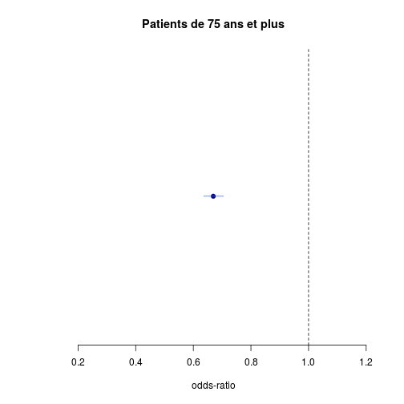
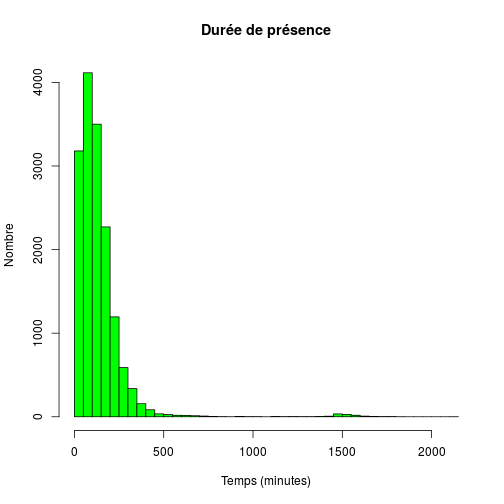
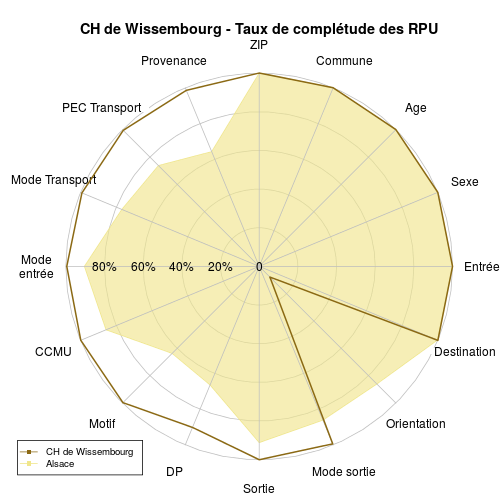

Analyse de l'activité d'un Hôpital
========================================================

Ligne 34 remplacer **Wis* par l'hôpital de son choix.


```r
source("../prologue.R")
```

```
## Loading required package: questionr
## 
## Attaching package: 'rgrs'
## 
## Les objets suivants sont masqués from 'package:questionr':
## 
##     copie, copie.default, copie.proptab, cprop, cramer.v,
##     format.proptab, freq, lprop, print.proptab, prop, quant.cut,
##     renomme.variable, residus, wtd.mean, wtd.table, wtd.var
## 
## Rattle : une interface graphique gratuite pour l'exploration de données avec R.
## Version 3.0.2 r169 Copyright (c) 2006-2013 Togaware Pty Ltd.
## Entrez 'rattle()' pour secouer, faire vibrer, et faire défiler vos données.
## Loading required package: foreign
## Loading required package: survival
## Loading required package: splines
## Loading required package: MASS
## Loading required package: nnet
## 
## Attaching package: 'zoo'
## 
## Les objets suivants sont masqués from 'package:base':
## 
##     as.Date, as.Date.numeric
## 
## Please visit openintro.org for free statistics materials
## 
## Attaching package: 'openintro'
## 
## L'objet suivant est masqué from 'package:MASS':
## 
##     mammals
## 
## L'objet suivant est masqué from 'package:datasets':
## 
##     cars
```

```
## [1] "Fichier courant: rpu2013d0112.Rda"
```

```r
source("../../../Routines/mes_fonctions.R")

date()
```

```
## [1] "Mon Mar 10 22:05:38 2014"
```

```r
pt <- nrow(d1)
# population totale
pt
```

```
## [1] 340338
```

### Population totale 340338

Récupération des données
========================

```r
library("epicalc")
library("lubridate")
library("stargazer")
```

```
## 
## Please cite as: 
## 
##  Hlavac, Marek (2014). stargazer: LaTeX code and ASCII text for well-formatted regression and summary statistics tables.
##  R package version 5.0. http://CRAN.R-project.org/package=stargazer
```

```r

source("odds.R")

# Pour supprimer la notation scientifique:
options(scipen = 6, digits = 2)

# Pour imposer un péparateur de milliers:
knit_hooks$set(inline = function(x) {
    prettyNum(x, big.mark = " ")
})

ch <- "Col"
ch.names <- "CH de Colmar"

hopital <- d1[d1$FINESS == ch, ]
n <- nrow(hopital)
```

CH de CH de Colmar
===================

### Passages en 2013: 64 758

Mode de sortie
--------------
- 4 items: mutation, Transfert, Domicile, décès
- **hosp** nombre total de patients hospitalisés
- **total** hospitalisés + retour à domicile
- le rapport des deux donne le **taux d'hospitalisation**


```r
a <- summary(hopital$MODE_SORTIE)
a
```

```
##        NA  Mutation Transfert  Domicile     Décès      NA's 
##         0     14974      1192     47316         0      1276
```

```r

hosp <- as.numeric(a["Mutation"] + a["Transfert"])
hosp
```

```
## [1] 16166
```

```r
total <- as.numeric(hosp + a["Domicile"])
total
```

```
## [1] 63482
```

```r
ratio_hosp <- round(hosp * 100/as.numeric(a["Domicile"]))
ratio_hosp
```

```
## [1] 34
```

```r
tx_hosp <- round(hosp * 100/total)
tx_hosp
```

```
## [1] 25
```

```r

stargazer(table(hopital$MODE_SORTIE))
```

```
## Error: $ operator is invalid for atomic vectors
```

```r

tab1(hopital$MODE_SORTIE, main = "Mode de sortie de l'hôpital")
```

```
## hopital$MODE_SORTIE : 
##           Frequency   %(NA+)   %(NA-)
## NA                0      0.0      0.0
## Mutation      14974     23.1     23.6
## Transfert      1192      1.8      1.9
## Domicile      47316     73.1     74.5
## Décès             0      0.0      0.0
## NA's           1276      2.0      0.0
##   Total       64758    100.0    100.0
```

```r
tab1(hopital$MODE_SORTIE, main = "Mode de sortie de l'hôpital")
```

 

```
## hopital$MODE_SORTIE : 
##           Frequency   %(NA+)   %(NA-)
## NA                0      0.0      0.0
## Mutation      14974     23.1     23.6
## Transfert      1192      1.8      1.9
## Domicile      47316     73.1     74.5
## Décès             0      0.0      0.0
## NA's           1276      2.0      0.0
##   Total       64758    100.0    100.0
```

- Nombre de patients hospitalisés (mutation + transferts): 16 166
- Taux d'hospitalisation: **25 %**


Destination
-----------
- 6 items: MCO, SSR, SLD, PSY, HAD, HMS
- on détermine les vrais non renseignés par soustraction entre le nombre total de patients déclarés hospitalisés (**hosp**) et la somme des 6 items qui décrivent la ventilation des hospitalisés. Normalement cette différence devrait être nulle.
- cette différence est notée **delta**. Elle permet de calculer l'exhaustivité pour l'item destination **exhaustivite.destination**


```r

a <- summary(hopital$DESTINATION)
a
```

```
   NA   MCO   SSR   SLD   PSY   HAD   HMS  NA's 
    0 15300     4     0   734     0     0 48720 
```

```r
# delta = vrai non renseignés
delta <- hosp - a["MCO"] - a["SSR"] - a["SLD"] - a["PSY"] - a["HAD"] - a["HMS"]
# exhaustivité réelle pour la destination
exhaustivite.destination <- round(100 - (delta * 100/hosp), 2)

tab1(hopital$DESTINATION, main = "Ventilation des patients hospitalisés")
```

 

```
hopital$DESTINATION : 
        Frequency   %(NA+)   %(NA-)
NA              0      0.0      0.0
MCO         15300     23.6     95.4
SSR             4      0.0      0.0
SLD             0      0.0      0.0
PSY           734      1.1      4.6
HAD             0      0.0      0.0
HMS             0      0.0      0.0
NA's        48720     75.2      0.0
  Total     64758    100.0    100.0
```

```r
tab1(hopital$DESTINATION, main = "Ventilation des patients hospitalisés", missing = FALSE)
```

 

```
hopital$DESTINATION : 
        Frequency   %(NA+)   %(NA-)
NA              0      0.0      0.0
MCO         15300     23.6     95.4
SSR             4      0.0      0.0
SLD             0      0.0      0.0
PSY           734      1.1      4.6
HAD             0      0.0      0.0
HMS             0      0.0      0.0
NA's        48720     75.2      0.0
  Total     64758    100.0    100.0
```


Distribution intra-hospitalière des patients hospitalisés. La colonne *Missing* correspond aux patients non hospialisés.
- vrai non renseignés pour la destination: 128, exhaustivité: 99 %

Orientation
-----------

- 13 items: CHIR FUGUE   HDT    HO   MED  OBST   PSA   REA   REO    SC  SCAM    SI  UHCD
  - items hospitalisation (**orient.hosp**): CHIR, HDT, HO, MED, OBST, REA, SC, SI, UHCD 
  - sorties atypiques (**orient.atypique**): FUGUE, PSA, SCAM
  - réorientation immédiate (**orient.reorient **): REO
- L'orientation est un mélange d'hospitalisés et de non hospitalisés.
- L'exhaustivité (**orient.exhaustivite**) est calculée comme le rapport entre les orientation correspondant à une hospitalisation (MED, CHIR, SI, etc) et le nombre d'hospitalisations (**hosp**) déclarées au paragraphe destination. Comment calculer l'exhaustivité des sorties atypiques ?


```r

a <- summary(hopital$ORIENTATION)
a
```

```
 CHIR FUGUE   HDT    HO   MED  OBST   PSA   REA   REO    SC  SCAM    SI 
 2789   117    58     6  6576    29   964   389  1174   440   171   642 
 UHCD  NA's 
 4827 46576 
```

```r
# on supprime les NA
a <- hopital$ORIENTATION[!is.na(hopital$ORIENTATION)]
nb_orient <- length(a)
tab1(a, horiz = T, main = "Orientation des patients", xlab = "Nombre")
```

 

```
a : 
        Frequency Percent Cum. percent
CHIR         2789    15.3           15
FUGUE         117     0.6           16
HDT            58     0.3           16
HO              6     0.0           16
MED          6576    36.2           52
OBST           29     0.2           53
PSA           964     5.3           58
REA           389     2.1           60
REO          1174     6.5           67
SC            440     2.4           69
SCAM          171     0.9           70
SI            642     3.5           74
UHCD         4827    26.5          100
  Total     18182   100.0          100
```

```r

sa <- summary(a)
orient.hosp <- as.numeric(sa["HO"] + sa["HDT"] + sa["UHCD"] + sa["SI"] + sa["SC"] + 
    sa["REA"] + sa["OBST"] + sa["MED"] + sa["CHIR"])
orient.atypique <- as.numeric(sa["SCAM"] + sa["PSA"] + sa["FUGUE"])
orient.reorient <- as.numeric(sa["REO"])
orient.exhaustivite <- 100 - round(100 * (hosp - orient.hosp)/hosp, 2)
```

- nombre de RPU avec orientation renseigné: 18 182
- nombre d'orientation correspondant à une hospitalisation: 15 756
- nombre de patients déclarés hospitalisés à la rubrique destination: 16 166
- exhaustivité: **97 %**
- nombre de réorientations: 1 174
- nombre de sorties atypiques: 1 252

Age
----


```r
age_local <- hopital$AGE
s <- summary(age_local)

c <- cut(age_local, breaks = c(-1, 1, 75, 150), labels = c("1 an", "1 à 75 ans", 
    "sup 75 ans"), ordered_result = TRUE)
a <- summary(c)
a
```

```
##       1 an 1 à 75 ans sup 75 ans 
##       5596      51377       7785
```

```r

c2 <- cut(age_local, breaks = c(-1, 19, 75, 120), labels = c("Pédiatrie", "Adultes", 
    "Gériatrie"))
b <- summary(c2)
b
```

```
## Pédiatrie   Adultes Gériatrie 
##     23832     33141      7785
```

### Age moyen: 36  ans
### Pédiatrie: 23 832  (37 %)
### Gériatrie: 7 785  (12 %)


```r

# region: chiffre pour toute l'Alsace local: hopital
region <- d1$AGE

hist(region, freq = F, main = "Histogramme des ages", ylab = "Fréquence", xlab = "Classes d'ages")
hist(age_local, add = T, col = "blue", freq = F)
abline(v = median(region, na.rm = T), col = "red")
abline(v = median(s, na.rm = T), col = "green")
legend("topright", legend = c("médiane régionale", "médiane locale", "Région"), 
    col = c("red", "green", "blue"), lty = 1, pch = 15)
```

 

```r

# moins de 1 an / total, pt = total RPU pour la région

local <- hopital$AGE[hopital$AGE < 1]
length(local)
```

```
## [1] 3036
```

```r
length(local) * 100/n
```

```
## [1] 4.7
```

```r
region <- d1$AGE[d1$AGE < 1]
length(region) * 100/pt
```

```
## [1] 2.7
```

```r

# on forme une matrice carrée de 2 lignes et 2 colonnes: on saisi d'abord la
# colonne 1, puis 2 pour une saisie par ligne mettre byrow=TRUE
M1 <- matrix(c(length(local), n, length(region), pt), nrow = 2, byrow = FALSE)
M1
```

```
##       [,1]   [,2]
## [1,]  3036   9226
## [2,] 64758 340338
```

```r
chisq.test(M1)
```

```
## 
## 	Pearson's Chi-squared test with Yates' continuity correction
## 
## data:  M1
## X-squared = 673, df = 1, p-value < 2.2e-16
```

```r
p <- M1[1, 1]/n
q <- M1[1, 2]/pt
or <- p * (1 - q)/q * (1 - p)
p
```

```
## [1] 0.047
```

```r
q
```

```
## [1] 0.027
```

```r
or
```

```
## [1] 1.6
```

```r

calcOddsRatio(M1, referencerow = 2)
```

```
## [1] "categorie =  , odds ratio =  1.72943933259245"
## [1] "categorie =  ,  95 % interval de confiance = [ 1.6585388247873 , 1.80337075045644 ]"
```

```r
calcRelativeRisk(M1)
```

```
## [1] "category =  , relative risk =  1.5488343893735"
## [1] "category =  ,  95 % confidence interval = [ 1.50057818980749 , 1.5986424312976 ]"
```

```r

# 75 ans et plus

local <- hopital$AGE[hopital$AGE > 74]
length(local) * 100/n  # % de la pop locale de 75 ans qui passa au SU
```

```
## [1] 13
```

```r
region <- d1$AGE[d1$AGE > 74]
length(region) * 100/pt  # % de 75 ans dans la pop alsacienne qui consulte au SU
```

```
## [1] 15
```

```r

hist(local, main = "75 ans et plus", xlab = "age", col = "pink")
```

 

```r
summary(local)
```

```
##    Min. 1st Qu.  Median    Mean 3rd Qu.    Max. 
##      75      79      83      84      87     112
```

```r
boxplot(local, col = "pink", main = "75 ans et plus", ylab = "Age (années)")
```

 

```r

# calcul manuel de l'odds-ratio

M1 <- matrix(c(length(local), n - length(local), length(region), pt - length(region)), 
    nrow = 2, byrow = FALSE)
M1
```

```
##       [,1]   [,2]
## [1,]  8175  52512
## [2,] 56583 287826
```

```r
chisq.test(M1)
```

```
## 
## 	Pearson's Chi-squared test with Yates' continuity correction
## 
## data:  M1
## X-squared = 336, df = 1, p-value < 2.2e-16
```

```r
p <- M1[1, 1]/n
q <- M1[1, 2]/pt
or <- (p * (1 - q))/(q * (1 - p))
p
```

```
## [1] 0.13
```

```r
q
```

```
## [1] 0.15
```

```r
or
```

```
## [1] 0.79
```

```r

# calcul del'OR et du risque relatif avec formules:

calcOddsRatio(M1, referencerow = 2)
```

```
## [1] "categorie =  , odds ratio =  0.79190530875014"
## [1] "categorie =  ,  95 % interval de confiance = [ 0.772364001259542 , 0.811941023926517 ]"
```

```r
calcRelativeRisk(M1)
```

```
## [1] "category =  , relative risk =  0.819937244765556"
## [1] "category =  ,  95 % confidence interval = [ 0.802476409746222 , 0.837778004672239 ]"
```

```r
chisq.test(M1)
```

```
## 
## 	Pearson's Chi-squared test with Yates' continuity correction
## 
## data:  M1
## X-squared = 336, df = 1, p-value < 2.2e-16
```

```r
fisher.test(M1)
```

```
## 
## 	Fisher's Exact Test for Count Data
## 
## data:  M1
## p-value < 2.2e-16
## alternative hypothesis: true odds ratio is not equal to 1
## 95 percent confidence interval:
##  0.77 0.81
## sample estimates:
## odds ratio 
##       0.79
```

```r

# graphe de l'OR

odds <- calcOddsRatio(M1, referencerow = 2, quiet = TRUE)
or <- odds[1]
lower <- odds[2]
upper <- odds[3]
y <- 0.5
if (lower > 1) limiteInf <- 0.5 else limiteInf <- lower - 0.5
plot(or, y, pch = 19, col = "darkblue", xlab = "odds-ratio", ylab = "", axes = FALSE, 
    main = "Patients de 75 ans et plus", xlim = c(limiteInf, upper + 0.5))
axis(1)
abline(v = 1, lty = "dashed")
lines(c(lower, upper), c(y, y), col = "royalblue")
```

 


sex ratio
-----------

```r
sexew <- hopital$SEXE
local <- summary(sexew)
local
```

```
##     F     I     M 
## 29732     0 35026
```

```r
srw <- round(local[3]/local[1], 3)

sexer <- d1$SEXE
region <- summary(sexer)
region
```

```
##      F      I      M 
## 161941      5 178392
```

```r
srr <- round(region[3]/region[1], 3)

M1 <- matrix(c(local[3], local[1], region[3], region[1]), nrow = 2)
colnames(M1) <- c("Local", "Alsace")
rownames(M1) <- c("Hommes", "Femmes")
M1
```

```
##        Local Alsace
## Hommes 35026 178392
## Femmes 29732 161941
```

```r
calcOddsRatio(M1, referencerow = 2)
```

```
## [1] "categorie = Hommes , odds ratio =  1.06941891542502"
## [1] "categorie = Hommes ,  95 % interval de confiance = [ 1.05154362255142 , 1.08759807215026 ]"
```

```r
or <- calcOddsRatio(M1, referencerow = 2, quiet = TRUE)

plot(or[1], 1, pch = 19, col = "darkblue", xlab = "odds-ratio", ylab = "", axes = FALSE)
axis(1)
abline(v = 1, lty = "dashed")
lines(c(or[2], or[3]), c(1, 1), col = "royalblue")
```

 

sex-ratio local = 1.2  
sex-ratio régional = 1.1  
odds-ratio = 1.1 [1.1-1.1]

Le sex-ratio est légèrement inférieur à celui de la région mais pas signficativement différent

Horaires
---------

```r
e <- hour(hopital$ENTREE)
a <- cut(e, breaks = c(0, 7, 19, 23), labels = c("nuit profonde", "journée", 
    "soirée"))
b <- summary(a)
```


### Soirée 16 %

### Nuit profonde 8.3 %

On fait la somme du vendredi 20 heures au lundi matin 8 heures. Dimanche = 1

```r
d <- hopital$ENTREE[wday(hopital$ENTREE) == 1 | wday(hopital$ENTREE) == 7 | 
    (wday(hopital$ENTREE) == 6 & hour(hopital$ENTREE) > 19) | (wday(hopital$ENTREE) == 
    2 & hour(hopital$ENTREE) < 8)]
f <- summary(as.factor(wday(d)))
```

### Week-end: 20 830 dossiers (32 %)

Gravité
--------

```r
d <- hopital$GRAVITE
a <- summary(d)
```


### CCMU 1: 21 093 (33 %)

### CCMU 4 & 5: 752 (1 %)

Durée de prise en charge
-------------------------

```r
e <- ymd_hms(hopital$ENTREE)
s <- ymd_hms(hopital$SORTIE)

hopital$presence <- s - e
hopital$presence[d1$presence < 0] <- NA

# hopital$presence est de type 'difftime' est peut s'exprimer en minutes ou
# en secondes. Si nécessaire on convertit les secondes en minutes:
if (units(hopital$presence) == "secs") hopital$presence <- hopital$presence/60

a <- summary(as.numeric(hopital$presence))

# on limite la durée de présence limitée à 1 jours
troisJours <- hopital[as.numeric(hopital$presence) < 1440 * 1, "presence"]
hist(as.numeric(troisJours), breaks = 40, main = "Durée de présence", xlab = "Temps (minutes)", 
    ylab = "Nombre", col = "green")
```

 

```r

# histogramme avec toutes les données:
hist(as.numeric(hopital$presence), breaks = 40, main = "Durée de présence", 
    xlab = "Temps (minutes)", ylab = "Nombre", col = "green")
```

 

```r


q <- hopital$presence[as.numeric(hopital$presence) < 4 * 60]
h <- hopital[hopital$MODE_SORTIE == "Mutation" | hopital$MODE_SORTIE == "Transfert", 
    "presence"]
sh <- summary(as.numeric(h))
sh
```

```
##    Min. 1st Qu.  Median    Mean 3rd Qu.    Max.    NA's 
##       1     112     217     245     346    4420    1276
```

```r
dom <- hopital[hopital$MODE_SORTIE == "Domicile", "presence"]
sdom <- summary(as.numeric(dom))
```

### Moyenne: 168 minutes

### Médiane: 119 minutes

### % en moins de 4 heures: 49 904 (77 %)

### si hospitalisé: 245 minutes

### si retour à domicile: 143 minutes

### Taux hospitalisation: 27 %

TOP 5 des pathologies
---------------------
### Médicales

### Traumatiques

```r
trauma <- hopital[substr(hopital$DP, 1, 3) >= "S00" & substr(hopital$DP, 1, 
    4) <= "T65", ]
head(trauma$DP)
```

```
## [1] "T17.9" "S05.6" "S91.3" "T23.2" "S61.8" "T22.2"
```

```r
t <- summary(as.factor(trauma$DP))
head(sort(t, decreasing = T), 6)
```

```
##    NA's (Other)   S93.4   S61.0  S52.50   S61.8 
##    7425    3679    1092     834     710     593
```

traumato: 30 528 soit 47 %  
Lésions les plus fréquentes: 7 425  


### Chirurgicales


Exhaustivité des données (RADAR)
================================
Par défaut, le diagramme en radar commence à 15h et progresse dans le sens antihoraire (la position 2 correspond à 14 heures, etc.)

Dessin de deux graphiques radar superposés, l'un pour l'ensemble des rpu de la région, l'autre pour l'hôpital considéré.  
On défini dans la variable *rpu.names* le nom et l'ordre des variables à afficher. Le radar commence par défaut à 15h puis progresse en sens anti-horaire. Les variables sont divisées en 3 secteurs:
- l'entrée du patient
- le diagnostic médical
- la sortie  
Le taux de complétude est calculé à partir des items non reseignés (NA) en appliquant à chaque colonne la fonction *mean* qui retourne le pourcentage de NA.


```r
library("plotrix")
library("openintro")

rpu.names <- c("Entrée", "Sexe", "Age", "Commune", "ZIP", "Provenance", "PEC Transport", 
    "Mode Transport", "Mode entrée", "CCMU", "Motif", "DP", "Sortie", "Mode sortie", 
    "Orientation", "Destination")

# taux de complétude régional
a <- is.na(d1)
b <- round(apply(a, 2, mean) * 100, 2)
b <- cbind(b)
colnames(b) <- "%"
completude <- c(b[6], b[16], b[20], b[3], b[2], b[15], b[19], b[18], b[10], 
    b[9], b[12], b[5], b[17], b[11], b[14], b[4])
completude <- 100 - completude

radial.plot(completude, labels = rpu.names, , rp.type = "p", radial.lim = c(0, 
    100), poly.col = fadeColor("khaki", fade = "A0"), main = paste(ch.names, 
    "- Taux de complétude des RPU"), radial.labels = T)

# taux de complétude de l'hôpital local
a <- is.na(hopital)
b <- round(apply(a, 2, mean) * 100, 2)
# b<-sort(b)
b <- cbind(b)
colnames(b) <- "%"
completude_hop <- c(b[6], b[16], b[20], b[3], b[2], b[15], b[19], b[18], b[10], 
    b[9], b[12], b[5], b[17], b[11], b[14], b[4])
completude_hop <- 100 - completude_hop
# corrections
completude_hop[16] <- exhaustivite.destination
completude_hop[15] <- orient.exhaustivite

radial.plot(completude_hop, labels = rpu.names, radial.lim = c(0, 100), add = T, 
    rp.type = "p", line.col = "goldenrod4", main = "Taux de complétude des RPU", 
    lwd = 2)

legend("bottomleft", legend = c(ch.names, "Alsace"), col = c("goldenrod4", "khaki"), 
    lty = 1, bty = "n")
```

 

```r

c <- as.data.frame(completude)
rownames(c) <- rpu.names
c <- cbind(c, completude_hop)
names(c) <- c("Alsace (%)", ch.names)
c
```

```
##                Alsace (%) CH de Colmar
## Entrée                100          100
## Sexe                  100          100
## Age                   100          100
## Commune               100          100
## ZIP                   100          100
## Provenance             65          100
## PEC Transport          74           99
## Mode Transport         77           99
## Mode entrée            91          100
## CCMU                   86           99
## Motif                  64          100
## DP                     66           89
## Sortie                 91           99
## Mode sortie            86           98
## Orientation            20           97
## Destination            21           99
```

Urilsation des routines
=======================

```r
source("../../../Routines/mes_fonctions.R")
x <- completude(d1)
y <- completude(hopital)
radar_completude(x, y, ch.names = "CH Colmar")
```

 


