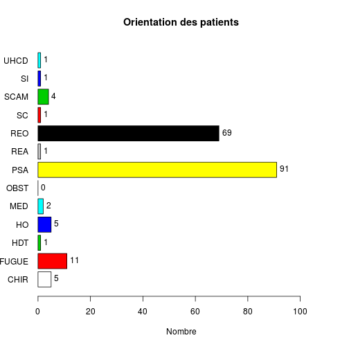
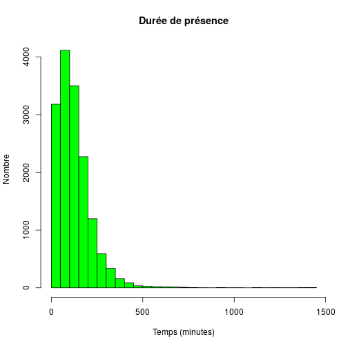
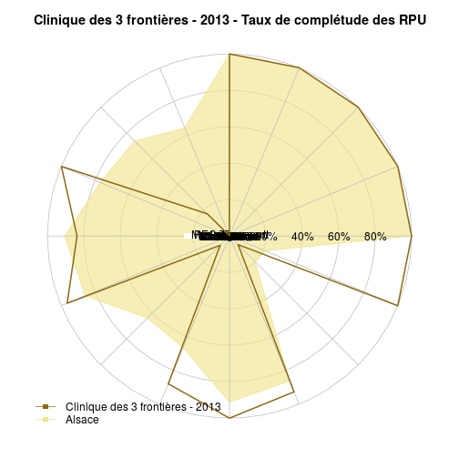

Analyse de l'activité d'un Hôpital
========================================================

Ligne 34 remplacer **Wis* par l'hôpital de son choix.


```r
source("../prologue.R")
```

```
## Loading required package: questionr
## 
## Attaching package: 'rgrs'
## 
## Les objets suivants sont masqués from 'package:questionr':
## 
##     copie, copie.default, copie.proptab, cprop, cramer.v,
##     format.proptab, freq, lprop, print.proptab, prop, quant.cut,
##     renomme.variable, residus, wtd.mean, wtd.table, wtd.var
## 
## Rattle : une interface graphique gratuite pour l'exploration de données avec R.
## Version 3.0.2 r169 Copyright (c) 2006-2013 Togaware Pty Ltd.
## Entrez 'rattle()' pour secouer, faire vibrer, et faire défiler vos données.
## Loading required package: foreign
## Loading required package: survival
## Loading required package: splines
## Loading required package: MASS
## Loading required package: nnet
## 
## Attaching package: 'zoo'
## 
## Les objets suivants sont masqués from 'package:base':
## 
##     as.Date, as.Date.numeric
## 
## Please visit openintro.org for free statistics materials
## 
## Attaching package: 'openintro'
## 
## L'objet suivant est masqué from 'package:MASS':
## 
##     mammals
## 
## L'objet suivant est masqué from 'package:datasets':
## 
##     cars
```

```
## [1] "Fichier courant: rpu2013d0112.Rda"
```

```r
source("../../../Routines/mes_fonctions.R")

date()
```

```
## [1] "Sat May  3 19:39:01 2014"
```

```r
pt <- nrow(d1)
# population totale
pt
```

```
## [1] 344073
```

### Population totale 344073

Récupération des données
========================

```r
library("epicalc")
library("lubridate")
library("stargazer")
```

```
## 
## Please cite as: 
## 
##  Hlavac, Marek (2014). stargazer: LaTeX code and ASCII text for well-formatted regression and summary statistics tables.
##  R package version 5.0. http://CRAN.R-project.org/package=stargazer
```

```r

source("odds.R")

# Pour supprimer la notation scientifique:
options(scipen = 6, digits = 2)

# Pour imposer un péparateur de milliers:
knit_hooks$set(inline = function(x) {
    prettyNum(x, big.mark = " ")
})

ch <- "Wis"
ch.names <- "CH de Wissembourg"

hopital <- d1[d1$FINESS == ch, ]
n <- nrow(hopital)
```

CH de CH de Wissembourg
===================

### Passages en 2013: 12 646

Mode de sortie
--------------
- 4 items: mutation, Transfert, Domicile, décès
- **hosp** nombre total de patients hospitalisés
- **total** hospitalisés + retour à domicile
- le rapport des deux donne le **taux d'hospitalisation**


```r
a <- summary(hopital$MODE_SORTIE)
a
```

```
##        NA  Mutation Transfert  Domicile     Décès      NA's 
##         0      2839       161      9567         0        79
```

```r

hosp <- as.numeric(a["Mutation"] + a["Transfert"])
hosp
```

```
## [1] 3000
```

```r
total <- as.numeric(hosp + a["Domicile"])
total
```

```
## [1] 12567
```

```r
ratio_hosp <- round(hosp * 100/as.numeric(a["Domicile"]))
ratio_hosp
```

```
## [1] 31
```

```r
tx_hosp <- round(hosp * 100/total)
tx_hosp
```

```
## [1] 24
```

```r

stargazer(table(hopital$MODE_SORTIE))
```

```
## Error: $ operator is invalid for atomic vectors
```

```r

tab1(hopital$MODE_SORTIE, main = "Mode de sortie de l'hôpital")
```

```
## hopital$MODE_SORTIE : 
##           Frequency   %(NA+)   %(NA-)
## NA                0      0.0      0.0
## Mutation       2839     22.4     22.6
## Transfert       161      1.3      1.3
## Domicile       9567     75.7     76.1
## Décès             0      0.0      0.0
## NA's             79      0.6      0.0
##   Total       12646    100.0    100.0
```

```r
tab1(hopital$MODE_SORTIE, main = "Mode de sortie de l'hôpital")
```

 

```
## hopital$MODE_SORTIE : 
##           Frequency   %(NA+)   %(NA-)
## NA                0      0.0      0.0
## Mutation       2839     22.4     22.6
## Transfert       161      1.3      1.3
## Domicile       9567     75.7     76.1
## Décès             0      0.0      0.0
## NA's             79      0.6      0.0
##   Total       12646    100.0    100.0
```

- Nombre de patients hospitalisés (mutation + transferts): 3 000
- Taux d'hospitalisation: **24 %**


Destination
-----------
- 6 items: MCO, SSR, SLD, PSY, HAD, HMS
- on détermine les vrais non renseignés par soustraction entre le nombre total de patients déclarés hospitalisés (**hosp**) et la somme des 6 items qui décrivent la ventilation des hospitalisés. Normalement cette différence devrait être nulle.
- cette différence est notée **delta**. Elle permet de calculer l'exhaustivité pour l'item destination **exhaustivite.destination**


```r

a <- summary(hopital$DESTINATION)
a
```

```
  NA  MCO  SSR  SLD  PSY  HAD  HMS NA's 
   0 2956    6    0   39    0    0 9645 
```

```r
# delta = vrai non renseignés
delta <- hosp - a["MCO"] - a["SSR"] - a["SLD"] - a["PSY"] - a["HAD"] - a["HMS"]
# exhaustivité réelle pour la destination
exhaustivite.destination <- round(100 - (delta * 100/hosp), 2)

tab1(hopital$DESTINATION, main = "Ventilation des patients hospitalisés")
```

 

```
hopital$DESTINATION : 
        Frequency   %(NA+)   %(NA-)
NA              0      0.0      0.0
MCO          2956     23.4     98.5
SSR             6      0.0      0.2
SLD             0      0.0      0.0
PSY            39      0.3      1.3
HAD             0      0.0      0.0
HMS             0      0.0      0.0
NA's         9645     76.3      0.0
  Total     12646    100.0    100.0
```

```r
tab1(hopital$DESTINATION, main = "Ventilation des patients hospitalisés", missing = FALSE)
```

 

```
hopital$DESTINATION : 
        Frequency   %(NA+)   %(NA-)
NA              0      0.0      0.0
MCO          2956     23.4     98.5
SSR             6      0.0      0.2
SLD             0      0.0      0.0
PSY            39      0.3      1.3
HAD             0      0.0      0.0
HMS             0      0.0      0.0
NA's         9645     76.3      0.0
  Total     12646    100.0    100.0
```


Distribution intra-hospitalière des patients hospitalisés. La colonne *Missing* correspond aux patients non hospialisés.
- vrai non renseignés pour la destination: -1, exhaustivité: 100 %

Orientation
-----------

- 13 items: CHIR FUGUE   HDT    HO   MED  OBST   PSA   REA   REO    SC  SCAM    SI  UHCD
  - items hospitalisation (**orient.hosp**): CHIR, HDT, HO, MED, OBST, REA, SC, SI, UHCD 
  - sorties atypiques (**orient.atypique**): FUGUE, PSA, SCAM
  - réorientation immédiate (**orient.reorient **): REO
- L'orientation est un mélange d'hospitalisés et de non hospitalisés.
- L'exhaustivité (**orient.exhaustivite**) est calculée comme le rapport entre les orientation correspondant à une hospitalisation (MED, CHIR, SI, etc) et le nombre d'hospitalisations (**hosp**) déclarées au paragraphe destination. Comment calculer l'exhaustivité des sorties atypiques ?


```r

a <- summary(hopital$ORIENTATION)
a
```

```
 CHIR FUGUE   HDT    HO   MED  OBST   PSA   REA   REO    SC  SCAM    SI 
   23    27    21    11    26     0   103     9     3    47    44    16 
 UHCD  NA's 
   81 12235 
```

```r
# on supprime les NA
a <- hopital$ORIENTATION[!is.na(hopital$ORIENTATION)]
nb_orient <- length(a)
tab1(a, horiz = T, main = "Orientation des patients", xlab = "Nombre")
```

 

```
a : 
        Frequency Percent Cum. percent
CHIR           23     5.6          5.6
FUGUE          27     6.6         12.2
HDT            21     5.1         17.3
HO             11     2.7         20.0
MED            26     6.3         26.3
OBST            0     0.0         26.3
PSA           103    25.1         51.3
REA             9     2.2         53.5
REO             3     0.7         54.3
SC             47    11.4         65.7
SCAM           44    10.7         76.4
SI             16     3.9         80.3
UHCD           81    19.7        100.0
  Total       411   100.0        100.0
```

```r

sa <- summary(a)
orient.hosp <- as.numeric(sa["HO"] + sa["HDT"] + sa["UHCD"] + sa["SI"] + sa["SC"] + 
    sa["REA"] + sa["OBST"] + sa["MED"] + sa["CHIR"])
orient.atypique <- as.numeric(sa["SCAM"] + sa["PSA"] + sa["FUGUE"])
orient.reorient <- as.numeric(sa["REO"])
orient.exhaustivite <- 100 - round(100 * (hosp - orient.hosp)/hosp, 2)
```

- nombre de RPU avec orientation renseigné: 411
- nombre d'orientation correspondant à une hospitalisation: 234
- nombre de patients déclarés hospitalisés à la rubrique destination: 3 000
- exhaustivité: **7.8 %**
- nombre de réorientations: 3
- nombre de sorties atypiques: 174

Age
----


```r
age_local <- hopital$AGE
s <- summary(age_local)

c <- cut(age_local, breaks = c(-1, 1, 75, 150), labels = c("1 an", "1 à 75 ans", 
    "sup 75 ans"), ordered_result = TRUE)
a <- summary(c)
a
```

```
##       1 an 1 à 75 ans sup 75 ans 
##        388      10068       2190
```

```r

c2 <- cut(age_local, breaks = c(-1, 19, 75, 120), labels = c("Pédiatrie", "Adultes", 
    "Gériatrie"))
b <- summary(c2)
b
```

```
## Pédiatrie   Adultes Gériatrie 
##      3202      7254      2190
```

### Age moyen: 43  ans
### Pédiatrie: 3 202  (25 %)
### Gériatrie: 2 190  (17 %)


```r

# region: chiffre pour toute l'Alsace local: hopital
region <- d1$AGE

hist(region, freq = F, main = "Histogramme des ages", ylab = "Fréquence", xlab = "Classes d'ages")
hist(age_local, add = T, col = "blue", freq = F)
abline(v = median(region, na.rm = T), col = "red")
abline(v = median(s, na.rm = T), col = "green")
legend("topright", legend = c("médiane régionale", "médiane locale", "Région"), 
    col = c("red", "green", "blue"), lty = 1, pch = 15)
```

 

```r

# moins de 1 an / total, pt = total RPU pour la région

local <- hopital$AGE[hopital$AGE < 1]
length(local)
```

```
## [1] 188
```

```r
length(local) * 100/n
```

```
## [1] 1.5
```

```r
region <- d1$AGE[d1$AGE < 1]
length(region) * 100/pt
```

```
## [1] 2.7
```

```r

# on forme une matrice carrée de 2 lignes et 2 colonnes: on saisi d'abord la
# colonne 1, puis 2 pour une saisie par ligne mettre byrow=TRUE
M1 <- matrix(c(length(local), n, length(region), pt), nrow = 2, byrow = FALSE)
M1
```

```
##       [,1]   [,2]
## [1,]   188   9243
## [2,] 12646 344073
```

```r
chisq.test(M1)
```

```
## 
## 	Pearson's Chi-squared test with Yates' continuity correction
## 
## data:  M1
## X-squared = 65, df = 1, p-value = 7.693e-16
```

```r
p <- M1[1, 1]/n
q <- M1[1, 2]/pt
or <- p * (1 - q)/q * (1 - p)
p
```

```
## [1] 0.015
```

```r
q
```

```
## [1] 0.027
```

```r
or
```

```
## [1] 0.53
```

```r

calcOddsRatio(M1, referencerow = 2)
```

```
## [1] "categorie =  , odds ratio =  0.553404024184798"
## [1] "categorie =  ,  95 % interval de confiance = [ 0.478478077438919 , 0.640062791639654 ]"
```

```r
calcRelativeRisk(M1)
```

```
## [1] "category =  , relative risk =  0.562306584194687"
## [1] "category =  ,  95 % confidence interval = [ 0.487603513820065 , 0.648454503847927 ]"
```

```r

# 75 ans et plus

local <- hopital$AGE[hopital$AGE > 74]
length(local) * 100/n  # % de la pop locale de 75 ans qui passa au SU
```

```
## [1] 18
```

```r
region <- d1$AGE[d1$AGE > 74]
length(region) * 100/pt  # % de 75 ans dans la pop alsacienne qui consulte au SU
```

```
## [1] 15
```

```r

hist(local, main = "75 ans et plus", xlab = "age", col = "pink")
```

 

```r
summary(local)
```

```
##    Min. 1st Qu.  Median    Mean 3rd Qu.    Max. 
##      75      79      83      83      87     102
```

```r
boxplot(local, col = "pink", main = "75 ans et plus", ylab = "Age (années)")
```

 

```r

# calcul manuel de l'odds-ratio

M1 <- matrix(c(length(local), n - length(local), length(region), pt - length(region)), 
    nrow = 2, byrow = FALSE)
M1
```

```
##       [,1]   [,2]
## [1,]  2291  53081
## [2,] 10355 290992
```

```r
chisq.test(M1)
```

```
## 
## 	Pearson's Chi-squared test with Yates' continuity correction
## 
## data:  M1
## X-squared = 67, df = 1, p-value = 2.631e-16
```

```r
p <- M1[1, 1]/n
q <- M1[1, 2]/pt
or <- (p * (1 - q))/(q * (1 - p))
p
```

```
## [1] 0.18
```

```r
q
```

```
## [1] 0.15
```

```r
or
```

```
## [1] 1.2
```

```r

# calcul del'OR et du risque relatif avec formules:

calcOddsRatio(M1, referencerow = 2)
```

```
## [1] "categorie =  , odds ratio =  1.21287749958153"
## [1] "categorie =  ,  95 % interval de confiance = [ 1.15813145119716 , 1.27021144920165 ]"
```

```r
calcRelativeRisk(M1)
```

```
## [1] "category =  , relative risk =  1.20406975647055"
## [1] "category =  ,  95 % confidence interval = [ 1.15185310209303 , 1.25865353473689 ]"
```

```r
chisq.test(M1)
```

```
## 
## 	Pearson's Chi-squared test with Yates' continuity correction
## 
## data:  M1
## X-squared = 67, df = 1, p-value = 2.631e-16
```

```r
fisher.test(M1)
```

```
## 
## 	Fisher's Exact Test for Count Data
## 
## data:  M1
## p-value = 9.601e-16
## alternative hypothesis: true odds ratio is not equal to 1
## 95 percent confidence interval:
##  1.2 1.3
## sample estimates:
## odds ratio 
##        1.2
```

```r

# graphe de l'OR

odds <- calcOddsRatio(M1, referencerow = 2, quiet = TRUE)
or <- odds[1]
lower <- odds[2]
upper <- odds[3]
y <- 0.5
if (lower > 1) limiteInf <- 0.5 else limiteInf <- lower - 0.5
plot(or, y, pch = 19, col = "darkblue", xlab = "odds-ratio", ylab = "", axes = FALSE, 
    main = "Patients de 75 ans et plus", xlim = c(limiteInf, upper + 0.5))
axis(1)
abline(v = 1, lty = "dashed")
lines(c(lower, upper), c(y, y), col = "royalblue")
```

 


sex ratio
-----------

```r
sexew <- hopital$SEXE
local <- summary(sexew)
local
```

```
##    F    I    M 
## 6071    0 6575
```

```r
srw <- round(local[3]/local[1], 3)

sexer <- d1$SEXE
region <- summary(sexer)
region
```

```
##      F      I      M 
## 163818      5 180250
```

```r
srr <- round(region[3]/region[1], 3)

M1 <- matrix(c(local[3], local[1], region[3], region[1]), nrow = 2)
colnames(M1) <- c("Local", "Alsace")
rownames(M1) <- c("Hommes", "Femmes")
M1
```

```
##        Local Alsace
## Hommes  6575 180250
## Femmes  6071 163818
```

```r
calcOddsRatio(M1, referencerow = 2)
```

```
## [1] "categorie = Hommes , odds ratio =  0.984287274647142"
## [1] "categorie = Hommes ,  95 % interval de confiance = [ 0.949937705520372 , 1.01987891774607 ]"
```

```r
or <- calcOddsRatio(M1, referencerow = 2, quiet = TRUE)

plot(or[1], 1, pch = 19, col = "darkblue", xlab = "odds-ratio", ylab = "", axes = FALSE)
axis(1)
abline(v = 1, lty = "dashed")
lines(c(or[2], or[3]), c(1, 1), col = "royalblue")
```

 

sex-ratio local = 1.1  
sex-ratio régional = 1.1  
odds-ratio = 0.98 [0.95-1]

Le sex-ratio est légèrement inférieur à celui de la région mais pas signficativement différent

Horaires
---------

```r
e <- hour(hopital$ENTREE)
a <- cut(e, breaks = c(0, 7, 19, 23), labels = c("nuit profonde", "journée", 
    "soirée"))
b <- summary(a)
```


### Soirée 15 %

### Nuit profonde 7.4 %

On fait la somme du vendredi 20 heures au lundi matin 8 heures. Dimanche = 1

```r
d <- hopital$ENTREE[wday(hopital$ENTREE) == 1 | wday(hopital$ENTREE) == 7 | 
    (wday(hopital$ENTREE) == 6 & hour(hopital$ENTREE) > 19) | (wday(hopital$ENTREE) == 
    2 & hour(hopital$ENTREE) < 8)]
f <- summary(as.factor(wday(d)))
```

### Week-end: 4 368 dossiers (35 %)

Gravité
--------

```r
d <- hopital$GRAVITE
a <- summary(d)
```


### CCMU 1: 828 (7 %)

### CCMU 4 & 5: 174 (1 %)

Durée de prise en charge
-------------------------

```r
e <- ymd_hms(hopital$ENTREE)
s <- ymd_hms(hopital$SORTIE)

hopital$presence <- s - e
hopital$presence[d1$presence < 0] <- NA

# hopital$presence est de type 'difftime' est peut s'exprimer en minutes ou
# en secondes. Si nécessaire on convertit les secondes en minutes:
if (units(hopital$presence) == "secs") hopital$presence <- hopital$presence/60

a <- summary(as.numeric(hopital$presence))

# on limite la durée de présence limitée à 1 jours
troisJours <- hopital[as.numeric(hopital$presence) < 1440 * 1, "presence"]
hist(as.numeric(troisJours), breaks = 40, main = "Durée de présence", xlab = "Temps (minutes)", 
    ylab = "Nombre", col = "green")
```

 

```r

# histogramme avec toutes les données:
hist(as.numeric(hopital$presence), breaks = 40, main = "Durée de présence", 
    xlab = "Temps (minutes)", ylab = "Nombre", col = "green")
```

 

```r


q <- hopital$presence[as.numeric(hopital$presence) < 4 * 60]
h <- hopital[hopital$MODE_SORTIE == "Mutation" | hopital$MODE_SORTIE == "Transfert", 
    "presence"]
sh <- summary(as.numeric(h))
sh
```

```
##    Min. 1st Qu.  Median    Mean 3rd Qu.    Max.    NA's 
##       0     106     169     217     261    1780      79
```

```r
dom <- hopital[hopital$MODE_SORTIE == "Domicile", "presence"]
sdom <- summary(as.numeric(dom))
```

### Moyenne: 133 minutes

### Médiane: 93 minutes

### % en moins de 4 heures: 11 089 (88 %)

### si hospitalisé: 217 minutes

### si retour à domicile: 105 minutes

### Taux hospitalisation: 24 %

TOP 5 des pathologies
---------------------
### Médicales

### Traumatiques

```r
trauma <- hopital[substr(hopital$DP, 1, 3) >= "S00" & substr(hopital$DP, 1, 
    4) <= "T65", ]
head(trauma$DP)
```

```
## [1] "S009"  "S610"  "S012"  "S0220" "S4220" "S635"
```

```r
t <- summary(as.factor(trauma$DP))
head(sort(t, decreasing = T), 6)
```

```
##    NA's (Other)    S934    S610    S602    S202 
##    1243     510     313     202     157     137
```

traumato: 5 302 soit 42 %  
Lésions les plus fréquentes: 1 243  


### Chirurgicales


Exhaustivité des données (RADAR)
================================
Par défaut, le diagramme en radar commence à 15h et progresse dans le sens antihoraire (la position 2 correspond à 14 heures, etc.)

Dessin de deux graphiques radar superposés, l'un pour l'ensemble des rpu de la région, l'autre pour l'hôpital considéré.  
On défini dans la variable *rpu.names* le nom et l'ordre des variables à afficher. Le radar commence par défaut à 15h puis progresse en sens anti-horaire. Les variables sont divisées en 3 secteurs:
- l'entrée du patient
- le diagnostic médical
- la sortie  
Le taux de complétude est calculé à partir des items non reseignés (NA) en appliquant à chaque colonne la fonction *mean* qui retourne le pourcentage de NA.


```r
library("plotrix")
library("openintro")

rpu.names <- c("Entrée", "Sexe", "Age", "Commune", "ZIP", "Provenance", "PEC Transport", 
    "Mode Transport", "Mode entrée", "CCMU", "Motif", "DP", "Sortie", "Mode sortie", 
    "Orientation", "Destination")

# taux de complétude régional ---------------------------
a <- is.na(d1)  # matrice équivalente à d1 formée uniquement de TRUE et FALSE
b <- round(apply(a, 2, mean) * 100, 2)  # pour chaque coonne de la matrice a on calcule le taux de NA's
b <- cbind(b)  # le vecter ligne est transformé en colonne
colnames(b) <- "% de NA's"  # l'intitulé de la coonne
# on réarrange b pour que l'ordre des items soit cohérent avec rpu.names. Le
# tout est sauvegardé sous le nom de complétude
completude <- c(b[6], b[16], b[20], b[3], b[2], b[15], b[19], b[18], b[10], 
    b[9], b[12], b[5], b[17], b[11], b[14], b[4])
completude <- 100 - completude

radial.plot(completude, labels = rpu.names, , rp.type = "p", radial.lim = c(0, 
    100), poly.col = fadeColor("khaki", fade = "A0"), main = paste(ch.names, 
    "- Taux de complétude des RPU"), radial.labels = c("0", "20%", "40%", "60%", 
    "80%", ""), boxed.radial = FALSE, line.col = "khaki", label.prop = 0)

# taux de complétude de l'hôpital local
# -------------------------------------
a <- is.na(hopital)
b <- round(apply(a, 2, mean) * 100, 2)
# b<-sort(b)
b <- cbind(b)
colnames(b) <- "%"
completude_hop <- c(b[6], b[16], b[20], b[3], b[2], b[15], b[19], b[18], b[10], 
    b[9], b[12], b[5], b[17], b[11], b[14], b[4])
completude_hop <- 100 - completude_hop
# corrections
completude_hop[16] <- exhaustivite.destination
completude_hop[15] <- orient.exhaustivite

radial.plot(completude_hop, labels = rpu.names, radial.lim = c(0, 100), add = T, 
    rp.type = "p", line.col = "goldenrod4", main = "Taux de complétude des RPU", 
    lwd = 2)

legend("bottomleft", legend = c(ch.names, "Alsace"), col = c("goldenrod4", "khaki"), 
    lty = 1, bty = "n", pch = 15)
```

 

```r

c <- as.data.frame(completude)
rownames(c) <- rpu.names
c <- cbind(c, completude_hop)
names(c) <- c("Alsace (%)", ch.names)
c
```

```
##                Alsace (%) CH de Wissembourg
## Entrée                100             100.0
## Sexe                  100             100.0
## Age                   100             100.0
## Commune               100             100.0
## ZIP                   100             100.0
## Provenance             64              98.5
## PEC Transport          74              99.5
## Mode Transport         77              99.2
## Mode entrée            90              99.5
## CCMU                   86              99.9
## Motif                  64              99.7
## DP                     66              90.2
## Sortie                 91             100.0
## Mode sortie            86              99.4
## Orientation            20               7.8
## Destination            21             100.0
```

Utilsation des routines
=======================

```r
source("../../../Routines/mes_fonctions.R")

ch <- "Wis"
ch.names <- "CH de Wissembourg"
hopital <- d1[d1$FINESS == ch, ]

x <- completude(d1)
y <- completude(hopital)
radar_completude(x, y, ch.names)
```

 


Application: création de radars de complétude pour tous les hôpitaux:
---------------------------------------------------------------------


```r
# par(mar=c(2,6,4,2), oma=c(1,4,1,1))
x <- completude(d1)
for (i in 1:length(hop.short)) {
    ch.names <- hop.long[i]
    ch <- hop.short[i]
    hopital <- d1[d1$FINESS == ch, ]
    y <- completude(hopital)
    radar_completude(x, y, ch.names)
}
```

           

```r

radar_completude(x, ch.names = "Région Alsace 2013")
```

 

```r

par(mar = c(5, 4, 4, 2) + 0.1, oma = c(0, 0, 0, 0))
```


