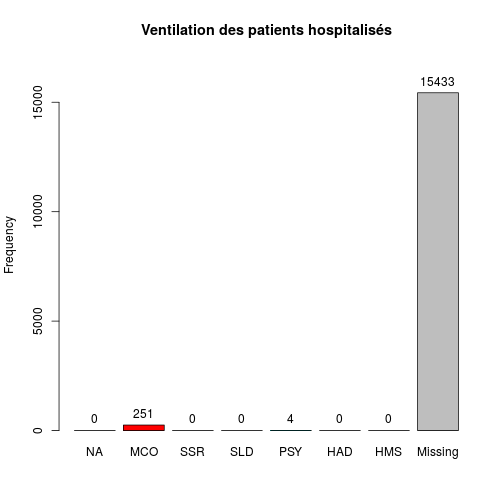

Analyse de l'activité d'un Hôpital
========================================================

Ligne 34 remplacer **Wis* par l'hôpital de son choix.


```r
source("../prologue.R")
```

```
## [1] "Fichier courant: rpu2013d0112.Rda"
```

```r
source("../../../Routines/mes_fonctions.R")

date()
```

```
## [1] "Wed Feb 19 09:34:28 2014"
```

```r
pt <- nrow(d1)
# population totale
pt
```

```
## [1] 340338
```

### Population totale 340338

Récupération des données
========================

```r
library("epicalc")
```

```
## Loading required package: foreign
## Loading required package: survival
## Loading required package: splines
## Loading required package: MASS
## Loading required package: nnet
```

```r
library("lubridate")
library("stargazer")
```

```
## 
## Please cite as: 
## 
##  Hlavac, Marek (2013). stargazer: LaTeX code and ASCII text for well-formatted regression and summary statistics tables.
##  R package version 4.5.3. http://CRAN.R-project.org/package=stargazer
```

```r

source("odds.R")

# Pour supprimer la notation scientifique:
options(scipen = 6, digits = 2)

# Pour imposer un péparateur de milliers:
knit_hooks$set(inline = function(x) {
    prettyNum(x, big.mark = " ")
})

ch <- "Geb"
ch.names <- "CH Guebwiller"

hopital <- d1[d1$FINESS == ch, ]
n <- nrow(hopital)
```

CH de CH Guebwiller
===================

### Passages en 2013: 15 103

Mode de sortie
--------------
- 4 items: mutation, Transfert, Domicile, décès
- **hosp** nombre total de patients hospitalisés
- **total** hospitalisés + retour à domicile
- le rapport des deux donne le **taux d'hospitalisation**


```r
a <- summary(hopital$MODE_SORTIE)
a
```

```
##        NA  Mutation Transfert  Domicile     Décès      NA's 
##         0       315       197      7748         0      6843
```

```r

hosp <- as.numeric(a["Mutation"] + a["Transfert"])
hosp
```

```
## [1] 512
```

```r
total <- as.numeric(hosp + a["Domicile"])
total
```

```
## [1] 8260
```

```r
ratio_hosp <- round(hosp * 100/as.numeric(a["Domicile"]))
ratio_hosp
```

```
## [1] 7
```

```r
tx_hosp <- round(hosp * 100/total)
tx_hosp
```

```
## [1] 6
```

```r

stargazer(table(hopital$MODE_SORTIE))
```

```
## Error: $ operator is invalid for atomic vectors
```

```r

tab1(hopital$MODE_SORTIE, main = "Mode de sortie de l'hôpital")
```

```
## hopital$MODE_SORTIE : 
##           Frequency   %(NA+)   %(NA-)
## NA                0      0.0      0.0
## Mutation        315      2.1      3.8
## Transfert       197      1.3      2.4
## Domicile       7748     51.3     93.8
## Décès             0      0.0      0.0
## NA's           6843     45.3      0.0
##   Total       15103    100.0    100.0
```

```r
tab1(hopital$MODE_SORTIE, main = "Mode de sortie de l'hôpital")
```

 

```
## hopital$MODE_SORTIE : 
##           Frequency   %(NA+)   %(NA-)
## NA                0      0.0      0.0
## Mutation        315      2.1      3.8
## Transfert       197      1.3      2.4
## Domicile       7748     51.3     93.8
## Décès             0      0.0      0.0
## NA's           6843     45.3      0.0
##   Total       15103    100.0    100.0
```

- Nombre de patients hospitalisés (mutation + transferts): 512
- Taux d'hospitalisation: **6 %**


Destination
-----------
- 6 items: MCO, SSR, SLD, PSY, HAD, HMS
- on détermine les vrais non renseignés par soustraction entre le nombre total de patients déclarés hospitalisés (**hosp**) et la somme des 6 items qui décrivent la ventilation des hospitalisés. Normalement cette différence devrait être nulle.
- cette différence est notée **delta**. Elle permet de calculer l'exhaustivité pour l'item destination **exhaustivite.destination**


```r

a <- summary(hopital$DESTINATION)
a
```

```
   NA   MCO   SSR   SLD   PSY   HAD   HMS  NA's 
    0   451    50     6     5     0     5 14586 
```

```r
# delta = vrai non renseignés
delta <- hosp - a["MCO"] - a["SSR"] - a["SLD"] - a["PSY"] - a["HAD"] - a["HMS"]
# exhaustivité réelle pour la destination
exhaustivite.destination <- round(100 - (delta * 100/hosp), 2)

tab1(hopital$DESTINATION, main = "Ventilation des patients hospitalisés")
```

 

```
hopital$DESTINATION : 
        Frequency   %(NA+)   %(NA-)
NA              0      0.0      0.0
MCO           451      3.0     87.2
SSR            50      0.3      9.7
SLD             6      0.0      1.2
PSY             5      0.0      1.0
HAD             0      0.0      0.0
HMS             5      0.0      1.0
NA's        14586     96.6      0.0
  Total     15103    100.0    100.0
```

```r
tab1(hopital$DESTINATION, main = "Ventilation des patients hospitalisés", missing = FALSE)
```

 

```
hopital$DESTINATION : 
        Frequency   %(NA+)   %(NA-)
NA              0      0.0      0.0
MCO           451      3.0     87.2
SSR            50      0.3      9.7
SLD             6      0.0      1.2
PSY             5      0.0      1.0
HAD             0      0.0      0.0
HMS             5      0.0      1.0
NA's        14586     96.6      0.0
  Total     15103    100.0    100.0
```


Distribution intra-hospitalière des patients hospitalisés. La colonne *Missing* correspond aux patients non hospialisés.
- vrai non renseignés pour la destination: -5, exhaustivité: 101 %

Orientation
-----------

- 13 items: CHIR FUGUE   HDT    HO   MED  OBST   PSA   REA   REO    SC  SCAM    SI  UHCD
  - items hospitalisation (**orient.hosp**): CHIR, HDT, HO, MED, OBST, REA, SC, SI, UHCD 
  - sorties atypiques (**orient.atypique**): FUGUE, PSA, SCAM
  - réorientation immédiate (**orient.reorient **): REO
- L'orientation est un mélange d'hospitalisés et de non hospitalisés.
- L'exhaustivité (**orient.exhaustivite**) est calculée comme le rapport entre les orientation correspondant à une hospitalisation (MED, CHIR, SI, etc) et le nombre d'hospitalisations (**hosp**) déclarées au paragraphe destination. Comment calculer l'exhaustivité des sorties atypiques ?


```r

a <- summary(hopital$ORIENTATION)
a
```

```
 CHIR FUGUE   HDT    HO   MED  OBST   PSA   REA   REO    SC  SCAM    SI 
   59     3     1     3    29     4    40     2     1     6    33    10 
 UHCD  NA's 
   26 14886 
```

```r
# on supprime les NA
a <- hopital$ORIENTATION[!is.na(hopital$ORIENTATION)]
nb_orient <- length(a)
tab1(a, horiz = T, main = "Orientation des patients", xlab = "Nombre")
```

 

```
a : 
        Frequency Percent Cum. percent
CHIR           59    27.2           27
FUGUE           3     1.4           29
HDT             1     0.5           29
HO              3     1.4           30
MED            29    13.4           44
OBST            4     1.8           46
PSA            40    18.4           64
REA             2     0.9           65
REO             1     0.5           65
SC              6     2.8           68
SCAM           33    15.2           83
SI             10     4.6           88
UHCD           26    12.0          100
  Total       217   100.0          100
```

```r

sa <- summary(a)
orient.hosp <- as.numeric(sa["HO"] + sa["HDT"] + sa["UHCD"] + sa["SI"] + sa["SC"] + 
    sa["REA"] + sa["OBST"] + sa["MED"] + sa["CHIR"])
orient.atypique <- as.numeric(sa["SCAM"] + sa["PSA"] + sa["FUGUE"])
orient.reorient <- as.numeric(sa["REO"])
orient.exhaustivite <- 100 - round(100 * (hosp - orient.hosp)/hosp, 2)
```

- nombre de RPU avec orientation renseigné: 217
- nombre d'orientation correspondant à une hospitalisation: 140
- nombre de patients déclarés hospitalisés à la rubrique destination: 512
- exhaustivité: **27 %**
- nombre de réorientations: 1
- nombre de sorties atypiques: 76

Age
----


```r
age_local <- hopital$AGE
s <- summary(age_local)

c <- cut(age_local, breaks = c(-1, 1, 75, 150), labels = c("1 an", "1 à 75 ans", 
    "sup 75 ans"), ordered_result = TRUE)
a <- summary(c)
a
```

```
##       1 an 1 à 75 ans sup 75 ans 
##        225      13347       1531
```

```r

c2 <- cut(age_local, breaks = c(-1, 19, 75, 120), labels = c("Pédiatrie", "Adultes", 
    "Gériatrie"))
b <- summary(c2)
b
```

```
## Pédiatrie   Adultes Gériatrie 
##      4537      9035      1531
```

### Age moyen: 37  ans
### Pédiatrie: 4 537  (30 %)
### Gériatrie: 1 531  (10 %)


```r

# region: chiffre pour toute l'Alsace local: hopital
region <- d1$AGE

hist(region, freq = F, main = "Histogramme des ages", ylab = "Fréquence", xlab = "Classes d'ages")
hist(age_local, add = T, col = "blue", freq = F)
abline(v = median(region, na.rm = T), col = "red")
abline(v = median(s, na.rm = T), col = "green")
legend("topright", legend = c("médiane régionale", "médiane locale", "Région"), 
    col = c("red", "green", "blue"), lty = 1, pch = 15)
```

 

```r

# moins de 1 an / total, pt = total RPU pour la région

local <- hopital$AGE[hopital$AGE < 1]
length(local)
```

```
## [1] 61
```

```r
length(local) * 100/n
```

```
## [1] 0.4
```

```r
region <- d1$AGE[d1$AGE < 1]
length(region) * 100/pt
```

```
## [1] 2.7
```

```r

# on forme une matrice carrée de 2 lignes et 2 colonnes: on saisi d'abord la
# colonne 1, puis 2 pour une saisie par ligne mettre byrow=TRUE
M1 <- matrix(c(length(local), n, length(region), pt), nrow = 2, byrow = FALSE)
M1
```

```
##       [,1]   [,2]
## [1,]    61   9226
## [2,] 15103 340338
```

```r
chisq.test(M1)
```

```
## 
## 	Pearson's Chi-squared test with Yates' continuity correction
## 
## data:  M1
## X-squared = 292, df = 1, p-value < 2.2e-16
```

```r
p <- M1[1, 1]/n
q <- M1[1, 2]/pt
or <- p * (1 - q)/q * (1 - p)
p
```

```
## [1] 0.004
```

```r
q
```

```
## [1] 0.027
```

```r
or
```

```
## [1] 0.14
```

```r

calcOddsRatio(M1, referencerow = 2)
```

```
## [1] "categorie =  , odds ratio =  0.14899222463156"
## [1] "categorie =  ,  95 % interval de confiance = [ 0.115768352787841 , 0.191750875486177 ]"
```

```r
calcRelativeRisk(M1)
```

```
## [1] "category =  , relative risk =  0.154581917136941"
## [1] "category =  ,  95 % confidence interval = [ 0.12031527934553 , 0.198607934384686 ]"
```

```r

# 75 ans et plus

local <- hopital$AGE[hopital$AGE > 74]
length(local) * 100/n  # % de la pop locale de 75 ans qui passa au SU
```

```
## [1] 11
```

```r
region <- d1$AGE[d1$AGE > 74]
length(region) * 100/pt  # % de 75 ans dans la pop alsacienne qui consulte au SU
```

```
## [1] 15
```

```r

hist(local, main = "75 ans et plus", xlab = "age", col = "pink")
```

 

```r
summary(local)
```

```
##    Min. 1st Qu.  Median    Mean 3rd Qu.    Max. 
##      75      79      83      84      88     104
```

```r
boxplot(local, col = "pink", main = "75 ans et plus", ylab = "Age (années)")
```

 

```r

# calcul manuel de l'odds-ratio

M1 <- matrix(c(length(local), n - length(local), length(region), pt - length(region)), 
    nrow = 2, byrow = FALSE)
M1
```

```
##       [,1]   [,2]
## [1,]  1615  52512
## [2,] 13488 287826
```

```r
chisq.test(M1)
```

```
## 
## 	Pearson's Chi-squared test with Yates' continuity correction
## 
## data:  M1
## X-squared = 251, df = 1, p-value < 2.2e-16
```

```r
p <- M1[1, 1]/n
q <- M1[1, 2]/pt
or <- (p * (1 - q))/(q * (1 - p))
p
```

```
## [1] 0.11
```

```r
q
```

```
## [1] 0.15
```

```r
or
```

```
## [1] 0.66
```

```r

# calcul del'OR et du risque relatif avec formules:

calcOddsRatio(M1, referencerow = 2)
```

```
## [1] "categorie =  , odds ratio =  0.656290975213122"
## [1] "categorie =  ,  95 % interval de confiance = [ 0.622762101756773 , 0.69162500886159 ]"
```

```r
calcRelativeRisk(M1)
```

```
## [1] "category =  , relative risk =  0.666546302037642"
## [1] "category =  ,  95 % confidence interval = [ 0.633537303656711 , 0.701275158062036 ]"
```

```r
chisq.test(M1)
```

```
## 
## 	Pearson's Chi-squared test with Yates' continuity correction
## 
## data:  M1
## X-squared = 251, df = 1, p-value < 2.2e-16
```

```r
fisher.test(M1)
```

```
## 
## 	Fisher's Exact Test for Count Data
## 
## data:  M1
## p-value < 2.2e-16
## alternative hypothesis: true odds ratio is not equal to 1
## 95 percent confidence interval:
##  0.62 0.69
## sample estimates:
## odds ratio 
##       0.66
```

```r

# graphe de l'OR

odds <- calcOddsRatio(M1, referencerow = 2, quiet = TRUE)
or <- odds[1]
lower <- odds[2]
upper <- odds[3]
y <- 0.5
if (lower > 1) limiteInf <- 0.5 else limiteInf <- lower - 0.5
plot(or, y, pch = 19, col = "darkblue", xlab = "odds-ratio", ylab = "", axes = FALSE, 
    main = "Patients de 75 ans et plus", xlim = c(limiteInf, upper + 0.5))
axis(1)
abline(v = 1, lty = "dashed")
lines(c(lower, upper), c(y, y), col = "royalblue")
```

 


sex ratio
-----------

```r
sexew <- hopital$SEXE
local <- summary(sexew)
local
```

```
##    F    I    M 
## 7387    0 7716
```

```r
srw <- round(local[3]/local[1], 3)

sexer <- d1$SEXE
region <- summary(sexer)
region
```

```
##      F      I      M 
## 161941      5 178392
```

```r
srr <- round(region[3]/region[1], 3)

M1 <- matrix(c(local[3], local[1], region[3], region[1]), nrow = 2)
colnames(M1) <- c("Local", "Alsace")
rownames(M1) <- c("Hommes", "Femmes")
M1
```

```
##        Local Alsace
## Hommes  7716 178392
## Femmes  7387 161941
```

```r
calcOddsRatio(M1, referencerow = 2)
```

```
## [1] "categorie = Hommes , odds ratio =  0.948212251093752"
## [1] "categorie = Hommes ,  95 % interval de confiance = [ 0.917793598690976 , 0.97963907615683 ]"
```

```r
or <- calcOddsRatio(M1, referencerow = 2, quiet = TRUE)

plot(or[1], 1, pch = 19, col = "darkblue", xlab = "odds-ratio", ylab = "", axes = FALSE)
axis(1)
abline(v = 1, lty = "dashed")
lines(c(or[2], or[3]), c(1, 1), col = "royalblue")
```

 

sex-ratio local = 1  
sex-ratio régional = 1.1  
odds-ratio = 0.95 [0.92-0.98]

Le sex-ratio est légèrement inférieur à celui de la région mais pas signficativement différent

Horaires
---------

```r
e <- hour(hopital$ENTREE)
a <- cut(e, breaks = c(0, 7, 19, 23), labels = c("nuit profonde", "journée", 
    "soirée"))
b <- summary(a)
```


### Soirée 15 %

### Nuit profonde 6.6 %

On fait la somme du vendredi 20 heures au lundi matin 8 heures. Dimanche = 1

```r
d <- hopital$ENTREE[wday(hopital$ENTREE) == 1 | wday(hopital$ENTREE) == 7 | 
    (wday(hopital$ENTREE) == 6 & hour(hopital$ENTREE) > 19) | (wday(hopital$ENTREE) == 
    2 & hour(hopital$ENTREE) < 8)]
f <- summary(as.factor(wday(d)))
```

### Week-end: 4 963 dossiers (33 %)

Gravité
--------

```r
d <- hopital$GRAVITE
a <- summary(d)
```


### CCMU 1: 881 (6 %)

### CCMU 4 & 5: 22 (0 %)

Durée de prise en charge
-------------------------

```r
e <- ymd_hms(hopital$ENTREE)
s <- ymd_hms(hopital$SORTIE)

hopital$presence <- s - e
hopital$presence[d1$presence < 0] <- NA

# hopital$presence est de type 'difftime' est peut s'exprimer en minutes ou
# en secondes. Si nécessaire on convertit les secondes en minutes:
if (units(hopital$presence) == "secs") hopital$presence <- hopital$presence/60

a <- summary(as.numeric(hopital$presence))

# on limite la durée de présence limitée à 1 jours
troisJours <- hopital[as.numeric(hopital$presence) < 1440 * 1, "presence"]
hist(as.numeric(troisJours), breaks = 40, main = "Durée de présence", xlab = "Temps (minutes)", 
    ylab = "Nombre", col = "green")
```

 

```r

# histogramme avec toutes les données:
hist(as.numeric(hopital$presence), breaks = 40, main = "Durée de présence", 
    xlab = "Temps (minutes)", ylab = "Nombre", col = "green")
```

 

```r


q <- hopital$presence[as.numeric(hopital$presence) < 4 * 60]
h <- hopital[hopital$MODE_SORTIE == "Mutation" | hopital$MODE_SORTIE == "Transfert", 
    "presence"]
sh <- summary(as.numeric(h))
sh
```

```
##    Min. 1st Qu.  Median    Mean 3rd Qu.    Max.    NA's 
##       7      45      75     113     115    1550    6843
```

```r
dom <- hopital[hopital$MODE_SORTIE == "Domicile", "presence"]
sdom <- summary(as.numeric(dom))
```

### Moyenne: 76 minutes

### Médiane: 50 minutes

### % en moins de 4 heures: 14 565 (96 %)

### si hospitalisé: 113 minutes

### si retour à domicile: 75 minutes

### Taux hospitalisation: 49 %

TOP 5 des pathologies
---------------------
### Médicales

### Traumatiques

```r
trauma <- hopital[substr(hopital$DP, 1, 3) >= "S00" & substr(hopital$DP, 1, 
    4) <= "T65", ]
head(trauma$DP)
```

```
## [1] "T230" "T510" "S019" "S019" "S208" "S009"
```

```r
t <- summary(as.factor(trauma$DP))
head(sort(t, decreasing = T), 6)
```

```
##    S934 (Other)    S610    S019    S602    S600 
##     540     523     374     360     337     283
```

traumato: 7 357 soit 49 %  
Lésions les plus fréquentes: 540  


### Chirurgicales

Exhaustivité des données (RADAR)
------------------------
Par défaut, le diagramme en radar commence à 15h et progresse dans le sens antihoraire (la position 2 correspond à 14 heures, etc.)

```r
library("plotrix", lib.loc = "/usr/lib/R/site-library")

rpu.names <- c("Entrée", "Sexe", "Age", "Commune", "ZIP", "Provenance", "PEC Transport", 
    "Mode Transport", "Mode entrée", "CCMU", "Motif", "DP", "Sortie", "Mode sortie", 
    "Orientation", "Destination")

# taux de complétude régional
a <- is.na(d1)
b <- round(apply(a, 2, mean) * 100, 2)
# b <- sort(b)
b <- cbind(b)
colnames(b) <- "%"
completude <- c(b[6], b[16], b[20], b[3], b[2], b[15], b[19], b[18], b[10], 
    b[9], b[12], b[5], b[17], b[11], b[14], b[4])
completude <- 100 - completude

radial.plot(completude, labels = rpu.names, , rp.type = "p", radial.lim = c(0, 
    100), poly.col = "khaki", main = paste(ch.names, "- Taux de complétude des RPU"))

# taux de complétude de l'hôpital local
a <- is.na(hopital)
b <- round(apply(a, 2, mean) * 100, 2)
# b<-sort(b)
b <- cbind(b)
colnames(b) <- "%"
completude_hop <- c(b[6], b[16], b[20], b[3], b[2], b[15], b[19], b[18], b[10], 
    b[9], b[12], b[5], b[17], b[11], b[14], b[4])
completude_hop <- 100 - completude_hop
# corrections
completude_hop[16] <- exhaustivite.destination
completude_hop[15] <- orient.exhaustivite

radial.plot(completude_hop, labels = rpu.names, radial.lim = c(0, 100), add = T, 
    rp.type = "p", line.col = "goldenrod4", main = "Taux de complétude des RPU", 
    lwd = 2)

legend("bottomleft", legend = c(ch.names, "Alsace"), col = c("goldenrod4", "khaki"), 
    lty = 1, bty = "n")
```

 

```r

c <- as.data.frame(completude)
rownames(c) <- rpu.names
c <- cbind(c, completude_hop)
names(c) <- c("Alsace (%)", ch.names)
c
```

```
##                Alsace (%) CH Guebwiller
## Entrée                100        100.00
## Sexe                  100        100.00
## Age                   100        100.00
## Commune               100        100.00
## ZIP                   100        100.00
## Provenance             65         15.20
## PEC Transport          74         38.76
## Mode Transport         77         99.09
## Mode entrée            91         58.09
## CCMU                   86         99.87
## Motif                  64          0.03
## DP                     66         99.62
## Sortie                 91        100.00
## Mode sortie            86         54.69
## Orientation            20         27.34
## Destination            21        100.98
```


