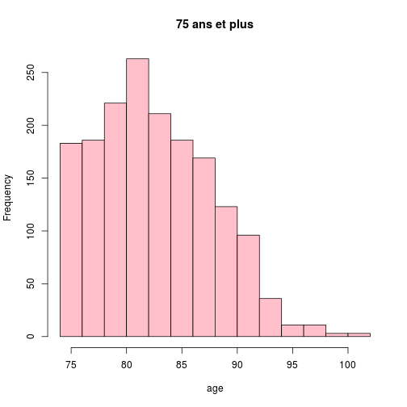

CH Wissembourg
========================================================

Ligne 21 remplacer **Wis* par l'hôpital de son choix.


```r
source("../prologue.R")
```

```
## [1] "Fichier courant: rpu2013d0111.Rda"
```

```r
source("../../mes_fonctions.R")

date()
```

```
## [1] "Sat Dec 14 11:11:37 2013"
```

```r
pt <- nrow(d1)
# population totale
pt
```

```
## [1] 301767
```

Récupération des données
========================

```r
library("epicalc")
```

```
## Loading required package: foreign
## Loading required package: survival
## Loading required package: splines
## Loading required package: MASS
## Loading required package: nnet
```

```r
library("lubridate")
source("odds.R")
HOP <- d1[d1$FINESS == "Col", ]
n <- nrow(HOP)
```

### Passages en 2013: 59503

Mode de sortie
--------------

```r
a <- summary(HOP$MODE_SORTIE)
a
```

```
##        NA  Mutation Transfert  Domicile     Décès      NA's 
##         0     13703      1111     43511         0      1178
```

```r
tab1(HOP$MODE_SORTIE)
```

 

```
## HOP$MODE_SORTIE : 
##           Frequency   %(NA+)   %(NA-)
## NA                0      0.0      0.0
## Mutation      13703     23.0     23.5
## Transfert      1111      1.9      1.9
## Domicile      43511     73.1     74.6
## Décès             0      0.0      0.0
## NA's           1178      2.0      0.0
##   Total       59503    100.0    100.0
```

```r
hosp <- as.numeric(a["Mutation"] + a["Transfert"])
hosp
```

```
## [1] 14814
```

```r
total <- as.numeric(hosp + a["Domicile"])
total
```

```
## [1] 58325
```

```r
ratio_hosp <- round(hosp * 100/as.numeric(a["Domicile"]))
ratio_hosp
```

```
## [1] 34
```

```r
tx_hosp <- round(hosp * 100/total)
tx_hosp
```

```
## [1] 25
```


Destination
-----------

```r
a <- summary(HOP$DESTINATION)
a
```

```
##    NA   MCO   SSR   SLD   PSY   HAD   HMS  NA's 
##     0 14009     4     0   682     0     0 44808
```

```r
tab1(HOP$DESTINATION)
```

 

```
## HOP$DESTINATION : 
##         Frequency   %(NA+)   %(NA-)
## NA              0      0.0      0.0
## MCO         14009     23.5     95.3
## SSR             4      0.0      0.0
## SLD             0      0.0      0.0
## PSY           682      1.1      4.6
## HAD             0      0.0      0.0
## HMS             0      0.0      0.0
## NA's        44808     75.3      0.0
##   Total     59503    100.0    100.0
```


Orientation
-----------

```r
summary(HOP$ORIENTATION)
```

```
##  CHIR FUGUE   HDT    HO   MED  OBST   PSA   REA   REO    SC  SCAM    SI 
##  2547   111    53     6  6016    27   898   363  1085   387   161   582 
##  UHCD  NA's 
##  4450 42817
```

```r

# on supprime les NA
a <- HOP$ORIENTATION[!is.na(HOP$ORIENTATION)]
tab1(a, horiz = T, main = "Orientation des patients", xlab = "Nombre")
```

 

```
## a : 
##         Frequency Percent Cum. percent
## CHIR         2547    15.3         15.3
## FUGUE         111     0.7         15.9
## HDT            53     0.3         16.2
## HO              6     0.0         16.3
## MED          6016    36.1         52.3
## OBST           27     0.2         52.5
## PSA           898     5.4         57.9
## REA           363     2.2         60.1
## REO          1085     6.5         66.6
## SC            387     2.3         68.9
## SCAM          161     1.0         69.8
## SI            582     3.5         73.3
## UHCD         4450    26.7        100.0
##   Total     16686   100.0        100.0
```


Age
----


```r
age_local <- HOP$AGE
s <- summary(age_local)

c <- cut(age_local, breaks = c(-1, 1, 75, 150), labels = c("1 an", "1 à 75 ans", 
    "sup 75 ans"), ordered_result = TRUE)
a <- summary(c)
a
```

```
##       1 an 1 à 75 ans sup 75 ans 
##       4992      47391       7120
```

```r

c2 <- cut(age_local, breaks = c(-1, 19, 75, 120), labels = c("Pédiatrie", "Adultes", 
    "Gériatrie"))
b <- summary(c2)
b
```

```
## Pédiatrie   Adultes Gériatrie 
##     21824     30559      7120
```

### Age moyen: 35.6  
### Pédiatrie: 21824  (37 %)
### Gériatrie: 7120  (12 %)


```r

# region: chiffre pour toute l'Alsace local: HOP
region <- d1$AGE

hist(region, freq = F)
hist(age_local, add = T, col = "blue", freq = F, main = "Histogramme des ages")
abline(v = median(region, na.rm = T), col = "red")
abline(v = median(s, na.rm = T), col = "green")
legend("topright", legend = c("médiane régionale", "médiane locale"), col = c("red", 
    "green"), lty = 1)
```

 

```r

# moins de 1 an / total
local <- HOP$AGE[HOP$AGE < 1]
length(local) * 100/n
```

```
## [1] 4.502
```

```r
region <- d1$AGE[d1$AGE < 1]
length(region) * 100/pt
```

```
## [1] 2.61
```

```r

# on forme une matrice carrée de 2 lignes et 2 colonnes: on saisi d'abord la
# colonne 1, puis 2 pour une saisie par ligne mettre byrow=TRUE
M1 <- matrix(c(length(a), n, length(region), pt), nrow = 2, byrow = FALSE)
M1
```

```
##       [,1]   [,2]
## [1,]     3   7875
## [2,] 59503 301767
```

```r
chisq.test(M1)
```

```
## 
## 	Pearson's Chi-squared test with Yates' continuity correction
## 
## data:  M1
## X-squared = 1538, df = 1, p-value < 2.2e-16
```

```r
p <- M1[1, 1]/n
q <- M1[1, 2]/pt
or <- p * (1 - q)/q * (1 - p)
p
```

```
## [1] 5.042e-05
```

```r
q
```

```
## [1] 0.0261
```

```r
or
```

```
## [1] 0.001881
```

```r

calcOddsRatio(M1, referencerow = 2)
```

```
## [1] "categorie =  , odds ratio =  0.0019319842216839"
## [1] "categorie =  ,  95 % interval de confiance = [ 0.000622950742406076 , 0.00599174666430118 ]"
```

```r
calcRelativeRisk(M1)
```

```
## [1] "category =  , relative risk =  0.00231205581946696"
## [1] "category =  ,  95 % confidence interval = [ 0.000745830442514099 , 0.00716731552859615 ]"
```

```r

# 75 ans et plus

a <- HOP$AGE[HOP$AGE > 74]
length(a) * 100/n  # % de la pop locale de 75 ans qui passa au SU
```

```
## [1] 12.53
```

```r
region <- d1$AGE[d1$AGE > 74]
length(region) * 100/pt  # % de 75 ans dans la pop alsacienne qui consulte au SU
```

```
## [1] 15.42
```

```r

hist(a, main = "75 ans et plus", xlab = "age", col = "pink")
```

 

```r
summary(a)
```

```
##    Min. 1st Qu.  Median    Mean 3rd Qu.    Max. 
##    75.0    79.0    83.0    83.5    87.0   112.0
```

```r
boxplot(a, col = "pink", main = "75 ans et plus", ylab = "Age (années)")
```

 

```r

# calcul manuel de l'odds-ratio

M1 <- matrix(c(length(a), n - length(a), length(region), pt - length(region)), 
    nrow = 2, byrow = FALSE)
M1
```

```
##       [,1]   [,2]
## [1,]  7458  46534
## [2,] 52045 255233
```

```r
chisq.test(M1)
```

```
## 
## 	Pearson's Chi-squared test with Yates' continuity correction
## 
## data:  M1
## X-squared = 325.6, df = 1, p-value < 2.2e-16
```

```r
p <- M1[1, 1]/n
q <- M1[1, 2]/pt
or <- (p * (1 - q))/(q * (1 - p))
p
```

```
## [1] 0.1253
```

```r
q
```

```
## [1] 0.1542
```

```r
or
```

```
## [1] 0.786
```

```r

# calcul del'OR et du risque relatif avec formules:

calcOddsRatio(M1, referencerow = 2)
```

```
## [1] "categorie =  , odds ratio =  0.785976942708004"
## [1] "categorie =  ,  95 % interval de confiance = [ 0.765651013319644 , 0.806842469639257 ]"
```

```r
calcRelativeRisk(M1)
```

```
## [1] "category =  , relative risk =  0.815540284708369"
## [1] "category =  ,  95 % confidence interval = [ 0.797413445549351 , 0.834079184009752 ]"
```

```r
chisq.test(M1)
```

```
## 
## 	Pearson's Chi-squared test with Yates' continuity correction
## 
## data:  M1
## X-squared = 325.6, df = 1, p-value < 2.2e-16
```

```r
fisher.test(M1)
```

```
## 
## 	Fisher's Exact Test for Count Data
## 
## data:  M1
## p-value < 2.2e-16
## alternative hypothesis: true odds ratio is not equal to 1
## 95 percent confidence interval:
##  0.7655 0.8069
## sample estimates:
## odds ratio 
##      0.786
```

```r

# graphe de l'OR

odds <- calcOddsRatio(M1, referencerow = 2, quiet = TRUE)
or <- odds[1]
lower <- odds[2]
upper <- odds[3]
y <- 0.5
if (lower > 1) limiteInf <- 0.5 else limiteInf <- lower - 0.5
plot(or, y, pch = 19, col = "darkblue", xlab = "odds-ratio", ylab = "", axes = FALSE, 
    main = "Patients de 75 ans et plus", xlim = c(limiteInf, upper + 0.5))
axis(1)
abline(v = 1, lty = "dashed")
lines(c(lower, upper), c(y, y), col = "royalblue")
```

 


sex ratio
-----------

```r
sexew <- HOP$SEXE
local <- summary(sexew)
local
```

```
##     F     I     M 
## 27245     0 32258
```

```r
srw <- round(local[3]/local[1], 3)

sexer <- d1$SEXE
region <- summary(sexer)
region
```

```
##      F      I      M 
## 143324      4 158439
```

```r
srr <- round(region[3]/region[1], 3)

M1 <- matrix(c(local[3], local[1], region[3], region[1]), nrow = 2)
colnames(M1) <- c("Local", "Alsace")
rownames(M1) <- c("Hommes", "Femmes")
M1
```

```
##        Local Alsace
## Hommes 32258 158439
## Femmes 27245 143324
```

```r
calcOddsRatio(M1, referencerow = 2)
```

```
## [1] "categorie = Hommes , odds ratio =  1.07104434612106"
## [1] "categorie = Hommes ,  95 % interval de confiance = [ 1.05231795034882 , 1.09010398518588 ]"
```

```r
or <- calcOddsRatio(M1, referencerow = 2, quiet = TRUE)

plot(or[1], 1, pch = 19, col = "darkblue", xlab = "odds-ratio", ylab = "", axes = FALSE)
axis(1)
abline(v = 1, lty = "dashed")
lines(c(or[2], or[3]), c(1, 1), col = "royalblue")
```

 

sex-ratio local = 1.184  
sex-ratio régional = 1.105  
odds-ratio = 1.071 [1.0523-1.0901]

Le sex-ratio est légèrement inférieur à celui de la région mais pas signficativement différent

Horaires
---------

```r
e <- hour(HOP$ENTREE)
a <- cut(e, breaks = c(0, 7, 19, 23), labels = c("nuit profonde", "journée", 
    "soirée"))
b <- summary(a)
```


### Soirée 15.81 %

### Nuit profonde 8.28 %

On fait la somme du vendredi 20 heures au lundi matin 8 heures. Dimanche = 1

```r
d <- HOP$ENTREE[wday(HOP$ENTREE) == 1 | wday(HOP$ENTREE) == 7 | (wday(HOP$ENTREE) == 
    6 & hour(HOP$ENTREE) > 19) | (wday(HOP$ENTREE) == 2 & hour(HOP$ENTREE) < 
    8)]
f <- summary(as.factor(wday(d)))
```

### Week-end: 19381 dossiers (32.57 %)

Gravité
--------

```r
d <- HOP$GRAVITE
a <- summary(d)
```


### CCMU 1: 19337 (32 %)

### CCMU 4 & 5: 698 (1 %)

Durée de prise en charge
-------------------------

```r
e <- ymd_hms(HOP$ENTREE)
s <- ymd_hms(HOP$SORTIE)

HOP$presence <- s - e
HOP$presence[d1$presence < 0] <- NA

# HOP$presence est de type 'difftime' est peut s'exprimer en minutes ou en
# secondes. Si nécessaire on convertit les secondes en minutes:
if (units(HOP$presence) == "secs") HOP$presence <- HOP$presence/60

a <- summary(as.numeric(HOP$presence))

# on limite la durée de présence limitée à 1 jours
troisJours <- HOP[as.numeric(HOP$presence) < 1440 * 1, "presence"]
hist(as.numeric(troisJours), breaks = 40, main = "Durée de présence", xlab = "Temps (minutes)", 
    ylab = "Nombre", col = "green")
```

 

```r

# histogramme avec toutes les données:
hist(as.numeric(HOP$presence), breaks = 40, main = "Durée de présence", xlab = "Temps (minutes)", 
    ylab = "Nombre", col = "green")
```

 

```r


q <- HOP$presence[as.numeric(HOP$presence) < 4 * 60]
h <- HOP[HOP$MODE_SORTIE == "Mutation" | HOP$MODE_SORTIE == "Transfert", "presence"]
sh <- summary(as.numeric(h))
sh
```

```
##    Min. 1st Qu.  Median    Mean 3rd Qu.    Max.    NA's 
##       1     112     218     245     346    4420    1178
```

```r
dom <- HOP[HOP$MODE_SORTIE == "Domicile", "presence"]
sdom <- summary(as.numeric(dom))
```

### Moyenne: 168 minutes

### Médiane: 119 minutes

### % en moins de 4 heures: 45839 (77 %)

### si hospitalisé: 245 minutes

### si retour à domicile: 143 minutes

### Taux hospitalisation: 26.88 %

TOP 5 des pathologies
---------------------
### Médicales

### Traumatiques

```r
trauma <- HOP[substr(HOP$DP, 1, 3) >= "S00" & substr(HOP$DP, 1, 4) <= "T65", 
    ]
head(trauma$DP)
```

```
## [1] "T17.9" "S05.6" "S91.3" "T23.2" "S61.8" "T22.2"
```

```r
t <- summary(as.factor(trauma$DP))
head(sort(t, decreasing = T), 6)
```

```
##    NA's (Other)   S93.4   S61.0  S52.50   S61.8 
##    6699    3438    1002     776     658     558
```

traumato: 28119 soit 47 %  
Lésions les plus fréquentes: 6699, 3438, 1002, 776, 658, 558  


### Chirurgicales
