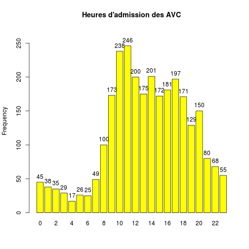
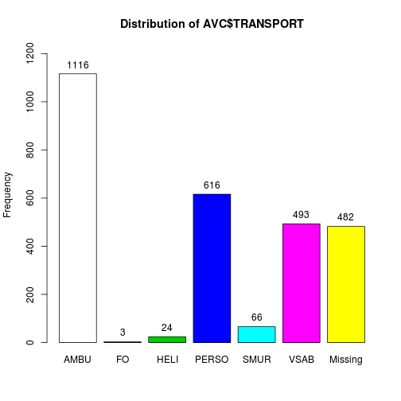

CIM 10
========================================================


```r
source("../prologue.R")
```

```
## [1] "Fichier courant: rpu2013d0112.Rda"
```

```r
source("../../../Routines/mes_fonctions.R")
library("lubridate")
library("epicalc")
library("epitools")
```

```
## 
## Attaching package: 'epitools'
## 
## L'objet suivant est masqué from 'package:survival':
## 
##     ratetable
```

```r

nrow(d1)
```

```
## [1] 344073
```


Analyse
----------


```r

dp <- d1$DP
ndp <- length(dp)
dpr <- dp[!is.na(dp)]
ndpr <- length(dpr)

# RPU renseignés
ndp
```

```
## [1] 344073
```

```r

# CIM10 renseignés
ndpr
```

```
## [1] 228524
```

```r

# % de DP renseignés:
round(ndpr * 100/ndp)
```

```
## [1] 66
```

```r

# correction d'erreurs: dpr[37807]<-'N10' dpr[47689]<-'R06.0'
# dpr[68023]<-'C61' dpr[73924]<-'N10'

# dpr<-gsub('.','',dpr,fixed=TRUE)
total <- ndpr

dpr <- d1[!is.na(d1$DP), c("DP", "CODE_POSTAL", "ENTREE", "FINESS", "GRAVITE", 
    "ORIENTATION", "MODE_SORTIE", "AGE", "SEXE", "TRANSPORT")]
# correction d'erreurs:
dpr$DP[37807] <- "N10"
dpr$DP[47689] <- "R06.0"
dpr$DP[68023] <- "C61"
dpr$DP[73924] <- "N10"
# un peu de ménage:
dpr$DP <- gsub(".", "", as.character(dpr$DP), fixed = TRUE)
dpr$DP <- gsub("+", "", as.character(dpr$DP), fixed = TRUE)

# Analyse de la longueur des codes CIM10
a <- nchar(dpr$DP)
summary(as.factor(a))
```

```
##      1      3      4      5      6      7     11     12     15     16 
##      9  21634 182834  23622    302    118      1      1      2      1
```

```r

# Création d'un dataframe DP
dpr <- d1[!is.na(d1$DP), c("DP", "CODE_POSTAL", "ENTREE", "FINESS", "GRAVITE", 
    "ORIENTATION", "MODE_SORTIE", "AGE", "SEXE", "TRANSPORT", "DESTINATION")]


annee <- 2013
```


Pneumonies
----------


```r
pneumo <- dpr[substr(dpr$DP, 1, 4) == "J159", ]
p <- summary(pneumo$AGE)
print("Pneumonies et AGE")
```

```
## [1] "Pneumonies et AGE"
```

```r
p
```

```
##    Min. 1st Qu.  Median    Mean 3rd Qu.    Max. 
##     2.0    63.0    79.0    72.1    86.0    98.0
```

Les pneumopaties bactériennes sans précision sont cotées J15.9 Dans la CIM10.
599 diagnostics de ce type ont été portés au SAU en 2013.

Les pneumonies bactériennes concernent les adultes agés des deux sexes. L'age moyen est de 72.1 ans et la moitié de ces patients ont 79 ans et plus.


```r
# copyright<-'© 2013 Résural'
seq3.r <- colorbrewer.palette(3, "seq", "r")

a <- epigraphe(pneumo$ENTREE, min.date = "2013-01-01", strata = pneumo$SEXE, 
    col = seq3.r[3:1], main = "Infections respiratoires", xlab = "", ylab = "Nombre de RPU")
```

 

En fonction de la gravité (CCMU):

```r
summary(as.factor(pneumo$GRAVITE))
```

```
##    1    2    3    4    5    D    P NA's 
##   13  268  276   29    2    0    0   11
```

En fonction du mode de sortie;

```r
summary(as.factor(pneumo$MODE_SORTIE))
```

```
##        NA  Mutation Transfert  Domicile     Décès      NA's 
##         0       459         0        93         0        47
```


En fonction de la destination:

```r
summary(as.factor(pneumo$DESTINATION))
```

```
##   NA  MCO  SSR  SLD  PSY  HAD  HMS NA's 
##    0  460    1    0    0    0    0  138
```


En fonction de l'orientation:

```r
a <- summary(pneumo$ORIENTATION)
a
```

```
##  CHIR FUGUE   HDT    HO   MED  OBST   PSA   REA   REO    SC  SCAM    SI 
##    11     0     0     0   170     0     0     2     0     0     0     1 
##  UHCD  NA's 
##   208   207
```


11 patients porteurs de problèmes respiratoires sont orienté en chirurgie : erreur ou manque de place en médecine ?


```r
rm(pneumo)
```


AVC
---


```r
AVC <- dpr[substr(dpr$DP, 1, 3) >= "I60" & substr(dpr$DP, 1, 3) < "I65" | substr(dpr$DP, 
    1, 3) == "G46" | substr(dpr$DP, 1, 3) == "G45", ]

h <- hour(AVC$ENTREE)
hist(h, breaks = 24, xlab = "Heure de la journée", main = "Répartition des AVC dans la journée")
```

 

```r
tab1(h, missing = FALSE, main = "Heures d'admission des AVC", col = "yellow")
```

 

```
## h : 
##         Frequency Percent Cum. percent
## 0              45     1.6          1.6
## 1              38     1.4          3.0
## 2              35     1.2          4.2
## 3              29     1.0          5.2
## 4              17     0.6          5.9
## 5              26     0.9          6.8
## 6              25     0.9          7.7
## 7              49     1.8          9.4
## 8             100     3.6         13.0
## 9             173     6.2         19.2
## 10            238     8.5         27.7
## 11            246     8.8         36.5
## 12            200     7.1         43.6
## 13            175     6.2         49.9
## 14            201     7.2         57.0
## 15            172     6.1         63.2
## 16            181     6.5         69.6
## 17            197     7.0         76.7
## 18            171     6.1         82.8
## 19            129     4.6         87.4
## 20            150     5.4         92.8
## 21             80     2.9         95.6
## 22             68     2.4         98.0
## 23             55     2.0        100.0
##   Total      2800   100.0        100.0
```

```r

nAvc <- nrow(AVC)
sAvc_age <- summary(AVC$AGE)
srAVC <- sr(AVC)
summary(AVC$TRANSPORT)
```

```
##  AMBU    FO  HELI PERSO  SMUR  VSAB  NA's 
##  1116     3    24   616    66   493   482
```

```r
tab1(AVC$TRANSPORT)
```

 

```
## AVC$TRANSPORT : 
##         Frequency   %(NA+)   %(NA-)
## AMBU         1116     39.9     48.1
## FO              3      0.1      0.1
## HELI           24      0.9      1.0
## PERSO         616     22.0     26.6
## SMUR           66      2.4      2.8
## VSAB          493     17.6     21.3
## NA's          482     17.2      0.0
##   Total      2800    100.0    100.0
```


Traumatologie
--------------
Code cim10 de S00 à T35

```r
trauma <- dpr[substr(dpr$DP, 1, 3) >= "S00" & substr(dpr$DP, 1, 4) <= "T65", 
    ]
trauma_age <- summary(trauma$AGE)
trauma_age
```

```
##    Min. 1st Qu.  Median    Mean 3rd Qu.    Max. 
##     0.0    13.0    28.0    33.9    51.0   112.0
```

```r
trauma_sexe <- summary(trauma$SEXE)
trauma_sexe
```

```
##     F     I     M 
## 36609     3 48089
```

Total traumato 84701  
Pourcentage 37.06
