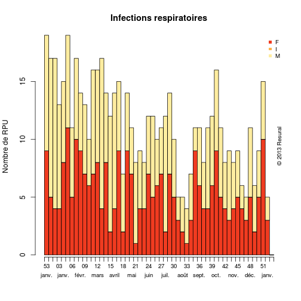

CIM 10
========================================================


```r
source("../prologue.R")
```

```
## [1] "Fichier courant: rpu2013d0110.Rda"
```

```r
source("../../mes_fonctions.R")
nrow(d1)
```

```
## [1] 276452
```


Analyse
----------


```r

dp <- d1$DP
ndp <- length(dp)
dpr <- dp[!is.na(dp)]
ndpr <- length(dpr)

# RPU renseignés
ndp
```

```
## [1] 276452
```

```r

# CIM10 renseignés
ndpr
```

```
## [1] 183565
```

```r

# % de DP renseignés:
round(ndpr * 100/ndp)
```

```
## [1] 66
```

```r

# correction d'erreurs: dpr[37807]<-'N10' dpr[47689]<-'R06.0'
# dpr[68023]<-'C61' dpr[73924]<-'N10'

# dpr<-gsub('.','',dpr,fixed=TRUE)
total <- ndpr

dpr <- d1[!is.na(d1$DP), c("DP", "CODE_POSTAL", "ENTREE", "FINESS", "GRAVITE", 
    "ORIENTATION", "MODE_SORTIE", "AGE", "SEXE", "TRANSPORT")]
# correction d'erreurs:
dpr$DP[37807] <- "N10"
dpr$DP[47689] <- "R06.0"
dpr$DP[68023] <- "C61"
dpr$DP[73924] <- "N10"
# un peu de ménage:
dpr$DP <- gsub(".", "", as.character(dpr$DP), fixed = TRUE)
dpr$DP <- gsub("+", "", as.character(dpr$DP), fixed = TRUE)

# Analyse de la longueur des codes CIM10
a <- nchar(dpr$DP)
summary(as.factor(a))
```

```
##      1      3      4      5      6      7     11     12     15     16 
##      9  17297 146862  19111    235     46      1      1      2      1
```

```r

# Création d'un dataframe DP
dpr <- d1[!is.na(d1$DP), c("DP", "CODE_POSTAL", "ENTREE", "FINESS", "GRAVITE", 
    "ORIENTATION", "MODE_SORTIE", "AGE", "SEXE", "TRANSPORT", "DESTINATION")]

library("epitools")
annee <- 2013
```


Pneumonies
----------


```r
pneumo <- dpr[substr(dpr$DP, 1, 4) == "J159", ]
p <- summary(pneumo$AGE)
print("Pneumonies et AGE")
```

```
## [1] "Pneumonies et AGE"
```

```r
p
```

```
##    Min. 1st Qu.  Median    Mean 3rd Qu.    Max. 
##     2.0    63.5    79.0    72.2    86.0    98.0
```

Les pneumopaties bactériennes sans précision sont cotées J15.9 Dans la CIM10.
467 diagnostics de ce type ont été portés au SAU en 2013.

Les pneumonies bactériennes concernent les adultes agés des deux sexes. L'age moyen est de 72.2 ans et la moitié de ces patients ont 79 ans et plus.


```r
# copyright<-'© 2013 Résural'
seq3.r <- colorbrewer.palette(3, "seq", "r")

a <- epigraphe(pneumo$ENTREE, min.date = "2013-01-01", strata = pneumo$SEXE, 
    col = seq3.r[3:1], main = "Infections respiratoires", xlab = "", ylab = "Nombre de RPU")
```

 

En fonction de la gravité (CCMU):

```r
summary(as.factor(pneumo$GRAVITE))
```

```
##    1    2    3    4    5    D    P NA's 
##   13  217  204   25    1    0    0    7
```

En fonction du mode de sortie;

```r
summary(as.factor(pneumo$MODE_SORTIE))
```

```
##        NA  Mutation Transfert  Domicile     Décès      NA's 
##         0       349         0        74         0        44
```


En fonction de la destination:

```r
summary(as.factor(pneumo$DESTINATION))
```

```
##   NA  MCO  SSR  SLD  PSY  HAD  HMS NA's 
##    0  350    1    0    0    0    0  116
```


En fonction de l'orientation:

```r
a <- summary(pneumo$ORIENTATION)
a
```

```
##  CHIR FUGUE   HDT    HO   MED  OBST   PSA   REA   REO    SC  SCAM    SI 
##     8     0     0     0   115     0     0     2     0     0     0     1 
##  UHCD  NA's 
##   177   164
```


8 patients porteurs de problèmes respiratoires sont orienté en chirurgie : erreur ou manque de place en médecine ?


```r
rm(pneumo)
```


AVC
---


```r
AVC <- dpr[substr(dpr$DP, 1, 3) >= "I60" & substr(dpr$DP, 1, 3) < "I65" | substr(dpr$DP, 
    1, 3) == "G46" | substr(dpr$DP, 1, 3) == "G45", ]

h <- hour(AVC$ENTREE)
```

```
## Error: impossible de trouver la fonction "hour"
```

```r
hist(h, breaks = 24, xlab = "Heure de la journée", main = "Répartition des AVC dans la journée")
```

```
## Error: objet 'h' introuvable
```

```r
tab1(h, missing = FALSE, main = "Heures d'admission des AVC", col = "paleyellow")
```

```
## Error: impossible de trouver la fonction "tab1"
```


Traumatologie
--------------
Code cim10 de S00 à T35

```r
trauma <- dpr[substr(dpr$DP, 1, 3) >= "S00" & substr(dpr$DP, 1, 4) <= "T65", 
    ]
trauma_age <- summary(trauma$AGE)
trauma_age
```

```
##    Min. 1st Qu.  Median    Mean 3rd Qu.    Max. 
##     0.0    13.0    28.0    33.6    50.0   112.0
```

```r
trauma_sexe <- summary(trauma$SEXE)
trauma_sexe
```

```
##     F     I     M 
## 29151     2 38691
```

Total traumato 67844  
Pourcentage 36.96
