Diagnostic principal
========================================================
On récupère la colonne diagnostic principal DP. Contient le code CIM10 des DP. Certaines adaptations sont nécessaires:
- suppression du point décimal (K36.2 devient K362)
- suppression du symbole '+'
- correction de codes apparaissant en clair pyélonéphrite N11


Analyse spécifique de certains items:
- AVC
- AIT
- Asthme
- gastro-entérites


```r
#'@param dp liste brute des diagnostics
#'@param dpr liste des diag sans les NA. Les intitulés sont standardisés par suppression du point. Ainsi I60.9 devient I609 (méthode gsub)
#'@param ndp nombre de DP bruts (NA inclus)
#'@param ndpr nombre de DP renseignés

library("epicalc")
```

```
## Loading required package: foreign
## Loading required package: survival
## Loading required package: splines
## Loading required package: MASS
## Loading required package: nnet
```

```r
library("lubridate")

source("../prologue.R")
```

```
## gdata: read.xls support for 'XLS' (Excel 97-2004) files ENABLED.
## 
## gdata: read.xls support for 'XLSX' (Excel 2007+) files ENABLED.
## 
## Attaching package: 'gdata'
## 
## L'objet suivant est masqué from 'package:stats':
## 
##     nobs
## 
## L'objet suivant est masqué from 'package:utils':
## 
##     object.size
## 
## Loading required package: questionr
## Loading required namespace: car
## 
## Attaching package: 'rgrs'
## 
## Les objets suivants sont masqués from 'package:questionr':
## 
##     copie, copie.default, copie.proptab, cprop, cramer.v,
##     format.proptab, freq, lprop, print.proptab, prop, quant.cut,
##     renomme.variable, residus, wtd.mean, wtd.table, wtd.var
## 
## Rattle : une interface graphique gratuite pour l'exploration de données avec R.
## Version 2.6.26 r77 Copyright (c) 2006-2013 Togaware Pty Ltd.
## Entrez 'rattle()' pour secouer, faire vibrer, et faire défiler vos données.
## 
## Attaching package: 'zoo'
## 
## Les objets suivants sont masqués from 'package:base':
## 
##     as.Date, as.Date.numeric
## 
## Please visit openintro.org for free statistics materials
## 
## Attaching package: 'openintro'
## 
## L'objet suivant est masqué from 'package:MASS':
## 
##     mammals
## 
## L'objet suivant est masqué from 'package:datasets':
## 
##     cars
```

```
## [1] "Fichier courant: rpu2013d0110.Rda"
```

```r
d1 <- foo(path, file)

# load('../../rpu2013d0107.Rda') d1<-d0107 rm(d0107)

dp <- d1$DP
ndp <- length(dp)
dpr <- dp[!is.na(dp)]
dpr <- d1[!is.na(d1$DP), c("DP", "CODE_POSTAL", "ENTREE", "FINESS", "GRAVITE", 
    "ORIENTATION", "MODE_SORTIE", "AGE", "SEXE", "TRANSPORT")]
dpr$DP <- gsub("\xe9", "é", dpr$DP)
dpr$DP <- gsub(".", "", dpr$DP, fixed = TRUE)

# dpr$DP<-gsub('.','',as.character(dpr$DP),fixed=TRUE)
dpr$DP <- gsub("+", "", dpr$DP, fixed = TRUE)
```

Nombre de diagnostics principaux (DP)

```r
ndpr <- nrow(dpr)
ndpr
```

```
## [1] 183565
```

Exhaustivité

```r
ex <- round(ndpr * 100/ndp, 2)
ex
```

```
## [1] 66.4
```

Nombre de diagnostic uniques:

```r
a <- length(unique(dpr$DP))
a
```

```
## [1] 4471
```

```r
a <- substr(dpr, 1, 1)
tab1(a, horiz = T, sort.group = "decreasing", main = "Classes dignostiques de la CIM10")
```

 

```
## a : 
##         Frequency Percent Cum. percent
## c              10     100          100
##   Total        10     100          100
```


Etude des AVC
-------------
Les AVC sont définis par la nomenclature *I60* à *I64*, *G45* Accidents ischémiques cérébraux transitoires (sauf G45.4 amnésie transitoire) et syndromes apparentés et *G46* Syndromes vasculaires cérébraux au cours de maladies cérébrovasculaires

La prévention et la prise en charge des accidents vasculaires cérébraux - Annexes -
juin 2009

Annexe : Liste exhaustive des codes CIM-10 d’AVC

- G450 Syndrome vertébro-basilaire
- G451 Syndrome carotidien (hémisphérique)
- G452 Accident ischémique transitoire de territoires artériels précérébraux multipleset bilatéraux
- G453 Amaurose fugace
- G454 Amnésie globale transitoire : NON RETENU
- G458 Autres accidents ischémiques cérébraux transitoires et syndromes apparentés
- G459 Accident ischémique cérébral transitoire, sans précision
- I600 Hémorragie sous-arachnoïdienne de labifurcation et du siphon carotidien
- I601 Hémorragie sous-arachnoïdienne de l'artère cérébrale moyenne
- I602 Hémorragie sous-arachnoïdienne de
- l'artère communicante antérieure
- I603 Hémorragie sous-arachnoïdienne del'artère communicante postérieure
- I604 Hémorragie sous-arachnoïdienne de l'artère basilaire
- I605 Hémorragie sous-arachnoïdienne de l'artère vertébrale
- I606 Hémorragie sous-arachnoïdienne d'autres artères intracrâniennes
- I607 Hémorragie sous-arachnoïdienne d'une ar
tère intracrânienne, sans précision
- I608 Autres hémorragies sous-arachnoïdiennes
- I609 Hémorragie sous-arachnoïdienne, sans précision
- I610 Hémorragie intracérébrale hémisphérique, sous-corticale
- I611 Hémorragie intracérébrale hémisphérique, corticale
- I612 Hémorragie intracérébrale hémisphérique, non précisée
- I613 Hémorragie intracérébrale du tronc cérébral
- I614 Hémorragie intracérébrale cérébelleuse
- I615 Hémorragie intracérébrale intraventriculaire
- I616 Hémorragie intracérébrale,localisations multiples
- I618 Autres hémorragies intracérébrales
- I619 Hémorragie intracérébrale, sans précision
- I620 Hémorragie sous-durale (aiguë) (non traumatique)
- I621 Hémorragie extradurale non traumatique
- I629 Hémorragie intracrânienne (non traumatique), sans précision
- I630 Infarctus cérébral dû à une thrombose des artères précérébrales
- I631 Infarctus cérébral dû à une embolie des artères précérébrales
- I632 Infarctus cérébral dû à une occlusion ou sténose des artères précérébrales,de mécanisme non précisé
- I633 Infarctus cérébral dû à une thrombose des artères cérébrales
- I634 Infarctus cérébral dû à une embolie des artères cérébrales
- I635 Infarctus cérébral dû à une occlusion ou sténose des artères cérébrales, demécanisme non précisé
- I636 Infarctus cérébral dû à une thrombose veineuse cérébrale, non pyogène
- I638 Autres infarctus cérébraux
- I639 Infarctus cérébral, sans précision
- I64 Accident vasculaire cérébral, non précisé comme étant hémorragique ou parinfarctus
- G460 Syndrome de l'artère cérébrale moyenne (I66.0) (1)
- G461 Syndrome de l'artère cérébrale antérieure (I66.1) (1)
- G462 Syndrome de l'artère cérébrale postérieure (I66.2) (1)
- G463 Syndromes vasculaires du tronc cérébral (I60-I67) (1)
- G464 Syndrome cérébelleux vasculaire (I60-I67) (1)
- G465 Syndrome lacunaire moteur pur (I60-I67) (1)
- G466 Syndrome lacunaire sensitif pur (I60-I67) (1)
- G467 Autres syndromes lacunaires (I60-I67) (1)
- G468 Autres syndromes vasculaires cérébraux au cours de maladies cérébrovasculaires (I60-I67) (1)
(1) : résumé à ne retenir que si présence d’un diagnostic associé significatif (DAS) des catégories I60 à I64


```r
#'@param avc liste des AVC
#'@param navc liste des codes Cim10 utilisés

avc <- dpr[substr(dpr$DP, 1, 3) >= "I60" & substr(dpr$DP, 1, 3) < "I65" | substr(dpr$DP, 
    1, 3) == "G46", ]
navc <- unique(avc)
summary(as.factor(avc$DP))
```

```
## G460 G462 G463 G464 G467 G468 I600 I601 I602 I606 I607 I608 I609 I610 I611 
##    5    1    1   11   15    3    2    2    3    1    2   29   17   63   21 
## I612 I613 I614 I615 I616 I618 I619 I620 I621 I629 I630 I631 I632 I633 I634 
##   17    1    6    5   20    9   19   16    2   66   10    1    3   22   14 
## I635 I636 I638 I639  I64 
##   18    1   43  516  710
```

```r

tab1(avc$DP, horiz = TRUE, sort.group = "decreasing", main = "AVC aux urgences (hors filière UNV", 
    missing = FALSE)
```

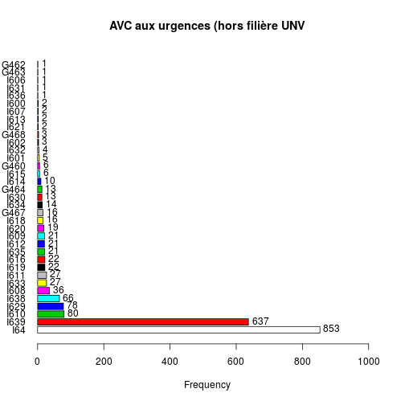 

```
## avc$DP : 
##         Frequency Percent Cum. percent
## I64           710    42.4         42.4
## I639          516    30.8         73.2
## I629           66     3.9         77.1
## I610           63     3.8         80.9
## I638           43     2.6         83.5
## I608           29     1.7         85.2
## I633           22     1.3         86.5
## I611           21     1.3         87.8
## I616           20     1.2         89.0
## I619           19     1.1         90.1
## I635           18     1.1         91.2
## I612           17     1.0         92.2
## I609           17     1.0         93.2
## I620           16     1.0         94.1
## G467           15     0.9         95.0
## I634           14     0.8         95.9
## G464           11     0.7         96.5
## I630           10     0.6         97.1
## I618            9     0.5         97.7
## I614            6     0.4         98.0
## I615            5     0.3         98.3
## G460            5     0.3         98.6
## I632            3     0.2         98.8
## I602            3     0.2         99.0
## G468            3     0.2         99.2
## I621            2     0.1         99.3
## I607            2     0.1         99.4
## I601            2     0.1         99.5
## I600            2     0.1         99.6
## I636            1     0.1         99.7
## I631            1     0.1         99.8
## I613            1     0.1         99.8
## I606            1     0.1         99.9
## G463            1     0.1         99.9
## G462            1     0.1        100.0
##   Total      1675   100.0        100.0
```

# Etude des AVC+AIT

avc_ait<-dpr[substr(dpr$DP,1,3)>="I60" & substr(dpr$DP,1,3)<"I65" | substr(dpr$DP,1,3)=="G46" | substr(dpr$DP,1,3)=="G45"]

tab1(avc_ait,horiz=TRUE,sort.group="decreasing",main="AVC&AIT aux urgences (hors filière UNV",missing=FALSE)

# Création d'un dataframe DP


extraction d'un DF avc:

```r
AVC <- dpr[substr(dpr$DP, 1, 3) >= "I60" & substr(dpr$DP, 1, 3) < "I65" | substr(dpr$DP, 
    1, 3) == "G46" | substr(dpr$DP, 1, 3) == "G45", ]
```

Horaire des AVC  
à comparer avec
- les crises d'épilepsie
- la pression athmosphérique

 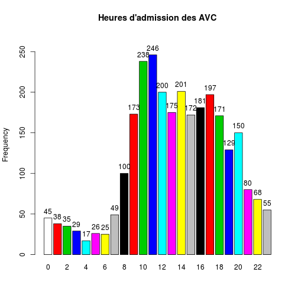 

```
## h : 
##         Frequency Percent Cum. percent
## 0              40     1.7          1.7
## 1              34     1.5          3.2
## 2              32     1.4          4.6
## 3              25     1.1          5.7
## 4              16     0.7          6.4
## 5              24     1.0          7.5
## 6              21     0.9          8.4
## 7              39     1.7         10.1
## 8              84     3.7         13.8
## 9             144     6.3         20.1
## 10            195     8.5         28.6
## 11            193     8.4         37.1
## 12            158     6.9         44.0
## 13            143     6.3         50.2
## 14            160     7.0         57.2
## 15            126     5.5         62.7
## 16            148     6.5         69.2
## 17            161     7.0         76.2
## 18            132     5.8         82.0
## 19            104     4.5         86.6
## 20            133     5.8         92.4
## 21             70     3.1         95.5
## 22             57     2.5         97.9
## 23             47     2.1        100.0
##   Total      2286   100.0        100.0
```

Selon le jour de la semaine


```
## w
##   Sun   Mon  Tues   Wed Thurs   Fri   Sat 
##   275   362   355   349   341   322   282
```

```
## w
##   Sun   Mon  Tues   Wed Thurs   Fri   Sat 
## 12.03 15.84 15.53 15.27 14.92 14.09 12.34
```

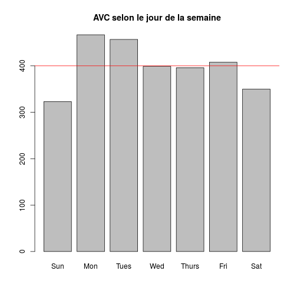 

Proportion théorique = 14.28% par jour de la semaine

AVC selon le mois
-----------------

```
## m
## Jan Feb Mar Apr May Jun Jul Aug Sep Oct Nov Dec 
## 232 191 220 270 251 258 250 242 185 187   0   0
```

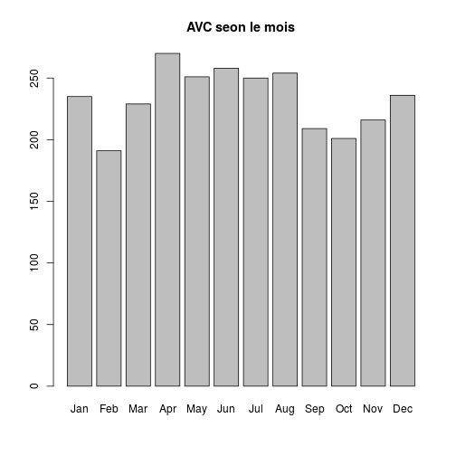 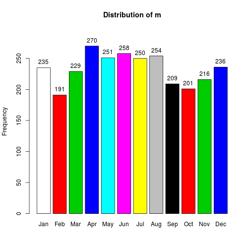 

```
## m : 
##         Frequency Percent Cum. percent
## Jan           232    10.1         10.1
## Feb           191     8.4         18.5
## Mar           220     9.6         28.1
## Apr           270    11.8         39.9
## May           251    11.0         50.9
## Jun           258    11.3         62.2
## Jul           250    10.9         73.1
## Aug           242    10.6         83.7
## Sep           185     8.1         91.8
## Oct           187     8.2        100.0
## Nov             0     0.0        100.0
## Dec             0     0.0        100.0
##   Total      2286   100.0        100.0
```

AVC par semaine
---------------
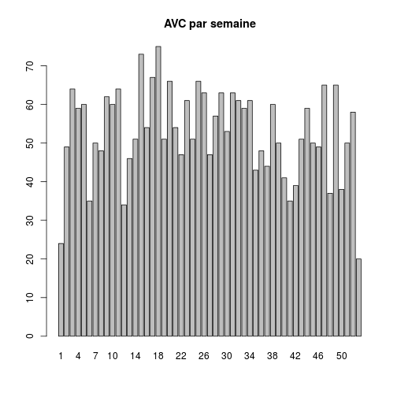 


Age et AVC
----------

```
##    Min. 1st Qu.  Median    Mean 3rd Qu.    Max. 
##     1.0    61.0    75.0    71.1    83.0   112.0
```

Le rapport de 2009 donne age moyen = 70.5 et age médian = 75 ans.

Sexe et AVC
-----------

```r
summary(AVC$SEXE)
```

```
##    F    I    M 
## 1196    0 1090
```

```r
hist(AVC$AGE, main = "Répartition des AVC", col = "pink", xlab = "Age en années")
```

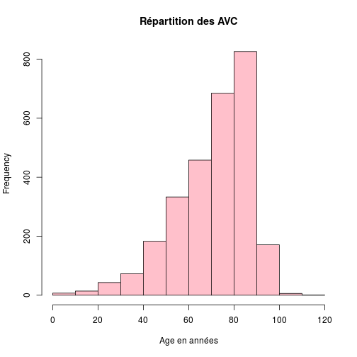 

```r
t <- table(AVC$AGE)
barplot(t, main = "AVC - Répartition des ages")
```

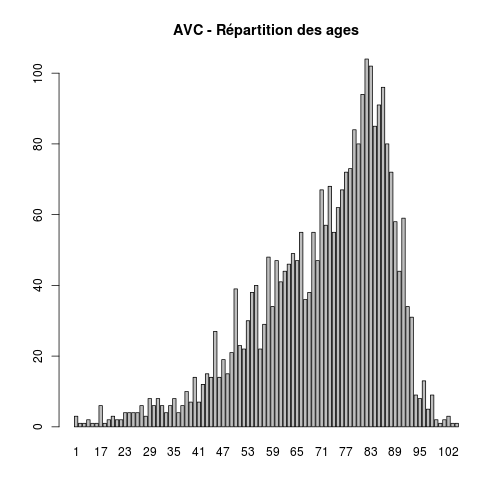 

```r
t <- table(AVC$SEXE, AVC$AGE)
barplot(t, col = c("darkblue", "white", "red"), legend = TRUE)
```

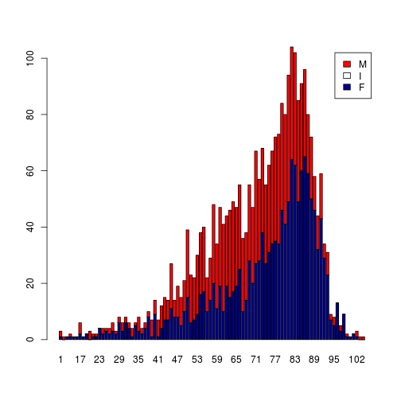 

```r
barplot(t, col = c("yellow", "red"), legend = TRUE, beside = TRUE)
```

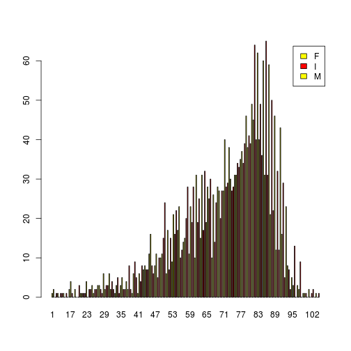 

Etude AIT
---------
Recommandations pour la sélection des données PMSI MCO concernant l’AVC (Juin 2009)
- G450 Syndrome vertébro-basilaire
- G451 Syndrome carotidien (hémisphérique)
- G452 Accident ischémique transitoire de territoires artériels précérébraux multiples et bilatéraux
- G453  Amaurose fugace
- G458  Autres accidents ischémiques cérébraux transitoires et syndromes apparentés
- G459  Accident ischémique cérébral transitoire, sans précision  

```r
ait <- dpr$DP[substr(dpr$DP, 1, 3) == "G45" & substr(dpr$DP, 1, 4) != "G454"]
tab1(ait, missing = FALSE)
```

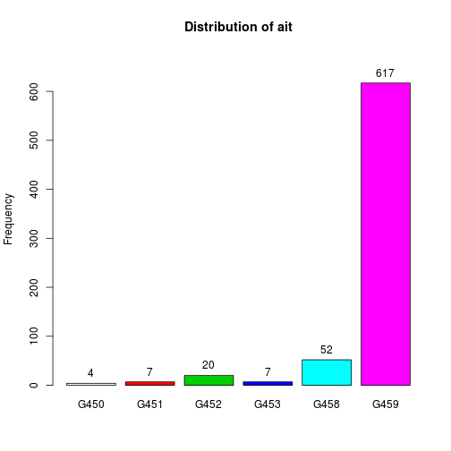 

```
## ait : 
##         Frequency Percent Cum. percent
## G450            4     0.7          0.7
## G451            5     0.9          1.6
## G452           13     2.2          3.8
## G453            4     0.7          4.5
## G458           37     6.4         10.9
## G459          515    89.1        100.0
##   Total       578   100.0        100.0
```


Asthme
======

J45.0 Asthme à prédominance allergique  
J45.1 Asthme non allergique  
J45.8 Asthme associé  
J45.9 Asthme, sans précision  
J46   Etat de mal asthmatique


```
## J450 J451 J458 J459  J46 
##  101  146    5  797   43
```

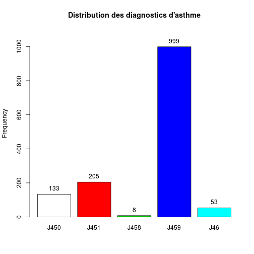 

```
## as.factor(asthme$DP) : 
##         Frequency Percent Cum. percent
## J450          101     9.2          9.2
## J451          146    13.4         22.6
## J458            5     0.5         23.1
## J459          797    73.0         96.1
## J46            43     3.9        100.0
##   Total      1092   100.0        100.0
```

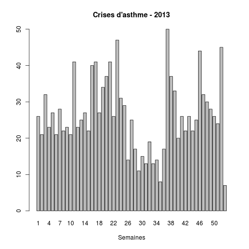 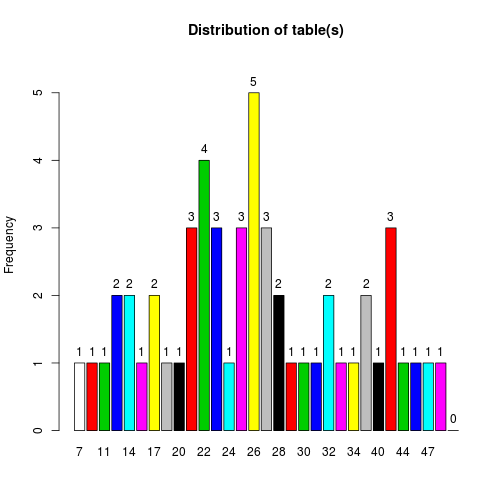 

```
## table(s) : 
##         Frequency Percent Cum. percent
## 8               1     2.3          2.3
## 11              2     4.5          6.8
## 13              2     4.5         11.4
## 14              2     4.5         15.9
## 15              1     2.3         18.2
## 16              1     2.3         20.5
## 17              2     4.5         25.0
## 19              3     6.8         31.8
## 20              2     4.5         36.4
## 21              2     4.5         40.9
## 22              2     4.5         45.5
## 23              2     4.5         50.0
## 24              1     2.3         52.3
## 25              2     4.5         56.8
## 26              2     4.5         61.4
## 27              4     9.1         70.5
## 29              2     4.5         75.0
## 31              2     4.5         79.5
## 32              1     2.3         81.8
## 34              1     2.3         84.1
## 37              1     2.3         86.4
## 40              1     2.3         88.6
## 41              3     6.8         95.5
## 47              2     4.5        100.0
##   Total        44   100.0        100.0
```

```
##       DP             CODE_POSTAL     ENTREE              FINESS   
##  Length:1092        68000  :125   Length:1092        Mul    :367  
##  Class :character   68100  : 80   Class :character   Col    :309  
##  Mode  :character   68200  : 79   Mode  :character   Sel    : 97  
##                     68500  : 37                      Hag    : 76  
##                     67100  : 34                      Hus    : 57  
##                     67600  : 33                      3Fr    : 55  
##                     (Other):704                      (Other):131  
##     GRAVITE     ORIENTATION     MODE_SORTIE       AGE       SEXE   
##  2      :697   MED    :184   NA       :  0   Min.   : 0.0   F:555  
##  3      :248   UHCD   :104   Mutation :353   1st Qu.: 3.0   I:  0  
##  1      :117   SC     : 54   Transfert: 16   Median :15.0   M:537  
##  4      : 17   REA    :  8   Domicile :619   Mean   :23.9          
##  5      :  4   CHIR   :  4   Décès    :  0   3rd Qu.:41.0          
##  (Other):  0   (Other):  4   NA's     :104   Max.   :97.0          
##  NA's   :  9   NA's   :734                                         
##  TRANSPORT  
##  AMBU :107  
##  FO   :  1  
##  HELI :  1  
##  PERSO:735  
##  SMUR : 31  
##  VSAB : 85  
##  NA's :132
```

Gravité des crises: prédominance CCMU  2  et 3 et qulques 4 ou 5 
hospit = mutation+tranfert = 323+13=336
taux hospit supérieur à 30% (336/1001)  
taux hospit en services chaud (SI+SC+Rea): 52/1001= 5.2% et 52/323= 16% des hospit  
age: moyenne 24 ans(médiane 14 ans)  
sex ratio: 0.98

Crise asthme hospitalisée et lieu d'hospitalisation:

```r
table(asthme$DP, asthme$ORIENTATION)
```

```
##       
##        CHIR FUGUE HDT  HO MED OBST PSA REA REO  SC SCAM  SI UHCD
##   J450    0     0   1   0   6    0   0   1   0   0    0   0   14
##   J451    1     0   0   0  31    0   0   0   0  16    0   0    4
##   J458    0     0   0   0   2    0   0   1   0   0    0   0    0
##   J459    2     0   0   0 130    2   0   4   0  30    1   0   84
##   J46     1     0   0   0  15    0   0   2   0   8    0   0    2
```

#### Remarques INVS:
Ce bulletin (Le point épidémiologique du 24 octobre 2013 | Surveillance épidémiologique de la Cire Lorraine-Alsace) clôt la surveillance de l’asthme. Pour l’association SOS Médecins de Strasbourg,
l’activité liée à l’asthme a été particulièrement marqué de mi-avril (semaine 16) à fin mai
(semaine 22) puis en semaine 40. Concernant l’association de Mulhouse, seule une forte
augmentation en semaine 39 a été observée depuis début avril.

Intoxications par les champignons
=================================
CIM10 = T62


```r
champ <- dpr[substr(dpr$DP, 1, 3) == "T62", ]
summary(champ)
```

```
##       DP             CODE_POSTAL    ENTREE              FINESS  
##  Length:46          68200  : 7   Length:46          Mul    :11  
##  Class :character   68300  : 3   Class :character   Col    : 9  
##  Mode  :character   67480  : 2   Mode  :character   3Fr    : 5  
##                     67500  : 2                      Geb    : 5  
##                     67600  : 2                      Hag    : 5  
##                     68150  : 2                      Sel    : 5  
##                     (Other):28                      (Other): 6  
##     GRAVITE    ORIENTATION    MODE_SORTIE      AGE       SEXE   TRANSPORT 
##  2      :26   UHCD   : 6   NA       : 0   Min.   : 0.0   F:21   AMBU :12  
##  1      :10   CHIR   : 1   Mutation : 9   1st Qu.:19.2   I: 0   FO   : 0  
##  3      : 9   SC     : 1   Transfert: 0   Median :34.5   M:25   HELI : 0  
##  4      : 0   FUGUE  : 0   Domicile :33   Mean   :34.7          PERSO:24  
##  5      : 0   HDT    : 0   Décès    : 0   3rd Qu.:50.0          SMUR : 0  
##  (Other): 0   (Other): 0   NA's     : 4   Max.   :91.0          VSAB : 5  
##  NA's   : 1   NA's   :38                                        NA's : 5
```

Intoxication au CO
==================
CIM10 = T58


```r
co <- dpr[substr(dpr$DP, 1, 3) == "T58", ]
m <- month(co$ENTREE, label = T)
table(m)
```

```
## m
## Jan Feb Mar Apr May Jun Jul Aug Sep Oct Nov Dec 
##   5  12  11   0   6   9   0   1   0   1   0   0
```

```r
barplot(table(m), main = "Intoxication au CO - 2013", xlab = "Mois")
```

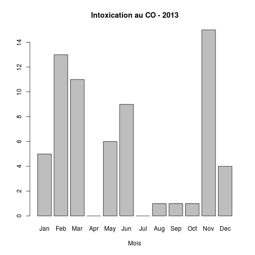 

Bronchiolite
============
Bronchiolite aiguë

Inclus:
    avec bronchospasme

J21.0 Bronchiolite aiguë due au virus respiratoire syncytial [VRS]
J21.8 Bronchiolite aiguë due à d'autres micro-organismes précisés
J21.9 Bronchiolite aiguë, sans précision


```r
bron <- dpr[substr(dpr$DP, 1, 3) == "J21", ]
m <- month(bron$ENTREE, label = T)
barplot(table(m), main = "Bronchiolites - 2013", xlab = "Mois")
```

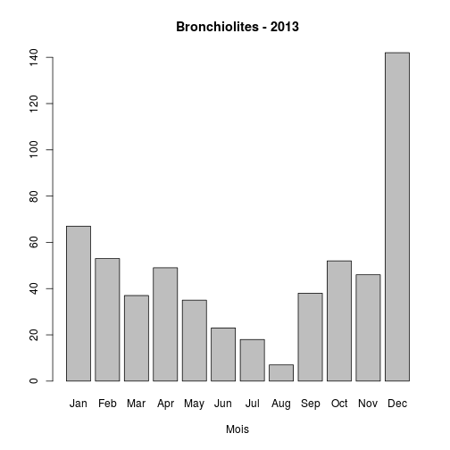 

```r
s <- week(bron$ENTREE)
barplot(table(s), main = "Bronchiolites - 2013", xlab = "Semaines")
```

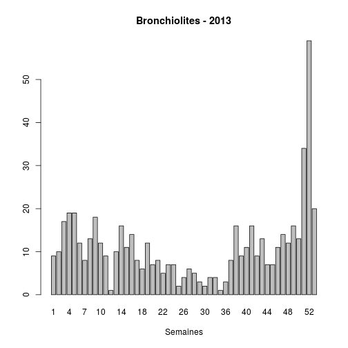 

```r
summary(bron)
```

```
##       DP             CODE_POSTAL     ENTREE              FINESS   
##  Length:368         68200  : 71   Length:368         Mul    :295  
##  Class :character   68100  : 51   Class :character   Sel    : 24  
##  Mode  :character   68270  : 19   Mode  :character   Col    : 20  
##                     68300  : 11                      Wis    : 13  
##                     67160  :  9                      3Fr    :  9  
##                     68110  :  9                      Geb    :  2  
##                     (Other):198                      (Other):  5  
##     GRAVITE     ORIENTATION     MODE_SORTIE       AGE        SEXE   
##  2      :207   MED    : 81   NA       :  0   Min.   : 0.00   F:158  
##  3      :112   SC     : 79   Mutation :165   1st Qu.: 0.00   I:  0  
##  1      : 40   REA    :  3   Transfert:  0   Median : 0.00   M:210  
##  4      :  3   UHCD   :  3   Domicile :173   Mean   : 1.24          
##  5      :  3   SCAM   :  1   Décès    :  0   3rd Qu.: 0.00          
##  (Other):  0   (Other):  0   NA's     : 30   Max.   :93.00          
##  NA's   :  3   NA's   :201                                          
##  TRANSPORT  
##  AMBU :  8  
##  FO   :  0  
##  HELI :  0  
##  PERSO:324  
##  SMUR :  0  
##  VSAB :  2  
##  NA's : 34
```

Surreprésentation de Mul  
taux hospitalisation: 50%

Gastro-entérites
================
CIM10 A09 : Diarrhée et gastro-entérite d'origine présumée infectieuse

Note:

    Dans les pays où les affections énumérées en A09 sans précision supplémentaire peuvent être présumées d'origine non infectieuse, les classer en K52.9.

Inclus:
    Catarrhe intestinal

        Colite
        Entérite
        Gastro-entérite
        SAI
        hémorragique
        septique

    Diarrhée:

        SAI
        dysentérique
        épidémique

    Maladie diarrhéique infectieuse SAI

Excl.:
    diarrhée non infectieuse (K52.9)

        néonatale (P78.3) 

    maladies dues à des bactéries, des protozoaires, des virus et d'autres agents infectieux précisés (A00-A08)  
    

```r
ge <- dpr[substr(dpr$DP, 1, 3) == "A09", ]
summary(ge)
```

```
##       DP             CODE_POSTAL      ENTREE              FINESS    
##  Length:2123        68100  : 252   Length:2123        Mul    :1100  
##  Class :character   68200  : 250   Class :character   Col    : 304  
##  Mode  :character   68300  : 139   Mode  :character   3Fr    : 200  
##                     68000  : 117                      Wis    : 138  
##                     68500  :  60                      Geb    : 114  
##                     67160  :  57                      Sel    :  89  
##                     (Other):1248                      (Other): 178  
##     GRAVITE      ORIENTATION      MODE_SORTIE        AGE        SEXE    
##  2      :1462   MED    : 202   NA       :   0   Min.   :  0.0   F:1057  
##  1      : 427   UHCD   : 116   Mutation : 364   1st Qu.:  1.0   I:   0  
##  3      : 202   SC     :  26   Transfert:   3   Median :  5.0   M:1066  
##  4      :  14   CHIR   :   4   Domicile :1545   Mean   : 18.1           
##  5      :   0   HO     :   1   Décès    :   0   3rd Qu.: 27.0           
##  (Other):   0   (Other):   4   NA's     : 211   Max.   :100.0           
##  NA's   :  18   NA's   :1770                                            
##  TRANSPORT   
##  AMBU : 203  
##  FO   :   0  
##  HELI :   0  
##  PERSO:1651  
##  SMUR :  10  
##  VSAB :  55  
##  NA's : 204
```

```r
table(ge$FINESS, ge$DP)
```

```
##      
##        A09 A090 A099
##   3Fr    0   40  160
##   Alk    0    6    9
##   Col  246   42   16
##   Dia    0    0    0
##   Geb    0   21   93
##   Hag    0   35   14
##   Hus    0   42   29
##   Mul 1100    0    0
##   Odi    0   12   31
##   Sel    0   39   50
##   Wis    0   66   72
##   Sav    0    0    0
```

```r
hist(ge$AGE, main = "Gasto-entérites - 2013", xlab = "Age (années)", ylab = "nombre", 
    col = "gray90")
```

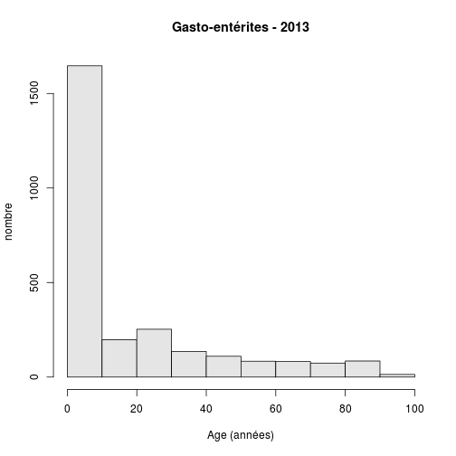 

```r
boxplot(ge$AGE, col = "yellow", main = "Gastro-entérite", ylab = "age (années)")
```

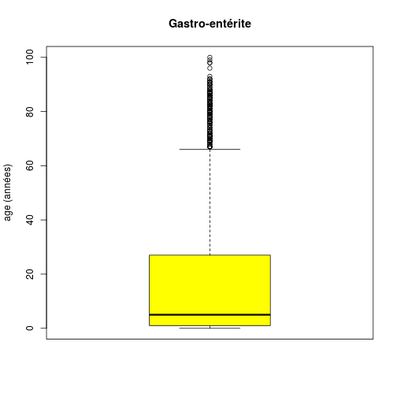 

```r
m <- month(ge$ENTREE, label = T)
x <- barplot(table(m), main = "Gestro-entérites - 2013", xlab = "Mois")
lines(x = x, y = table(m), col = "red")
```

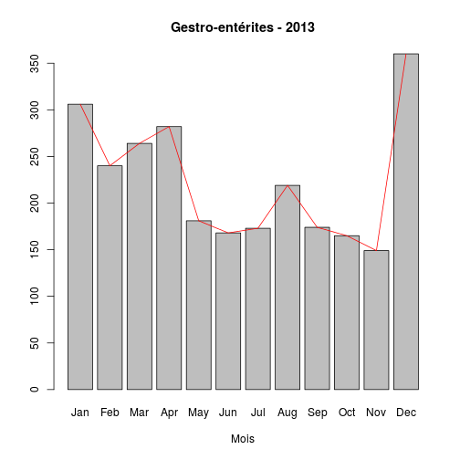 

#### NOTE TECHNIQUE: tracer une ligne joignant les sommets des barres du barplot. On utilise lines avec les valeurs suivantes:
- x = abcisse des colonnes. Elles sont contenues dans l'objet barplot. On peut les recueillir eplicitement par la fonction *str* (str(x)).
- y = ordonnées des barres, récupérées avec la fonction *table* qui agglomère les données par mois
Voir aussi: http://www.ats.ucla.edu/stat/r/faq/barplotplus.htm

#### calculs à la manière de l'INVS

nombre de diagnostics de GE / nb total de diagnostics par semaine:

```r
mge <- month(ge$ENTREE, label = T)
mtot <- month(dpr$ENTREE, label = T)
summary(mtot)
```

```
##   Jan   Feb   Mar   Apr   May   Jun   Jul   Aug   Sep   Oct   Nov   Dec 
## 17364 17156 18396 20302 19207 20772 20387 17993 15842 16146     0     0
```

```r
summary(mge)
```

```
## Jan Feb Mar Apr May Jun Jul Aug Sep Oct Nov Dec 
## 294 236 251 282 181 168 173 214 162 162   0   0
```

```r
a <- round(summary(mge) * 100/summary(mtot), 2)
a
```

```
##  Jan  Feb  Mar  Apr  May  Jun  Jul  Aug  Sep  Oct  Nov  Dec 
## 1.69 1.38 1.36 1.39 0.94 0.81 0.85 1.19 1.02 1.00  NaN  NaN
```

```r
barplot(a)
```

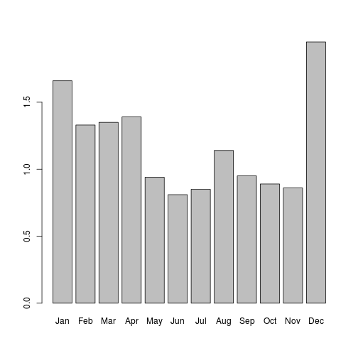 

dpt: tous les cas de traumato (S00 à T98)  
dpnp:tous lescas de médecine  

dpt<-dpr[substr(dpr$DP,1,3)>="S00" & substr(dpr$DP,1,3)<"T99", ]  
dpnt<-dpr[substr(dpr$DP,1,3) < "S00" | substr(dpr$DP,1,3)>"T98", ]  
mnt<-month(dpnt$ENTREE,label=T)  
a<-round(summary(mge)*100/summary(mnt),2)  
a  

Qualité des données DP
======================
Certains logiciels ne contôlent pas la cohérence du code CIM 10. Si on prend les DP de janvier à septembre 2013 inclus, on relève les éléments suivants:
- nombre total de RPU: 249 039
- nombre de RPU où le DP est renseigné: 167 419
- taux de complétude: 67.22 %
On s'intéresse aux codes CIM10 renseignés. Pour celà on trace l'histogramme des DP en fonction de la longueur du code utilisé:

```r
a <- nchar(dpr$DP)
summary(a)
```

```
##    Min. 1st Qu.  Median    Mean 3rd Qu.    Max. 
##    1.00    4.00    4.00    4.01    4.00   19.00
```

```r
b <- summary(as.factor(a))
b
```

```
##      1      3      4      5      6      7     11     12     14     15 
##      9  17294 146861  19111    235     46      1      1      1      2 
##     16     18     19 
##      1      1      2
```

```r
barplot(b)
```

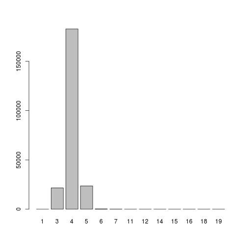 

```r
barplot(log(b))
```

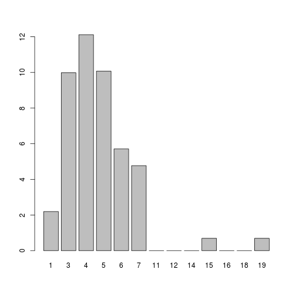 

```r
dpr[nchar(dpr$DP) > 6, c("FINESS", "DP")]
```

```
##        FINESS                  DP
## 22395     Mul         JJ449) BPCO
## 32891     Mul        PW199) Chute
## 49760     Mul             S2250B6
## 55395     Mul NN10) Pyelonéphrite
## 69971     Mul      HR060) Dyspnée
## 97650     Mul  NC61) Néo prostate
## 107027    Mul NN10) Pyelonéphrite
## 109184    Mul             S2250B6
## 178125    Mul             S2250B6
## 188273    Mul     HH819) Vertiges
## 196313    Mul             S2250B6
## 198071    Mul             S2250B6
## 205698    Mul     KK297) Gastrite
## 207226    Mul    SY099) Agression
## 257288    Hag             S422 02
## 259057    Hag             S223 01
## 259068    Hag             S011 02
## 260853    Hag             S400 01
## 260863    Hag             S810 01
## 260864    Hag             S810 01
## 260870    Hag             S525 02
## 260893    Hag             S800 01
## 260897    Hag             S800 01
## 261535    Hag             S202 02
## 262527    Hag             S422 01
## 262543    Hag             S823 01
## 262546    Hag             S929 01
## 263914    Hag             S422 01
## 263916    Hag             S711 01
## 264205    Hag             S400 01
## 264210    Hag             S521 02
## 264212    Hag             S223 02
## 265378    Hag             T150 01
## 266155    Hag             S826 02
## 266209    Hag             S929 01
## 266211    Hag             S510 01
## 266215    Hag             S711 02
## 267287    Hag             J189 02
## 267302    Hag             I800 02
## 267308    Hag             S724 02
## 267344    Hag             S431 02
## 267391    Hag             R073 01
## 268055    Hag             S223 01
## 268127    Hag             J189 02
## 268143    Hag             S823 01
## 268373    Hag             S834 01
## 268422    Hag             S525 02
## 268447    Hag             S834 02
## 268452    Hag             S424 01
## 270174    Hag             S810 02
## 271100    Hag             S521 01
## 272290    Hag             R073 01
## 272324    Hag             H920 02
## 274628    Hag             G560 02
## 275030    Hag             S821 02
```

La Dixième Révision (CIM10) utilise un code alphanumérique avec une lettre en
première position et des chiffres en seconde, troisième et quatrième position.
Le quatrième caractère est précédé par un point. Les possibilités de codage
vont de ce fait de A00.0 à Z99.9. La lettre U n'est pas utilisée. Il en résulte qu'après suppression du point décimal, le code DP ne peut être constitué que de 2, 3 ou 4 caractères.

Wissembourg


```r
cw <- dpr[dpr$FINESS == "Wis", "DP"]
head(cw)
```

```
## [1] "S009"  "S610"  "S012"  "S0220" "A090"  "A099"
```

```r
a <- nchar(cw)
summary(a)
```

```
##    Min. 1st Qu.  Median    Mean 3rd Qu.    Max. 
##    3.00    4.00    4.00    4.04    4.00    6.00
```

```r
summary(as.factor(a))
```

```
##    3    4    5    6 
##  686 7760 1090    9
```

```r
cw[nchar(cw) > 5]
```

```
## [1] "M62890" "I21900" "F10241" "M62800" "I21100" "M62890" "M62890" "M62890"
## [9] "M62890"
```

Le code M62890 (PMSI ?) correspond à la rhabdomyolyse, en CIM10 M62.8 (présent 5 fois sous ceete forme et 7 fois au total: "M62890" "M62800" "M6286"  "M62890" "M62890" "M62890" "M6285")

