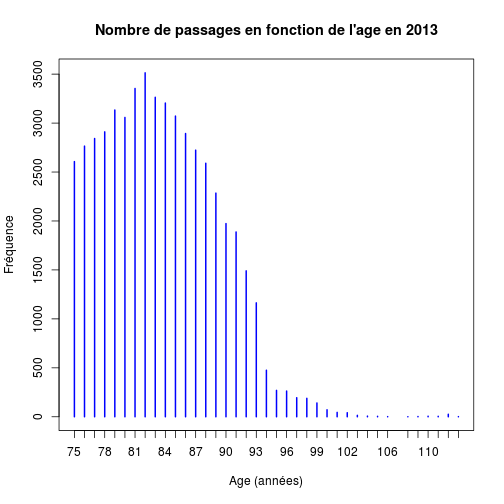

Gériatrie
========================================================

**Date:** Sun Mar  2 11:19:38 2014

**Working directory:** /home/jcb/Documents/Resural/Stat Resural/RPU_2013/Analyse/Chapitres/Geriatrie
***

Variables globales:
-------------------

```
## [1] "Fichier courant: rpu2013d0112.Rda"
```

Nombre de dossiers: 340338


```r
g <- d1[d1$AGE > 74, ]
n_g <- nrow(g)
```

Les 75 ans et plus représentent $52512$ passages en 2013 soit $145$ passages par jour.

nombre de passages en fonction sde l'age
----------------------------------------

```r
pg <- table(as.factor(g$AGE))
plot(pg, main = paste("Nombre de passages en fonction de l'age en", an_c), ylab = "Fréquence", 
    xlab = "Age (années)", col = "blue")
```

 


Gériatrie et sexe
------------------

```r
sg <- table(g$SEXE)
sg <- sg[-2]
psg <- round(prop.table(sg) * 100, 2)
b <- rbind(sg, psg)
rownames(b) <- c("n", "%")

sex_ratio <- round(sg["M"]/sg["F"], 2)

xtable(b)
```

% latex table generated in R 3.0.2 by xtable 1.7-1 package
% Sun Mar  2 11:19:55 2014
\begin{table}[ht]
\centering
\begin{tabular}{rrr}
  \hline
 & F & M \\ 
  \hline
n & 31941.00 & 20560.00 \\ 
  \% & 60.84 & 39.16 \\ 
   \hline
\end{tabular}
\end{table}

Le sex-ratio est de 0.64

Taux hospitalisation
--------------------


```r
a <- table(g$MODE_SORTIE)
a <- c(a[2] + a[3], a[4], a[5])
b <- round(prop.table(a) * 100, 2)
c <- rbind(a, b)
colnames(c) <- c("Hospitalisation", "Domicile", "Décès")
rownames(c) <- c("n", "%")
c
```

```
##   Hospitalisation Domicile Décès
## n        26592.00 16271.00     1
## %           62.04    37.96     0
```

- Taux hospitalisation: 62.04 %.

Durée de présence
-----------------


```r
e <- ymd_hms(g$ENTREE)
s <- ymd_hms(g$SORTIE)
g$presence <- s - e
g$presence <- (s - e)/60
a <- summary(as.numeric(g$presence))
```

- Durée de présence moyenne: 219 mn.
- Durée de présence médiane: 174 mn.
- Durée de présence la plus longue: 3.0278 jours.
