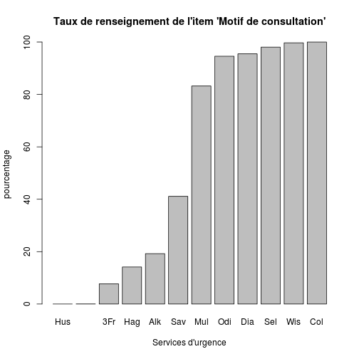

Motif de consultation
========================================================

Le motif de consultation est l'un des items les plus mal renseigné. Cela est du en partie à l'absence de règles formelles concernant la saisie de cet élément. Une recommandation du ministère de la santé demande que la thésaurus 2013 de la SFMU [ref.9] soit utilisé.

Le thésaurus est présenté sous la formed'un fichier Excel. L'onglet **recours** liste environ *150* motifs de recours aux urgences avec leur correspondance CIM10. Aucune méthode n'est parfaite mais cette page constitue une bonne base d'harmonisation des données.


```r
getwd()
```

```
## [1] "/home/jcb/Documents/Resural/Stat Resural/RPU2013/Chapitres/Motif"
```

```r
source("../prologue.R")
```

```
## [1] "Fichier courant: rpu2013d0110.Rda"
```

```r

d1 <- foo(path)
names(d1)
```

```
##  [1] "id"            "CODE_POSTAL"   "COMMUNE"       "DESTINATION"  
##  [5] "DP"            "ENTREE"        "EXTRACT"       "FINESS"       
##  [9] "GRAVITE"       "MODE_ENTREE"   "MODE_SORTIE"   "MOTIF"        
## [13] "NAISSANCE"     "ORIENTATION"   "PROVENANCE"    "SEXE"         
## [17] "SORTIE"        "TRANSPORT"     "TRANSPORT_PEC" "AGE"
```

```r
nrow(d1)
```

```
## [1] 276452
```


```r
print(annee_courante)
```

```
## [1] 2013
```

```r
print(mois_courant)
```

```
## [1] 10
```

```r
d1$MOTIF <- as.factor(d1$MOTIF)

motifs_renseignes <- function(d1, finess) {
    print(head(d1$MOTIF[d1$FINESS == finess]))
    a <- is.na(d1$MOTIF[d1$FINESS == finess])
    b <- length(a[a == TRUE])
    c <- b * 100/length(a)
    print("")
    print(paste("% de motifs non renseignés:", round(c, 2)))
}

motifs_renseignes(d1, "Mul")
```

```
## [1] S37.0 R05   R10.4 R41.0 R10.4 J45.9
## 19684 Levels: ,, ... zona ; une pathologie ophtalmalogique au
## [1] ""
## [1] "% de motifs non renseignés: 16.78"
```

Ensemble des hôpitaux
---------------------

```r

c <- tapply(!is.na(d1$MOTIF), d1$FINESS, mean)
round(c * 100, 2)
```

```
##    3Fr    Alk    Col    Dia    Geb    Hag    Hus    Mul    Odi    Sel 
##   7.74  19.24 100.00  95.49   0.03  14.14   0.00  83.22  94.57  98.05 
##    Wis    Sav 
##  99.70  41.10
```

```r
barplot(sort(round(c * 100, 2)), main = "Taux de renseignement de l'item 'Motif de consultation'", 
    ylab = "pourcentage", xlab = "Services d'urgence")
```

 

Le motif de consultation nest pas renseigné dans 54.44 % des cas.

barplot(sort(round(c*100,2),decreasing=TRUE),main="Taux de renseignement de l'item 'Motif de consultation'",xlab="pourcentage",ylab="Services d'urgence",horiz=TRUE,las=2)

Altkirch
-----

```r
motifs_renseignes(d1, "Alk")
```

```
## [1] <NA> <NA> <NA> <NA> R600 <NA>
## 19684 Levels: ,, ... zona ; une pathologie ophtalmalogique au
## [1] ""
## [1] "% de motifs non renseignés: 80.76"
```


Wissembourg
-----

```r
motifs_renseignes(d1, "Wis")
```

```
## [1] T009 T119 T009 S008 R11  R11 
## 19684 Levels: ,, ... zona ; une pathologie ophtalmalogique au
## [1] ""
## [1] "% de motifs non renseignés: 0.3"
```


Colmar
-----

```r
motifs_renseignes(d1, "Col")
```

```
## [1] une crise d'asthme                         
## [2] un malaise avec PC                         
## [3] Autre                                      
## [4] un traumatisme oculaire: explosion d'un    
## [5] plaie pied gauche par p\xe9tard ; une plaie
## [6] une br\xfblre                              
## 19684 Levels: ,, ... zona ; une pathologie ophtalmalogique au
## [1] ""
## [1] "% de motifs non renseignés: 0"
```


Mulhouse
--------

```r
motifs_renseignes(d1, "Mul")
```

```
## [1] S37.0 R05   R10.4 R41.0 R10.4 J45.9
## 19684 Levels: ,, ... zona ; une pathologie ophtalmalogique au
## [1] ""
## [1] "% de motifs non renseignés: 16.78"
```


Thann
--------

```r
motifs_renseignes(d1, "Thn")
```

```
## factor(0)
## 19684 Levels: ,, ... zona ; une pathologie ophtalmalogique au
## [1] ""
## [1] "% de motifs non renseignés: NaN"
```


Saverne
--------

```r
motifs_renseignes(d1, "Sav")
```

```
## [1] <NA> <NA> <NA> <NA> <NA> <NA>
## 19684 Levels: ,, ... zona ; une pathologie ophtalmalogique au
## [1] ""
## [1] "% de motifs non renseignés: 58.9"
```

Selestat
--------

```r
motifs_renseignes(d1, "Sel")
```

```
## [1] GASTRO04   DIVERS23   TRAUMATO10 TRAUMATO02 OPHTALMO04 TRAUMATO09
## 19684 Levels: ,, ... zona ; une pathologie ophtalmalogique au
## [1] ""
## [1] "% de motifs non renseignés: 1.95"
```

Hus
--------

```r
motifs_renseignes(d1, "Hus")
```

```
## [1] <NA> <NA> <NA> <NA> <NA> <NA>
## 19684 Levels: ,, ... zona ; une pathologie ophtalmalogique au
## [1] ""
## [1] "% de motifs non renseignés: 100"
```

Guebwiller
--------

```r
motifs_renseignes(d1, "Geb")
```

```
## [1] <NA> <NA> <NA> <NA> <NA> <NA>
## 19684 Levels: ,, ... zona ; une pathologie ophtalmalogique au
## [1] ""
## [1] "% de motifs non renseignés: 99.97"
```

St Louis
--------

```r
motifs_renseignes(d1, "3Fr")
```

```
## [1] <NA> <NA> <NA> <NA> <NA> <NA>
## 19684 Levels: ,, ... zona ; une pathologie ophtalmalogique au
## [1] ""
## [1] "% de motifs non renseignés: 92.26"
```

