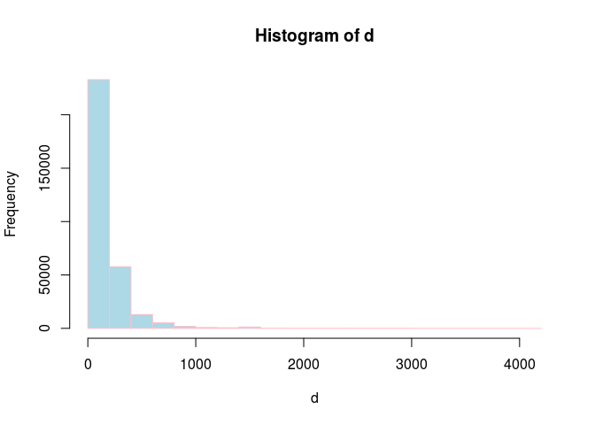
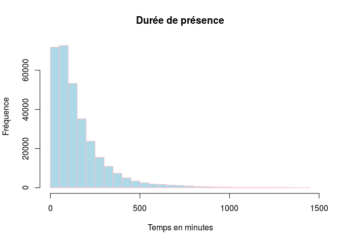
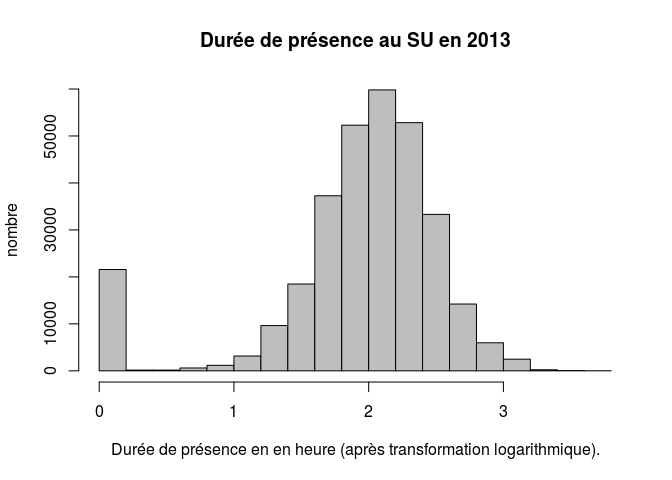

Calcul des durées de présence
========================================================

Il faut retirer les lignes où la date de sortie n'est pas connue + 3 lignes où la date de sortie indiquée et antérieure à la date de sortie !

24h = 1440 mn
72h = 4320 mn


```r
library("lubridate")

load("~/Documents/Resural/Stat Resural/RPU_2013/rpu2013d0112.Rda")

e <- ymd_hms(d1$ENTREE)
s <- ymd_hms(d1$SORTIE)
s_na <- mean(is.na(s))

dx <- d1[!is.na(d1$SORTIE), ]
e <- ymd_hms(dx$ENTREE)
s <- ymd_hms(dx$SORTIE)
d <- as.numeric((s-e)/60)
d <- d[d>0]
# dossier sup à 72 heures
b72 <- d[d>4320]
# dossier sup à 24h
b24 <- d[d>1440]
# on garde les dossiers entre 0 et 72 heures
d <- d[d<4320]
summary(d)
```

```
##    Min. 1st Qu.  Median    Mean 3rd Qu.    Max. 
##     1.0    55.0   111.0   162.6   204.0  4159.0
```

```r
hist(d, breaks = 18, col = "lightblue", border = "pink")
```

 

```r
# si on ne conserve que les dossier de 24 heures
hist(d[d<1440], breaks = 24, col = "lightblue", border = "pink", ylab="Fréquence", xlab="Temps en minutes", main="Durée de présence")
```

 

```r
hist(log10(d),ylab="nombre", xlab="Durée de présence en en heure (après transformation logarithmique).", main="Durée de présence au SU en 2013", col="gray")
```

 

```r
# i <- new_interval(e,s)
# d<- as.duration(i)
# 
# d1$duree <- as.duration(new_interval(ymd_hms(d1$ENTREE),ymd_hms(d1$SORTIE)))
# dx <- d1[!is.na(d1$duree), ]
# a <- dx[dx$duree < 0,]
# a
# dx <- dx[dx$duree > 0,]
# summary(dx$duree)
# # on borne à 72 heures
# dx <- dx[dx$duree < 72*60,]
```
Heures de sortie manquante: 8.82 %  
Présence supérieure à 72 heures: 17 dossiers  
Présence supérieure à 24 heures: 758 dossiers


