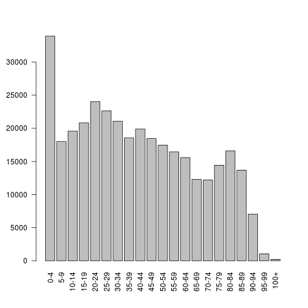
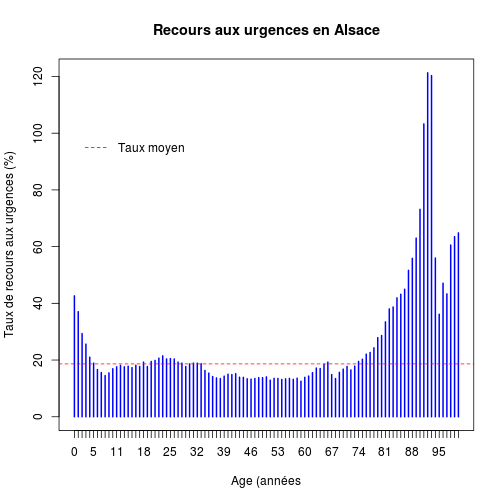
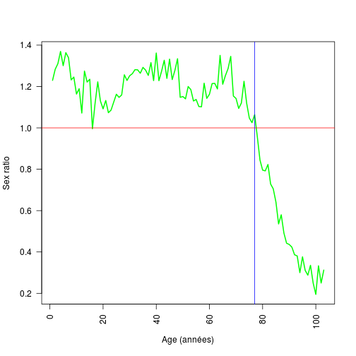

Répartition des passages par tranches d'age
========================================================

```r
date()
```

```
## [1] "Fri Mar 28 18:15:03 2014"
```

```r
wd <- getwd()
wd
```

```
## [1] "/home/jcb/Documents/Resural/Stat Resural/RPU_2013/Analyse/Chapitres/Tranches age"
```

Variables globales:
-------------------

```r
source("../prologue.R")
```

```
## Loading required package: questionr
## 
## Attaching package: 'rgrs'
## 
## Les objets suivants sont masqués from 'package:questionr':
## 
##     copie, copie.default, copie.proptab, cprop, cramer.v,
##     format.proptab, freq, lprop, print.proptab, prop, quant.cut,
##     renomme.variable, residus, wtd.mean, wtd.table, wtd.var
## 
## Rattle : une interface graphique gratuite pour l'exploration de données avec R.
## Version 3.0.2 r169 Copyright (c) 2006-2013 Togaware Pty Ltd.
## Entrez 'rattle()' pour secouer, faire vibrer, et faire défiler vos données.
## Loading required package: foreign
## Loading required package: survival
## Loading required package: splines
## Loading required package: MASS
## Loading required package: nnet
## 
## Attaching package: 'zoo'
## 
## Les objets suivants sont masqués from 'package:base':
## 
##     as.Date, as.Date.numeric
## 
## Please visit openintro.org for free statistics materials
## 
## Attaching package: 'openintro'
## 
## L'objet suivant est masqué from 'package:MASS':
## 
##     mammals
## 
## L'objet suivant est masqué from 'package:datasets':
## 
##     cars
```

```
## [1] "Fichier courant: rpu2013d0112.Rda"
```

```r
N <- nrow(d1)
N
```

```
## [1] 344073
```


Données Age
-----------

```r
a <- summary(d1$AGE)
```

**Age moyen** 40.5  
**Age médian** 38  

Tranches d'age
--------------

La méthode **cut** permet de diviser le vecteur *age* en classes. Le résultat est un *factor*.

Syntaxe des intervalles:
- $[0,5] <=> 0 <= X <= 5 <=> 0, 1, 2, 3, 4, 5$
- $(0,5] <=> 0 <= X < 5 <=> 0, 1, 2, 3, 4$  cut(...., right = FALSE)
- $[0,5) <=> 0 < X <= 5 <=> 1, 2, 3, 4, 5$  cut(...., right = TRUE)

Intervalles pré-réglés:
- age1: 
- age2: 3 catégories (Pédiatrie, Adulte, Gériatrie)
- age3: intervalles de classe allant de 0 à 95 ans par tranches de 5 ans, borne sup de l'intervalle exclue. Le premier intervalle va de 0 à 4, le second de 5 à 9, le dernier va de 90 à 94. O ajoute un sernier intervalle pour toutes les valeurs supérieures ou égales à 95. Deux façons d'afficher les résultats:
- *table()* affiche les résultats groupés par catégories, mais pas les NA's.
- *summary()* idem + les NA's.

Le découpage en tranches d'age est le même que celui utilisé pour la population générale (voir demographie2.Rmd)


```r

age1 <- cut(d1$AGE, breaks = c(-1, 0.99, 14, 74, 84, 110), labels = c("Moins de 1 an", 
    "De 1 à 15 ans", "De 15 à 75 ans", "de 75 à 85 ans", "Plus de 85 ans"))
a <- tapply(d1$AGE, age1, length)
a
```

```
##  Moins de 1 an  De 1 à 15 ans De 15 à 75 ans de 75 à 85 ans Plus de 85 ans 
##           9233          62274         219485          31022          22016
```

```r
barplot(a, main = "Répartition des RPU par tranches d'age", ylab = "Nombre")
```

 

### Age2

```r
age2 <- cut(d1$AGE, breaks = c(-1, 17, 74, 110), labels = c("Pédiatrie", "Adulte < 75 ans", 
    "Gériatrie"))
t1 <- table(age2)
mp <- barplot(prop.table(t1) * 100, ylab = "Pourcentage de la population", main = "Répartition des consultants en 2013", 
    col = "lavender")
mtext(side = 1, at = mp, line = -2, text = paste(round(prop.table(t1) * 100, 
    0), "%", sep = ""), col = "blue")
```

 

```r

t2 <- round(prop.table(table(age2)) * 100, 2)
a <- rbind(t1, t2)
rownames(a) <- c("n", "%")
a
```

```
##   Pédiatrie Adulte < 75 ans Gériatrie
## n  83445.00       207547.00  53038.00
## %     24.26           60.33     15.42
```

- Pédiatrie: **24 %**
- Gériatrie: **15 %**

### Age3

```r
# age3 ------ construction du vecteur x des labels ('0-4','5-9', ...)  inc =
# incrément intervalle = no de l'intervalle (le premier vaut 1) i = borne
# inférieure de l'intervalle j = borne sup de l'intervalle x = vecteur des
# labels
inc <- 5
intervalle <- 1
lim_sup <- 100
i <- 0
j <- i + inc - 1
x <- 1
while (j < lim_sup) {
    x[intervalle] <- paste(i, "-", j, sep = "")
    i <- j + 1
    j <- i + inc - 1
    intervalle <- intervalle + 1
}
x[intervalle] <- "100+"
x
```

```
##  [1] "0-4"   "5-9"   "10-14" "15-19" "20-24" "25-29" "30-34" "35-39"
##  [9] "40-44" "45-49" "50-54" "55-59" "60-64" "65-69" "70-74" "75-79"
## [17] "80-84" "85-89" "90-94" "95-99" "100+"
```

```r
# construction du vecteur age3
brek <- c(seq(from = 0, to = lim_sup, by = 5), 120)
age3 <- cut(d1$AGE, breaks = brek, include.lowest = F, right = F, labels = x)
t_age3 <- table(age3)
# Affichage
barplot(t_age3, las = 2)
```

 

```r
barplot(round(prop.table(t_age3) * 100, 2), ylab = "% de la population", las = 2, 
    xlab = "", main = "Pourcentage de consultants par tranche d'age")
```

 

```r
# -------------------------------------------------------------------------
```


Recours aux urgences par age et par sexe
----------------------------------------
La table *ts* est reformatée pour supprimer la colonne *I* et pour mettre la colonne *H* en premier de manière à être cohérent avec la présentation de l'INSEE.


```r
ts <- table(age3, d1$SEXE)
ts <- cbind(ts[, 3], ts[, 1])
colnames(ts) <- c("H", "F")
ts
```

```
##           H     F
## 0-4   19105 14812
## 5-9   10077  7930
## 10-14 10666  8915
## 15-19 10959  9868
## 20-24 12667 11359
## 25-29 12383 10263
## 30-34 11813  9259
## 35-39 10443  8109
## 40-44 11170  8731
## 45-49 10172  8291
## 50-54  9371  8093
## 55-59  8772  7669
## 60-64  8609  6973
## 65-69  6811  5498
## 70-74  6438  5762
## 75-79  6937  7489
## 80-84  7034  9561
## 85-89  4562  9127
## 90-94  1942  5118
## 95-99   235   833
## 100+     83   149
```

Pyramide des ages des consultants
---------------------------------

```r
# graduations echelle des x: de 0 à 70000 par pas de 10000
rl <- seq(0, 17000, 1000)
# labels centraux
agelabels <- c("0-4", "5-9", "10-14", "15-19", "20-24", "25-29", "30-34", "35-39", 
    "40-44", "45-49", "50-54", "55-59", "60-64", "65-69", "70-74", "75-79", 
    "80-84", "85-89", "90-94", "95-99", "100+")
# gap = écartement entre les colonnes en unité prop au graphique
pyramid.plot(lx = ts[, 1], rx = ts[, 2], labels = agelabels, top.labels = c("Hommes", 
    "Age", "Femmes"), gap = 1500, main = "Pyramide des ages des passages aux urgences", 
    unit = "nombre", labelcex = 0.8, laxlab = rl, raxlab = rl)
```

```
## [1] 5.1 4.1 4.1 2.1
```

```r

# en pourcentages

round(prop.table(ts) * 100, 2)
```

```
##          H    F
## 0-4   5.55 4.31
## 5-9   2.93 2.30
## 10-14 3.10 2.59
## 15-19 3.19 2.87
## 20-24 3.68 3.30
## 25-29 3.60 2.98
## 30-34 3.43 2.69
## 35-39 3.04 2.36
## 40-44 3.25 2.54
## 45-49 2.96 2.41
## 50-54 2.72 2.35
## 55-59 2.55 2.23
## 60-64 2.50 2.03
## 65-69 1.98 1.60
## 70-74 1.87 1.67
## 75-79 2.02 2.18
## 80-84 2.04 2.78
## 85-89 1.33 2.65
## 90-94 0.56 1.49
## 95-99 0.07 0.24
## 100+  0.02 0.04
```

```r

rl <- seq(0, 6, 1)
l <- ts[, 1] * 100/sum(ts)
r <- ts[, 2] * 100/sum(ts)
pyr.urg <- pyramid.plot(lx = l, rx = r, labels = agelabels, top.labels = c("Hommes", 
    "Age", "Femmes"), gap = 1, main = "Pyramide des ages des passages aux urgences", 
    unit = "%", labelcex = 0.8, laxlab = rl, raxlab = rl, add = TRUE)
```

 

```r
pyr.urg
```

```
## [1] 4 2 4 2
```


Taux de recours aux urgences par tranches d'age
-----------------------------------------------
Nécessite de connaître la répartition de la population par tranches d'age. On forme le rapport nb consultants / pop correspondante.

Todo: voir fichier population. BTT_TD_POP1B_2010.txt

On récupère le fichier de l'insee qui donne les chiffres régionaux par tranches de 1 an. Ce fichier couvre toute la France, il faut donc isoler l'alsace (code REG = 42). La virgule décimale doit êtrre remplacée par le point décimal.
```{alsace}
file<-"~/Documents/Resural/Stat Resural/population_alsace/pop_legale_2011/BTT_TD_POP1B_2010.txt"
doc<-read.table(file,header=TRUE,sep=";")
alsace <- doc[doc$REG == 42,]
alsace$NB <- gsub(",", ".", alsace$NB, fixed = TRUE)
save(alsace,file="pop_alsace_2010.Rda")
rm(doc)
```
```
> head(alsace)
        NIVEAU CODGEO REG DEP C_AGED10 C_SEXE       NB
3857428    COM  67001  42  67        0      1 4,244738
3857429    COM  67001  42  67        0      2 6,367107
3857430    COM  67001  42  67        1      1 11,67303
3857431    COM  67001  42  67        1      2 6,367107
3857432    COM  67001  42  67        2      1 8,489476
3857433    COM  67001  42  67        2      2 7,428292
```

On récupère le fichier *alsace* d'ou on extrait **pop_als** qui liste le nombre d'individus par classe d'age, de 0 à 100 ans et plus. On forme la variable **pop_urg**, qui liste le nombre de consultants alsaciens par classe d'age, que l'on ramène à 100 pour être comparable à *pop_als*.

Le rapport des deux vecteurs indique le taux de recours par classe d'age:


```r
load("../../../pop_alsace_2010.Rda")
pop_als <- tapply(as.numeric(alsace$NB), alsace$C_AGED10, sum)
rm(alsace)

pop_urg <- d1$AGE
pop_urg[pop_urg > 100] <- 100
pop_urg <- table(as.factor(pop_urg))

tx <- round(pop_urg * 100/pop_als, 2)
tx_moyen <- sum(pop_urg)/sum(pop_als)
plot(tx, ylab = "Taux de recours aux urgences (%)", xlab = "Age (années", main = "Recours aux urgences en Alsace", 
    col = "blue")
abline(h = tx_moyen * 100, col = "red", lty = 2)
legend(0, 100, legend = "Taux moyen", col = "red", lty = 2, bty = "n")
```

 

#### taux moyen de recours aux urgences: 18.64 %

Centenaires
-----------


```r
centenaire <- d1$AGE[d1$AGE > 99]
n_centenaire <- length(centenaire)

centenaire <- d1[d1$AGE > 99, c("AGE", "SEXE")]
```

En 2013, **242 centenaires** ont été pris en charge par les services d'urgence (0.07 % des RPU).  
Le recensement 2010 fait état de **358** centenaires en Alsace. Le taux de recours aux urgences pour cette population particulière s'élève à 67.6 %.

Sex ratio
---------

```r
a <- table(d1$SEXE)
sex_ratio <- a["M"]/a["F"]

a <- table(d1$SEXE, as.factor(d1$AGE))
sr <- a[3, ]/a[1, ]
sr
```

```
##       0       1       2       3       4       5       6       7       8 
##  1.2300  1.2834  1.3105  1.3698  1.3008  1.3639  1.3394  1.2321  1.2455 
##       9      10      11      12      13      14      15      16      17 
##  1.1636  1.1893  1.0718  1.2748  1.2217  1.2352  0.9959  1.1197  1.2225 
##      18      19      20      21      22      23      24      25      26 
##  1.1301  1.0921  1.1325  1.0735  1.0861  1.1248  1.1627  1.1475  1.1593 
##      27      28      29      30      31      32      33      34      35 
##  1.2568  1.2294  1.2523  1.2621  1.2815  1.2807  1.2643  1.2926  1.2793 
##      36      37      38      39      40      41      42      43      44 
##  1.2537  1.3155  1.2287  1.3619  1.2282  1.2741  1.3268  1.2394  1.3325 
##      45      46      47      48      49      50      51      52      53 
##  1.2337  1.2776  1.3344  1.1477  1.1516  1.1405  1.2001  1.1850  1.1301 
##      54      55      56      57      58      59      60      61      62 
##  1.1375  1.1034  1.1019  1.2160  1.1428  1.1627  1.2143  1.2152  1.1884 
##      63      64      65      66      67      68      69      70      71 
##  1.3506  1.2112  1.2527  1.2865  1.3458  1.1542  1.1425  1.0942  1.1200 
##      72      73      74      75      76      77      78      79      80 
##  1.2253  1.1188  1.0474  1.0253  1.0637  0.9577  0.8447  0.7959  0.7922 
##      81      82      83      84      85      86      87      88      89 
##  0.8231  0.7286  0.7051  0.6414  0.5356  0.5798  0.4916  0.4425  0.4363 
##      90      91      92      93      94      95      96      97      98 
##  0.4234  0.3866  0.3810  0.3002  0.3764  0.3110  0.2878  0.3356  0.2500 
##      99     100     101     102     103     104     105     106     108 
##  0.1949  0.3333  0.2500  0.3125  0.3636  0.1429  0.0000  0.0000  0.0000 
##     109     110     111     112     113 
##     Inf     Inf     Inf 25.0000     Inf
```

```r
plot(sr[0:103], type = "l", xlab = "Age (années)", ylab = "Sex ratio", las = 2, 
    col = "green", lwd = 2)
abline(h = 1, col = "red")
abline(v = 77, col = "blue")
```

 

**Sex-ratio: 1.1**

Même calcul avec des tanches d'age de 5 ans

```r
d1$age3 <- cut(d1$AGE, breaks = brek, include.lowest = F, right = F, labels = x)
a <- table(d1$SEXE, d1$age3)
a
```

```
##    
##       0-4   5-9 10-14 15-19 20-24 25-29 30-34 35-39 40-44 45-49 50-54
##   F 14812  7930  8915  9868 11359 10263  9259  8109  8731  8291  8093
##   I     1     1     0     2     0     0     0     0     0     0     0
##   M 19105 10077 10666 10959 12667 12383 11813 10443 11170 10172  9371
##    
##     55-59 60-64 65-69 70-74 75-79 80-84 85-89 90-94 95-99  100+
##   F  7669  6973  5498  5762  7489  9561  9127  5118   833   149
##   I     0     0     0     0     0     1     0     0     0     0
##   M  8772  8609  6811  6438  6937  7034  4562  1942   235    83
```

```r
# NOTE: à quoi correspondent les NA ? Si on refait les calculs en ajoutant
# une rubrique entre -1 et 0, on réduit le nomfre de NA a 10 mais on ne
# modifie pas le npmbre de cas par catégorie: brek <- c( -1, seq(from = 0,
# to = 95, by = 5),120) d2 <- d1[,c('AGE','SEXE')] d2$age3 <- cut(d2$AGE,
# breaks = brek, include.lowest=F, right=F) summary(d2$age3)

sr <- a[3, ]/a[1, ]
plot(sr, type = "l", xlab = "Tranches d'Age (années)", ylab = "Sex ratio", 
    col = "green", lwd = 2)
abline(h = 1, col = "red")
```

 


Pyramide des ages
-----------------
Onrécupère le fichier de l'insee qui donne les chiffres régionaux par tranches de 5 ans:

```r
file <- "~/Documents/Resural/Stat Resural/population_alsace/pop_legale_2010/rp2010_POP1B_n1_REG-42.csv"
doc <- read.table(file, header = TRUE, sep = ",", skip = 9)
# on supprime la dernière ligne qui correspond au total
doc <- doc[-nrow(doc), ]
head(doc)
```

```
##                X Hommes Femmes Ensemble
## 1 Moins de 5 ans  55914  53240   109154
## 2      5 à 9 ans  56840  54235   111075
## 3    10 à 14 ans  56710  54357   111067
## 4    15 à 19 ans  58843  56599   115441
## 5    20 à 24 ans  58106  59818   117924
## 6    25 à 29 ans  57879  59193   117072
```

```r

# couleur du fond
par(bg = "#eedd55")
# graduations echelle des x: de 0 à 70000 par pas de 10000
rl <- seq(0, 70000, 10000)
# labels centraux
agelabels <- c("0-4", "5-9", "10-14", "15-19", "20-24", "25-29", "30-34", "35-39", 
    "40-44", "45-49", "50-54", "55-59", "60-64", "65-69", "70-74", "75-79", 
    "80-84", "85-89", "90-94", "95-99", "100+")
# gap = écartement entre les colonnes en unité prop au graphique
pyramid.plot(lx = doc$Hommes, rx = doc$Femmes, labels = agelabels, top.labels = c("Hommes", 
    "Age", "Femmes"), gap = 6000, main = "Pyramide des ages en Alsace (INSEE 2010)", 
    unit = "nombre", labelcex = 0.8, laxlab = rl, raxlab = rl)
```

 

```
## [1] 5.1 4.1 4.1 2.1
```

```r
par(bg = "white")

# en pourcentage
n <- sum(doc$Hommes, doc$Femmes)  # pop totale
rl <- seq(0, 6, 1)
r <- doc$Hommes * 100/n
l <- doc$Femmes * 100/n
pyr.regionale <- pyramid.plot(lx = r, rx = l, labels = agelabels, top.labels = c("Hommes", 
    "Age", "Femmes"), gap = 1, main = "Pyramide des ages en Alsace (INSEE 2010)", 
    unit = "%", labelcex = 0.8, laxlab = rl, raxlab = rl)
```

 

```r
pyr.regionale
```

```
## [1] 4 2 4 2
```

On peut superposer les deux pyramides
--------------------------------------
pyr.regionale en premier puis pyr.urg

```r
myred <- adjustcolor("red", alpha.f = 0.3)
myblue <- adjustcolor("blue", alpha.f = 0.3)

n <- sum(doc$Hommes, doc$Femmes)  # pop totale
rl <- seq(0, 6, 1)
r <- doc$Hommes * 100/n
l <- doc$Femmes * 100/n
pyr.regionale <- pyramid.plot(lx = r, rx = l, labels = agelabels, top.labels = c("Hommes", 
    "Age", "Femmes"), gap = 1, main = "Pyramide des ages en Alsace (INSEE 2010)", 
    unit = "%", labelcex = 0.8, laxlab = rl, raxlab = rl, lxcol = myblue, rxcol = myblue)
pyr.regionale
```

```
## [1] 5.1 4.1 4.1 2.1
```

```r

rl <- seq(0, 6, 1)
l <- ts[, 1] * 100/sum(ts)
r <- ts[, 2] * 100/sum(ts)
pyr.urg <- pyramid.plot(lx = l, rx = r, labels = agelabels, top.labels = c("Hommes", 
    "Age", "Femmes"), gap = 1, main = "Pyramide des ages des passages aux urgences", 
    unit = "%", labelcex = 0.8, laxlab = rl, raxlab = rl, , lxcol = myred, rxcol = myred, 
    add = TRUE)
pyr.urg
```

```
## [1] 4 2 4 2
```

```r

legend("topleft", legend = c("Région", "Urgences"), col = c(myblue, myred), 
    pch = 15)
```

 


TODO: voir également le package **Pyramid**
