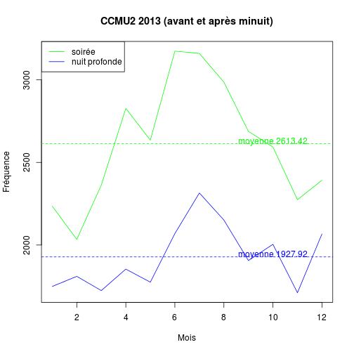

Etude de l'impact de l'arrêt de la PDSA
========================================================

Regarder d'une part  

1) l'activité pour chaque SU, avec pour le total des passages aux SU
- le nombre de CCMU 1
- le nombre de CCMU2
- en fonction des périodes horaires indiquées ci-dessous

En regardant l'évolution du chiffre par semaine, et par mois: une représentation par graphique pourrait être intéressante si cela est possible. Cette première étape vise à observer l'évolution du nombre de CCMU1 sur l'ensemble de l'année, par période horaire (avant/après minuit), sur le nombre total de passage aux urgence: par exemple, en figurant sur un premier graphique: une courbe des CCMU1 avant minuit avec une courbe du nombre de passage total aux SU, et sur un 2e graphique: une courbe des CCMU1 après minuit avec une courbe du nombre de passage total aux SU.
 
et d'autre part 

2) en croisant le nombre de CCMU1 selon la tranche horaire (avant minuit/après minuit) en fonction des territoires de PDSA dont viennent les patients (en utilisant le code postal des patients pour recoder la porvenance du territoire): la question étant= sur toutes les CCMU1 observées après minuit dans chaque SU, il y a-t-il significativement plus de patients en provenance des territoires où la PDSA s'est arrêtée?
Cette deuxième étape viserait à identifier plus finement si une éventuelle augmentation de CCMU1 peut être attribuée à la provenance des patients (territoire de PDSA).
 
L'autre fichier Excel fournit hier permettra d'interpréter les données en fonction des dates d'arrêt de PDSA après minuit dans certains territoires.

Initialisation
--------------


- Auteur: JCB
- Statut: doc de travail
- date début: 2014-02-08
- dernière version: sam. 15 févr. 2014 (19:46:56)

On crée deux groupes:
- soirée (SR 20h - 24h) dsr 
- nuit profonde (NP 24h - 8h) dnp

tables crées:
- dx: date, établissement, CCMU, code postal


Nombre total de passages
------------------------


- total des passages en 2013: 340338
- entre 20h et 8h: 96874 (28.46 %)
- dont
  - soirée (20h-0h): 59475 (17.48 %)
  - nuit profonde (0h-8h): 37399 (10.99 %)

Analyse CCMU
------------

 

```
dx$GRAVITE : 
        Frequency   %(NA+)   %(NA-)
1           38730     11.4     13.3
2          206434     60.7     70.8
3           40419     11.9     13.9
4            3561      1.0      1.2
5             868      0.3      0.3
D              38      0.0      0.0
P            1380      0.4      0.5
NA's        48908     14.4      0.0
  Total    340338    100.0    100.0
```

 

```
dsr$GRAVITE : 
        Frequency   %(NA+)   %(NA-)
1            6380     10.7     14.4
2           31361     52.7     70.9
3            5618      9.4     12.7
4             480      0.8      1.1
5             115      0.2      0.3
D              13      0.0      0.0
P             242      0.4      0.5
NA's        15266     25.7      0.0
  Total     59475    100.0    100.0
```

 

```
dnp$GRAVITE : 
        Frequency   %(NA+)   %(NA-)
1            4180     11.2     12.2
2           23135     61.9     67.3
3            6170     16.5     18.0
4             557      1.5      1.6
5             175      0.5      0.5
D               6      0.0      0.0
P             146      0.4      0.4
NA's         3030      8.1      0.0
  Total     37399    100.0    100.0
```

```
    
         1     2     3     4     5     D     P
  NP  4180 23135  6170   557   175     6   146
  SR  6380 31361  5618   480   115    13   242
```

```
      1     2    3   4   5  D   P
SR 6380 31361 5618 480 115 13 242
NP 4180 23135 6170 557 175  6 146
```

```
       1     2     3    4    5    D    P
SR 14.43 70.94 12.71 1.09 0.26 0.03 0.55
NP 12.16 67.31 17.95 1.62 0.51 0.02 0.42
```

 

La fréquence des CCMU 1 & 2 est plus élevée avant minuit et diminue en nuit profonde. C'est l'inverse pour les CCMU 3-4-5 qui sont plus fréquentes en nuit profonde qu'en soirée. Une explication pourrrait être la suivante: dans les situations sans gravité les patients se rendent à l'hôpital à condition qu'il ne soit pas trop tard (ie avant minuit). Après minuit, il est possible qu'ils remettent au lendemain une consultation médicale non urgente. Il serait intéressant de comparer les taux d'hospitalisation pour cette catégorie de patient, avant ou après minuit.

En nuit profonde, on observe plus de cas grave pour lesquels l'heure va avoir moins d'influence sur la décision de se rendre à l'hôpital ou pas.

Il pourrait être intéressant également de scinder ces population en "médicales" et en "traumatiques". A gravité égale (CCMU 2) la necessité defaire un platre ou une suture contraint au passage hospitalier et ceci qu'il y ait ou non une PDS libérale dans le secteur. Pour une douleur dentaire par exemple à 3h du matin la décision d'attendre le matin est plus plausible.

Analyse des CCMU1 & 2 par mois et semaine
------------------------------------------
- dsr1: soirée, ccmu1
- dsr2: soirée, ccmu2
- dsrt: soirée, total (sans les NA)

- t_dsr1: soirée, ccmu1 par mois
- t_dsr2: soirée, ccmu2 par mois
- t_dsrt

- dnp1: nuit profonde, ccmu1
- dnp2: nuit profonde, ccmu2
- dnpt: nuit profonde, total (sans les NA)

- t_dnp1: nuit profonde, ccmu1 par mois
- t_dnp2: nuit profonde, ccmu2 par mois
- t_dnpt: nuit profonde, total par mois

      


Comparaison passages totaux versus CCMU1 et 2
---------------------------------------------
  


Passages et code postal
=======================

Pour les CCMU1 et 2, on veut savoir comment se fait la répartition des passages selon 3 critères:
- la période: soirée ou nuit
- le mois
- le code postal (critère de regroupement)

La séparation en fonction de la gravité est déjà faite:
- CCMU1 soirée: dsr1
- CCMU1 nuit: dnp1

1. Passages par mois de l'année
-------------------------------
on utilise la fonction *split*. On obtient une *large list* composée de 12 éléments, correspondant à chacun des mois de l'année. On extrait le mois de janvier (b) que l'on transforme en dataframe. Avec la méthode *summary* on rétermine le nombre de CCMU1 en soirée par code postal au mois de janvier 2013.  

variables:
- mdsr1: liste des 12 mois de l'année (1 sous-liste par mois)
- m1 à m12: mois de l'année


```
Error: $ operator is invalid for atomic vectors
```

```
                 
1 .Primitive("c")
```

2. Synthèse des paragraphes précédents
--------------------------------------


Idem pour les CCMU2 en soirée sauf que le fichier de départ est dsr2 <- dsr[!is.na(dsr$GRAVITE) & dsr$GRAVITE==2,]

mdsr2 <- split(dsr2, month(dsr2$ENTREE))
m <- as.data.frame(mdsr2[[1]]) # mois de janvier

cp <- as.character(m$CODE_POSTAL)
b<-table(cp)
d <- cbind(names(b),b)
c <- merge(a,d, all.x=TRUE,by.x=1,by.y=1)
# on traite chaque mois
for(i in 2:12){
  m <- as.data.frame(mdsr1[[i]])
  cp <- as.character(m$CODE_POSTAL)
  b<-table(cp)
  d <- cbind(names(b),b)
  c <- merge(c,d, all.x=TRUE,by.x=1,by.y=1)
  }
d <- lapply(c[,2:13],as.numeric)
d <- data.frame(d)
d[is.na(d)]<-0
d<-cbind(c$a,d)
names(d) <- c("CP","Janvier","Février","Mars","Avril","Mai","Juin","Juillet","Aout","Septembre","Octobre","Novembre","Décembre")
ccmu2_soiree <- d

# tous les CCMU en soirée
dsrt <- dsr[!is.na(dsr$GRAVITE),]
mdsrt <- split(dsrt, month(dsrt$ENTREE))
m <- as.data.frame(mdsrt[[1]]) # mois de janvier

cp <- as.character(m$CODE_POSTAL)
b<-table(cp)
d <- cbind(names(b),b)
c <- merge(a,d, all.x=TRUE,by.x=1,by.y=1)
# on traite chaque mois
for(i in 2:12){
  m <- as.data.frame(mdsr1[[i]])
  cp <- as.character(m$CODE_POSTAL)
  b<-table(cp)
  d <- cbind(names(b),b)
  c <- merge(c,d, all.x=TRUE,by.x=1,by.y=1)
  }
d <- lapply(c[,2:13],as.numeric)
d <- data.frame(d)
d[is.na(d)]<-0
d<-cbind(c$a,d)
names(d) <- c("CP","Janvier","Février","Mars","Avril","Mai","Juin","Juillet","Aout","Septembre","Octobre","Novembre","Décembre")

ccmut_soiree <- d
