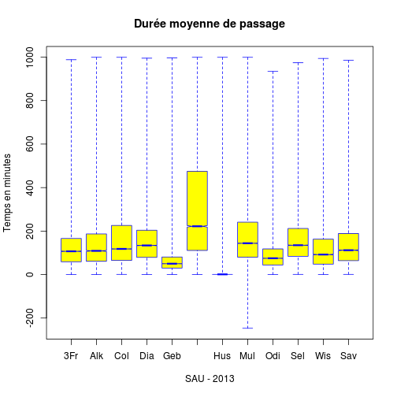
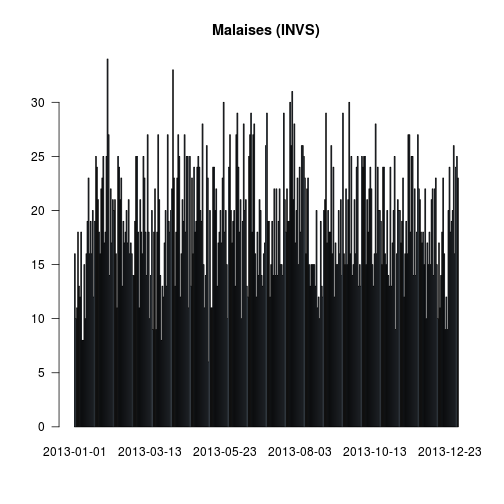
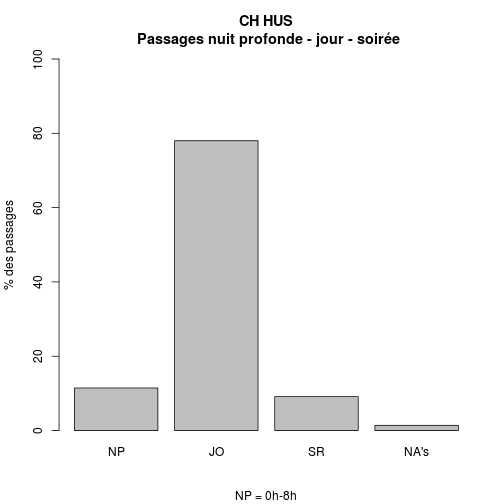
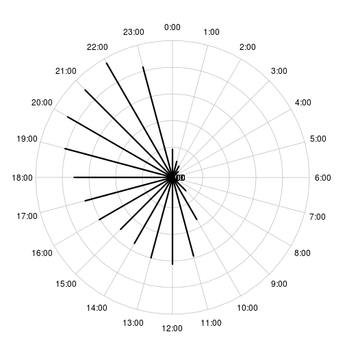
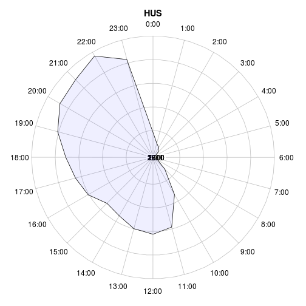
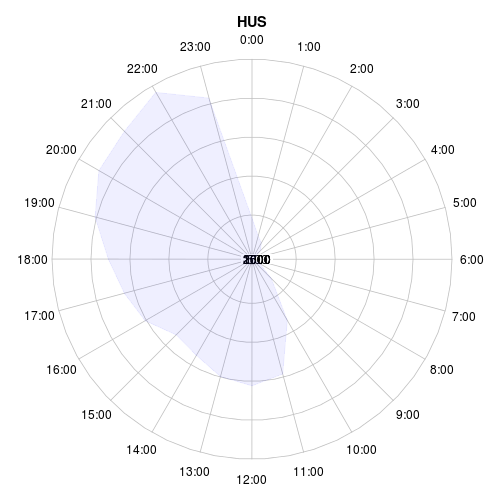
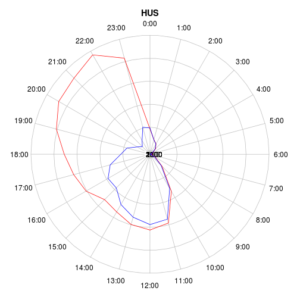

RPU 2013 Analyse
========================================================

```r
date()
```

```
## [1] "Mon Dec 23 14:05:21 2013"
```

source: RPU2013
Ce document exploite le fichier RData préparé à partir de la table *RPU__* de Sagec. Voir le document *RPU_2013_Preparation.Rmd* du dossier Resural.

Librairies nécessaires:
-----------------------

```r
library("gdata")
library("rgrs")
library("lubridate")
library("rattle")
library("epicalc")
library("zoo")
library("xts")
library("xtable")
library("plotrix")
library("openintro")
```

Chargement des routines perso
-----------------------------

```r
source("../Routines/mes_fonctions.R")
```

Variables globales:
-------------------

```r
mois_courant <- 11
```


Lecture du fichier des données
---------------------------------------
On lit le fichier de travail créé:

```r

# load('../rpu2013.Rda')
load("../rpu2013d0111.Rda")
# d1<-d0109 rm(d0109)

attach(d1)
```

Les données sont enregistrées dans un data.frame appelé *d1*.

Analyse des données
===================

```r
n <- dim(d1)
print(n)
```

```
## [1] 301767     20
```

```r
names(d1)
```

```
##  [1] "id"            "CODE_POSTAL"   "COMMUNE"       "DESTINATION"  
##  [5] "DP"            "ENTREE"        "EXTRACT"       "FINESS"       
##  [9] "GRAVITE"       "MODE_ENTREE"   "MODE_SORTIE"   "MOTIF"        
## [13] "NAISSANCE"     "ORIENTATION"   "PROVENANCE"    "SEXE"         
## [17] "SORTIE"        "TRANSPORT"     "TRANSPORT_PEC" "AGE"
```

```r
str(d1)
```

```
## 'data.frame':	301767 obs. of  20 variables:
##  $ id           : chr  "2c9d83843bf5e01d013bf5e985d20225" "2c9d83843bf5e01d013bf5e986950226" "2c9d83843bf5e01d013bf5e987620227" "2c9d83843bf5e01d013bf5e988060228" ...
##  $ CODE_POSTAL  : Factor w/ 2727 levels "00000","00159",..: 706 706 706 706 706 701 818 706 706 706 ...
##  $ COMMUNE      : Factor w/ 5853 levels "00","01257 DRESDEN ALLEMAGNE",..: 2184 2184 2184 2184 741 2048 2033 2184 2184 2184 ...
##  $ DESTINATION  : Factor w/ 7 levels "NA","MCO","SSR",..: NA NA NA NA NA NA 2 NA 2 NA ...
##  $ DP           : chr  "R104" "J038" "S617" "M485" ...
##  $ ENTREE       : chr  "2013-01-01 00:04:00" "2013-01-01 00:16:00" "2013-01-01 00:26:00" "2013-01-01 00:32:00" ...
##  $ EXTRACT      : chr  "2013-01-01 05:37:00" "2013-01-01 05:37:00" "2013-01-01 05:37:00" "2013-01-01 05:37:00" ...
##  $ FINESS       : Factor w/ 12 levels "3Fr","Alk","Col",..: 10 10 10 10 10 10 10 10 10 10 ...
##  $ GRAVITE      : Factor w/ 7 levels "1","2","3","4",..: 2 2 3 2 2 1 3 2 2 2 ...
##  $ MODE_ENTREE  : Factor w/ 5 levels "NA","Mutation",..: 4 4 4 4 4 4 4 4 4 4 ...
##  $ MODE_SORTIE  : Factor w/ 5 levels "NA","Mutation",..: 4 4 4 4 4 4 2 4 2 4 ...
##  $ MOTIF        : chr  "GASTRO04" "DIVERS23" "TRAUMATO10" "TRAUMATO02" ...
##  $ NAISSANCE    : chr  "1960-04-08 00:00:00" "1986-03-05 00:00:00" "1971-12-22 00:00:00" "1927-04-27 00:00:00" ...
##  $ ORIENTATION  : Factor w/ 13 levels "CHIR","FUGUE",..: NA NA NA NA NA NA 5 NA 5 NA ...
##  $ PROVENANCE   : Factor w/ 7 levels "NA","MCO","SSR",..: 6 6 6 6 6 6 6 6 6 6 ...
##  $ SEXE         : Factor w/ 3 levels "F","I","M": 3 3 3 1 3 3 1 1 1 1 ...
##  $ SORTIE       : chr  "2013-01-01 02:38:00" "2013-01-01 00:38:00" "2013-01-01 02:07:00" "2013-01-01 01:52:00" ...
##  $ TRANSPORT    : Factor w/ 6 levels "AMBU","FO","HELI",..: 4 4 4 1 4 4 6 6 4 4 ...
##  $ TRANSPORT_PEC: Factor w/ 3 levels "AUCUN","MED",..: 1 1 1 3 1 1 2 2 1 1 ...
##  $ AGE          : num  52 26 41 85 39 9 79 50 46 18 ...
```

```r
summary(d1)
```

```
##       id             CODE_POSTAL            COMMUNE        DESTINATION    
##  Length:301767      68000  : 20624   MULHOUSE   : 35853   MCO    : 62721  
##  Class :character   68200  : 18931   STRASBOURG : 30757   PSY    :  1092  
##  Mode  :character   68100  : 17017   COLMAR     : 20614   SSR    :    97  
##                     67100  : 14145   HAGUENAU   :  6432   HMS    :    21  
##                     67000  :  9847   SAINT LOUIS:  5078   SLD    :    16  
##                     68500  :  7918   (Other)    :203029   (Other):     4  
##                     (Other):213285   NA's       :     4   NA's   :237816  
##       DP               ENTREE            EXTRACT              FINESS     
##  Length:301767      Length:301767      Length:301767      Col    :59503  
##  Class :character   Class :character   Class :character   Mul    :50982  
##  Mode  :character   Mode  :character   Mode  :character   Hus    :33907  
##                                                           Hag    :31834  
##                                                           Dia    :26976  
##                                                           Odi    :23747  
##                                                           (Other):74818  
##     GRAVITE            MODE_ENTREE        MODE_SORTIE    
##  2      :183174   NA         :     0   NA       :     0  
##  3      : 35175   Mutation   :  3277   Mutation : 59601  
##  1      : 34437   Transfert  :  2614   Transfert:  4496  
##  4      :  3157   Domicile   :265384   Domicile :193831  
##  P      :  1230   Transfe  rt:   294   Décès    :     2  
##  (Other):   828   NA's       : 30198   NA's     : 43837  
##  NA's   : 43766                                          
##     MOTIF            NAISSANCE          ORIENTATION       PROVENANCE    
##  Length:301767      Length:301767      UHCD   : 29625   PEA    :159928  
##  Class :character   Class :character   MED    : 15427   PEO    : 26669  
##  Mode  :character   Mode  :character   CHIR   :  6683   MCO    :  7011  
##                                        PSA    :  2779   SSR    :    45  
##                                        REO    :  1317   PSY    :    43  
##                                        (Other):  4393   (Other):    20  
##                                        NA's   :241543   NA's   :108051  
##  SEXE          SORTIE          TRANSPORT      TRANSPORT_PEC   
##  F:143324   Length:301767      AMBU : 39501   AUCUN  :212089  
##  I:     4   Class :character   FO   :  1269   MED    :  5501  
##  M:158439   Mode  :character   HELI :   186   PARAMED:  5559  
##                                PERSO:162761   NA's   : 78618  
##                                SMUR :  2378                   
##                                VSAB : 24962                   
##                                NA's : 70710                   
##       AGE       
##  Min.   :  0.0  
##  1st Qu.: 18.0  
##  Median : 38.0  
##  Mean   : 40.5  
##  3rd Qu.: 62.0  
##  Max.   :112.0  
##  NA's   :10
```

Stuctures hospitaliéres participantes
=====================================
- *Alk* CH d' Alkirch
- *Col* CH Colmar (Pasteur + Parc)
- *Dia* Diaconat-Fonderie
- *3Fr* Clinique des trois frontières
- *Geb* HUS
- *Hag* CH de Haguenau
- *Hus* Hôpiaux Universitaires de Strasbourg
- *Mul* CH de Mulhouse
- *Odi* Clinique Ste Odile
- *Sel* CH de Sélestat
- *Wis* CH de Wissembourg
- *Sav* CH de Saverne
Hôpitaux ne transmettant pas de données:
- *Tha* CH de Thann
- *Ann* Clinique Ste Anne

Contribution (en %) des SU à la production de RPU:

```r
summary(d1$FINESS)
```

```
##   3Fr   Alk   Col   Dia   Geb   Hag   Hus   Mul   Odi   Sel   Wis   Sav 
## 14431  6457 59503 26976 13900 31834 33907 50982 23747 18502 11613  9915
```

```r
a <- table(d1$FINESS)
round(prop.table(a) * 100, digits = 2)
```

```
## 
##   3Fr   Alk   Col   Dia   Geb   Hag   Hus   Mul   Odi   Sel   Wis   Sav 
##  4.78  2.14 19.72  8.94  4.61 10.55 11.24 16.89  7.87  6.13  3.85  3.29
```

Passages déclarés au serveur régional:

   ALK  | COL  | CTF |  DIA |  GEB |  HUS |  MUL |  ODI |  SAV |  SEL  | TAN |  WIS 
   ----|-------|-----|------|------|------|-------|------|-----|-------|-----|-----
  4577 |21353 | 5475 | 3136  |4926 |41561 |20160 | 8417 | 8961 | 9670 | 4840 | 3052
  
  First Header  | Second Header
------------- | -------------
Content Cell  | Content Cell
Content Cell  | Content Cell

Projection sur l'année:

```r
mois_courant <- 9
p <- 12/mois_courant
summary(d1$FINESS) * p
```

```
##   3Fr   Alk   Col   Dia   Geb   Hag   Hus   Mul   Odi   Sel   Wis   Sav 
## 19241  8609 79337 35968 18533 42445 45209 67976 31663 24669 15484 13220
```

```r
sum(summary(d1$FINESS) * p)
```

```
## [1] 402356
```

```r

t1 <- table(d1$FINESS)
t2 <- table(d1$FINESS) * p
t3 <- rbind(t1, t2)
rownames(t3) <- c("Réalisé", "Projection 2013")
xtable(t(t3))
```

```
## % latex table generated in R 3.0.2 by xtable 1.7-1 package
## % Mon Dec 23 14:05:33 2013
## \begin{table}[ht]
## \centering
## \begin{tabular}{rrr}
##   \hline
##  & Réalisé & Projection 2013 \\ 
##   \hline
## 3Fr & 14431.00 & 19241.33 \\ 
##   Alk & 6457.00 & 8609.33 \\ 
##   Col & 59503.00 & 79337.33 \\ 
##   Dia & 26976.00 & 35968.00 \\ 
##   Geb & 13900.00 & 18533.33 \\ 
##   Hag & 31834.00 & 42445.33 \\ 
##   Hus & 33907.00 & 45209.33 \\ 
##   Mul & 50982.00 & 67976.00 \\ 
##   Odi & 23747.00 & 31662.67 \\ 
##   Sel & 18502.00 & 24669.33 \\ 
##   Wis & 11613.00 & 15484.00 \\ 
##   Sav & 9915.00 & 13220.00 \\ 
##    \hline
## \end{tabular}
## \end{table}
```

### Origine temporelle des données:
Pour chaque hopital on determine la datela plus basse a partir de laquelle des donn2es sont transmises. Les dates sont donnees en secondes unix => il faut les transformer en dates calendaires

```r
b <- tapply(as.Date(d1$ENTREE), d1$FINESS, min)
c <- as.Date(b, origin = "1970-01-01")
cbind(as.character(sort(c)))
```

```
##     [,1]        
## 3Fr "2013-01-01"
## Col "2013-01-01"
## Dia "2013-01-01"
## Geb "2013-01-01"
## Hag "2013-01-01"
## Hus "2013-01-01"
## Odi "2013-01-01"
## Sel "2013-01-01"
## Wis "2013-01-01"
## Mul "2013-01-07"
## Alk "2013-04-01"
## Sav "2013-07-23"
```

Exhaustivité des données
------------------------

#### Jours manquants:a<-as.data.frame(a)
NB: il manque le 31/05dans d1

On forme une matrice (table) de 365 lignes et 12 colonnes (hopitaux) contenant le nombre de RPU un jour donne pour un hopital. Pour conserver une trace du jour, on ajoute une colonne date. On signale les jours pour lesquels le nombre de RPU est inferieur a 20:


```r
a <- table(as.Date(d1$ENTREE), d1$FINESS)
a <- as.data.frame.matrix(a)
head(a)
```

```
##            3Fr Alk Col Dia Geb Hag Hus Mul Odi Sel Wis Sav
## 2013-01-01  59   0 208  88  45 131 126   0  84 111  32   0
## 2013-01-02  38   0 197  89  42 112 125   0  69  80  49   0
## 2013-01-03  39   0 160  73  42  83 121   0  55  78  35   0
## 2013-01-04  42   0 170  93  30  92 121   0  67  65  24   0
## 2013-01-05  46   0 150  87  44 100 102   0  70  85  38   0
## 2013-01-06  38   0 167  77  43  90  93   0  79  68  36   0
```

```r
# liste par FINESS des jours où le nb de RPU est inférieur à 20: il faut
# ajouter une colonne date pour que cela fonctionne.
a$date <- seq(as.Date("2013-01-01"), as.Date("2013-09-29"), 1)
```

```
## Error: le tableau de remplacement a 272 lignes, le tableau remplacé en a
## 333
```

```r
# On initialise une liste de 12 éléments,12 parce que 12 SU
b <- list(1:12)
# pour chacun des SU, les jours où le nombre de RPU < 20, on stocke la date
# (col.13) et le n° du SU
for (i in 1:12) {
    b[[i]] <- a[a[, i] < 20, c(13, i)]
}
```

```
## Error: undefined columns selected
```

```r
str(b)
```

```
## List of 1
##  $ : int [1:12] 1 2 3 4 5 6 7 8 9 10 ...
```

```r
# dossier manquants pour guebwiller:
b[[5]]
```

```
## Error: indice hors limites
```

```r
names(b[[5]])
```

```
## Error: indice hors limites
```

```r
b[[5]]$date
```

```
## Error: indice hors limites
```

```r
# liste des SU incomplets:
for (i in 1:12) {
    n = length(b[[i]]$date)
    if (n > 0) {
        print(paste(i, names(b[[i]][2]), n, sep = " "))
    }
}
```

```
## Error: $ operator is invalid for atomic vectors
```

#### Exhaustivité des items
Il faut tranformer les valeurs NULL en NA pour pouvoir les comptabiliser. Les valeurs NULL apparaissent pour les factors: DP, MOTIF, TRANSPORT, ORIENTATION,GRAVITE, SORTIE. Il faut les transformer en character pour leur attriber la valeur NA au lieu de NULL:

```r
a <- as.character(d1$DP)
a[a == "NULL"] <- NA
sum(is.na(a))
```

```
## [1] 103108
```

```r
mean(is.na(a))
```

```
## [1] 0.3417
```

sum(is.na(a)) retourne le nombre de lignes concernées et *mean(is.na(a))* donne directement le pourcentage de valeurs nulles (R in action pp 356)

```r
d1$DP <- a

a <- as.character(d1$MOTIF)
a[a == "NULL"] <- NA
d1$MOTIF <- a

a <- as.character(d1$TRANSPORT)
a[a == "NULL"] <- NA
d1$TRANSPORT <- a

a <- as.character(d1$ORIENTATION)
a[a == "NULL"] <- NA
d1$ORIENTATION <- a

a <- as.character(d1$GRAVITE)
a[a == "NULL"] <- NA
d1$GRAVITE <- a

a <- as.character(d1$SORTIE)
a[a == "NULL"] <- NA
d1$SORTIE <- a

a <- as.character(d1$ENTREE)
a[a == "NULL"] <- NA
d1$ENTREE <- a
```

Les 2 lignes qui suivent comptent les NA

```r
a <- is.na(d1)
b <- apply(a, 2, mean)
a <- cbind(sort(round(b * 100, 2)))
colnames(a) <- "%"
a
```

```
##                   %
## id             0.00
## CODE_POSTAL    0.00
## COMMUNE        0.00
## ENTREE         0.00
## EXTRACT        0.00
## FINESS         0.00
## NAISSANCE      0.00
## SEXE           0.00
## AGE            0.00
## SORTIE         9.15
## MODE_ENTREE   10.01
## GRAVITE       14.50
## MODE_SORTIE   14.53
## TRANSPORT     23.43
## TRANSPORT_PEC 26.05
## DP            34.17
## PROVENANCE    35.81
## MOTIF         36.72
## DESTINATION   78.81
## ORIENTATION   80.04
```

MODE_SORTIE (hospitalisation ou retour à domicile): dans 14.86% des cas on ne sait pas ce que devient le patient. Pour sélectionner les hospitalisés et éliminer les NA et les valeurs nulles:

```r
a <- d1$MODE_SORTIE[MODE_SORTIE == "Mutation" | MODE_SORTIE == "Transfert"]
a <- na.omit(a)
a <- as.factor(as.character(a))
summary(a)
```

```
##  Mutation Transfert 
##     59601      4496
```

```r
round(prop.table(table(a)) * 100, 2)
```

```
## a
##  Mutation Transfert 
##     92.99      7.01
```

```r

a <- d1[MODE_SORTIE == "Mutation" | MODE_SORTIE == "Transfert", ]
a <- na.omit(a)
summary(a$DESTINATION)
```

```
##    NA   MCO   SSR   SLD   PSY   HAD   HMS 
##     0 21436     4     4   394     0     0
```

```r
summary(as.factor(a$ORIENTATION))
```

```
## CHIR  HDT   HO  MED OBST  PSA  REA   SC   SI UHCD 
## 4544   59   14 9925   38    1  656  922  865 4814
```

```r
round(prop.table(table(as.factor(a$ORIENTATION))) * 100, 2)
```

```
## 
##  CHIR   HDT    HO   MED  OBST   PSA   REA    SC    SI  UHCD 
## 20.81  0.27  0.06 45.45  0.17  0.00  3.00  4.22  3.96 22.04
```

```r

tab1(as.factor(a$ORIENTATION), sort.group = "decreasing", horiz = TRUE, cex.names = 0.8, 
    xlab = "", main = "Orientation des patients hospitalisés")
```

 

```
## as.factor(a$ORIENTATION) :  
##         Frequency Percent Cum. percent
## MED          9925    45.4         45.4
## UHCD         4814    22.0         67.5
## CHIR         4544    20.8         88.3
## SC            922     4.2         92.5
## SI            865     4.0         96.5
## REA           656     3.0         99.5
## HDT            59     0.3         99.8
## OBST           38     0.2         99.9
## HO             14     0.1        100.0
## PSA             1     0.0        100.0
##   Total     21838   100.0        100.0
```

```r

a <- d1[d1$MODE_SORTIE == "Domicile", ]
summary(as.factor(a$ORIENTATION))
```

```
##   CHIR  FUGUE    HDT     HO    MED   OBST    PSA    REA    REO     SC 
##    112    237     13      2     62      1   2732     10   1283      6 
##   SCAM     SI   UHCD   NA's 
##    465     24    255 232466
```

```r
t <- table(as.factor(a$ORIENTATION))
round(prop.table(t) * 100, 2)
```

```
## 
##  CHIR FUGUE   HDT    HO   MED  OBST   PSA   REA   REO    SC  SCAM    SI 
##  2.15  4.56  0.25  0.04  1.19  0.02 52.52  0.19 24.66  0.12  8.94  0.46 
##  UHCD 
##  4.90
```

```r
tab1(as.factor(a$ORIENTATION), sort.group = "decreasing", horiz = TRUE, cex.names = 0.8, 
    xlab = "", main = "Orientation des patients non hospitalisés", missing = F)
```

 

```
## as.factor(a$ORIENTATION) :  
##         Frequency   %(NA+)   %(NA-)
## NA's       232466     97.8      0.0
## PSA          2732      1.1     52.5
## REO          1283      0.5     24.7
## SCAM          465      0.2      8.9
## UHCD          255      0.1      4.9
## FUGUE         237      0.1      4.6
## CHIR          112      0.0      2.2
## MED            62      0.0      1.2
## SI             24      0.0      0.5
## HDT            13      0.0      0.2
## REA            10      0.0      0.2
## SC              6      0.0      0.1
## HO              2      0.0      0.0
## OBST            1      0.0      0.0
##   Total    237668    100.0    100.0
```

La table ci-dessus liste le devenir des patients non hospitalisés. On note des incohérences: REA, HDT, SI, Med, CHIR, UHCD. La ligne *Missing* correspond aux patients rentrés sur avis médical.

Etude des patients hospitalisés
--------------------------------
La rubrique mode de sortie peut se décomposer en 3 éléments
- *hosp*: patient hospitalisés, cad gardé en milieu de soins par *MUTATION* ou *TRANSFERT*
- *dom*: retour à domicile ou équivalent
- *dcd*: patients décédés aux urgences
Dans l'échantillon *d1* c'est la colonne *MODE_SORTIE* qui renseigne sur le devenir du patient à la sortie des urgences:


```
## [1] "d1 compte  301767  lignes"
```

Il y a deux façons de former des sous ensembles avec R:
- sélectionner en utilisant la notation vectorielle: hosp<-d1[d1$MODE_SORTIE=="Mutation" | d1$MODE_SORTIE=="Transfert",]
- sélectionner avec la méthode **subset**: b<-subset(d1,MODE_SORTIE=="Mutation" | MODE_SORTIE=="Transfert")

La première méthode sélectionne toutes les lignes correspondant aux critères ET celles où le critère vaut *NA*. ie, la méthode 1 retourne un data frame de 39224 lignes et 20 colonnes.

La méthode *subset* ne tient pas compte des lignes où le critère vaut NA. Dans l'exemple, retourne un dataframe de 23473 lignes et 20 colonnes.


```r
hosp <- d1[d1$MODE_SORTIE == "Mutation" | d1$MODE_SORTIE == "Transfert", ]
dom <- d1[d1$MODE_SORTIE == "Domicile", ]
dcd <- d1[d1$MODE_SORTIE == "Deces", ]
nbna <- nrow(hosp) + nrow(dom) + nrow(dcd) - nrow(d1)
pna <- round(nbna * 100/nrow(d1), 2)

print(paste("hosp = ", nrow(hosp), " lignes"))
```

```
## [1] "hosp =  107934  lignes"
```

```r
print(paste("dom = ", nrow(dom), " lignes"))
```

```
## [1] "dom =  237668  lignes"
```

```r
print(paste("dcd = ", nrow(dcd), " lignes"))
```

```
## [1] "dcd =  43837  lignes"
```

```r

print(paste("La différence du nombre de lignes entre d1 et hosp, dom et dcd indique le nmbre de lignes correspondant à NA et qui sont incluses dans le décompte des lignes de chaque sous ensemble: ", 
    nbna, "correspondant aux mode de sortie non renseignés soit ", pna, " %"))
```

```
## [1] "La différence du nombre de lignes entre d1 et hosp, dom et dcd indique le nmbre de lignes correspondant à NA et qui sont incluses dans le décompte des lignes de chaque sous ensemble:  87672 correspondant aux mode de sortie non renseignés soit  29.05  %"
```

Avec *subset* on élimine ces lignes parasites:

```r
a <- subset(d1, MODE_SORTIE == "Domicile")
b <- subset(d1, MODE_SORTIE == "Mutation" | MODE_SORTIE == "Transfert")
nrow(a)
```

```
## [1] 193831
```

```r
nrow(b)
```

```
## [1] 64097
```

```r
nrow(d1) - nrow(a) - nrow(b)
```

```
## [1] 43839
```

```r

print("O")
```

```
## [1] "O"
```

```r
t <- table(b$ORIENTATION, b$FINESS, useNA = "ifany")
m1 <- margin.table(t, 1)
t2 <- cbind(t, m1)
m2 <- margin.table(t2, 2)
rbind(t2, m2)
```

```
##      3Fr  Alk   Col  Dia Geb  Hag   Hus  Mul  Odi  Sel  Wis  Sav    m1
## CHIR   1    0  2542   39  43 1036     1 1455  163  835   20  304  6439
## HDT    0    0    52    0   1    0     0    5    3    0   18    0    79
## HO     0    0     6    0   3    0     0    3    0    0    9    0    21
## MED    1    0  6002    8  20 1902   442 2379   46 2726   23 1601 15150
## OBST   0    0    27    0   4   44     0    0    1   11    0    0    87
## PSA    0    1     0    9   0    0     0    0    0    0    1    0    11
## REA    0    0   363    2   0  150     0  260    2   57    6   13   853
## REO    6    8     0   12   0    0     0    0    1    0    1    0    28
## SC     0    0   387    1   5   66     0  733    2    1   38    0  1233
## SI     0    0   582    0   8  263     0  289    7    8   15    0  1172
## UHCD   0    0  4445    5  20 3674 18117  608    1  240   52    0 27162
## <NA> 223 1136   408 2716 344 1920     1 1647  817    0 2541  109 11862
## m2   231 1145 14814 2792 448 9055 18561 7379 1043 3878 2724 2027 64097
```

```r

summary(a$MODE_SORTIE)
```

```
##        NA  Mutation Transfert  Domicile     Décès 
##         0         0         0    193831         0
```

```r
summary(b$MODE_SORTIE)
```

```
##        NA  Mutation Transfert  Domicile     Décès 
##         0     59601      4496         0         0
```

- nb total de lignes = 105979
- total hospitalisés = 21950 +  1523
- total non hospitalisés = 66755 
- non réponses = 105979-90228 = 15751

```r
summary(b$DESTINATION)
```

```
##    NA   MCO   SSR   SLD   PSY   HAD   HMS  NA's 
##     0 62574    97    16  1086     3     0   321
```

```r
summary(b$ORIENTATION)
```

```
##    Length     Class      Mode 
##     64097 character character
```

```r
summary(a$DESTINATION)
```

```
##     NA    MCO    SSR    SLD    PSY    HAD    HMS   NA's 
##      0    128      0      0      0      1     21 193681
```

```r
summary(a$ORIENTATION)
```

```
##    Length     Class      Mode 
##    193831 character character
```


on forme un dataframe *hosp* des patients hospitalisés par mutation ou transfert:

```r
hosp <- d1[d1$MODE_SORTIE == "Mutation" | d1$MODE_SORTIE == "Transfert", ]
summary(d1$MODE_SORTIE)
```

```
##        NA  Mutation Transfert  Domicile     Décès      NA's 
##         0     59601      4496    193831         2     43837
```

```r
prop.table(summary(d1$MODE_SORTIE)) * 100
```

```
##        NA  Mutation Transfert  Domicile     Décès      NA's 
## 0.000e+00 1.975e+01 1.490e+00 6.423e+01 6.628e-04 1.453e+01
```

#### Destinations

```r
summary(hosp$DESTINATION)
```

```
##    NA   MCO   SSR   SLD   PSY   HAD   HMS  NA's 
##     0 62574    97    16  1086     3     0 44158
```

```r
prop.table(summary(hosp$DESTINATION))
```

```
##        NA       MCO       SSR       SLD       PSY       HAD       HMS 
## 0.000e+00 5.797e-01 8.987e-04 1.482e-04 1.006e-02 2.779e-05 0.000e+00 
##      NA's 
## 4.091e-01
```

```r
# sans les NA
table(hosp$DESTINATION)
```

```
## 
##    NA   MCO   SSR   SLD   PSY   HAD   HMS 
##     0 62574    97    16  1086     3     0
```

```r
prop.table(table(hosp$DESTINATION)) * 100
```

```
## 
##        NA       MCO       SSR       SLD       PSY       HAD       HMS 
##  0.000000 98.115278  0.152095  0.025088  1.702835  0.004704  0.000000
```


#### Orientation des hospitalisés MCO (avec et sans les NA):

```r
a <- as.factor(hosp$ORIENTATION[hosp$DESTINATION == "MCO"])
a <- summary(a)
a
```

```
##  CHIR   HDT    HO   MED  OBST   PSA   REA   REO    SC    SI  UHCD  NA's 
##  6312    13     9 14896    87    11   843    26  1222  1170 27125 55018
```

```r
round(prop.table(a) * 100, 2)
```

```
##  CHIR   HDT    HO   MED  OBST   PSA   REA   REO    SC    SI  UHCD  NA's 
##  5.91  0.01  0.01 13.96  0.08  0.01  0.79  0.02  1.14  1.10 25.41 51.55
```

```r

a <- table(hosp$ORIENTATION[hosp$DESTINATION == "MCO"])
a
```

```
## 
##  CHIR   HDT    HO   MED  OBST   PSA   REA   REO    SC    SI  UHCD 
##  6312    13     9 14896    87    11   843    26  1222  1170 27125
```

```r
a <- prop.table(a) * 100
a
```

```
## 
##     CHIR      HDT       HO      MED     OBST      PSA      REA      REO 
## 12.20559  0.02514  0.01740 28.80458  0.16823  0.02127  1.63012  0.05028 
##       SC       SI     UHCD 
##  2.36300  2.26244 52.45195
```

```r
sce_chauds <- a["REA"] + a["SI"] + a["SC"]
print(paste("Services chauds: ", round(sce_chauds, 2), " %"))
```

```
## [1] "Services chauds:  6.26  %"
```

```r
mco <- a["CHIR"] + a["MED"] + a["OBST"]
print(paste("MCO: ", round(mco, 2), " %"))
```

```
## [1] "MCO:  41.18  %"
```

```r
print(paste("UHTCD: ", round(a["UHCD"], 2), " %"))
```

```
## [1] "UHTCD:  52.45  %"
```

```r
print(paste("Atypiques: ", round(a["FUGUE"] + a["PSA"] + a["SCAM"] + a["REO"], 
    2), " %"))
```

```
## [1] "Atypiques:  NA  %"
```

```r
print(paste("HDT-HO: ", round(a["HDT"] + a["HO"], 2), " %"))
```

```
## [1] "HDT-HO:  0.04  %"
```

Quelques erreurs de codage:
- Fugue, HDT, HO, PSA,REO, SCAM devraient être nuls
dom<-d1
#### Orientation des patients hospitalisés en Psychiatrie:

```r
a <- summary(hosp$ORIENTATION[hosp$DESTINATION == "PSY"])
a
```

```
##    Length     Class      Mode 
##     45244 character character
```

```r
a <- table(hosp$ORIENTATION[hosp$DESTINATION == "PSY"])
a
```

```
## 
## CHIR  HDT   HO  MED  REA  REO   SC   SI UHCD 
##  127   66   12  243    7    1   11    2   20
```

```r

a <- d1[d1$DESTINATION == "PSY", ]
a$DESTINATION <- as.character(a$DESTINATION)
a <- a[!is.na(a$DESTINATION), ]
summary(a$ORIENTATION)
```

```
##    Length     Class      Mode 
##      1092 character character
```

```r
round(prop.table(summary(a$ORIENTATION)) * 100, 3)
```

```
## Error: 'type' (character) de l'argument incorrect
```

#### Analyse de l'ensemble de la rubrique **ORIENTATION**

```r
d1$ORIENTATION <- as.factor(d1$ORIENTATION)
a <- summary(d1$ORIENTATION)
a
```

```
##   CHIR  FUGUE    HDT     HO    MED   OBST    PSA    REA    REO     SC 
##   6683    238    115     25  15427     88   2779    924   1317   1272 
##   SCAM     SI   UHCD   NA's 
##    465   1266  29625 241543
```

```r
a <- round(prop.table(a) * 100, 4)

sce_chauds <- a["REA"] + a["SI"] + a["SC"]
print(paste("Services chauds: ", round(sce_chauds, 2), " %"))
```

```
## [1] "Services chauds:  1.15  %"
```

```r
mco <- a["CHIR"] + a["MED"] + a["OBST"]
print(paste("MCO: ", round(mco, 2), " %"))
```

```
## [1] "MCO:  7.36  %"
```

```r
uhcd <- a["UHCD"]
print(paste("UHTCD: ", round(uhcd, 2), " %"))
```

```
## [1] "UHTCD:  9.82  %"
```

```r
atypique <- a["FUGUE"] + a["PSA"] + a["SCAM"] + a["REO"]
print(paste("Atypiques: ", round(atypique, 2), " %"))
```

```
## [1] "Atypiques:  1.59  %"
```

```r
psy <- a["HDT"] + a["HO"]
print(paste("HDT-HO: ", round(psy, 2), " %"))
```

```
## [1] "HDT-HO:  0.05  %"
```

```r
nr <- a["NA's"]

als <- c(mco, uhcd, nr, atypique, sce_chauds, psy)
lor <- c(49.39, 19.12, 17.25, 8.92, 5.24, 0.07)

r <- rbind(als, lor)
barplot(r, las = 2, beside = T, legend = T, ylab = "% des RPU", xlab = "", sub = "(Ref. ORULOR 2011 p.50)", 
    names.arg = c("MCO", "UHCD", "NR", "Atypiques", "REA", "PSY"), main = "Orientation des patients hospitalisés", 
    cex.sub = 0.6)
```

 

en fonction de l'établissement (NOTE: utilisation de useNA="ifany"):

```r
# analyse brute
t <- table(d1$ORIENTATION, d1$FINESS)
t
```

```
##        
##           3Fr   Alk   Col   Dia   Geb   Hag   Hus   Mul   Odi   Sel   Wis
##   CHIR      5     0  2547    79    55  1036     1  1566   232   836    21
##   FUGUE    10     5   111    12     3    38     0     0    27     2    26
##   HDT       0     0    53     0     1     0     0    39     3     0    19
##   HO        2     0     6     0     3     0     0     4     0     0    10
##   MED       1     0  6016    16    24  1902   442  2593    66  2738    25
##   OBST      0     0    27     0     4    44     0     0     2    11     0
##   PSA      68   145   898   891    35   442     0   154    39     6   101
##   REA       1     0   363     5     1   150     0   324     3    57     7
##   REO      58    24  1085   139     1     0     0     0     3     0     3
##   SC        0     0   387     1     6    66     0   763     2     1    46
##   SCAM      3    23   161    18    26   136     0    10    33     3    38
##   SI        1     0   582     2    10   263     0   356    10    26    16
##   UHCD      1     0  4450    12    24  3674 19156  1999     1   240    68
##        
##           Sav
##   CHIR    305
##   FUGUE     4
##   HDT       0
##   HO        0
##   MED    1604
##   OBST      0
##   PSA       0
##   REA      13
##   REO       4
##   SC        0
##   SCAM     14
##   SI        0
##   UHCD      0
```

```r
# analyse brute incluant les NA
t <- table(d1$ORIENTATION, d1$FINESS, useNA = "ifany")
t
```

```
##        
##           3Fr   Alk   Col   Dia   Geb   Hag   Hus   Mul   Odi   Sel   Wis
##   CHIR      5     0  2547    79    55  1036     1  1566   232   836    21
##   FUGUE    10     5   111    12     3    38     0     0    27     2    26
##   HDT       0     0    53     0     1     0     0    39     3     0    19
##   HO        2     0     6     0     3     0     0     4     0     0    10
##   MED       1     0  6016    16    24  1902   442  2593    66  2738    25
##   OBST      0     0    27     0     4    44     0     0     2    11     0
##   PSA      68   145   898   891    35   442     0   154    39     6   101
##   REA       1     0   363     5     1   150     0   324     3    57     7
##   REO      58    24  1085   139     1     0     0     0     3     0     3
##   SC        0     0   387     1     6    66     0   763     2     1    46
##   SCAM      3    23   161    18    26   136     0    10    33     3    38
##   SI        1     0   582     2    10   263     0   356    10    26    16
##   UHCD      1     0  4450    12    24  3674 19156  1999     1   240    68
##   <NA>  14281  6260 42817 25801 13707 24083 14308 43174 23326 14582 11233
##        
##           Sav
##   CHIR    305
##   FUGUE     4
##   HDT       0
##   HO        0
##   MED    1604
##   OBST      0
##   PSA       0
##   REA      13
##   REO       4
##   SC        0
##   SCAM     14
##   SI        0
##   UHCD      0
##   <NA>   7971
```

```r
# cette analyse ne permet pas de séparer les vraies non réponses des retours
# à domicile
hosp <- d1[d1$MODE_SORTIE == "Mutation" | d1$MODE_SORTIE == "Transfert", ]
t <- table(hosp$ORIENTATION, hosp$FINESS, useNA = "ifany")
t
```

```
##        
##           3Fr   Alk   Col   Dia   Geb   Hag   Hus   Mul   Odi   Sel   Wis
##   CHIR      1     0  2542    39    43  1036     1  1455   163   835    20
##   FUGUE     0     0     0     0     0     0     0     0     0     0     0
##   HDT       0     0    52     0     1     0     0     5     3     0    18
##   HO        0     0     6     0     3     0     0     3     0     0     9
##   MED       1     0  6002     8    20  1902   442  2379    46  2726    23
##   OBST      0     0    27     0     4    44     0     0     1    11     0
##   PSA       0     1     0     9     0     0     0     0     0     0     1
##   REA       0     0   363     2     0   150     0   260     2    57     6
##   REO       6     8     0    12     0     0     0     0     1     0     1
##   SC        0     0   387     1     5    66     0   733     2     1    38
##   SCAM      0     0     0     0     0     0     0     0     0     0     0
##   SI        0     0   582     0     8   263     0   289     7     8    15
##   UHCD      0     0  4445     5    20  3674 18117   608     1   240    52
##   <NA>    223  1136   408  2716   344  1920     1  1647   817     0  2541
##        
##           Sav  <NA>
##   CHIR    304     0
##   FUGUE     0     0
##   HDT       0     0
##   HO        0     0
##   MED    1601     0
##   OBST      0     0
##   PSA       0     0
##   REA      13     0
##   REO       0     0
##   SC        0     0
##   SCAM      0     0
##   SI        0     0
##   UHCD      0     0
##   <NA>    109 43837
```

```r
# non hospitalisés
dom <- d1[d1$MODE_SORTIE == "Domicile", ]
```


Adultes
-------
Répartition de la population adulte (18 ans et plus)

```r
a <- d1[AGE > 17, c("AGE", "FINESS")]
boxplot(a$AGE ~ a$FINESS, main = "Patients de 18 ans et plus", col = "slategray1")
```

 


Mineurs
-------

```r
a <- d1$AGE[d1$AGE <= 18]
# a
summary(a)
```

```
##    Min. 1st Qu.  Median    Mean 3rd Qu.    Max.    NA's 
##    0.00    2.00    7.00    7.85   13.00   18.00      10
```

```r
hist(a, main = "Moins de 18 ans", xlab = "Age (années)", col = "yellow")
```

 

```r

a <- d1$AGE[FINESS == "Col" & d1$AGE < 18]
# a
a <- d1$AGE[FINESS == "Hag" & d1$AGE < 18]
# a
a <- d1$AGE[FINESS == "Mul" & d1$AGE < 18]
# a
table(FINESS)
```

```
## FINESS
##   3Fr   Alk   Col   Dia   Geb   Hag   Hus   Mul   Odi   Sel   Wis   Sav 
## 14431  6457 59503 26976 13900 31834 33907 50982 23747 18502 11613  9915
```

Durée d'attente
===============
On utilise les données de Sélestat comme étude pilote:

```r
sel <- d1[d1$FINESS == "Sel", ]
e <- ymd_hms(sel$ENTREE)
s <- ymd_hms(sel$SORTIE)
q <- s - e
sel$attente <- q
summary(as.numeric(q))
```

```
##    Min. 1st Qu.  Median    Mean 3rd Qu.    Max.    NA's 
##       1      86     137     162     216     974     627
```

Attente cumulée par jour (pour chaque jour, on cumule les durées d'attente) en mn:

```r
q <- tapply(sel$attente, as.Date(sel$ENTREE), sum, na.rm = TRUE)
summary(q)
```

```
##    Min. 1st Qu.  Median    Mean 3rd Qu.    Max. 
##       0   10800   12900   12900   15200   23000
```

```r
hist(q, main = "Attente cumulée par 24h", xlab = "Durée de passage (en mn)", 
    ylab = "Fréquence", col = "orange")
```

 

```r

z <- zoo(q, unique(as.Date(sel$ENTREE)))
plot(z, main = "Attente cumulée par 24h", xlab = "Sélestat 2013")
```

 

```r
plot(xts(z))
```

 

```r
plot(rollmean(z, 7), main = "Attente cumulée par 24h (moyenne lissée)")
```

 

```r
plot(rollmean(xts(z), 7), main = "Attente cumulée (lissée) par 24h", xlab = "Durée de passage (en mn)", 
    ylab = "Fréquence")
```

 

Ensemble des SAU
----------------
attente en mn:

```r
e <- ymd_hms(d1$ENTREE)
s <- ymd_hms(d1$SORTIE)
q <- s - e
d1$passage <- q/60

tapply(d1$passage, d1$FINESS, mean, na.rm = TRUE)
```

```
##    3Fr    Alk    Col    Dia    Geb    Hag    Hus    Mul    Odi    Sel 
## 136.15 155.77 168.19 159.77  76.74 354.98  64.64 177.81  95.05 161.99 
##    Wis    Sav 
## 133.56 149.15
```

```r
tapply(d1$passage, d1$FINESS, sd, na.rm = TRUE)
```

```
##   3Fr   Alk   Col   Dia   Geb   Hag   Hus   Mul   Odi   Sel   Wis   Sav 
## 155.1 183.7 177.7 140.7 130.1 329.4 255.7 137.3 109.7 103.9 156.7 151.5
```

```r
tapply(d1$passage, d1$FINESS, median, na.rm = TRUE)
```

```
## 3Fr Alk Col Dia Geb Hag Hus Mul Odi Sel Wis Sav 
## 108 110 119 134  50 238   1 142  76 137  93 110
```

```r
boxplot(as.numeric(d1$passage) ~ d1$FINESS, col = "pink")
```

 

attente de moins d'une journée:

```r
h24 <- d1[as.numeric(d1$passage) < 1000, c("passage", "FINESS")]
boxplot(as.numeric(h24$passage) ~ h24$FINESS, col = "pink", main = "Durée moyenne de passage (pour t<24h)", 
    ylab = "Temps en minutes", xlab = "SAU - 2013")
```

 

```r
boxplot(as.numeric(h24$passage) ~ h24$FINESS, col = "yellow", range = 0, notch = TRUE, 
    border = "blue", main = "Durée moyenne de passage", ylab = "Temps en minutes", 
    xlab = "SAU - 2013")
```

 

Maladies infectieuses
=====================
Codes CIM 10:
- bronchiolite: J11
- Grippe: J11, J10, J09
- Gastroenterite: A09

Regroupement | Code CIM 10 | Description
------------ | ------------ | -----------
Hyperthermies |T67 | Effets de la chaleur et de la lumière
Hyperthermies | X30 |Exposition à une chaleur naturelle excessive
Déshydratations |E86 |Hypovolémie
Hyponatrémies | E871 | Hypo-osmolarité et hyponatrémie
Malaises | R42 | Etourdissements et éblouissements
Malaises |R53| Malaise et fatigue
Malaises | R55| Syncope et collapsus
Asthme|J45 | Asthme
Asthme |J46 | Etat de mal asthmatique
Piqûres arthropodes ou autres |T63 |Effet toxique d’un contact avec un animal venimeux
Piqûres arthropodes ou autres |W57 |Morsure ou piqûre non venimeuse d’insectes et arthropodes
Piqûres arthropodes ou autres |X20→X29 | Contact avec des animaux ou des plantes venimeuses

Pendant toute la durée du Plan Canicule, du 1er juin au 31 août.


on veut mettre 3 graphiques sur le même dessin

```r
par(mfrow = c(3, 1))
```


gastro
------

```r
gastro <- d1[substr(d1$DP, 1, 3) == "A09", c("DP", "ENTREE")]
g <- gastro[complete.cases(gastro), ]
g$date <- as.Date(g$ENTREE)
hist(g$date, breaks = 18, freq = TRUE, col = "slategray1", main = "2013 - Gastroentérites", 
    xlab = "")
```

 

```r
g$date2 <- ymd_hms(g$ENTREE)
wg <- week(g$date2)
barplot(summary(as.factor(wg)))
```

 

bronchiolite
------------

```r
bronchio <- d1[substr(d1$DP, 1, 3) == "J21", c("DP", "ENTREE")]
bronchio <- bronchio[complete.cases(bronchio), ]
bronchio$date <- as.Date(bronchio$ENTREE)
hist(bronchio$date, breaks = 18, freq = TRUE, col = "slategray1", main = "2013 - Bronchiolites", 
    xlab = "")
```

 

Grippe
------

```r
grippe <- d1[substr(d1$DP, 1, 3) == "J11" | substr(d1$DP, 1, 3) == "J10" | substr(d1$DP, 
    1, 3) == "J09", c("DP", "ENTREE")]
grippe <- grippe[complete.cases(grippe), ]
grippe$date <- as.Date(grippe$ENTREE)
hist(grippe$date, breaks = 18, freq = TRUE, col = "slategray1", main = "2013 - Syndromes grippaux", 
    xlab = "")
```

 

```r

par(mfrow = c(1, 1))
```

malaises
--------

```r
malaise <- d1[substr(d1$DP, 1, 3) == "R55", c("DP", "ENTREE")]
malaise <- malaise[complete.cases(malaise), ]
malaise$date <- as.Date(malaise$ENTREE)
hist(malaise$date, breaks = 18, freq = TRUE, col = "slategray1")
```

 

malaise selon INVS (canicule):

```r
malaise <- d1[substr(d1$DP, 1, 3) == "R55" | substr(d1$DP, 1, 3) == "R53" | 
    substr(d1$DP, 1, 3) == "R42", c("DP", "ENTREE")]
malaise <- malaise[complete.cases(malaise), ]
malaise$date <- as.Date(malaise$ENTREE)
hist(malaise$date, breaks = 18, freq = TRUE, col = "slategray1", main = "Malaises (INVS)")
```

 

```r
plot(as.factor(malaise$date), col = "slategray1", las = 1, main = "Malaises (INVS)")
```

 

AVC
----
code SIM10: I60 à I64
**complete.cases** permet de supprimer les enregistrements vides

```r
avc <- d1[substr(d1$DP, 1, 3) >= "I60" & substr(d1$DP, 1, 3) <= "I64", c("DP", 
    "ENTREE", "FINESS", "AGE", "SEXE")]
avc <- avc[complete.cases(avc), ]
nrow(avc)
```

```
## [1] 1785
```

```r
summary(avc$FINESS)
```

```
## 3Fr Alk Col Dia Geb Hag Hus Mul Odi Sel Wis Sav 
##  45  11 398   0  14 411 274 459   1 115  57   0
```

```r
summary(avc$AGE)
```

```
##    Min. 1st Qu.  Median    Mean 3rd Qu.    Max. 
##     1.0    63.0    76.0    72.3    84.0   112.0
```

```r
summary(avc$SEXE)
```

```
##   F   I   M 
## 938   0 847
```

Le SAU des HUS reçoit peu d' AVC alors que c'est la meilleure filière. Les résultats sont faussés par l'UNV.

Douleur thoracique
------------------
code SIM10: I20 à I25

```r
idm <- d1[substr(d1$DP, 1, 3) >= "I20" & substr(d1$DP, 1, 3) <= "I25", c("DP", 
    "ENTREE", "FINESS", "AGE", "SEXE")]
idm <- idm[complete.cases(idm), ]
nrow(idm)
```

```
## [1] 867
```

```r
summary(idm$FINESS)
```

```
## 3Fr Alk Col Dia Geb Hag Hus Mul Odi Sel Wis Sav 
##  67   8 133   0  30 138 279 117   2  44  49   0
```

```r
summary(idm$AGE)
```

```
##    Min. 1st Qu.  Median    Mean 3rd Qu.    Max. 
##     0.0    53.5    65.0    65.1    80.0   103.0
```

```r
summary(idm$SEXE)
```

```
##   F   I   M 
## 333   0 534
```

Lésions traumatiques
--------------------
codes CIM10 S00–T98

```r
trauma <- d1[substr(d1$DP, 1, 3) >= "S00" & substr(d1$DP, 1, 3) <= "T98", c("DP", 
    "ENTREE", "FINESS", "AGE", "SEXE")]
trauma <- trauma[complete.cases(trauma), ]
nrow(trauma)
```

```
## [1] 75115
```

```r
summary(trauma$FINESS)
```

```
##   3Fr   Alk   Col   Dia   Geb   Hag   Hus   Mul   Odi   Sel   Wis   Sav 
##  5036  2545 21966     0  6959 10581  1543 10810  3370  8396  3909     0
```

```r
summary(trauma$AGE)
```

```
##    Min. 1st Qu.  Median    Mean 3rd Qu.    Max. 
##     0.0    13.0    28.0    33.9    51.0   112.0
```

```r
summary(trauma$SEXE)
```

```
##     F     I     M 
## 32484     2 42629
```

Etude HUS
----------------

```r
geb <- d1[d1$FINESS == "Geb", ]
```

Orientation des patients 

```r
summary(geb$MODE_SORTIE)
```

```
##        NA  Mutation Transfert  Domicile     Décès      NA's 
##         0       275       173      6796         0      6656
```

```r
summary(geb$ORIENTATION)
```

```
##  CHIR FUGUE   HDT    HO   MED  OBST   PSA   REA   REO    SC  SCAM    SI 
##    55     3     1     3    24     4    35     1     1     6    26    10 
##  UHCD  NA's 
##    24 13707
```

Mode d'arrivée aux urgences:

```r
summary(as.factor(geb$TRANSPORT))
```

```
##  AMBU PERSO  SMUR  VSAB  NA's 
##  1216 11720     1   835   128
```

Heure d'arrivée aux urgences

```r
e <- ymd_hms(geb$ENTREE)
h <- hour(e)
summary(h)
```

```
##    Min. 1st Qu.  Median    Mean 3rd Qu.    Max. 
##       0      10      14      14      18      23
```

```r
hist(h, breaks = 23, xlab = "Heures", main = "CH HUS - Horaire de fréquentation du SU")
```

 

```r
t <- table(h)
t2 <- as.integer(t)
c <- clock24.plot(t2, clock.pos = 1:24, lwd = 3)
```

 

```r
c <- clock24.plot(t2, clock.pos = 1:24, rp.type = "p", main = "HUS", xlab = "Heures d'arrivée aux urgences", 
    show.grid.labels = F)
```

 

```r
# nécessite la librairie openintro
clock24.plot(t2, clock.pos = 1:24, rp.type = "p", main = "HUS", xlab = "Heures d'arrivée aux urgences", 
    show.grid.labels = F, poly.col = fadeColor("blue", fade = "10"))
```

 

```r
clock24.plot(t2, clock.pos = 1:24, rp.type = "p", main = "HUS", xlab = "Heures d'arrivée aux urgences", 
    show.grid.labels = F, poly.col = fadeColor("blue", fade = "10"), line.col = fadeColor("blue", 
        fade = "10"))
```

 

Idem pour les sorties

```r
s <- ymd_hms(geb$SORTIE)
t3 <- as.integer(table(hour(s)))
clock24.plot(t3, clock.pos = 1:24, rp.type = "p", main = "HUS", xlab = "Heures de sortie des urgences", 
    show.grid.labels = F)
```

 

Combinaison entrée-sortie

```r
t4 <- rbind(t2, t3)
clock24.plot(t4, clock.pos = 1:24, rp.type = "p", main = "HUS", xlab = "Heures d'arrivée aux urgences", 
    show.grid.labels = F)
```

 

```r
clock24.plot(t4, clock.pos = 1:24, rp.type = "p", main = "HUS", xlab = "Heures d'arrivée aux urgences", 
    show.grid.labels = F, line.col = c("red", "blue"))
```

 

```r
fadeBlue <- fadeColor("blue", fade = "15")
fadeRed <- fadeColor("red", fade = "15")
clock24.plot(t4, clock.pos = 1:24, rp.type = "p", main = "HUS", xlab = "Heures d'arrivée aux urgences", 
    show.grid.labels = F, line.col = c(fadeRed, fadeBlue), poly.col = c(fadeRed, 
        fadeBlue))
```

 

Entrées selon la période du jour: nuit profonde NP (0h-8h = 1), journée JO (8h-20h = 2), soir SR (20h-24h = 3). La date/heure d'entrée est transformée en heure entière par la fonction *hour*. hest à son tour segmenté en 3 périodes.

```r
e <- ymd_hms(geb$ENTREE)
h <- hour(e)
b <- cut(h, c(0, 8, 20, 24), labels = c("NP", "JO", "SR"))
bp <- summary(as.factor(b))
barplot(bp)
```

 

```r
round(prop.table(bp) * 100, 2)
```

```
##    NP    JO    SR  NA's 
## 11.37 77.98  9.22  1.42
```

```r
barplot(round(prop.table(bp) * 100, 2), ylab = "% des passages", sub = "NP = 0h-8h", 
    ylim = c(0, 100), main = "CH HUS\n Passages nuit profonde - jour - soirée")
```

 

```r
t <- table(geb$GRAVITE, b)
t
```

```
##    b
##        NP    JO    SR
##   1    88   618    76
##   2  1470 10122  1196
##   3    16    54     3
##   4     3    11     3
##   5     0     0     1
##   D     0     1     0
##   P     4    18     2
```

```r
barplot(t, beside = T, col = 1:7)
```

 

Mode sortie en fonction de la période

```r
t <- table(geb$MODE_SORTIE, b)
t
```

```
##            b
##               NP   JO   SR
##   NA           0    0    0
##   Mutation    71  165   24
##   Transfert   29  129   12
##   Domicile   717 5684  339
##   Décès        0    0    0
```

```r
t <- table(geb$ORIENTATION, b)
```

CCL: à HUS tout le monde rentre à la maison !

#### Calcul des heures d'arrivées pour l'ensemble des établissements

```r
e <- ymd_hms(d1$ENTREE)
h <- hour(e)
summary(h)
```

```
##    Min. 1st Qu.  Median    Mean 3rd Qu.    Max. 
##     0.0    10.0    14.0    13.9    18.0    23.0
```

```r
hist(h, breaks = 23, xlab = "Heures", main = "Alsace - Horaire de fréquentation du SU")
```

 

```r
t <- table(h)
als_entree <- as.integer(t)
c <- clock24.plot(als_entree, clock.pos = 1:24, lwd = 3, show.grid.labels = F)
```

 

```r
c <- clock24.plot(als_entree, clock.pos = 1:24, rp.type = "p", main = "Alsace", 
    xlab = "Heures d'arrivée aux urgences", show.grid.labels = F)
```

 

#### Comparaison Alsace - HUS
Les calculs sont exprimés en %

```r
e <- ymd_hms(geb$ENTREE)
h <- hour(e)
t <- table(h)
t2 <- as.integer(t)
t4 <- rbind(prop.table(t2), prop.table(als_entree))
clock24.plot(t4, clock.pos = 1:24, rp.type = "p", main = "Alsace - HUS (rouge)", 
    xlab = "Heures d'arrivée aux urgences", show.grid.labels = F, line.col = c("red", 
        "blue"), radial.lim = c(0, 0.1))
legend(0.09, -0.09, c("CH", "Alsace"), col = c("red", "blue"), lty = 1, cex = 0.8)
```

 

```r

# Profil entrées de HUS versus le profil régional
clock24.plot(t4, clock.pos = 1:24, rp.type = "p", main = "Alsace - HUS (rouge)", 
    xlab = "Heures d'arrivée aux urgences", show.grid.labels = F, line.col = c("red", 
        fadeBlue), poly.col = c(NA, fadeBlue), radial.lim = c(0, 0.1))
```

 

#### Comparaison Alsace - Wissembourg

```r
wis <- d1[d1$FINESS == "Wis", ]
e <- ymd_hms(wis$ENTREE)
h <- hour(e)
t <- table(h)
t2 <- as.integer(t)
t4 <- rbind(prop.table(t2), prop.table(als_entree))
clock24.plot(t4, clock.pos = 1:24, rp.type = "p", main = "Alsace - CH de Wissembourg", 
    xlab = "Heures d'arrivée aux urgences", show.grid.labels = F, line.col = c("red", 
        "blue"), radial.lim = c(0, 0.1))
legend(0.09, -0.09, c("CH", "Alsace"), col = c("red", "blue"), lty = 1, cex = 0.8)
```

 

#### comparaison Alsace - HUS

```r
hus <- d1[d1$FINESS == "Hus", ]
e <- ymd_hms(hus$ENTREE)
h <- hour(e)
t <- table(h)
t2 <- as.integer(t)
t4 <- rbind(prop.table(t2), prop.table(als_entree))
clock24.plot(t4, clock.pos = 1:24, rp.type = "p", main = "Alsace - CHU Strasbourg", 
    xlab = "Heures d'arrivée aux urgences", show.grid.labels = F, line.col = c("red", 
        "blue"), radial.lim = c(0, 0.1))
legend(0.09, -0.09, c("CH", "Alsace"), col = c("red", "blue"), lty = 1, cex = 0.8)
```

 

#### Test de la fonction*passages*

```r
par(mfrow = c(2, 2))
source("./mes_fonctions.R")
```

```
## Warning: impossible d'ouvrir le fichier './mes_fonctions.R' : Aucun
## fichier ou dossier de ce type
```

```
## Error: impossible d'ouvrir la connexion
```

```r
passages("Hus", "HUS", sens = 3)
passages("Mul", "CH Mulhouse", sens = 3)
passages("Col", "CH Colmar", sens = 3)
passages("Hag", "CH Haguenau", sens = 3)
```

 

```r

passages("Sel", "CH Selestat", sens = 3)
passages("Odi", "Clinique Ste Odile", sens = 3)
passages("Dia", "Diaconnat - Fonderie", sens = 3)
passages("Tan", "CH Thann", sens = 3)
```

```
## Warning: All formats failed to parse. No formats found.
## Warning: All formats failed to parse. No formats found.
```

 

```r

passages("3Fr", "Trois frontières", sens = 3)
passages("Alk", "CH Alkirch", sens = 3)
passages("Sav", "CH Saverne", sens = 3)
par(mfrow = c(1, 1))
```

 


Etude HUS
----------------

```r
Hus <- d1[d1$FINESS == "Hus", ]
nrow(Hus)
```

```
## [1] 33907
```

```r
min(Hus$ENTREE)
```

```
## [1] "2013-01-01 00:11:00"
```

```r
max(Hus$ENTREE)
```

```
## [1] "2013-11-30 23:57:00"
```

comparaison entre RPU attendu et RPU transmis. Nécessite le fichier *sau2013*. Les données sont dans le dataframe *d*. Les données hus sont isolées dans *dhus*

```r
load("../SAU2013/sau2013.Rda")
```

```
## Warning: impossible d'ouvrir le fichier compressé
## '../SAU2013/sau2013.Rda', cause probable : 'Aucun fichier ou dossier de ce
## type'
```

```
## Error: impossible d'ouvrir la connexion
```

```r
dhus <- d[d$hop == "HUS", ]
```

```
## Error: objet 'd' introuvable
```

```r
sum(dhus$TOTAL.passages, na.rm = T)
```

```
## Error: objet 'dhus' introuvable
```

```r

# hus.serv: DU des Hus. HTP adultes, HTP gynéco, HTP pédiatrie, NHC et CCOM
# (Sos mains)
hus.serv <- as.factor(dhus$ser2)
```

```
## Error: objet 'dhus' introuvable
```

```r
summary(hus.serv)
```

```
## Error: objet 'hus.serv' introuvable
```

```r
tapply(dhus$TOTAL.passages, hus.serv, sum)
```

```
## Error: objet 'hus.serv' introuvable
```

```r
# RPU uniquement du au SU HTP et NHC
hus.rpu <- subset(dhus, ser2 == "aHTP" | ser2 == "NHC")
```

```
## Error: objet 'dhus' introuvable
```

```r
n <- sum(hus.rpu$TOTAL.passages)
```

```
## Error: objet 'hus.rpu' introuvable
```

```r
print("Prévision2013:")
```

```
## [1] "Prévision2013:"
```

```r
n * 3
```

```
## [1] 905301     60
```

```r

a <- c(nrow(Hus), n)
names(a) = c("RPU déclarés", "RPU Attendus")
barplot(a, main = "HUS - 1er quadrimestre 2013")
```

 

```r
a[1] * 100/a[2]
```

```
## RPU déclarés 
##        11.24
```

Les urgences pédiatriques sont divisées en 2, médicales et chirurgicales. Il y a donc 2 données par jour

```r
hus.ped <- subset(dhus, ser2 == "pHTP")
```

```
## Error: objet 'dhus' introuvable
```

```r
nped <- sum(hus.ped$TOTAL.passages)
```

```
## Error: objet 'hus.ped' introuvable
```

```r
print("Prévision2013:")
```

```
## [1] "Prévision2013:"
```

```r
nped * 3
```

```
## Error: objet 'nped' introuvable
```

```r

print("Total adulte + pédiatrie:")
```

```
## [1] "Total adulte + pédiatrie:"
```

```r
ntot <- n + nped
```

```
## Error: objet 'nped' introuvable
```

```r
ntot
```

```
## Error: objet 'ntot' introuvable
```

```r
print("total annuel:")
```

```
## [1] "total annuel:"
```

```r
ntot * 3
```

```
## Error: objet 'ntot' introuvable
```


Orientation des patients 

```r
summary(Hus$MODE_SORTIE)
```

```
##        NA  Mutation Transfert  Domicile     Décès      NA's 
##         0     18561         0       775         0     14571
```

```r
mean(is.na(Hus$MODE_SORTIE))
```

```
## [1] 0.4297
```

```r
summary(Hus$ORIENTATION)
```

```
##  CHIR FUGUE   HDT    HO   MED  OBST   PSA   REA   REO    SC  SCAM    SI 
##     1     0     0     0   442     0     0     0     0     0     0     0 
##  UHCD  NA's 
## 19156 14308
```

```r
mean(is.na(Hus$ORIENTATION))
```

```
## [1] 0.422
```

```r

mean(is.na(Hus$MOTIF))
```

```
## [1] 1
```

```r
mean(is.na(Hus$DESTINATION))
```

```
## [1] 0.4488
```

```r
mean(is.na(Hus$TRANSPORT_PEC))
```

```
## [1] 0.9987
```

```r
mean(is.na(Hus$PROVENANCE))
```

```
## [1] 0.9592
```

```r
mean(is.na(Hus$TRANSPORT))
```

```
## [1] 0.8667
```

```r
mean(is.na(Hus$MODE_ENTREE))
```

```
## [1] 0
```

```r
mean(is.na(Hus$COMMUNE))
```

```
## [1] 0
```

```r
mean(is.na(Hus$GRAVITE))
```

```
## [1] 0.5573
```

```r
mean(is.na(Hus$DP))
```

```
## [1] 0.6474
```

Mode d'arrivée aux urgences:

```r
summary(as.factor(Hus$TRANSPORT))
```

```
##  AMBU    FO PERSO  SMUR  VSAB  NA's 
##  2382     9   815   294  1020 29387
```

```r
mean(is.na(Hus$TRANSPORT))
```

```
## [1] 0.8667
```

Heure d'arrivée aux urgences

```r
e <- ymd_hms(Hus$ENTREE)
h <- hour(e)
summary(h)
```

```
##    Min. 1st Qu.  Median    Mean 3rd Qu.    Max. 
##     0.0    11.0    16.0    14.7    19.0    23.0
```

```r
hist(h, breaks = 23, xlab = "Heures", main = "CH HUS - Horaire de fréquentation du SU", 
    col = c(rep(1, 8), rep(2, 12), rep(3, 4)))
```

 

```r
t <- table(h)
t2 <- as.integer(t)
c <- clock24.plot(t2, clock.pos = 1:24, lwd = 3)
```

 

```r
c <- clock24.plot(t2, clock.pos = 1:24, rp.type = "p", main = "HUS", xlab = "Heures d'arrivée aux urgences", 
    show.grid.labels = F)
```

 

```r
# nécessite la librairie openintro
clock24.plot(t2, clock.pos = 1:24, rp.type = "p", main = "HUS", xlab = "Heures d'arrivée aux urgences", 
    show.grid.labels = F, poly.col = fadeColor("blue", fade = "10"))
```

 

```r
clock24.plot(t2, clock.pos = 1:24, rp.type = "p", main = "HUS", xlab = "Heures d'arrivée aux urgences", 
    show.grid.labels = F, poly.col = fadeColor("blue", fade = "10"), line.col = fadeColor("blue", 
        fade = "10"))
```

 

Idem pour les sorties

```r
s <- ymd_hms(Hus$SORTIE)
mean(is.na(s))
```

```
## [1] 0.3526
```

```r
t3 <- as.integer(table(hour(s)))
clock24.plot(t3, clock.pos = 1:24, rp.type = "p", main = "HUS", xlab = "Heures de sortie des urgences", 
    show.grid.labels = F)
```

 

Combinaison entrée-sortie

```r
t4 <- rbind(t2, t3)
clock24.plot(t4, clock.pos = 1:24, rp.type = "p", main = "HUS", xlab = "Heures d'arrivée aux urgences", 
    show.grid.labels = F)
```

 

```r
clock24.plot(t4, clock.pos = 1:24, rp.type = "p", main = "HUS", xlab = "Heures d'arrivée aux urgences", 
    show.grid.labels = F, line.col = c("red", "blue"))
```

 

```r
fadeBlue <- fadeColor("blue", fade = "15")
fadeRed <- fadeColor("red", fade = "15")
clock24.plot(t4, clock.pos = 1:24, rp.type = "p", main = "HUS", xlab = "Heures d'arrivée aux urgences", 
    show.grid.labels = F, line.col = c(fadeRed, fadeBlue), poly.col = c(fadeRed, 
        fadeBlue))
```

 

Entrées selon la période du jour: nuit profonde NP (0h-8h = 1), journée JO (8h-20h = 2), soir SR (20h-24h = 3). La date/heure d'entrée est transformée en heure entière par la fonction *hour*. hest à son tour segmenté en 3 périodes.

```r
e <- ymd_hms(Hus$ENTREE)
h <- hour(e)
b <- cut(h, c(0, 8, 20, 24), labels = c("NP", "JO", "SR"))
bp <- summary(as.factor(b))
barplot(bp)
```

 

```r
round(prop.table(bp) * 100, 2)
```

```
##    NP    JO    SR  NA's 
## 11.82 68.70 17.49  1.99
```

```r
barplot(round(prop.table(bp) * 100, 2), ylab = "% des passages", sub = "NP = 0h-8h", 
    ylim = c(0, 100), main = "CH HUS\n Passages nuit profonde - jour - soirée")
```

 

```r
t <- table(Hus$GRAVITE, b)
t
```

```
##    b
##       NP   JO   SR
##   1  238 1162  182
##   2 1769 5596  633
##   3  942 3027  277
##   4  114  379   38
##   5   34   75   14
##   D    0    1    0
```

```r
barplot(t, beside = T, col = 1:5, main = "Gravité en fonction de la période")
legend(1, 2000, c(1:5), col = c(1:5), pch = 15, cex = 0.8)
```

 

Mode sortie en fonction de la période

```r
t <- table(Hus$MODE_SORTIE, b)
t
```

```
##            b
##                NP    JO    SR
##   NA            0     0     0
##   Mutation   3685 12923  1322
##   Transfert     0     0     0
##   Domicile    114   565    79
##   Décès         0     0     0
```

```r
t <- table(Hus$ORIENTATION, b)
```


Comparaison Mode de sortie - Gravite
------------------------------------

```r
a <- table(d1$MODE_SORTIE, d1$GRAVITE)
a
```

```
##            
##                  1      2      3      4      5      D      P
##   NA             0      0      0      0      0      0      0
##   Mutation    2058  22729  23282   2460    622      9    390
##   Transfert    136   2307   1451     80     39      0    290
##   Domicile   30427 144217   7422    162     19      4    518
##   Décès          0      2      0      0      0      0      0
```


Comparaison Orientation - Gravite
------------------------------------
  

```r
a <- table(d1$ORIENTATION, d1$GRAVITE)
a
```

```
##        
##             1     2     3     4     5     D     P
##   CHIR    164  2971  2959   303     9     1   120
##   FUGUE    57   131    21     0     0     0     9
##   HDT       3    26    20     1     0     0    46
##   HO        0    11     5     0     0     0     9
##   MED     686  5336  7634   606    34     1   246
##   OBST      3    50    28     3     0     0     0
##   PSA     979   507    29     0     0     0     8
##   REA       1    92   224   219   373     0     3
##   REO     877   314    48     0     0     0     1
##   SC       66   378   673   118    22     0     9
##   SCAM     68   284    76     3     0     0     2
##   SI       16   292   673   235    27     0     2
##   UHCD   1183 11556  8424  1068   180     6    40
```

```r
xtable(a)
```

```
## % latex table generated in R 3.0.2 by xtable 1.7-1 package
## % Mon Dec 23 14:06:20 2013
## \begin{table}[ht]
## \centering
## \begin{tabular}{rrrrrrrr}
##   \hline
##  & 1 & 2 & 3 & 4 & 5 & D & P \\ 
##   \hline
## CHIR & 164 & 2971 & 2959 & 303 &   9 &   1 & 120 \\ 
##   FUGUE &  57 & 131 &  21 &   0 &   0 &   0 &   9 \\ 
##   HDT &   3 &  26 &  20 &   1 &   0 &   0 &  46 \\ 
##   HO &   0 &  11 &   5 &   0 &   0 &   0 &   9 \\ 
##   MED & 686 & 5336 & 7634 & 606 &  34 &   1 & 246 \\ 
##   OBST &   3 &  50 &  28 &   3 &   0 &   0 &   0 \\ 
##   PSA & 979 & 507 &  29 &   0 &   0 &   0 &   8 \\ 
##   REA &   1 &  92 & 224 & 219 & 373 &   0 &   3 \\ 
##   REO & 877 & 314 &  48 &   0 &   0 &   0 &   1 \\ 
##   SC &  66 & 378 & 673 & 118 &  22 &   0 &   9 \\ 
##   SCAM &  68 & 284 &  76 &   3 &   0 &   0 &   2 \\ 
##   SI &  16 & 292 & 673 & 235 &  27 &   0 &   2 \\ 
##   UHCD & 1183 & 11556 & 8424 & 1068 & 180 &   6 &  40 \\ 
##    \hline
## \end{tabular}
## \end{table}
```


Age et gravité
--------------
On fabrique une nouvelle colonne appelée **cat** qui partage la coleene *age* en 4 catégories. La première categorie comence a -1 pour prendre en compte les moins de 1 an.


```r
d1$cat <- cut(d1$AGE, c(-1, 15, 50, 75, 120), labels = c("Jeunes", "Adultes", 
    "Agés", "Très agés"))
table(d1$cat, d1$GRAVITE)
```

```
##            
##                 1     2     3     4     5     D     P
##   Jeunes    14809 41550  3163   130    29     1    26
##   Adultes   12916 84570  9747   601   165     2   874
##   Agés       4840 36160 10801  1080   323    10   286
##   Très agés  1872 20887 11462  1346   277    21    44
```

```r
barplot(table(d1$GRAVITE))
```

 

```r

barplot(round(prop.table(table(d1$cat, d1$GRAVITE), margin = 1) * 100, 2), beside = T, 
    xlab = "CCMU", ylab = "% du groupe", main = "CCMU par groupe d'age", col = c(1:4))
legend("topright", legend = c("< 15 ans", "15 à 50 ans", "50 à 75", "> 75 ans"), 
    cex = 0.8, pch = 15, col = c(1:4))
```

 

```r

barplot(round(prop.table(table(d1$cat, d1$GRAVITE), margin = 2) * 100, 2), beside = T, 
    xlab = "CCMU", ylab = "% du groupe", main = "Répartition des ages par CCMU", 
    col = c(1:4))
```

 

Représentation sous forme de barres emplilées avec légende  
- on restreint l'espace de dessin en augmentant la marge de gauche
- on dessine les barres en utilisant la marge 2 comme diviseur. Ainsi chaque barre représente un % de 0 à 100 à laquelle contribe chaque catégorie d'age
- on rétablit la marge de droite
- on dessine la légende en supprimant l'encadrement de celle-ci.


```r
par(mar = c(5, 4, 4, 8))
barplot(round(prop.table(table(d1$cat, d1$GRAVITE), margin = 2) * 100, 2), beside = FALSE, 
    xlab = "CCMU", ylab = "% du groupe", main = "Répartition des ages par CCMU", 
    col = c(1:4))
par(mar = c(5, 4, 4, 2))
legend(x = 8.5, y = 100, legend = c("< 15 ans", "15 à 50 ans", "50 à 75", 
    "> 75 ans"), cex = 0.8, pch = 15, col = c(1:4), bty = "n")
```

 


