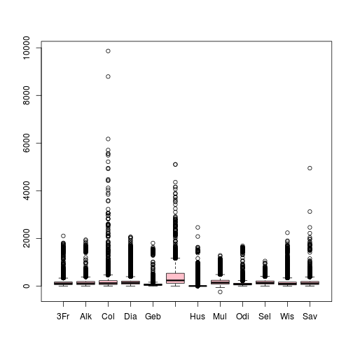
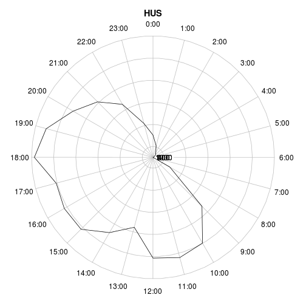
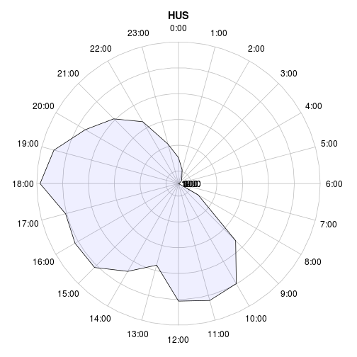
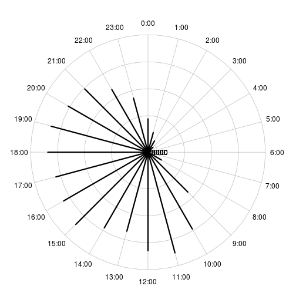
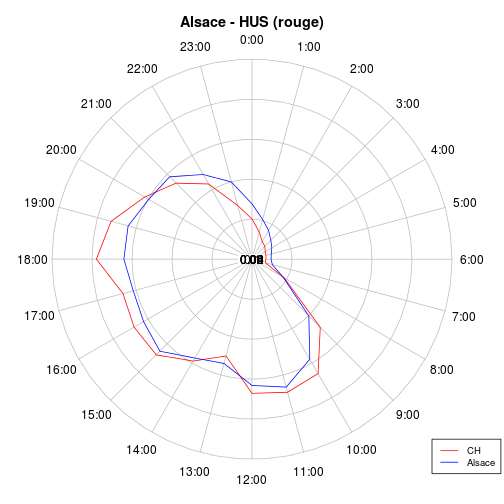
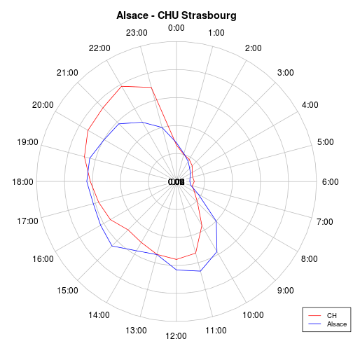
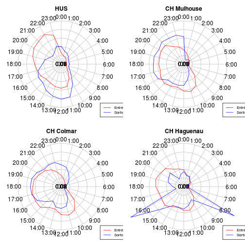
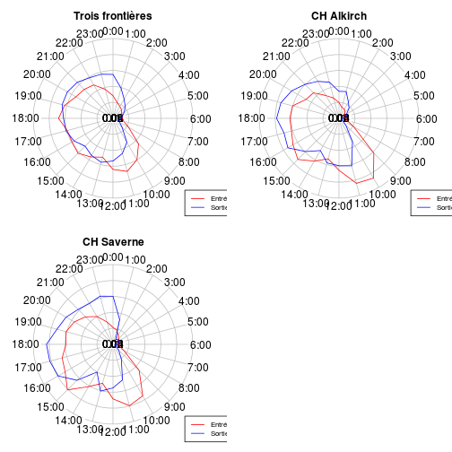
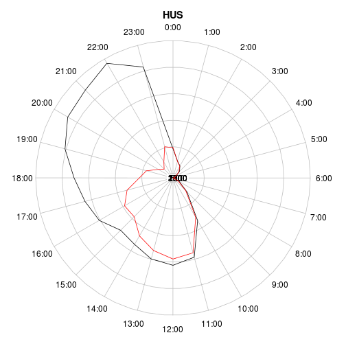
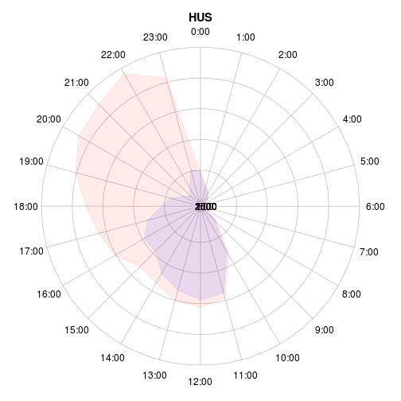

RPU 2013 Analyse
========================================================

```r
date()
```

```
## [1] "Thu Feb 27 18:36:14 2014"
```

source: RPU2013
Ce document exploite le fichier RData préparé à partir de la table *RPU__* de Sagec. Voir le document *RPU_2013_Preparation.Rmd* du dossier Resural.

Librairies nécessaires:
-----------------------

```r
library("gdata")
```

```
## Error: there is no package called 'gdata'
```

```r
library("rgrs")
library("lubridate")
library("rattle")
library("epicalc")
library("zoo")
library("xts")
library("xtable")
library("plotrix")
library("openintro")
```

Chargement des routines perso
-----------------------------

```r
source("../Routines/mes_fonctions.R")
```

Variables globales:
-------------------

```r
mois_courant <- 11
```


Lecture du fichier des données
---------------------------------------
On lit le fichier de travail créé:

```r

load("../rpu2013d0112.Rda")

attach(d1)
```

Les données sont enregistrées dans un data.frame appelé *d1*.

Analyse des données
===================

```r
n <- dim(d1)
print(n)
```

```
## [1] 340338     20
```

```r
names(d1)
```

```
##  [1] "id"            "CODE_POSTAL"   "COMMUNE"       "DESTINATION"  
##  [5] "DP"            "ENTREE"        "EXTRACT"       "FINESS"       
##  [9] "GRAVITE"       "MODE_ENTREE"   "MODE_SORTIE"   "MOTIF"        
## [13] "NAISSANCE"     "ORIENTATION"   "PROVENANCE"    "SEXE"         
## [17] "SORTIE"        "TRANSPORT"     "TRANSPORT_PEC" "AGE"
```

```r
str(d1)
```

```
## 'data.frame':	340338 obs. of  20 variables:
##  $ id           : chr  "2c9d83843bf5e01d013bf5e985d20225" "2c9d83843bf5e01d013bf5e986950226" "2c9d83843bf5e01d013bf5e987620227" "2c9d83843bf5e01d013bf5e988060228" ...
##  $ CODE_POSTAL  : Factor w/ 2979 levels "00000","00159",..: 706 706 706 706 706 701 818 706 706 706 ...
##  $ COMMUNE      : Factor w/ 6405 levels "00","01257 DRESDEN ALLEMAGNE",..: 2184 2184 2184 2184 741 2048 2033 2184 2184 2184 ...
##  $ DESTINATION  : Factor w/ 7 levels "NA","MCO","SSR",..: NA NA NA NA NA NA 2 NA 2 NA ...
##  $ DP           : chr  "R104" "J038" "S617" "M485" ...
##  $ ENTREE       : chr  "2013-01-01 00:04:00" "2013-01-01 00:16:00" "2013-01-01 00:26:00" "2013-01-01 00:32:00" ...
##  $ EXTRACT      : chr  "2013-01-01 05:37:00" "2013-01-01 05:37:00" "2013-01-01 05:37:00" "2013-01-01 05:37:00" ...
##  $ FINESS       : Factor w/ 12 levels "3Fr","Alk","Col",..: 10 10 10 10 10 10 10 10 10 10 ...
##  $ GRAVITE      : Factor w/ 7 levels "1","2","3","4",..: 2 2 3 2 2 1 3 2 2 2 ...
##  $ MODE_ENTREE  : Factor w/ 5 levels "NA","Mutation",..: 4 4 4 4 4 4 4 4 4 4 ...
##  $ MODE_SORTIE  : Factor w/ 5 levels "NA","Mutation",..: 4 4 4 4 4 4 2 4 2 4 ...
##  $ MOTIF        : chr  "GASTRO04" "DIVERS23" "TRAUMATO10" "TRAUMATO02" ...
##  $ NAISSANCE    : chr  "1960-04-08 00:00:00" "1986-03-05 00:00:00" "1971-12-22 00:00:00" "1927-04-27 00:00:00" ...
##  $ ORIENTATION  : Factor w/ 13 levels "CHIR","FUGUE",..: NA NA NA NA NA NA 5 NA 5 NA ...
##  $ PROVENANCE   : Factor w/ 7 levels "NA","MCO","SSR",..: 6 6 6 6 6 6 6 6 6 6 ...
##  $ SEXE         : Factor w/ 3 levels "F","I","M": 3 3 3 1 3 3 1 1 1 1 ...
##  $ SORTIE       : chr  "2013-01-01 02:38:00" "2013-01-01 00:38:00" "2013-01-01 02:07:00" "2013-01-01 01:52:00" ...
##  $ TRANSPORT    : Factor w/ 6 levels "AMBU","FO","HELI",..: 4 4 4 1 4 4 6 6 4 4 ...
##  $ TRANSPORT_PEC: Factor w/ 3 levels "AUCUN","MED",..: 1 1 1 3 1 1 2 2 1 1 ...
##  $ AGE          : num  52 26 41 85 39 9 79 50 46 18 ...
```

```r
summary(d1)
```

```
##       id             CODE_POSTAL           COMMUNE        DESTINATION    
##  Length:340338      68000  : 22516   MULHOUSE  : 39313   MCO    : 71057  
##  Class :character   68200  : 20786   STRASBOURG: 33651   PSY    :  1168  
##  Mode  :character   68100  : 18627   COLMAR    : 22507   SSR    :   102  
##                     67100  : 15505   HAGUENAU  :  6984   HMS    :    21  
##                     67000  : 10758   SELESTAT  :  6090   SLD    :    18  
##                     67600  :  9108   (Other)   :231788   (Other):     6  
##                     (Other):243038   NA's      :     5   NA's   :267966  
##       DP               ENTREE            EXTRACT              FINESS     
##  Length:340338      Length:340338      Length:340338      Col    :64758  
##  Class :character   Class :character   Class :character   Mul    :56195  
##  Mode  :character   Mode  :character   Mode  :character   Hus    :37018  
##                                                           Hag    :34414  
##                                                           Sel    :29534  
##                                                           Dia    :29469  
##                                                           (Other):88950  
##     GRAVITE            MODE_ENTREE        MODE_SORTIE    
##  2      :206434   NA         :     0   NA       :     0  
##  3      : 40419   Mutation   :  3512   Mutation : 67665  
##  1      : 38730   Transfert  :  3061   Transfert:  4877  
##  4      :  3561   Domicile   :301318   Domicile :220090  
##  P      :  1380   Transfe  rt:   294   Décès    :     2  
##  (Other):   906   NA's       : 32153   NA's     : 47704  
##  NA's   : 48908                                          
##     MOTIF            NAISSANCE          ORIENTATION       PROVENANCE    
##  Length:340338      Length:340338      UHCD   : 32452   PEA    :183974  
##  Class :character   Class :character   MED    : 18522   PEO    : 29124  
##  Mode  :character   Mode  :character   CHIR   :  7872   MCO    :  7843  
##                                        PSA    :  3067   SSR    :    48  
##                                        REO    :  1436   PSY    :    45  
##                                        (Other):  4886   (Other):    22  
##                                        NA's   :272103   NA's   :119282  
##  SEXE          SORTIE          TRANSPORT      TRANSPORT_PEC   
##  F:161941   Length:340338      AMBU : 44176   AUCUN  :238923  
##  I:     5   Class :character   FO   :  1456   MED    :  7271  
##  M:178392   Mode  :character   HELI :   207   PARAMED:  7353  
##                                PERSO:184365   NA's   : 86791  
##                                SMUR :  2602                   
##                                VSAB : 28238                   
##                                NA's : 79294                   
##       AGE       
##  Min.   :  0.0  
##  1st Qu.: 18.0  
##  Median : 38.0  
##  Mean   : 40.4  
##  3rd Qu.: 62.0  
##  Max.   :113.0  
##  NA's   :10
```

Stuctures hospitaliéres participantes
=====================================
- *Alk* CH d' Alkirch
- *Col* CH Colmar (Pasteur + Parc)
- *Dia* Diaconat-Fonderie
- *3Fr* Clinique des trois frontières
- *Geb* HUS
- *Hag* CH de Haguenau
- *Hus* Hôpiaux Universitaires de Strasbourg
- *Mul* CH de Mulhouse
- *Odi* Clinique Ste Odile
- *Sel* CH de Sélestat
- *Wis* CH de Wissembourg
- *Sav* CH de Saverne
Hôpitaux ne transmettant pas de données:
- *Tha* CH de Thann
- *Ann* Clinique Ste Anne

Contribution (en %) des SU à la production de RPU:

```r
summary(d1$FINESS)
```

```
##   3Fr   Alk   Col   Dia   Geb   Hag   Hus   Mul   Odi   Sel   Wis   Sav 
## 15688  7126 64758 29469 15103 34414 37018 56195 25963 29534 12646 12424
```

```r
a <- table(d1$FINESS)
round(prop.table(a) * 100, digits = 2)
```

```
## 
##   3Fr   Alk   Col   Dia   Geb   Hag   Hus   Mul   Odi   Sel   Wis   Sav 
##  4.61  2.09 19.03  8.66  4.44 10.11 10.88 16.51  7.63  8.68  3.72  3.65
```

Passages déclarés au serveur régional:

   ALK  | COL  | CTF |  DIA |  GEB |  HUS |  MUL |  ODI |  SAV |  SEL  | TAN |  WIS 
   ----|-------|-----|------|------|------|-------|------|-----|-------|-----|-----
  4577 |21353 | 5475 | 3136  |4926 |41561 |20160 | 8417 | 8961 | 9670 | 4840 | 3052
  
  First Header  | Second Header
------------- | -------------
Content Cell  | Content Cell
Content Cell  | Content Cell

Projection sur l'année:

```r
mois_courant <- 9
p <- 12/mois_courant
summary(d1$FINESS) * p
```

```
##   3Fr   Alk   Col   Dia   Geb   Hag   Hus   Mul   Odi   Sel   Wis   Sav 
## 20917  9501 86344 39292 20137 45885 49357 74927 34617 39379 16861 16565
```

```r
sum(summary(d1$FINESS) * p)
```

```
## [1] 453784
```

```r

t1 <- table(d1$FINESS)
t2 <- table(d1$FINESS) * p
t3 <- rbind(t1, t2)
rownames(t3) <- c("Réalisé", "Projection 2013")
xtable(t(t3))
```

```
## % latex table generated in R 3.0.2 by xtable 1.7-1 package
## % Thu Feb 27 18:36:33 2014
## \begin{table}[ht]
## \centering
## \begin{tabular}{rrr}
##   \hline
##  & Réalisé & Projection 2013 \\ 
##   \hline
## 3Fr & 15688.00 & 20917.33 \\ 
##   Alk & 7126.00 & 9501.33 \\ 
##   Col & 64758.00 & 86344.00 \\ 
##   Dia & 29469.00 & 39292.00 \\ 
##   Geb & 15103.00 & 20137.33 \\ 
##   Hag & 34414.00 & 45885.33 \\ 
##   Hus & 37018.00 & 49357.33 \\ 
##   Mul & 56195.00 & 74926.67 \\ 
##   Odi & 25963.00 & 34617.33 \\ 
##   Sel & 29534.00 & 39378.67 \\ 
##   Wis & 12646.00 & 16861.33 \\ 
##   Sav & 12424.00 & 16565.33 \\ 
##    \hline
## \end{tabular}
## \end{table}
```

### Origine temporelle des données:
Pour chaque hopital on determine la datela plus basse a partir de laquelle des donn2es sont transmises. Les dates sont donnees en secondes unix => il faut les transformer en dates calendaires

```r
b <- tapply(as.Date(d1$ENTREE), d1$FINESS, min)
c <- as.Date(b, origin = "1970-01-01")
cbind(as.character(sort(c)))
```

```
##     [,1]        
## 3Fr "2013-01-01"
## Col "2013-01-01"
## Dia "2013-01-01"
## Geb "2013-01-01"
## Hag "2013-01-01"
## Hus "2013-01-01"
## Odi "2013-01-01"
## Sel "2013-01-01"
## Wis "2013-01-01"
## Mul "2013-01-07"
## Alk "2013-04-01"
## Sav "2013-07-23"
```

Exhaustivité des données
------------------------

#### Jours manquants:a<-as.data.frame(a)
NB: il manque le 31/05dans d1

On forme une matrice (table) de 365 lignes et 12 colonnes (hopitaux) contenant le nombre de RPU un jour donne pour un hopital. Pour conserver une trace du jour, on ajoute une colonne date. On signale les jours pour lesquels le nombre de RPU est inferieur a 20:


```r
a <- table(as.Date(d1$ENTREE), d1$FINESS)
a <- as.data.frame.matrix(a)
head(a)
```

```
##            3Fr Alk Col Dia Geb Hag Hus Mul Odi Sel Wis Sav
## 2013-01-01  59   0 208  88  45 131 126   0  84 111  32   0
## 2013-01-02  38   0 197  89  42 112 125   0  69  80  49   0
## 2013-01-03  39   0 160  73  42  83 121   0  55  78  35   0
## 2013-01-04  42   0 170  93  30  92 121   0  67  65  24   0
## 2013-01-05  46   0 150  87  44 100 102   0  70  85  38   0
## 2013-01-06  38   0 167  77  43  90  93   0  79  68  36   0
```

```r
# liste par FINESS des jours où le nb de RPU est inférieur à 20: il faut
# ajouter une colonne date pour que cela fonctionne.
a$date <- seq(as.Date("2013-01-01"), as.Date("2013-09-29"), 1)
```

```
## Error: le tableau de remplacement a 272 lignes, le tableau remplacé en a
## 364
```

```r
# On initialise une liste de 12 éléments,12 parce que 12 SU
b <- list(1:12)
# pour chacun des SU, les jours où le nombre de RPU < 20, on stocke la date
# (col.13) et le n° du SU
for (i in 1:12) {
    b[[i]] <- a[a[, i] < 20, c(13, i)]
}
```

```
## Error: undefined columns selected
```

```r
str(b)
```

```
## List of 1
##  $ : int [1:12] 1 2 3 4 5 6 7 8 9 10 ...
```

```r
# dossier manquants pour guebwiller:
b[[5]]
```

```
## Error: indice hors limites
```

```r
names(b[[5]])
```

```
## Error: indice hors limites
```

```r
b[[5]]$date
```

```
## Error: indice hors limites
```

```r
# liste des SU incomplets:
for (i in 1:12) {
    n = length(b[[i]]$date)
    if (n > 0) {
        print(paste(i, names(b[[i]][2]), n, sep = " "))
    }
}
```

```
## Error: $ operator is invalid for atomic vectors
```

#### Exhaustivité des items
Il faut tranformer les valeurs NULL en NA pour pouvoir les comptabiliser. Les valeurs NULL apparaissent pour les factors: DP, MOTIF, TRANSPORT, ORIENTATION,GRAVITE, SORTIE. Il faut les transformer en character pour leur attriber la valeur NA au lieu de NULL:

```r
a <- as.character(d1$DP)
a[a == "NULL"] <- NA
sum(is.na(a))
```

```
## [1] 114865
```

```r
mean(is.na(a))
```

```
## [1] 0.3375
```

sum(is.na(a)) retourne le nombre de lignes concernées et *mean(is.na(a))* donne directement le pourcentage de valeurs nulles (R in action pp 356)

```r
d1$DP <- a

a <- as.character(d1$MOTIF)
a[a == "NULL"] <- NA
d1$MOTIF <- a

a <- as.character(d1$TRANSPORT)
a[a == "NULL"] <- NA
d1$TRANSPORT <- a

a <- as.character(d1$ORIENTATION)
a[a == "NULL"] <- NA
d1$ORIENTATION <- a

a <- as.character(d1$GRAVITE)
a[a == "NULL"] <- NA
d1$GRAVITE <- a

a <- as.character(d1$SORTIE)
a[a == "NULL"] <- NA
d1$SORTIE <- a

a <- as.character(d1$ENTREE)
a[a == "NULL"] <- NA
d1$ENTREE <- a
```

Les 2 lignes qui suivent comptent les NA

```r
a <- is.na(d1)
b <- apply(a, 2, mean)
a <- cbind(sort(round(b * 100, 2)))
colnames(a) <- "%"
a
```

```
##                   %
## id             0.00
## CODE_POSTAL    0.00
## COMMUNE        0.00
## ENTREE         0.00
## EXTRACT        0.00
## FINESS         0.00
## NAISSANCE      0.00
## SEXE           0.00
## AGE            0.00
## SORTIE         8.91
## MODE_ENTREE    9.45
## MODE_SORTIE   14.02
## GRAVITE       14.37
## TRANSPORT     23.30
## TRANSPORT_PEC 25.50
## DP            33.75
## PROVENANCE    35.05
## MOTIF         35.75
## DESTINATION   78.74
## ORIENTATION   79.95
```

MODE_SORTIE (hospitalisation ou retour à domicile): dans 14.86% des cas on ne sait pas ce que devient le patient. Pour sélectionner les hospitalisés et éliminer les NA et les valeurs nulles:

```r
a <- d1$MODE_SORTIE[MODE_SORTIE == "Mutation" | MODE_SORTIE == "Transfert"]
a <- na.omit(a)
a <- as.factor(as.character(a))
summary(a)
```

```
##  Mutation Transfert 
##     67665      4877
```

```r
round(prop.table(table(a)) * 100, 2)
```

```
## a
##  Mutation Transfert 
##     93.28      6.72
```

```r

a <- d1[MODE_SORTIE == "Mutation" | MODE_SORTIE == "Transfert", ]
a <- na.omit(a)
summary(a$DESTINATION)
```

```
##    NA   MCO   SSR   SLD   PSY   HAD   HMS 
##     0 25382     4     5   427     0     0
```

```r
summary(as.factor(a$ORIENTATION))
```

```
##  CHIR   HDT    HO   MED  OBST   PSA   REA    SC    SI  UHCD 
##  5423    65    16 12185    46     1   736  1033   950  5363
```

```r
round(prop.table(table(as.factor(a$ORIENTATION))) * 100, 2)
```

```
## 
##  CHIR   HDT    HO   MED  OBST   PSA   REA    SC    SI  UHCD 
## 21.00  0.25  0.06 47.20  0.18  0.00  2.85  4.00  3.68 20.77
```

```r

tab1(as.factor(a$ORIENTATION), sort.group = "decreasing", horiz = TRUE, cex.names = 0.8, 
    xlab = "", main = "Orientation des patients hospitalisés")
```

 

```
## as.factor(a$ORIENTATION) :  
##         Frequency Percent Cum. percent
## MED         12185    47.2         47.2
## CHIR         5423    21.0         68.2
## UHCD         5363    20.8         89.0
## SC           1033     4.0         93.0
## SI            950     3.7         96.7
## REA           736     2.9         99.5
## HDT            65     0.3         99.8
## OBST           46     0.2         99.9
## HO             16     0.1        100.0
## PSA             1     0.0        100.0
##   Total     25818   100.0        100.0
```

```r

a <- d1[d1$MODE_SORTIE == "Domicile", ]
summary(as.factor(a$ORIENTATION))
```

```
##   CHIR  FUGUE    HDT     HO    MED   OBST    PSA    REA    REO     SC 
##    134    255     16      2     73      2   3015     10   1394      6 
##   SCAM     SI   UHCD   NA's 
##    512     36    283 262056
```

```r
t <- table(as.factor(a$ORIENTATION))
round(prop.table(t) * 100, 2)
```

```
## 
##  CHIR FUGUE   HDT    HO   MED  OBST   PSA   REA   REO    SC  SCAM    SI 
##  2.34  4.44  0.28  0.03  1.27  0.03 52.54  0.17 24.29  0.10  8.92  0.63 
##  UHCD 
##  4.93
```

```r
tab1(as.factor(a$ORIENTATION), sort.group = "decreasing", horiz = TRUE, cex.names = 0.8, 
    xlab = "", main = "Orientation des patients non hospitalisés", missing = F)
```

 

```
## as.factor(a$ORIENTATION) :  
##         Frequency   %(NA+)   %(NA-)
## NA's       262056     97.9      0.0
## PSA          3015      1.1     52.5
## REO          1394      0.5     24.3
## SCAM          512      0.2      8.9
## UHCD          283      0.1      4.9
## FUGUE         255      0.1      4.4
## CHIR          134      0.1      2.3
## MED            73      0.0      1.3
## SI             36      0.0      0.6
## HDT            16      0.0      0.3
## REA            10      0.0      0.2
## SC              6      0.0      0.1
## HO              2      0.0      0.0
## OBST            2      0.0      0.0
##   Total    267794    100.0    100.0
```

La table ci-dessus liste le devenir des patients non hospitalisés. On note des incohérences: REA, HDT, SI, Med, CHIR, UHCD. La ligne *Missing* correspond aux patients rentrés sur avis médical.

Etude des patients hospitalisés
--------------------------------
La rubrique mode de sortie peut se décomposer en 3 éléments
- *hosp*: patient hospitalisés, cad gardé en milieu de soins par *MUTATION* ou *TRANSFERT*
- *dom*: retour à domicile ou équivalent
- *dcd*: patients décédés aux urgences
Dans l'échantillon *d1* c'est la colonne *MODE_SORTIE* qui renseigne sur le devenir du patient à la sortie des urgences:


```
## [1] "d1 compte  340338  lignes"
```

Il y a deux façons de former des sous ensembles avec R:
- sélectionner en utilisant la notation vectorielle: hosp<-d1[d1$MODE_SORTIE=="Mutation" | d1$MODE_SORTIE=="Transfert",]
- sélectionner avec la méthode **subset**: b<-subset(d1,MODE_SORTIE=="Mutation" | MODE_SORTIE=="Transfert")

La première méthode sélectionne toutes les lignes correspondant aux critères ET celles où le critère vaut *NA*. ie, la méthode 1 retourne un data frame de 39224 lignes et 20 colonnes.

La méthode *subset* ne tient pas compte des lignes où le critère vaut NA. Dans l'exemple, retourne un dataframe de 23473 lignes et 20 colonnes.


```r
hosp <- d1[d1$MODE_SORTIE == "Mutation" | d1$MODE_SORTIE == "Transfert", ]
dom <- d1[d1$MODE_SORTIE == "Domicile", ]
dcd <- d1[d1$MODE_SORTIE == "Deces", ]
nbna <- nrow(hosp) + nrow(dom) + nrow(dcd) - nrow(d1)
pna <- round(nbna * 100/nrow(d1), 2)

print(paste("hosp = ", nrow(hosp), " lignes"))
```

```
## [1] "hosp =  120246  lignes"
```

```r
print(paste("dom = ", nrow(dom), " lignes"))
```

```
## [1] "dom =  267794  lignes"
```

```r
print(paste("dcd = ", nrow(dcd), " lignes"))
```

```
## [1] "dcd =  47704  lignes"
```

```r

print(paste("La différence du nombre de lignes entre d1 et hosp, dom et dcd indique le nmbre de lignes correspondant à NA et qui sont incluses dans le décompte des lignes de chaque sous ensemble: ", 
    nbna, "correspondant aux mode de sortie non renseignés soit ", pna, " %"))
```

```
## [1] "La différence du nombre de lignes entre d1 et hosp, dom et dcd indique le nmbre de lignes correspondant à NA et qui sont incluses dans le décompte des lignes de chaque sous ensemble:  95406 correspondant aux mode de sortie non renseignés soit  28.03  %"
```

Avec *subset* on élimine ces lignes parasites:

```r
a <- subset(d1, MODE_SORTIE == "Domicile")
b <- subset(d1, MODE_SORTIE == "Mutation" | MODE_SORTIE == "Transfert")
nrow(a)
```

```
## [1] 220090
```

```r
nrow(b)
```

```
## [1] 72542
```

```r
nrow(d1) - nrow(a) - nrow(b)
```

```
## [1] 47706
```

```r

print("O")
```

```
## [1] "O"
```

```r
t <- table(b$ORIENTATION, b$FINESS, useNA = "ifany")
m1 <- margin.table(t, 1)
t2 <- cbind(t, m1)
m2 <- margin.table(t2, 2)
rbind(t2, m2)
```

```
##      3Fr  Alk   Col  Dia Geb  Hag   Hus  Mul  Odi  Sel  Wis  Sav    m1
## CHIR   1    0  2783   51  47 1128     1 1604  176 1378   22  391  7582
## HDT    0    0    57    0   1    0     0    5    3    0   20    0    86
## HO     1    0     6    0   3    0     0    4    1    0   10    0    25
## MED    1    0  6562    8  25 2079   467 2638   54 4355   24 1996 18209
## OBST   0    0    29    0   4   45     0    0    1   17    0    0    96
## PSA    0    1     0   11   0    0     0    0    0    0    1    0    13
## REA    0    0   389    2   1  165     0  281    2   93    8   18   959
## REO    9    9     0   13   0    0     0    0    1    0    1    0    33
## SC     0    0   440    1   5   78     0  817    3    2   39    0  1385
## SI     0    0   642    0   8  294     0  312    8   12   15    0  1291
## UHCD   0    0  4822    5  20 3944 19869  674    2  392   63    0 29791
## <NA> 243 1261   436 3051 398 2071     1 1792  886    1 2797  135 13072
## m2   255 1271 16166 3142 512 9804 20338 8127 1137 6250 3000 2540 72542
```

```r

summary(a$MODE_SORTIE)
```

```
##        NA  Mutation Transfert  Domicile     Décès 
##         0         0         0    220090         0
```

```r
summary(b$MODE_SORTIE)
```

```
##        NA  Mutation Transfert  Domicile     Décès 
##         0     67665      4877         0         0
```

- nb total de lignes = 105979
- total hospitalisés = 21950 +  1523
- total non hospitalisés = 66755 
- non réponses = 105979-90228 = 15751

```r
summary(b$DESTINATION)
```

```
##    NA   MCO   SSR   SLD   PSY   HAD   HMS  NA's 
##     0 70909   102    18  1160     5     0   348
```

```r
summary(b$ORIENTATION)
```

```
##    Length     Class      Mode 
##     72542 character character
```

```r
summary(a$DESTINATION)
```

```
##     NA    MCO    SSR    SLD    PSY    HAD    HMS   NA's 
##      0    128      0      0      0      1     21 219940
```

```r
summary(a$ORIENTATION)
```

```
##    Length     Class      Mode 
##    220090 character character
```


on forme un dataframe *hosp* des patients hospitalisés par mutation ou transfert:

```r
hosp <- d1[d1$MODE_SORTIE == "Mutation" | d1$MODE_SORTIE == "Transfert", ]
summary(d1$MODE_SORTIE)
```

```
##        NA  Mutation Transfert  Domicile     Décès      NA's 
##         0     67665      4877    220090         2     47704
```

```r
prop.table(summary(d1$MODE_SORTIE)) * 100
```

```
##        NA  Mutation Transfert  Domicile     Décès      NA's 
## 0.000e+00 1.988e+01 1.433e+00 6.467e+01 5.877e-04 1.402e+01
```

#### Destinations

```r
summary(hosp$DESTINATION)
```

```
##    NA   MCO   SSR   SLD   PSY   HAD   HMS  NA's 
##     0 70909   102    18  1160     5     0 48052
```

```r
prop.table(summary(hosp$DESTINATION))
```

```
##        NA       MCO       SSR       SLD       PSY       HAD       HMS 
## 0.000e+00 5.897e-01 8.483e-04 1.497e-04 9.647e-03 4.158e-05 0.000e+00 
##      NA's 
## 3.996e-01
```

```r
# sans les NA
table(hosp$DESTINATION)
```

```
## 
##    NA   MCO   SSR   SLD   PSY   HAD   HMS 
##     0 70909   102    18  1160     5     0
```

```r
prop.table(table(hosp$DESTINATION)) * 100
```

```
## 
##        NA       MCO       SSR       SLD       PSY       HAD       HMS 
##  0.000000 98.220074  0.141286  0.024933  1.606782  0.006926  0.000000
```


#### Orientation des hospitalisés MCO (avec et sans les NA):

```r
a <- as.factor(hosp$ORIENTATION[hosp$DESTINATION == "MCO"])
a <- summary(a)
a
```

```
##  CHIR   HDT    HO   MED  OBST   PSA   REA   REO    SC    SI  UHCD  NA's 
##  7446    15    12 17934    96    13   949    31  1374  1289 29749 60053
```

```r
round(prop.table(a) * 100, 2)
```

```
##  CHIR   HDT    HO   MED  OBST   PSA   REA   REO    SC    SI  UHCD  NA's 
##  6.26  0.01  0.01 15.08  0.08  0.01  0.80  0.03  1.16  1.08 25.01 50.48
```

```r

a <- table(hosp$ORIENTATION[hosp$DESTINATION == "MCO"])
a
```

```
## 
##  CHIR   HDT    HO   MED  OBST   PSA   REA   REO    SC    SI  UHCD 
##  7446    15    12 17934    96    13   949    31  1374  1289 29749
```

```r
a <- prop.table(a) * 100
a
```

```
## 
##     CHIR      HDT       HO      MED     OBST      PSA      REA      REO 
## 12.64005  0.02546  0.02037 30.44408  0.16297  0.02207  1.61099  0.05262 
##       SC       SI     UHCD 
##  2.33245  2.18816 50.50078
```

```r
sce_chauds <- a["REA"] + a["SI"] + a["SC"]
print(paste("Services chauds: ", round(sce_chauds, 2), " %"))
```

```
## [1] "Services chauds:  6.13  %"
```

```r
mco <- a["CHIR"] + a["MED"] + a["OBST"]
print(paste("MCO: ", round(mco, 2), " %"))
```

```
## [1] "MCO:  43.25  %"
```

```r
print(paste("UHTCD: ", round(a["UHCD"], 2), " %"))
```

```
## [1] "UHTCD:  50.5  %"
```

```r
print(paste("Atypiques: ", round(a["FUGUE"] + a["PSA"] + a["SCAM"] + a["REO"], 
    2), " %"))
```

```
## [1] "Atypiques:  NA  %"
```

```r
print(paste("HDT-HO: ", round(a["HDT"] + a["HO"], 2), " %"))
```

```
## [1] "HDT-HO:  0.05  %"
```

Quelques erreurs de codage:
- Fugue, HDT, HO, PSA,REO, SCAM devraient être nuls
dom<-d1
#### Orientation des patients hospitalisés en Psychiatrie:

```r
a <- summary(hosp$ORIENTATION[hosp$DESTINATION == "PSY"])
a
```

```
##    Length     Class      Mode 
##     49212 character character
```

```r
a <- table(hosp$ORIENTATION[hosp$DESTINATION == "PSY"])
a
```

```
## 
## CHIR  HDT   HO  MED  REA  REO   SC   SI UHCD 
##  136   71   13  263    7    1   11    2   21
```

```r

a <- d1[d1$DESTINATION == "PSY", ]
a$DESTINATION <- as.character(a$DESTINATION)
a <- a[!is.na(a$DESTINATION), ]
summary(a$ORIENTATION)
```

```
##    Length     Class      Mode 
##      1168 character character
```

```r
round(prop.table(summary(a$ORIENTATION)) * 100, 3)
```

```
## Error: 'type' (character) de l'argument incorrect
```

#### Analyse de l'ensemble de la rubrique **ORIENTATION**

```r
d1$ORIENTATION <- as.factor(d1$ORIENTATION)
a <- summary(d1$ORIENTATION)
a
```

```
##   CHIR  FUGUE    HDT     HO    MED   OBST    PSA    REA    REO     SC 
##   7872    256    126     31  18522     98   3067   1035   1436   1426 
##   SCAM     SI   UHCD   NA's 
##    512   1402  32452 272103
```

```r
a <- round(prop.table(a) * 100, 4)

sce_chauds <- a["REA"] + a["SI"] + a["SC"]
print(paste("Services chauds: ", round(sce_chauds, 2), " %"))
```

```
## [1] "Services chauds:  1.14  %"
```

```r
mco <- a["CHIR"] + a["MED"] + a["OBST"]
print(paste("MCO: ", round(mco, 2), " %"))
```

```
## [1] "MCO:  7.78  %"
```

```r
uhcd <- a["UHCD"]
print(paste("UHTCD: ", round(uhcd, 2), " %"))
```

```
## [1] "UHTCD:  9.54  %"
```

```r
atypique <- a["FUGUE"] + a["PSA"] + a["SCAM"] + a["REO"]
print(paste("Atypiques: ", round(atypique, 2), " %"))
```

```
## [1] "Atypiques:  1.55  %"
```

```r
psy <- a["HDT"] + a["HO"]
print(paste("HDT-HO: ", round(psy, 2), " %"))
```

```
## [1] "HDT-HO:  0.05  %"
```

```r
nr <- a["NA's"]

als <- c(mco, uhcd, nr, atypique, sce_chauds, psy)
lor <- c(49.39, 19.12, 17.25, 8.92, 5.24, 0.07)

r <- rbind(als, lor)
barplot(r, las = 2, beside = T, legend = T, ylab = "% des RPU", xlab = "", sub = "(Ref. ORULOR 2011 p.50)", 
    names.arg = c("MCO", "UHCD", "NR", "Atypiques", "REA", "PSY"), main = "Orientation des patients hospitalisés", 
    cex.sub = 0.6)
```

 

en fonction de l'établissement (NOTE: utilisation de useNA="ifany"):

```r
# analyse brute
t <- table(d1$ORIENTATION, d1$FINESS)
t
```

```
##        
##           3Fr   Alk   Col   Dia   Geb   Hag   Hus   Mul   Odi   Sel   Wis
##   CHIR      5     0  2789   101    59  1128     1  1735   253  1386    23
##   FUGUE    11     7   117    12     3    40     0     0    30     3    27
##   HDT       1     0    58     0     1     0     0    41     3     1    21
##   HO        5     0     6     0     3     0     0     5     1     0    11
##   MED       2     0  6576    19    29  2079   468  2878    75  4371    26
##   OBST      0     0    29     0     4    45     0     0     3    17     0
##   PSA      91   162   964   974    40   458     0   223    42    10   103
##   REA       1     0   389     6     2   165     0   349     3    93     9
##   REO      69    27  1174   153     1     0     0     0     5     0     3
##   SC        1     0   440     1     6    78     0   848     3     2    47
##   SCAM      4    25   171    18    33   147     0    11    36     5    44
##   SI        1     0   642     2    10   294     0   384    11    42    16
##   UHCD      1     0  4827    12    26  3944 20984  2183     2   392    81
##        
##           Sav
##   CHIR    392
##   FUGUE     6
##   HDT       0
##   HO        0
##   MED    1999
##   OBST      0
##   PSA       0
##   REA      18
##   REO       4
##   SC        0
##   SCAM     18
##   SI        0
##   UHCD      0
```

```r
# analyse brute incluant les NA
t <- table(d1$ORIENTATION, d1$FINESS, useNA = "ifany")
t
```

```
##        
##           3Fr   Alk   Col   Dia   Geb   Hag   Hus   Mul   Odi   Sel   Wis
##   CHIR      5     0  2789   101    59  1128     1  1735   253  1386    23
##   FUGUE    11     7   117    12     3    40     0     0    30     3    27
##   HDT       1     0    58     0     1     0     0    41     3     1    21
##   HO        5     0     6     0     3     0     0     5     1     0    11
##   MED       2     0  6576    19    29  2079   468  2878    75  4371    26
##   OBST      0     0    29     0     4    45     0     0     3    17     0
##   PSA      91   162   964   974    40   458     0   223    42    10   103
##   REA       1     0   389     6     2   165     0   349     3    93     9
##   REO      69    27  1174   153     1     0     0     0     5     0     3
##   SC        1     0   440     1     6    78     0   848     3     2    47
##   SCAM      4    25   171    18    33   147     0    11    36     5    44
##   SI        1     0   642     2    10   294     0   384    11    42    16
##   UHCD      1     0  4827    12    26  3944 20984  2183     2   392    81
##   <NA>  15496  6905 46576 28171 14886 26036 15565 47538 25496 23212 12235
##        
##           Sav
##   CHIR    392
##   FUGUE     6
##   HDT       0
##   HO        0
##   MED    1999
##   OBST      0
##   PSA       0
##   REA      18
##   REO       4
##   SC        0
##   SCAM     18
##   SI        0
##   UHCD      0
##   <NA>   9987
```

```r
# cette analyse ne permet pas de séparer les vraies non réponses des retours
# à domicile
hosp <- d1[d1$MODE_SORTIE == "Mutation" | d1$MODE_SORTIE == "Transfert", ]
t <- table(hosp$ORIENTATION, hosp$FINESS, useNA = "ifany")
t
```

```
##        
##           3Fr   Alk   Col   Dia   Geb   Hag   Hus   Mul   Odi   Sel   Wis
##   CHIR      1     0  2783    51    47  1128     1  1604   176  1378    22
##   FUGUE     0     0     0     0     0     0     0     0     0     0     0
##   HDT       0     0    57     0     1     0     0     5     3     0    20
##   HO        1     0     6     0     3     0     0     4     1     0    10
##   MED       1     0  6562     8    25  2079   467  2638    54  4355    24
##   OBST      0     0    29     0     4    45     0     0     1    17     0
##   PSA       0     1     0    11     0     0     0     0     0     0     1
##   REA       0     0   389     2     1   165     0   281     2    93     8
##   REO       9     9     0    13     0     0     0     0     1     0     1
##   SC        0     0   440     1     5    78     0   817     3     2    39
##   SCAM      0     0     0     0     0     0     0     0     0     0     0
##   SI        0     0   642     0     8   294     0   312     8    12    15
##   UHCD      0     0  4822     5    20  3944 19869   674     2   392    63
##   <NA>    243  1261   436  3051   398  2071     1  1792   886     1  2797
##        
##           Sav  <NA>
##   CHIR    391     0
##   FUGUE     0     0
##   HDT       0     0
##   HO        0     0
##   MED    1996     0
##   OBST      0     0
##   PSA       0     0
##   REA      18     0
##   REO       0     0
##   SC        0     0
##   SCAM      0     0
##   SI        0     0
##   UHCD      0     0
##   <NA>    135 47704
```

```r
# non hospitalisés
dom <- d1[d1$MODE_SORTIE == "Domicile", ]
```


Adultes
-------
Répartition de la population adulte (18 ans et plus)

```r
a <- d1[AGE > 17, c("AGE", "FINESS")]
boxplot(a$AGE ~ a$FINESS, main = "Patients de 18 ans et plus", col = "slategray1")
```

 


Mineurs
-------

```r
a <- d1$AGE[d1$AGE <= 18]
# a
summary(a)
```

```
##    Min. 1st Qu.  Median    Mean 3rd Qu.    Max.    NA's 
##     0.0     2.0     7.0     7.8    13.0    18.0      10
```

```r
hist(a, main = "Moins de 18 ans", xlab = "Age (années)", col = "yellow")
```

 

```r

a <- d1$AGE[FINESS == "Col" & d1$AGE < 18]
# a
a <- d1$AGE[FINESS == "Hag" & d1$AGE < 18]
# a
a <- d1$AGE[FINESS == "Mul" & d1$AGE < 18]
# a
table(FINESS)
```

```
## FINESS
##   3Fr   Alk   Col   Dia   Geb   Hag   Hus   Mul   Odi   Sel   Wis   Sav 
## 15688  7126 64758 29469 15103 34414 37018 56195 25963 29534 12646 12424
```

Durée d'attente
===============
On utilise les données de Sélestat comme étude pilote:

```r
sel <- d1[d1$FINESS == "Sel", ]
e <- ymd_hms(sel$ENTREE)
s <- ymd_hms(sel$SORTIE)
q <- s - e
sel$attente <- q
summary(as.numeric(q))
```

```
##    Min. 1st Qu.  Median    Mean 3rd Qu.    Max.    NA's 
##       1      84     135     159     212    1050     874
```

Attente cumulée par jour (pour chaque jour, on cumule les durées d'attente) en mn:

```r
q <- tapply(sel$attente, as.Date(sel$ENTREE), sum, na.rm = TRUE)
summary(q)
```

```
##    Min. 1st Qu.  Median    Mean 3rd Qu.    Max. 
##       0   10600   12700   12600   14600   23000
```

```r
hist(q, main = "Attente cumulée par 24h", xlab = "Durée de passage (en mn)", 
    ylab = "Fréquence", col = "orange")
```

 

```r

z <- zoo(q, unique(as.Date(sel$ENTREE)))
plot(z, main = "Attente cumulée par 24h", xlab = "Sélestat 2013")
```

 

```r
plot(xts(z))
```

 

```r
plot(rollmean(z, 7), main = "Attente cumulée par 24h (moyenne lissée)")
```

 

```r
plot(rollmean(xts(z), 7), main = "Attente cumulée (lissée) par 24h", xlab = "Durée de passage (en mn)", 
    ylab = "Fréquence")
```

 

Ensemble des SAU
----------------
attente en mn:

```r
e <- ymd_hms(d1$ENTREE)
s <- ymd_hms(d1$SORTIE)
q <- s - e
d1$passage <- q/60

tapply(d1$passage, d1$FINESS, mean, na.rm = TRUE)
```

```
##    3Fr    Alk    Col    Dia    Geb    Hag    Hus    Mul    Odi    Sel 
## 135.94 156.18 168.02 160.29  76.40 351.89  61.78 179.46  94.39 159.32 
##    Wis    Sav 
## 132.53 151.46
```

```r
tapply(d1$passage, d1$FINESS, sd, na.rm = TRUE)
```

```
##   3Fr   Alk   Col   Dia   Geb   Hag   Hus   Mul   Odi   Sel   Wis   Sav 
## 154.8 183.0 176.3 140.5 128.1 327.3 248.9 138.2 108.3 102.0 153.9 154.4
```

```r
tapply(d1$passage, d1$FINESS, median, na.rm = TRUE)
```

```
## 3Fr Alk Col Dia Geb Hag Hus Mul Odi Sel Wis Sav 
## 107 110 119 135  50 235   1 144  75 135  93 112
```

```r
boxplot(as.numeric(d1$passage) ~ d1$FINESS, col = "pink")
```

 

attente de moins d'une journée:

```r
h24 <- d1[as.numeric(d1$passage) < 1000, c("passage", "FINESS")]
boxplot(as.numeric(h24$passage) ~ h24$FINESS, col = "pink", main = "Durée moyenne de passage (pour t<24h)", 
    ylab = "Temps en minutes", xlab = "SAU - 2013")
```

 

```r
boxplot(as.numeric(h24$passage) ~ h24$FINESS, col = "yellow", range = 0, notch = TRUE, 
    border = "blue", main = "Durée moyenne de passage", ylab = "Temps en minutes", 
    xlab = "SAU - 2013")
```

 

Maladies infectieuses
=====================
Codes CIM 10:
- bronchiolite: J11
- Grippe: J11, J10, J09
- Gastroenterite: A09

Regroupement | Code CIM 10 | Description
------------ | ------------ | -----------
Hyperthermies |T67 | Effets de la chaleur et de la lumière
Hyperthermies | X30 |Exposition à une chaleur naturelle excessive
Déshydratations |E86 |Hypovolémie
Hyponatrémies | E871 | Hypo-osmolarité et hyponatrémie
Malaises | R42 | Etourdissements et éblouissements
Malaises |R53| Malaise et fatigue
Malaises | R55| Syncope et collapsus
Asthme|J45 | Asthme
Asthme |J46 | Etat de mal asthmatique
Piqûres arthropodes ou autres |T63 |Effet toxique d’un contact avec un animal venimeux
Piqûres arthropodes ou autres |W57 |Morsure ou piqûre non venimeuse d’insectes et arthropodes
Piqûres arthropodes ou autres |X20→X29 | Contact avec des animaux ou des plantes venimeuses

Pendant toute la durée du Plan Canicule, du 1er juin au 31 août.


on veut mettre 3 graphiques sur le même dessin

```r
par(mfrow = c(3, 1))
```


gastro
------

```r
gastro <- d1[substr(d1$DP, 1, 3) == "A09", c("DP", "ENTREE")]
g <- gastro[complete.cases(gastro), ]
g$date <- as.Date(g$ENTREE)
hist(g$date, breaks = 18, freq = TRUE, col = "slategray1", main = "2013 - Gastroentérites", 
    xlab = "")
```

 

```r
g$date2 <- ymd_hms(g$ENTREE)
wg <- week(g$date2)
barplot(summary(as.factor(wg)))
```

 

bronchiolite
------------

```r
bronchio <- d1[substr(d1$DP, 1, 3) == "J21", c("DP", "ENTREE")]
bronchio <- bronchio[complete.cases(bronchio), ]
bronchio$date <- as.Date(bronchio$ENTREE)
hist(bronchio$date, breaks = 18, freq = TRUE, col = "slategray1", main = "2013 - Bronchiolites", 
    xlab = "")
```

 

Grippe
------

```r
grippe <- d1[substr(d1$DP, 1, 3) == "J11" | substr(d1$DP, 1, 3) == "J10" | substr(d1$DP, 
    1, 3) == "J09", c("DP", "ENTREE")]
grippe <- grippe[complete.cases(grippe), ]
grippe$date <- as.Date(grippe$ENTREE)
hist(grippe$date, breaks = 18, freq = TRUE, col = "slategray1", main = "2013 - Syndromes grippaux", 
    xlab = "")
```

 

```r

par(mfrow = c(1, 1))
```

malaises
--------

```r
malaise <- d1[substr(d1$DP, 1, 3) == "R55", c("DP", "ENTREE")]
malaise <- malaise[complete.cases(malaise), ]
malaise$date <- as.Date(malaise$ENTREE)
hist(malaise$date, breaks = 18, freq = TRUE, col = "slategray1")
```

 

malaise selon INVS (canicule):

```r
malaise <- d1[substr(d1$DP, 1, 3) == "R55" | substr(d1$DP, 1, 3) == "R53" | 
    substr(d1$DP, 1, 3) == "R42", c("DP", "ENTREE")]
malaise <- malaise[complete.cases(malaise), ]
malaise$date <- as.Date(malaise$ENTREE)
hist(malaise$date, breaks = 18, freq = TRUE, col = "slategray1", main = "Malaises (INVS)")
```

 

```r
plot(as.factor(malaise$date), col = "slategray1", las = 1, main = "Malaises (INVS)")
```

 

AVC
----
code SIM10: I60 à I64
**complete.cases** permet de supprimer les enregistrements vides

```r
avc <- d1[substr(d1$DP, 1, 3) >= "I60" & substr(d1$DP, 1, 3) <= "I64", c("DP", 
    "ENTREE", "FINESS", "AGE", "SEXE")]
avc <- avc[complete.cases(avc), ]
nrow(avc)
```

```
## [1] 2002
```

```r
summary(avc$FINESS)
```

```
## 3Fr Alk Col Dia Geb Hag Hus Mul Odi Sel Wis Sav 
##  48  11 443   0  16 431 316 500   1 171  65   0
```

```r
summary(avc$AGE)
```

```
##    Min. 1st Qu.  Median    Mean 3rd Qu.    Max. 
##     1.0    63.0    76.0    72.5    84.0   112.0
```

```r
summary(avc$SEXE)
```

```
##    F    I    M 
## 1069    0  933
```

Le SAU des HUS reçoit peu d' AVC alors que c'est la meilleure filière. Les résultats sont faussés par l'UNV.

Douleur thoracique
------------------
code SIM10: I20 à I25

```r
idm <- d1[substr(d1$DP, 1, 3) >= "I20" & substr(d1$DP, 1, 3) <= "I25", c("DP", 
    "ENTREE", "FINESS", "AGE", "SEXE")]
idm <- idm[complete.cases(idm), ]
nrow(idm)
```

```
## [1] 994
```

```r
summary(idm$FINESS)
```

```
## 3Fr Alk Col Dia Geb Hag Hus Mul Odi Sel Wis Sav 
##  74  10 147   0  34 152 311 133   2  77  54   0
```

```r
summary(idm$AGE)
```

```
##    Min. 1st Qu.  Median    Mean 3rd Qu.    Max. 
##     0.0    53.2    65.0    65.3    80.0   103.0
```

```r
summary(idm$SEXE)
```

```
##   F   I   M 
## 387   0 607
```

Lésions traumatiques
--------------------
codes CIM10 S00–T98

```r
trauma <- d1[substr(d1$DP, 1, 3) >= "S00" & substr(d1$DP, 1, 3) <= "T98", c("DP", 
    "ENTREE", "FINESS", "AGE", "SEXE")]
trauma <- trauma[complete.cases(trauma), ]
nrow(trauma)
```

```
## [1] 85588
```

```r
summary(trauma$FINESS)
```

```
##   3Fr   Alk   Col   Dia   Geb   Hag   Hus   Mul   Odi   Sel   Wis   Sav 
##  5451  2795 23701     0  7496 11426  1716 11812  3550 13431  4210     0
```

```r
summary(trauma$AGE)
```

```
##    Min. 1st Qu.  Median    Mean 3rd Qu.    Max. 
##     0.0    13.0    28.0    34.1    51.0   112.0
```

```r
summary(trauma$SEXE)
```

```
##     F     I     M 
## 37136     3 48449
```

Etude HUS
----------------

```r
geb <- d1[d1$FINESS == "Geb", ]
```

Orientation des patients 

```r
summary(geb$MODE_SORTIE)
```

```
##        NA  Mutation Transfert  Domicile     Décès      NA's 
##         0       315       197      7748         0      6843
```

```r
summary(geb$ORIENTATION)
```

```
##  CHIR FUGUE   HDT    HO   MED  OBST   PSA   REA   REO    SC  SCAM    SI 
##    59     3     1     3    29     4    40     2     1     6    33    10 
##  UHCD  NA's 
##    26 14886
```

Mode d'arrivée aux urgences:

```r
summary(as.factor(geb$TRANSPORT))
```

```
##  AMBU PERSO  SMUR  VSAB  NA's 
##  1317 12749     1   899   137
```

Heure d'arrivée aux urgences

```r
e <- ymd_hms(geb$ENTREE)
h <- hour(e)
summary(h)
```

```
##    Min. 1st Qu.  Median    Mean 3rd Qu.    Max. 
##       0      10      14      14      18      23
```

```r
hist(h, breaks = 23, xlab = "Heures", main = "CH HUS - Horaire de fréquentation du SU")
```

 

```r
t <- table(h)
t2 <- as.integer(t)
c <- clock24.plot(t2, clock.pos = 1:24, lwd = 3)
```

```
## 103 1175
```

 

```
## 200 400 600 800 1000 1200
```

```r
c <- clock24.plot(t2, clock.pos = 1:24, rp.type = "p", main = "HUS", xlab = "Heures d'arrivée aux urgences", 
    show.grid.labels = F)
```

```
## 103 1175
```

 

```
## 200 400 600 800 1000 1200
```

```r
# nécessite la librairie openintro
clock24.plot(t2, clock.pos = 1:24, rp.type = "p", main = "HUS", xlab = "Heures d'arrivée aux urgences", 
    show.grid.labels = F, poly.col = fadeColor("blue", fade = "10"))
```

```
## 103 1175
```

 

```
## 200 400 600 800 1000 1200
```

```r
clock24.plot(t2, clock.pos = 1:24, rp.type = "p", main = "HUS", xlab = "Heures d'arrivée aux urgences", 
    show.grid.labels = F, poly.col = fadeColor("blue", fade = "10"), line.col = fadeColor("blue", 
        fade = "10"))
```

```
## 103 1175
```

 

```
## 200 400 600 800 1000 1200
```

Idem pour les sorties

```r
s <- ymd_hms(geb$SORTIE)
t3 <- as.integer(table(hour(s)))
clock24.plot(t3, clock.pos = 1:24, rp.type = "p", main = "HUS", xlab = "Heures de sortie des urgences", 
    show.grid.labels = F)
```

```
## 74 1169
```

 

```
## 200 400 600 800 1000 1200
```

Combinaison entrée-sortie

```r
t4 <- rbind(t2, t3)
clock24.plot(t4, clock.pos = 1:24, rp.type = "p", main = "HUS", xlab = "Heures d'arrivée aux urgences", 
    show.grid.labels = F)
```

```
## 74 1175
```

 

```
## 200 400 600 800 1000 1200
```

```r
clock24.plot(t4, clock.pos = 1:24, rp.type = "p", main = "HUS", xlab = "Heures d'arrivée aux urgences", 
    show.grid.labels = F, line.col = c("red", "blue"))
```

```
## 74 1175
```

 

```
## 200 400 600 800 1000 1200
```

```r
fadeBlue <- fadeColor("blue", fade = "15")
fadeRed <- fadeColor("red", fade = "15")
clock24.plot(t4, clock.pos = 1:24, rp.type = "p", main = "HUS", xlab = "Heures d'arrivée aux urgences", 
    show.grid.labels = F, line.col = c(fadeRed, fadeBlue), poly.col = c(fadeRed, 
        fadeBlue))
```

```
## 74 1175
```

 

```
## 200 400 600 800 1000 1200
```

Entrées selon la période du jour: nuit profonde NP (0h-8h = 1), journée JO (8h-20h = 2), soir SR (20h-24h = 3). La date/heure d'entrée est transformée en heure entière par la fonction *hour*. hest à son tour segmenté en 3 périodes.

```r
e <- ymd_hms(geb$ENTREE)
h <- hour(e)
b <- cut(h, c(0, 8, 20, 24), labels = c("NP", "JO", "SR"))
bp <- summary(as.factor(b))
barplot(bp)
```

 

```r
round(prop.table(bp) * 100, 2)
```

```
##    NP    JO    SR  NA's 
## 11.46 78.00  9.14  1.40
```

```r
barplot(round(prop.table(bp) * 100, 2), ylab = "% des passages", sub = "NP = 0h-8h", 
    ylim = c(0, 100), main = "CH HUS\n Passages nuit profonde - jour - soirée")
```

 

```r
t <- table(geb$GRAVITE, b)
t
```

```
##    b
##        NP    JO    SR
##   1    96   698    78
##   2  1610 10974  1290
##   3    16    56     3
##   4     4    12     3
##   5     1     1     1
##   D     0     1     0
##   P     4    21     3
```

```r
barplot(t, beside = T, col = 1:7)
```

 

Mode sortie en fonction de la période

```r
t <- table(geb$MODE_SORTIE, b)
t
```

```
##            b
##               NP   JO   SR
##   NA           0    0    0
##   Mutation    78  189   30
##   Transfert   37  145   12
##   Domicile   827 6470  391
##   Décès        0    0    0
```

```r
t <- table(geb$ORIENTATION, b)
```

CCL: à HUS tout le monde rentre à la maison !

#### Calcul des heures d'arrivées pour l'ensemble des établissements

```r
e <- ymd_hms(d1$ENTREE)
h <- hour(e)
summary(h)
```

```
##    Min. 1st Qu.  Median    Mean 3rd Qu.    Max. 
##     0.0    10.0    14.0    13.9    18.0    23.0
```

```r
hist(h, breaks = 23, xlab = "Heures", main = "Alsace - Horaire de fréquentation du SU")
```

 

```r
t <- table(h)
als_entree <- as.integer(t)
c <- clock24.plot(als_entree, clock.pos = 1:24, lwd = 3, show.grid.labels = F)
```

```
## 3238 22533
```

 

```
## 5000 10000 15000 20000 25000
```

```r
c <- clock24.plot(als_entree, clock.pos = 1:24, rp.type = "p", main = "Alsace", 
    xlab = "Heures d'arrivée aux urgences", show.grid.labels = F)
```

```
## 3238 22533
```

 

```
## 5000 10000 15000 20000 25000
```

#### Comparaison Alsace - HUS
Les calculs sont exprimés en %

```r
e <- ymd_hms(geb$ENTREE)
h <- hour(e)
t <- table(h)
t2 <- as.integer(t)
t4 <- rbind(prop.table(t2), prop.table(als_entree))
clock24.plot(t4, clock.pos = 1:24, rp.type = "p", main = "Alsace - HUS (rouge)", 
    xlab = "Heures d'arrivée aux urgences", show.grid.labels = F, line.col = c("red", 
        "blue"), radial.lim = c(0, 0.1))
```

```
## 0 0.1
```

```
## 0 0.02 0.04 0.06 0.08 0.1
```

```r
legend(0.09, -0.09, c("CH", "Alsace"), col = c("red", "blue"), lty = 1, cex = 0.8)
```

 

```r

# Profil entrées de HUS versus le profil régional
clock24.plot(t4, clock.pos = 1:24, rp.type = "p", main = "Alsace - HUS (rouge)", 
    xlab = "Heures d'arrivée aux urgences", show.grid.labels = F, line.col = c("red", 
        fadeBlue), poly.col = c(NA, fadeBlue), radial.lim = c(0, 0.1))
```

```
## 0 0.1
```

 

```
## 0 0.02 0.04 0.06 0.08 0.1
```

#### Comparaison Alsace - Wissembourg

```r
wis <- d1[d1$FINESS == "Wis", ]
e <- ymd_hms(wis$ENTREE)
h <- hour(e)
t <- table(h)
t2 <- as.integer(t)
t4 <- rbind(prop.table(t2), prop.table(als_entree))
clock24.plot(t4, clock.pos = 1:24, rp.type = "p", main = "Alsace - CH de Wissembourg", 
    xlab = "Heures d'arrivée aux urgences", show.grid.labels = F, line.col = c("red", 
        "blue"), radial.lim = c(0, 0.1))
```

```
## 0 0.1
```

```
## 0 0.02 0.04 0.06 0.08 0.1
```

```r
legend(0.09, -0.09, c("CH", "Alsace"), col = c("red", "blue"), lty = 1, cex = 0.8)
```

 

#### comparaison Alsace - HUS

```r
hus <- d1[d1$FINESS == "Hus", ]
e <- ymd_hms(hus$ENTREE)
h <- hour(e)
t <- table(h)
t2 <- as.integer(t)
t4 <- rbind(prop.table(t2), prop.table(als_entree))
clock24.plot(t4, clock.pos = 1:24, rp.type = "p", main = "Alsace - CHU Strasbourg", 
    xlab = "Heures d'arrivée aux urgences", show.grid.labels = F, line.col = c("red", 
        "blue"), radial.lim = c(0, 0.1))
```

```
## 0 0.1
```

```
## 0 0.02 0.04 0.06 0.08 0.1
```

```r
legend(0.09, -0.09, c("CH", "Alsace"), col = c("red", "blue"), lty = 1, cex = 0.8)
```

 

#### Test de la fonction*passages*

```r
par(mfrow = c(2, 2))
source("./mes_fonctions.R")
```

```
## Warning: impossible d'ouvrir le fichier './mes_fonctions.R' : Aucun
## fichier ou dossier de ce type
```

```
## Error: impossible d'ouvrir la connexion
```

```r
passages("Hus", "HUS", sens = 3)
```

```
## 0 0.1
```

```
## 0 0.02 0.04 0.06 0.08 0.1
```

```r
passages("Mul", "CH Mulhouse", sens = 3)
```

```
## 0 0.1
```

```
## 0 0.02 0.04 0.06 0.08 0.1
```

```r
passages("Col", "CH Colmar", sens = 3)
```

```
## 0 0.1
```

```
## 0 0.02 0.04 0.06 0.08 0.1
```

```r
passages("Hag", "CH Haguenau", sens = 3)
```

```
## 0 0.1
```

 

```
## 0 0.02 0.04 0.06 0.08 0.1
```

```r

passages("Sel", "CH Selestat", sens = 3)
```

```
## 0 0.1
```

```
## 0 0.02 0.04 0.06 0.08 0.1
```

```r
passages("Odi", "Clinique Ste Odile", sens = 3)
```

```
## 0 0.1
```

```
## 0 0.02 0.04 0.06 0.08 0.1
```

```r
passages("Dia", "Diaconnat - Fonderie", sens = 3)
```

```
## 0 0.1
```

```
## 0 0.02 0.04 0.06 0.08 0.1
```

```r
passages("Tan", "CH Thann", sens = 3)
```

```
## Warning: All formats failed to parse. No formats found.
## Warning: All formats failed to parse. No formats found.
```

```
## 0 0.1
```

 

```
## 0 0.02 0.04 0.06 0.08 0.1
```

```r

passages("3Fr", "Trois frontières", sens = 3)
```

```
## 0 0.1
```

```
## 0 0.02 0.04 0.06 0.08 0.1
```

```r
passages("Alk", "CH Alkirch", sens = 3)
```

```
## 0 0.1
```

```
## 0 0.02 0.04 0.06 0.08 0.1
```

```r
passages("Sav", "CH Saverne", sens = 3)
```

```
## 0 0.1
```

```
## 0 0.02 0.04 0.06 0.08 0.1
```

```r
par(mfrow = c(1, 1))
```

 


Etude HUS
----------------

```r
Hus <- d1[d1$FINESS == "Hus", ]
nrow(Hus)
```

```
## [1] 37018
```

```r
min(Hus$ENTREE)
```

```
## [1] "2013-01-01 00:11:00"
```

```r
max(Hus$ENTREE)
```

```
## [1] "2013-12-31 23:13:00"
```

comparaison entre RPU attendu et RPU transmis. Nécessite le fichier *sau2013*. Les données sont dans le dataframe *d*. Les données hus sont isolées dans *dhus*

```r
load("../SAU2013/sau2013.Rda")
```

```
## Warning: impossible d'ouvrir le fichier compressé
## '../SAU2013/sau2013.Rda', cause probable : 'Aucun fichier ou dossier de ce
## type'
```

```
## Error: impossible d'ouvrir la connexion
```

```r
dhus <- d[d$hop == "HUS", ]
```

```
## Error: objet 'd' introuvable
```

```r
sum(dhus$TOTAL.passages, na.rm = T)
```

```
## Error: objet 'dhus' introuvable
```

```r

# hus.serv: DU des Hus. HTP adultes, HTP gynéco, HTP pédiatrie, NHC et CCOM
# (Sos mains)
hus.serv <- as.factor(dhus$ser2)
```

```
## Error: objet 'dhus' introuvable
```

```r
summary(hus.serv)
```

```
## Error: objet 'hus.serv' introuvable
```

```r
tapply(dhus$TOTAL.passages, hus.serv, sum)
```

```
## Error: objet 'hus.serv' introuvable
```

```r
# RPU uniquement du au SU HTP et NHC
hus.rpu <- subset(dhus, ser2 == "aHTP" | ser2 == "NHC")
```

```
## Error: objet 'dhus' introuvable
```

```r
n <- sum(hus.rpu$TOTAL.passages)
```

```
## Error: objet 'hus.rpu' introuvable
```

```r
print("Prévision2013:")
```

```
## [1] "Prévision2013:"
```

```r
n * 3
```

```
## [1] 1021014      60
```

```r

a <- c(nrow(Hus), n)
names(a) = c("RPU déclarés", "RPU Attendus")
barplot(a, main = "HUS - 1er quadrimestre 2013")
```

 

```r
a[1] * 100/a[2]
```

```
## RPU déclarés 
##        10.88
```

Les urgences pédiatriques sont divisées en 2, médicales et chirurgicales. Il y a donc 2 données par jour

```r
hus.ped <- subset(dhus, ser2 == "pHTP")
```

```
## Error: objet 'dhus' introuvable
```

```r
nped <- sum(hus.ped$TOTAL.passages)
```

```
## Error: objet 'hus.ped' introuvable
```

```r
print("Prévision2013:")
```

```
## [1] "Prévision2013:"
```

```r
nped * 3
```

```
## Error: objet 'nped' introuvable
```

```r

print("Total adulte + pédiatrie:")
```

```
## [1] "Total adulte + pédiatrie:"
```

```r
ntot <- n + nped
```

```
## Error: objet 'nped' introuvable
```

```r
ntot
```

```
## Error: objet 'ntot' introuvable
```

```r
print("total annuel:")
```

```
## [1] "total annuel:"
```

```r
ntot * 3
```

```
## Error: objet 'ntot' introuvable
```


Orientation des patients 

```r
summary(Hus$MODE_SORTIE)
```

```
##        NA  Mutation Transfert  Domicile     Décès      NA's 
##         0     20338         0       793         0     15887
```

```r
mean(is.na(Hus$MODE_SORTIE))
```

```
## [1] 0.4292
```

```r
summary(Hus$ORIENTATION)
```

```
##  CHIR FUGUE   HDT    HO   MED  OBST   PSA   REA   REO    SC  SCAM    SI 
##     1     0     0     0   468     0     0     0     0     0     0     0 
##  UHCD  NA's 
## 20984 15565
```

```r
mean(is.na(Hus$ORIENTATION))
```

```
## [1] 0.4205
```

```r

mean(is.na(Hus$MOTIF))
```

```
## [1] 1
```

```r
mean(is.na(Hus$DESTINATION))
```

```
## [1] 0.4471
```

```r
mean(is.na(Hus$TRANSPORT_PEC))
```

```
## [1] 0.9988
```

```r
mean(is.na(Hus$PROVENANCE))
```

```
## [1] 0.96
```

```r
mean(is.na(Hus$TRANSPORT))
```

```
## [1] 0.8777
```

```r
mean(is.na(Hus$MODE_ENTREE))
```

```
## [1] 0
```

```r
mean(is.na(Hus$COMMUNE))
```

```
## [1] 0
```

```r
mean(is.na(Hus$GRAVITE))
```

```
## [1] 0.5565
```

```r
mean(is.na(Hus$DP))
```

```
## [1] 0.6439
```

Mode d'arrivée aux urgences:

```r
summary(as.factor(Hus$TRANSPORT))
```

```
##  AMBU    FO PERSO  SMUR  VSAB  NA's 
##  2382     9   821   294  1020 32492
```

```r
mean(is.na(Hus$TRANSPORT))
```

```
## [1] 0.8777
```

Heure d'arrivée aux urgences

```r
e <- ymd_hms(Hus$ENTREE)
h <- hour(e)
summary(h)
```

```
##    Min. 1st Qu.  Median    Mean 3rd Qu.    Max. 
##     0.0    11.0    16.0    14.7    19.0    23.0
```

```r
hist(h, breaks = 23, xlab = "Heures", main = "CH HUS - Horaire de fréquentation du SU", 
    col = c(rep(1, 8), rep(2, 12), rep(3, 4)))
```

 

```r
t <- table(h)
t2 <- as.integer(t)
c <- clock24.plot(t2, clock.pos = 1:24, lwd = 3)
```

```
## 433 2906
```

 

```
## 500 1000 1500 2000 2500 3000
```

```r
c <- clock24.plot(t2, clock.pos = 1:24, rp.type = "p", main = "HUS", xlab = "Heures d'arrivée aux urgences", 
    show.grid.labels = F)
```

```
## 433 2906
```

 

```
## 500 1000 1500 2000 2500 3000
```

```r
# nécessite la librairie openintro
clock24.plot(t2, clock.pos = 1:24, rp.type = "p", main = "HUS", xlab = "Heures d'arrivée aux urgences", 
    show.grid.labels = F, poly.col = fadeColor("blue", fade = "10"))
```

```
## 433 2906
```

 

```
## 500 1000 1500 2000 2500 3000
```

```r
clock24.plot(t2, clock.pos = 1:24, rp.type = "p", main = "HUS", xlab = "Heures d'arrivée aux urgences", 
    show.grid.labels = F, poly.col = fadeColor("blue", fade = "10"), line.col = fadeColor("blue", 
        fade = "10"))
```

```
## 433 2906
```

 

```
## 500 1000 1500 2000 2500 3000
```

Idem pour les sorties

```r
s <- ymd_hms(Hus$SORTIE)
mean(is.na(s))
```

```
## [1] 0.3529
```

```r
t3 <- as.integer(table(hour(s)))
clock24.plot(t3, clock.pos = 1:24, rp.type = "p", main = "HUS", xlab = "Heures de sortie des urgences", 
    show.grid.labels = F)
```

```
## 413 1941
```

 

```
## 500 1000 1500 2000
```

Combinaison entrée-sortie

```r
t4 <- rbind(t2, t3)
clock24.plot(t4, clock.pos = 1:24, rp.type = "p", main = "HUS", xlab = "Heures d'arrivée aux urgences", 
    show.grid.labels = F)
```

```
## 413 2906
```

 

```
## 500 1000 1500 2000 2500 3000
```

```r
clock24.plot(t4, clock.pos = 1:24, rp.type = "p", main = "HUS", xlab = "Heures d'arrivée aux urgences", 
    show.grid.labels = F, line.col = c("red", "blue"))
```

```
## 413 2906
```

 

```
## 500 1000 1500 2000 2500 3000
```

```r
fadeBlue <- fadeColor("blue", fade = "15")
fadeRed <- fadeColor("red", fade = "15")
clock24.plot(t4, clock.pos = 1:24, rp.type = "p", main = "HUS", xlab = "Heures d'arrivée aux urgences", 
    show.grid.labels = F, line.col = c(fadeRed, fadeBlue), poly.col = c(fadeRed, 
        fadeBlue))
```

```
## 413 2906
```

 

```
## 500 1000 1500 2000 2500 3000
```

Entrées selon la période du jour: nuit profonde NP (0h-8h = 1), journée JO (8h-20h = 2), soir SR (20h-24h = 3). La date/heure d'entrée est transformée en heure entière par la fonction *hour*. hest à son tour segmenté en 3 périodes.

```r
e <- ymd_hms(Hus$ENTREE)
h <- hour(e)
b <- cut(h, c(0, 8, 20, 24), labels = c("NP", "JO", "SR"))
bp <- summary(as.factor(b))
barplot(bp)
```

 

```r
round(prop.table(bp) * 100, 2)
```

```
##    NP    JO    SR  NA's 
## 11.93 68.66 17.40  2.00
```

```r
barplot(round(prop.table(bp) * 100, 2), ylab = "% des passages", sub = "NP = 0h-8h", 
    ylim = c(0, 100), main = "CH HUS\n Passages nuit profonde - jour - soirée")
```

 

```r
t <- table(Hus$GRAVITE, b)
t
```

```
##    b
##       NP   JO   SR
##   1  254 1247  195
##   2 1996 6194  695
##   3 1014 3251  300
##   4  118  403   42
##   5   36   77   14
##   D    0    1    0
```

```r
barplot(t, beside = T, col = 1:5, main = "Gravité en fonction de la période")
legend(1, 2000, c(1:5), col = c(1:5), pch = 15, cex = 0.8)
```

 

Mode sortie en fonction de la période

```r
t <- table(Hus$MODE_SORTIE, b)
t
```

```
##            b
##                NP    JO    SR
##   NA            0     0     0
##   Mutation   4067 14135  1440
##   Transfert     0     0     0
##   Domicile    119   577    80
##   Décès         0     0     0
```

```r
t <- table(Hus$ORIENTATION, b)
```


Comparaison Mode de sortie - Gravite
------------------------------------

```r
a <- table(d1$MODE_SORTIE, d1$GRAVITE)
a
```

```
##            
##                  1      2      3      4      5      D      P
##   NA             0      0      0      0      0      0      0
##   Mutation    2305  25213  27333   2778    678     10    444
##   Transfert    140   2503   1594     89     40      0    309
##   Domicile   34308 163928   8216    200     26      4    593
##   Décès          0      2      0      0      0      0      0
```


Comparaison Orientation - Gravite
------------------------------------
  

```r
a <- table(d1$ORIENTATION, d1$GRAVITE)
a
```

```
##        
##             1     2     3     4     5     D     P
##   CHIR    181  3331  3662   363    11     1   140
##   FUGUE    65   139    22     0     0     0     9
##   HDT       4    30    24     1     0     0    48
##   HO        0    16     5     0     0     0    10
##   MED     827  5966  9670   704    39     1   274
##   OBST      3    53    35     3     0     0     0
##   PSA    1057   551    32     0     0     0     8
##   REA       1    99   246   266   408     0     3
##   REO     946   348    52     0     0     0     1
##   SC       80   419   749   138    24     0     9
##   SCAM     74   317    81     3     0     0     2
##   SI       19   319   757   255    29     0     2
##   UHCD   1258 12752  9190  1157   191     7    48
```

```r
xtable(a)
```

```
## % latex table generated in R 3.0.2 by xtable 1.7-1 package
## % Thu Feb 27 18:37:32 2014
## \begin{table}[ht]
## \centering
## \begin{tabular}{rrrrrrrr}
##   \hline
##  & 1 & 2 & 3 & 4 & 5 & D & P \\ 
##   \hline
## CHIR & 181 & 3331 & 3662 & 363 &  11 &   1 & 140 \\ 
##   FUGUE &  65 & 139 &  22 &   0 &   0 &   0 &   9 \\ 
##   HDT &   4 &  30 &  24 &   1 &   0 &   0 &  48 \\ 
##   HO &   0 &  16 &   5 &   0 &   0 &   0 &  10 \\ 
##   MED & 827 & 5966 & 9670 & 704 &  39 &   1 & 274 \\ 
##   OBST &   3 &  53 &  35 &   3 &   0 &   0 &   0 \\ 
##   PSA & 1057 & 551 &  32 &   0 &   0 &   0 &   8 \\ 
##   REA &   1 &  99 & 246 & 266 & 408 &   0 &   3 \\ 
##   REO & 946 & 348 &  52 &   0 &   0 &   0 &   1 \\ 
##   SC &  80 & 419 & 749 & 138 &  24 &   0 &   9 \\ 
##   SCAM &  74 & 317 &  81 &   3 &   0 &   0 &   2 \\ 
##   SI &  19 & 319 & 757 & 255 &  29 &   0 &   2 \\ 
##   UHCD & 1258 & 12752 & 9190 & 1157 & 191 &   7 &  48 \\ 
##    \hline
## \end{tabular}
## \end{table}
```


Age et gravité
--------------
On fabrique une nouvelle colonne appelée **cat** qui partage la coleene *age* en 4 catégories. La première categorie comence a -1 pour prendre en compte les moins de 1 an.


```r
d1$cat <- cut(d1$AGE, c(-1, 15, 50, 75, 120), labels = c("Jeunes", "Adultes", 
    "Agés", "Très agés"))
table(d1$cat, d1$GRAVITE)
```

```
##            
##                 1     2     3     4     5     D     P
##   Jeunes    16748 46938  3757   139    32     1    33
##   Adultes   14480 95252 11048   674   178     2   975
##   Agés       5451 40786 12317  1205   354    11   320
##   Très agés  2051 23451 13295  1543   304    24    52
```

```r
barplot(table(d1$GRAVITE))
```

 

```r

barplot(round(prop.table(table(d1$cat, d1$GRAVITE), margin = 1) * 100, 2), beside = T, 
    xlab = "CCMU", ylab = "% du groupe", main = "CCMU par groupe d'age", col = c(1:4))
legend("topright", legend = c("< 15 ans", "15 à 50 ans", "50 à 75", "> 75 ans"), 
    cex = 0.8, pch = 15, col = c(1:4))
```

 

```r

barplot(round(prop.table(table(d1$cat, d1$GRAVITE), margin = 2) * 100, 2), beside = T, 
    xlab = "CCMU", ylab = "% du groupe", main = "Répartition des ages par CCMU", 
    col = c(1:4))
```

 

Représentation sous forme de barres emplilées avec légende  
- on restreint l'espace de dessin en augmentant la marge de gauche
- on dessine les barres en utilisant la marge 2 comme diviseur. Ainsi chaque barre représente un % de 0 à 100 à laquelle contribe chaque catégorie d'age
- on rétablit la marge de droite
- on dessine la légende en supprimant l'encadrement de celle-ci.


```r
par(mar = c(5, 4, 4, 8))
barplot(round(prop.table(table(d1$cat, d1$GRAVITE), margin = 2) * 100, 2), beside = FALSE, 
    xlab = "CCMU", ylab = "% du groupe", main = "Répartition des ages par CCMU", 
    col = c(1:4))
par(mar = c(5, 4, 4, 2))
legend(x = 8.5, y = 100, legend = c("< 15 ans", "15 à 50 ans", "50 à 75", 
    "> 75 ans"), cex = 0.8, pch = 15, col = c(1:4), bty = "n")
```

 


