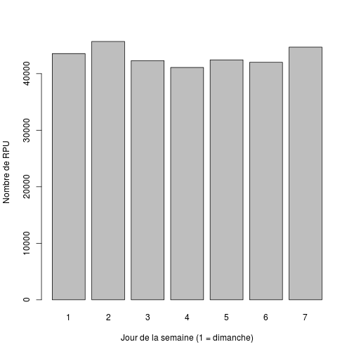
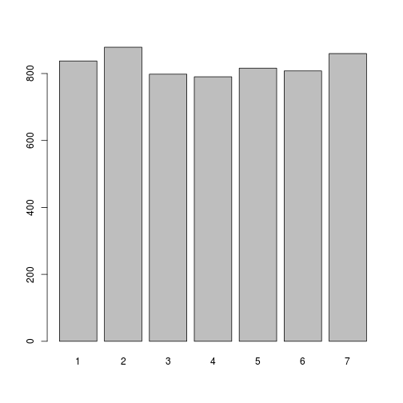
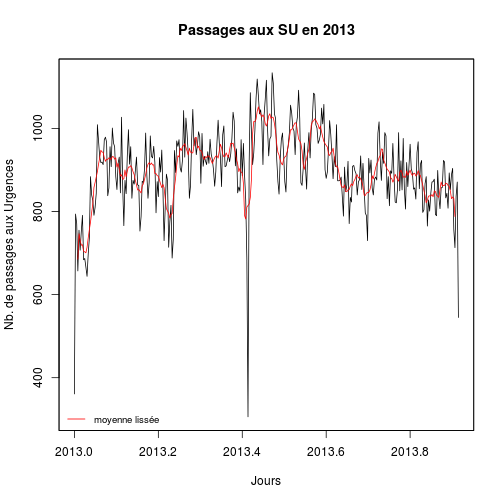
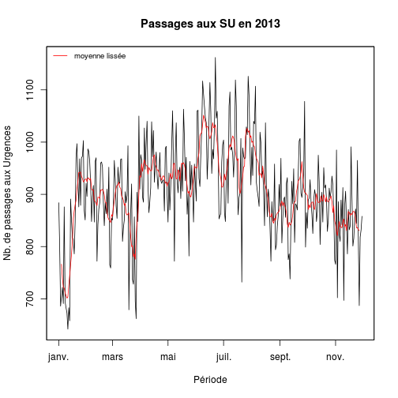
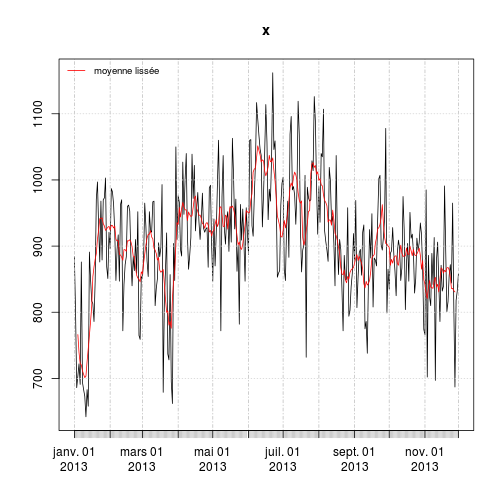
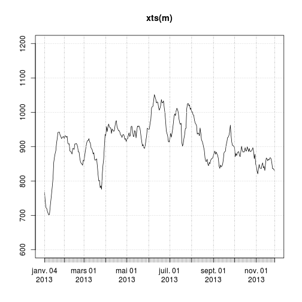
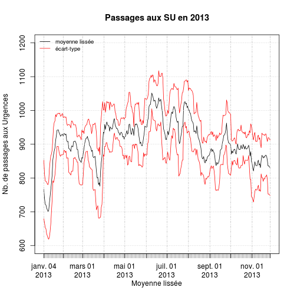

RPU2013 Analyse 2
========================================================

On forme une séquence de 365 dates allant du 1er janvier au 31 décembre. Days(1) est égal au nombre de secondes dans 1 journée:

```r
library("lubridate")
library("zoo")
```

```
## 
## Attaching package: 'zoo'
## 
## Les objets suivants sont masqués from 'package:base':
## 
##     as.Date, as.Date.numeric
```

```r
library("xts")

b1 <- as.Date("2013-01-01")
b2 <- as.Date("2013-12-31")
b <- seq(b1, b2, 1)
```

Le tout est transformé en type de jour (dimanche = 1). Summary donne le nombre de type de jours en 2013

```r
b3 <- wday(b)
b4 <- summary(as.factor(b3))
b4
```

```
##  1  2  3  4  5  6  7 
## 52 52 53 52 52 52 52
```


```r
load("../rpu2013d0111.Rda")
# d1<-d0109 rm(d0109)

# nombre de RPU par type de jour de la semaine:
e <- ymd_hms(d1$ENTREE)
a <- summary(as.factor(wday(e)))
a
```

```
##     1     2     3     4     5     6     7 
## 43549 45693 42301 41089 42434 42004 44697
```

```r
# nb de RPU par type de jour divisé par le nombre de fois où ce jour
# apparait dans l'année:
round(a/b4, 1)
```

```
##     1     2     3     4     5     6     7 
## 837.5 878.7 798.1 790.2 816.0 807.8 859.6
```

```r

barplot(a, xlab = "Jour de la semaine (1 = dimanche)", ylab = "Nombre de RPU")
```

 

```r
barplot(round(a/b4, 1))
```

 


Utilisation de zoo - moyenne mobile (moving average)
====================================================
nécessite lubridate

on part de 

```r
e <- ymd_hms(d1$ENTREE)
```


on arrondit au jour entier:  

```r
f <- round_date(e, "day")
e[1]
```

```
## [1] "2013-01-01 00:04:00 UTC"
```

```r
f[1]
```

```
## [1] "2013-01-01 UTC"
```

```r
g <- summary(as.factor(f))
g
```

```
## 2013-06-22 2013-06-09 2013-06-17 2013-06-23 2013-07-15 2013-06-03 
##       1134       1119       1116       1109       1092       1086 
## 2013-07-28 2013-07-29 2013-06-10 2013-06-08 2013-06-16 2013-08-06 
##       1085       1082       1080       1073       1071       1058 
## 2013-07-08 2013-08-04 2013-04-14 2013-06-12 2013-04-06 2013-05-19 
##       1056       1049       1046       1045       1043       1039 
## 2013-07-09 2013-06-11 2013-06-24 2013-06-15 2013-07-14 2013-02-11 
##       1037       1035       1035       1032       1028       1027 
## 2013-04-08 2013-07-27 2013-06-25 2013-07-16 2013-05-06 2013-08-11 
##       1025       1025       1024       1024       1020       1019 
## 2013-05-20 2013-06-13 2013-09-23 2013-08-05 2013-01-21 2013-07-13 
##       1018       1017       1016       1011       1009       1009 
## 2013-07-30 2013-08-17 2013-05-11 2013-02-03 2013-07-10 2013-07-31 
##       1009       1009       1006       1001       1001       1001 
## 2013-06-18 2013-02-17 2013-06-07 2013-07-26 2013-07-11 2013-04-19 
##        999        997        996        996        994        992 
## 2013-06-04 2013-07-07 2013-07-24 2013-09-28 2013-10-10 2013-03-04 
##        990        990        990        990        990        989 
## 2013-07-01 2013-09-22 2013-04-09 2013-04-22 2013-08-03 2013-05-10 
##        989        989        988        988        986        985 
## 2013-08-12 2013-03-08 2013-09-29 2013-06-21 2013-04-20 2013-01-28 
##        985        982        982        981        980        979 
## 2013-04-16 2013-05-18 2013-10-14 2013-04-13 2013-06-20 2013-04-29 
##        977        976        976        975        975        974 
## 2013-01-27 2013-04-02 2013-05-26 2013-06-30 2013-08-02 2013-01-22 
##        973        973        973        973        972        970 
## 2013-03-31 2013-10-27 2013-01-29 2013-05-05 2013-05-07 2013-02-04 
##        970        968        967        966        966        965 
## 2013-07-20 2013-05-28 2013-08-01 2013-10-05 2013-10-20 2013-07-06 
##        965        964        964        964        962        961 
## 2013-04-18 2013-04-15 2013-03-11 2013-04-01 2013-02-01 2013-02-05 
##        960        958        957        957        956        956 
## 2013-02-19 2013-05-22 2013-07-23    (Other) 
##        956        951        950     202349
```


Cela donne:
e[1]
[1] "2013-01-01 00:04:00 UTC"

[1] "2013-01-01 UTC"

 g<-summary(as.factor(f))
 
 on crée une nouvelle variable **count** qui attribue à chaque enregistrement la valeur 1. Puis on utilise la fonction *aggregate* pour faire la somme des visites aux SU par jour:
 
 ```r
 d1$count <- 1
 g <- aggregate(d1$count, by = list(as.factor(f)), FUN = sum)
 ```

 
 On obtient une matrice de 121 lignes (1er janvier au 1er mai) et 2 colonnes, la date (*Group.1*) et le nombre de visites (*x*)
 
 On fabrique un objet *série temporelle*:
 
 ```r
 h <- ts(g, start = c(2013, 1), frequency = 365)
 summary(h)
 ```
 
 ```
 ##     Group.1            x       
 ##  Min.   :  1.0   Min.   : 306  
 ##  1st Qu.: 84.5   1st Qu.: 853  
 ##  Median :168.0   Median : 908  
 ##  Mean   :168.0   Mean   : 901  
 ##  3rd Qu.:251.5   3rd Qu.: 965  
 ##  Max.   :335.0   Max.   :1134
 ```
 
 ```r
 plot(h[, 2], ylab = "Nb. de passages aux Urgences", main = "Passages aux SU en 2013")
 ```
 
  

  
 On fabrique un objet *zoo*:
 
 ```r
 h2 <- zoo(h)
 summary(h2)
 ```
 
 ```
 ##      Index         Group.1            x       
 ##  Min.   :2013   Min.   :  1.0   Min.   : 306  
 ##  1st Qu.:2013   1st Qu.: 84.5   1st Qu.: 853  
 ##  Median :2014   Median :168.0   Median : 908  
 ##  Mean   :2014   Mean   :168.0   Mean   : 901  
 ##  3rd Qu.:2014   3rd Qu.:251.5   3rd Qu.: 965  
 ##  Max.   :2014   Max.   :335.0   Max.   :1134
 ```
 
 ```r
 plot(h2[, 2], ylab = "Nb. de passages aux Urgences", main = "Passages aux SU en 2013", 
     xlab = "Jours")
 legend("bottomleft", "moyenne lissée", col = "red", lty = 1, cex = 0.8, bty = "n")
 lines(rollmean(h2[, 2], 7), col = "red")
 ```
 
  

 
  meilleure solution
  ------------------
  on fabrique un objet **a** qui dait la somme par date des passages aux urgences:
  
  ```r
  a <- tapply(e, as.Date(d1$ENTREE), length)
  a[1:10]
  ```
  
  ```
  ## 2013-01-01 2013-01-02 2013-01-03 2013-01-04 2013-01-05 2013-01-06 
  ##        884        801        686        704        722        691 
  ## 2013-01-07 2013-01-08 2013-01-09 2013-01-10 
  ##        876        694        683        673
  ```

  
  vérification:
  a[1:10]
2013-01-01 2013-01-02 2013-01-03 2013-01-04 2013-01-05 2013-01-06 2013-01-07 2013-01-08 2013-01-09 2013-01-10 
       884        801        686        704        722        691        876        694        683        673 
       
On supprime l'enregistrement 121 correspondant au 1er mai et qui ne contient qu'un élément:
a[121]  2013-05-01 1 
a<-a[-121]


```r
a1 <- summary(a)
a1
```

```
##    Min. 1st Qu.  Median    Mean 3rd Qu.    Max. 
##     642     854     906     906     968    1160
```

```r

z <- zoo(a, unique(as.Date(d1$ENTREE)))
plot(z, ylab = "Nb. de passages aux Urgences", main = "Passages aux SU en 2013", 
    xlab = "Période")
legend("topleft", legend = "moyenne lissée", col = "red", lty = 1, cex = 0.8, 
    bty = "n")
lines(rollmean(z[, 2], 7), col = "red")
```

 

  
Variante avec *xts*
-------------------

```r
x <- as.xts(z)
plot(x)
legend("topleft", legend = "moyenne lissée", col = "red", lty = 1, cex = 0.8, 
    bty = "n")
lines(rollmean(xts(z), 7), col = "red")
```

 


utilisation de rollapply
------------------------
rollapply permet d'appliquer une fonction à une moyenne mobile. On calcule la moyenne mobile sur 7 jours ainsi que son écart-type (ze). Puis on dessine la courbe moyenne (m) ainsi que les 2 courbes correspongant à l'écart-type sup (zes) et inférieur (zei)

calcul de l'écart-type:

```r
r <- rollapply(z, 7, sd)
z <- zoo(a, unique(as.Date(d1$ENTREE)))
m <- rollapply(z, 7, mean)
plot(xts(m), ylim = c(600, 1200))
```

 

```r
ze <- rollapply(z, 7, sd)
zes <- m + ze
zei <- m - ze
plot(xts(m), ylim = c(600, 1200), ylab = "Nb. de passages aux Urgences", main = "Passages aux SU en 2013", 
    xlab = "Moyenne lissée")
lines(xts(zes), col = "red")
lines(xts(zei), col = "red")
legend("topleft", legend = c("moyenne lissée", "écart-type"), col = c("black", 
    "red"), lty = 1, cex = 0.8, bty = "n")
```

 

