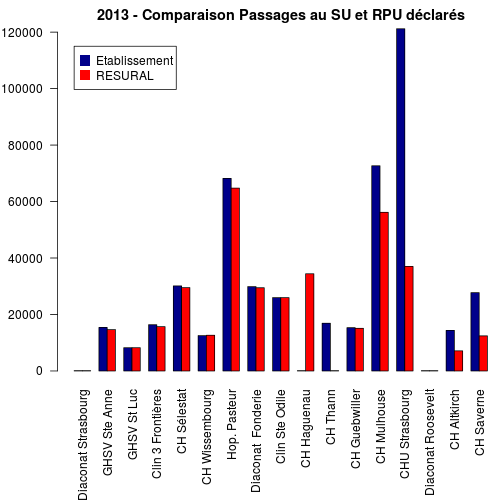

Comparaison RPU recensés versus RPU déclarés
=============================================

Ce travail compare le nombre de RPU transmis à Résural versus le nombre de RPU officiellement déclarés par les directions hospitalières. Les hôpitaux sont interrogés officiellment par Résural. Les résultats sont colligés dans le fichier __doc/attente chiffres RPU officiels.csv__.


```r
getwd()
```

```
## [1] "/home/jcb/Documents/Resural/Stat Resural/RPU_2013/doc/Chiffres_officiels"
```

```r
file <- "attente chiffres RPU officiels.csv"
x <- read.table(file, header = TRUE, sep = ",")
names(x)
```

```
## [1] "établissement"      "ville"              "nom.du.directeur"  
## [4] "chiffres.officiels" "chiffre.RESURAL"
```

```r

a <- rbind(x$chiffres.officiels, x$chiffre.RESURAL)
a[is.na(a)] <- 100
rownames(a) <- c("Etablissement", "RESURAL")
barplot(a, beside = TRUE, col = c("darkblue", "red"), legend = rownames(a), 
    names.arg = x$établissement, las = 2)
```

 


