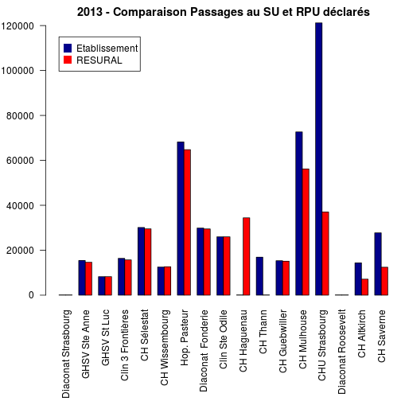
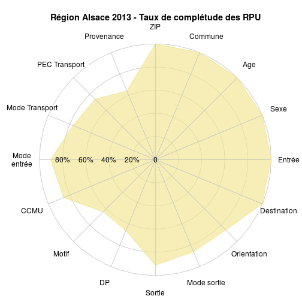
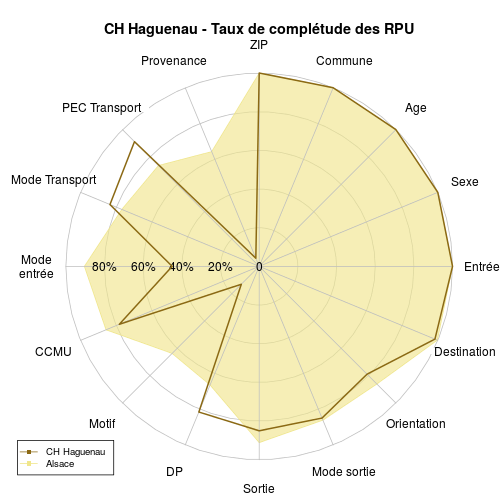
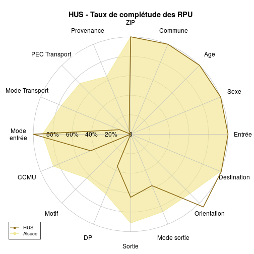

Réunion ARS Qualité des RPU
========================================================
author: Dr JC Bartier
date: 3/12/2013
transition: rotate
width: 1440
height: 900


Introduction
============
type: section

Introduction
============
incremental: true

- Démarche d'amélioration de la qualité et de la sécurité des soins

- Au delà de l'aspect réglementaire, c'est dire ce que lon fait (et faire ce que l'on dit)

- Complémentarité RPU et ROR (et DPC)

- Globalement plutôt satisfaisant

Généralités
========================================================
incremental: true

Un **RPU** est composé de **18 items** qui peuvent être
divisés en deux groupes.

- groupe principal ou __RPU administratif__ (**core**)

  éléments de base qui peuvent **toujours** être relevés de manière exhaustive dès l'admission du patient et transmis au fil de l'eau au concentrateur régional.

  C'est le minimum qui doit pouvoir être transmis au moins une fois par 24 heures.

- groupe complémentaire ou __RPU médical__ (**supplementary**)

RPU Administratif (Core)
========================================================

- Il doit être transmis tous les jours avant 4 heures du matin
- Codage __UTF-8__
- Le fichier doit comporter un nombre d'enregistrements égal au nombre de passages (inscriptions) au service des urgences(SU)
- Il comprend l'ensemble des données recueillies au moment de l'enregistrement administratif du patient:

RPU Administratif (Core)
========================================================

  1. n° de dossier
  2. Date et heure d'enregistrement
  3. Le n° FINESS (géographique) de l'établissement
  4. La commune de résidence
  5. Le code postal  
  6. Date de naissance
  7. Mode d'entrée
  8. Provenance
  9. Mode de transport
  10. Prise en charge durant le transport
  11. Sexe

RPU Médical (Supplementary)
===========================

- RPU administratif +
  1. Diagnostic principal (DP)
  2. Diagnostics associés
  3. Motif de recours
  4. Gravité
  5. Actes réalisés
  6. Date et heure de sortie
  7. Mode de sortie
  8. Destination
  9. Orientation
- Cette partie du dossier est transmise au plus tard dans les 6 jours.

-----------------------------------------------------------------------------------------

Résultats
=========
type: section

% les figures doivent être dans le dossier figure


Exhaustivité quantitative
=========================



***

- Comparaison RPU réalisés / RPU déclarés au serveur régional.
- Haguenau: pas de chiffres officiels
- HUS: chiffres issus du serveur régional

Exhaustivité qualitative
========================


***

- Taux de Complétude régionale

-----------------------------------------------------------------------------------------

Les items du RPU dans le détail
===============================
type: section

*le diable est dans les détails*

 La réussite d'une production repose sur l'attention prêtée aux détails.
 David O. Selznick (Autant en emporte le vent)
 
Suivi des RPU
=============
incremental: true

- alertes
  - non transmission des fichiers
  - non réceptions des fichiers
  
- maintenance
  - tests unitaires
  - signaler toute intervention sur le processus de saisie ou de transmission (mises à jour)

No de dossier
=============
- attribué par l'expéditeur
- doit être unique
- permet de lier le RPU 
  - aux diagnostics associés et 
  - aux gestes

FINESS
======
- FINESS __géographique__
- critère de rejet (FEDORU)
- Exhaustivité de 100% pour tous les sites

COMMUNE
=======
- nom de la commune de résidence du patient
- lettre majuscules sans accent
- les noms composés sont séparés par un tiret (WIR-AU-VAL)
- ex: Strasbourg: 5 orthographes différentes 
- Il est recommandé d'utiliser la **nomenclature des villes de l'INSEE**. (http://www.insee.fr/fr/methodes/nomenclatures/cog/)
- Pour le **schéma ATIH** le nom de la commune est remplacé par son code INSEE.
- Item manquant:

- Exhaustivité de 100% pour tous les sites0 0.01 0.00 0.00 0.00 0.00
- __Exhaustivité qualitative__ à améliorer

Code postal
========================================================

- Code à 5 chiffre valable uniquement pour les personnes résidentes sur le territoire français. 
- La norme RPU définit un code de résidence pour les non résidents. Ce code (**99 999**)n'est en général pas respecté et nécessite un détrompage reposant sur le pays de résidence (pas demandé dans le RPU). 
- Pour des régions frontalières comme l'Alsace il pourrait être intéressant de distinguer les résidents Suisses et Allemands des autres non résidents.
    - Allemagne: **99109**
    - Suisse: **99140**
- Pour la partie des RPU à transmettre à l'**ATIH** ce code doit être remplacé par un **code de résidence** calqué sur le modèle du **PMSI**.

```
- Exhaustivité quantitative 100%
- Exhaustivité qualitative ?
```

Date-Heure
==========

- format ISO [AAAA-MM-HH hh:mn:ss]
- heure d'entrée et de sortie sont obligatoire sinon rejet
- heure de sortie ne peut pas être inférieure à l'heure d'entrée

Règles de rejet des durées de passage (non consensuelles)
- nulle ou négatives
- inférieures à 10 mn
- supérieures à 72 heures

Date-heure d'entrée
===================
- Exhaustivité de 100% pour tous les sites

Date-heure de sortie
====================
<!--
  round(mean(is.na(d1$SORTIE))*100,2)
[1] 8.82
sort(tapply(d1$SORTIE, d1$FINESS, meanna))
barplot(sort(x), ylab="% de non réponse", main="Item Date-heure de Sortie")
-->
- indispensable pour calculer la __durée de passage__
- heure de sortie correspond à la sortie physique du patient
- exhaustivité moyenne: <b>91.18 %</b>

<!-- html table generated in R 3.1.0 by xtable 1.7-1 package -->
<!-- Sat May 10 14:07:14 2014 -->
<TABLE border=1>
<TR>  <TH> 3Fr </TH> <TH> Alk </TH> <TH> Dia </TH> <TH> Geb </TH> <TH> Odi </TH> <TH> Wis </TH> <TH> Col </TH> <TH> Sel </TH> <TH> Sav </TH> <TH> Hag </TH> <TH> Mul </TH> <TH> Hus </TH>  </TR>
  <TR>  <TD align="right"> 100.00 </TD> <TD align="right"> 100.00 </TD> <TD align="right"> 100.00 </TD> <TD align="right"> 100.00 </TD> <TD align="right"> 100.00 </TD> <TD align="right"> 100.00 </TD> <TD align="right"> 99.31 </TD> <TD align="right"> 97.04 </TD> <TD align="right"> 90.50 </TD> <TD align="right"> 85.06 </TD> <TD align="right"> 82.86 </TD> <TD align="right"><font color="red"> 64.71 </TD> </TR>
   </TABLE>
   
L'**hospitalisation en UHCD** est une sortie du point de vue du RPU mais une simple translation pour le service (porosité accueil/UHCD).

Sexe
========================================================

- Le RPU attend **M**asculin ou **F**éminin ou __I__ndéterminé (pas homme / femme)
- Exhaustivité de 100% pour tous les sites

Date de naissance
========================================================

- Pour le **schéma ATIH** la date de naissance est remplacée par l'**âge** calendaire à la date d'entrée du patient.
- Exhaustivité de 100%

<!-- html table generated in R 3.1.0 by xtable 1.7-1 package -->
<!-- Sat May 10 13:15:11 2014 -->
<TABLE border=1>
<TR><TH> 3Fr </TH> <TH> Alk </TH> <TH> Col </TH> <TH> Dia </TH> <TH> Geb </TH> <TH> Hag </TH> <TH> Hus </TH> <TH> Mul </TH> <TH> Odi </TH> <TH> Sel </TH> <TH> Wis </TH> <TH> Sav </TH>  </TR>
  <TR>  </TD> <TD align="right"> 100.00 </TD> <TD align="right"> 100.00 </TD> <TD align="right"> 100.00 </TD> <TD align="right"> 100.00 </TD> <TD align="right"> 100.00 </TD> <TD align="right"> 100.00 </TD> <TD align="right"> 100.00 </TD> <TD align="right"> 100.00 </TD> <TD align="right"> 100.00 </TD> <TD align="right"> 100.00 </TD> <TD align="right"> 100.00 </TD> <TD align="right"> 100.00 </TD> </TR>
</TABLE>

<!--
t <- data.frame(t(100-sort(tapply(d1$NAISSANCE, d1$FINESS, meanna))), check.names = FALSE, row.names="")
print.xtable(xtable(t), type = "html")
-->

MODE D’ENTREE
=============
Le RPU connait 3 modes d'entrée:
- __Mutation__: le malade vient d'une autre unité médicale de la même entité juridique
- __Transfert__: le malade vient d'une autre entité juridique 
- __Domicile__: le malade vient de son domicile ou de son substitut, comme une structure d'hébergement __médico-sociale__. Ce mode inclut les entrées à partir de la __voie publique__. Le code 8 du mode d'entrée est à utiliser en cas de naissance d'un nouveau-né quelque soit la situation d’hospitalisation ou de non hospitalisation de la mère

- exhaustivité globale: __90.43 %__


<TABLE border=1>
<TR> <TH> Col </TH> <TH> Hus </TH> <TH> Sel </TH> <TH> Sav </TH> <TH> Odi </TH> <TH> Wis </TH> <TH> Dia </TH> <TH> Mul </TH> <TH> Alk </TH> <TH> 3Fr </TH> <TH> Geb </TH> <TH> Hag </TH>  </TR>

<TR> <TD align="right"> 100.00 </TD> <TD align="right"> 100.00 </TD> <TD align="right"> 100.00 </TD> <TD align="right"> 100.00 </TD> <TD align="right"> 99.93 </TD> <TD align="right"> 99.53 </TD> <TD align="right"> 96.19 </TD> <TD align="right"> 95.92 </TD> <TD align="right"> 85.19 </TD> <TD align="right"> 83.71 </TD> <TD align="right"><font color="red"> 58.09 </TD> <TD align="right"><font color="red"> 45.01 </TD> </TR>
   </TABLE>

<!-- 
100-sort(tapply(d1$MODE_ENTREE, d1$FINESS, meanna))
print.xtable(xtable(data.frame(t(t))), type="html")
-->


Provenance
===========
Le RPU connait deux origine du patient 
- par *mutation ou transfert*. Le patient est adressé par un service du même établissement (__mutation__) ou d'un autre établissement (__transfert__). 
On distingue 4 cas:
  - MCO: un service hospitalier
  - SSR: soins de suite et de réadaptation
  - SLD: soins de longue durée
  - PSY: psychiatrie

===
- en provenance directe du *domicile*
  - soit parce que c'est le choix du patient. C'est le cas de la plupart des passages aux urgences et ce passage n'est pas du à des raisons organisationelles (**PEA**).
  - soit parcequ'on lui a demandé de passer par les urgences avant d'être admis dans un autre service. Le passage aux urgences se fait pour des raisons organisationnelles (**PEO**).
- Les codes __Provenance 1 à 4__ sont incompatibles avec __Mode d’entrée 8__. De
même les codes __Provenance 7 et 8__ sont incompatibles avec __Mode d’entrée 6__
et 7.
- exhaustivité __64 %__

<!-- html table generated in R 3.1.0 by xtable 1.7-1 package -->
<!-- Sat May 10 11:57:37 2014 -->
<TABLE border=1>
<TR>  <TH> Col </TH> <TH> Sel </TH> <TH> Odi </TH> <TH> Wis </TH> <TH> Dia </TH> <TH> Mul </TH> <TH> Geb </TH> <TH> Sav </TH> <TH> Hag </TH> <TH> Hus </TH> <TH> 3Fr </TH> <TH> Alk </TH>  </TR>
  <TR> <TD align="right"> 100.00 </TD> <TD align="right"> 100.00 </TD> <TD align="right"> 99.93 </TD> <TD align="right"> 98.55 </TD> <TD align="right"> 96.17 </TD> <TD align="right"> 95.92 </TD> <TD align="right"><font color="red"> 15.20 </TD> <TD align="right"><font color="red"> 5.89 </TD> <TD align="right"><font color="red"> 4.56 </TD> <TD align="right"><font color="red"> 4.00 </TD> <TD align="right"><font color="red"> 0.22 </TD> <TD align="right"><font color="red"> 0.06 </TD> </TR>
</TABLE>

<!-- 
Pour afficher en HLML une table d'une ligne
t <- data.frame(t(100-sort(tapply(d1$PROVENANCE, d1$FINESS, meanna))), check.names = FALSE, row.names="")
print.xtable(xtable(t), type = "html")
-->

Provenance et Orientation
=========================

<!-- html table generated in R 3.1.0 by xtable 1.7-1 package -->
<!-- Fri May  9 14:36:50 2014 -->
<TABLE border=1>
<TR> <TH>  </TH> <TH> Mutation </TH> <TH> Transfert </TH> <TH> Domicile </TH>  </TR>
  <TR> <TD align="right"> NA </TD> <TD align="right">   0 </TD> <TD align="right">   0 </TD> <TD align="right">   0 </TD> </TR>
  <TR> <TD align="right"> MCO </TD> <TD align="right"> 3148 </TD> <TD align="right"> 3199 </TD> <TD align="right"><font color="red"><b> 1497</b></font> </TD> </TR>
  <TR> <TD align="right"> SSR </TD> <TD align="right">  20 </TD> <TD align="right">  30 </TD> <TD align="right">   0 </TD> </TR>
  <TR> <TD align="right"> SLD </TD> <TD align="right">   8 </TD> <TD align="right">  14 </TD> <TD align="right">   0 </TD> </TR>
  <TR> <TD align="right"> PSY </TD> <TD align="right">  14 </TD> <TD align="right">  31 </TD> <TD align="right">   0 </TD> </TR>
  <TR> <TD align="right"> PEA </TD> <TD align="right"> 323 </TD> <TD align="right">  78 </TD> <TD align="right"> 183 574 </TD> </TR>
  <TR> <TD align="right"> PEO </TD> <TD align="right">   0 </TD> <TD align="right">   0 </TD> <TD align="right"> 29 114 </TD> </TR>
   </TABLE>

***

- pas de détrompage. On ne peut venir simultanément de son domicile et d'un service.

Provenance en pratique
=======================
<!--
  x <- xtable(table(d1$FINESS, factor(d1$PROVENANCE)), align=c("l","r","r","r","r","r","r"))
  print.xtable(x, type="html")
-->

<TABLE border=1>
<TR> <TH>  </TH> <TH> MCO </TH> <TH> SSR </TH> <TH> SLD </TH> <TH> PSY </TH> <TH><font color="red"> PEA </TH> <TH><font color="red"> PEO </TH>  </TR>
  <TR> <TD align="right"> 3Fr </TD> <TD align="right">  23 </TD> <TD align="right">   0 </TD> <TD align="right">   0 </TD> <TD align="right">   0 </TD> <TD align="right">  12 </TD> <TD align="right">   0 </TD> </TR>
  <TR> <TD align="right"> Alk </TD> <TD align="right">   2 </TD> <TD align="right">   2 </TD> <TD align="right">   0 </TD> <TD align="right">   2 </TD> <TD align="right">   1 </TD> <TD align="right">   0 </TD> </TR>
  <TR> <TD align="right"> Col </TD> <TD align="right"> 2394 </TD> <TD align="right">   0 </TD> <TD align="right">   0 </TD> <TD align="right">   0 </TD> <TD align="right"> 61308 </TD> <TD align="right"> 1056 </TD> </TR>
  <TR> <TD align="right"> Dia </TD> <TD align="right"> 852 </TD> <TD align="right">  14 </TD> <TD align="right">   7 </TD> <TD align="right">   0 </TD> <TD align="right">  31 </TD> <TD align="right"> 27436 </TD> </TR>
  <TR> <TD align="right"> Geb </TD> <TD align="right">  20 </TD> <TD align="right">   7 </TD> <TD align="right">   3 </TD> <TD align="right">   0 </TD> <TD align="right"> 2256 </TD> <TD align="right">  10 </TD> </TR>
  <TR> <TD align="right"> Hag </TD> <TD align="right"> 1522 </TD> <TD align="right">  13 </TD> <TD align="right">   4 </TD> <TD align="right">  29 </TD> <TD align="right">   0 </TD> <TD align="right">   0 </TD> </TR>
  <TR> <TD align="right"> Hus </TD> <TD align="right"> 1446 </TD> <TD align="right">  13 </TD> <TD align="right">   8 </TD> <TD align="right">  14 </TD> <TD align="right">   0 </TD> <TD align="right">   0 </TD> </TR>
  <TR> <TD align="right"> Mul </TD> <TD align="right"> 905 </TD> <TD align="right">   0 </TD> <TD align="right">   0 </TD> <TD align="right">   0 </TD> <TD align="right"> 52579 </TD> <TD align="right"> 418 </TD> </TR>
  <TR> <TD align="right"> Odi </TD> <TD align="right">   1 </TD> <TD align="right">   0 </TD> <TD align="right">   0 </TD> <TD align="right">   0 </TD> <TD align="right"> 25739 </TD> <TD align="right"> 204 </TD> </TR>
  <TR> <TD align="right"> Sel </TD> <TD align="right"> 656 </TD> <TD align="right">   0 </TD> <TD align="right">   0 </TD> <TD align="right">   0 </TD> <TD align="right"> 28878 </TD> <TD align="right">   0 </TD> </TR>
  <TR> <TD align="right"> Wis </TD> <TD align="right">   9 </TD> <TD align="right">   1 </TD> <TD align="right">   0 </TD> <TD align="right">   0 </TD> <TD align="right"> 12453 </TD> <TD align="right">   0 </TD> </TR>
  <TR> <TD align="right"> Sav </TD> <TD align="right">  14 </TD> <TD align="right">   0 </TD> <TD align="right">   0 </TD> <TD align="right">   0 </TD> <TD align="right"> 718 </TD> <TD align="right">   0 </TD> </TR>
   </TABLE>

***

Confusion entre
- raisons organisationnelles (PEO)
- raisons non organisationnelles (PEA)


CCMU (Gravité)
========================================================

la CCMU 
doit être déterminée **dès l'admission** et non  la sortie du patient, ou être modifiée parce que l'état du patient évolue pendant le séjour aux urgences (étude INVS).

- CCMU 1: consultation simple sans acte biologique ou radiologique (ex. angine)
- CCMU 2: nécessité d'un acte bio ou radio et/ou d'un petit geste (suture), pas d'hospitalisation
- CCMU 3: hospitalisation nécessaire dans un service conventionnel
- CCMU 4: SI, SC
- CCMU 5: REA

- Exhaustivité: __85,75 %__

<!-- html table generated in R 3.1.0 by xtable 1.7-1 package -->
<!-- Sat May 10 12:34:25 2014 -->
<TABLE border=1>
<TR> <TH>  </TH> <TH> Wis </TH> <TH> Geb </TH> <TH> Odi </TH> <TH> Col </TH> <TH> Sel </TH> <TH> Alk </TH> <TH> 3Fr </TH> <TH> Dia </TH> <TH> Hag </TH> <TH> Mul </TH> <TH> Sav </TH> <TH> Hus </TH>  </TR>
  <TR> <TD align="right">  </TD> <TD align="right"> 99.89 </TD> <TD align="right"> 99.87 </TD> <TD align="right"> 99.60 </TD> <TD align="right"> 99.48 </TD> <TD align="right"> 97.68 </TD> <TD align="right"> 97.26 </TD> <TD align="right"> 96.46 </TD> <TD align="right"> 95.85 </TD> <TD align="right"><font color="red"> 78.32 </TD> <TD align="right"><font color="red"> 77.82 </TD> <TD align="right"><font color="red"> 57.78 </TD> <TD align="right"><font color="red"> 44.35 </TD> </TR>
   </TABLE>

CCMU (2)
=======
left: 60%

<!-- html table generated in R 3.1.0 by xtable 1.7-1 package -->
<!-- Mon Apr 28 18:50:16 2014 -->
<TABLE border=1>
<CAPTION ALIGN="bottom"> CCMU et devenir </CAPTION>
<TR> <TH>  </TH> <TH> 1 </TH> <TH> 2 </TH> <TH> 3 </TH> <TH> 4 </TH> <TH> 5 </TH> <TH> D </TH> <TH> P </TH>  </TR>
  <TR> <TD align="left"> CHIR </TD> <TD align="left"> 181 </TD> <TD align="left"> 3331 </TD> <TD align="left"> 3662 </TD> <TD align="left"> 363 </TD> <TD align="left">  11 </TD> <TD align="left">   1 </TD> <TD align="left"> 140 </TD> </TR>
  <TR> <TD align="left"> FUGUE </TD> <TD align="left">  67 </TD> <TD align="left"> 141 </TD> <TD align="left">  22 </TD> <TD align="left">   0 </TD> <TD align="left">   0 </TD> <TD align="left">   0 </TD> <TD align="left">   9 </TD> </TR>
  <TR> <TD align="left"> HDT </TD> <TD align="left">   4 </TD> <TD align="left">  30 </TD> <TD align="left">  24 </TD> <TD align="left">   1 </TD> <TD align="left">   0 </TD> <TD align="left">   0 </TD> <TD align="left">  48 </TD> </TR>
  <TR> <TD align="left"> HO </TD> <TD align="left">   0 </TD> <TD align="left">  16 </TD> <TD align="left">   5 </TD> <TD align="left">   0 </TD> <TD align="left">   0 </TD> <TD align="left">   0 </TD> <TD align="left">  10 </TD> </TR>
  <TR> <TD align="left"> MED </TD> <TD align="left"> 827 </TD> <TD align="left"> 5966 </TD> <TD align="left"> 9670 </TD> <TD align="left"> 704 </TD> <TD align="left">  39 </TD> <TD align="left">   1 </TD> <TD align="left"> 274 </TD> </TR>
  <TR> <TD align="left"> OBST </TD> <TD align="left">   3 </TD> <TD align="left">  53 </TD> <TD align="left">  35 </TD> <TD align="left">   3 </TD> <TD align="left">   0 </TD> <TD align="left">   0 </TD> <TD align="left">   0 </TD> </TR>
  <TR> <TD align="left"> PSA </TD> <TD align="left"> 1109 </TD> <TD align="left"> 558 </TD> <TD align="left">  32 </TD> <TD align="left">   0 </TD> <TD align="left">   0 </TD> <TD align="left">   0 </TD> <TD align="left">   8 </TD> </TR>
  <TR> <TD align="left"> REA </TD> <TD align="left">   1 </TD> <TD align="left">  99 </TD> <TD align="left"> 246 </TD> <TD align="left"> 266 </TD> <TD align="left"> 408 </TD> <TD align="left">   0 </TD> <TD align="left">   3 </TD> </TR>
  <TR> <TD align="left"> REO </TD> <TD align="left"> 955 </TD> <TD align="left"> 349 </TD> <TD align="left">  52 </TD> <TD align="left">   0 </TD> <TD align="left">   0 </TD> <TD align="left">   0 </TD> <TD align="left">   1 </TD> </TR>
  <TR> <TD align="left"> SC </TD> <TD align="left">  80 </TD> <TD align="left"> 419 </TD> <TD align="left"> 749 </TD> <TD align="left"> 138 </TD> <TD align="left">  24 </TD> <TD align="left">   0 </TD> <TD align="left">   9 </TD> </TR>
  <TR> <TD align="left"> SCAM </TD> <TD align="left">  77 </TD> <TD align="left"> 324 </TD> <TD align="left">  81 </TD> <TD align="left">   3 </TD> <TD align="left">   0 </TD> <TD align="left">   0 </TD> <TD align="left">   2 </TD> </TR>
  <TR> <TD align="left"> SI </TD> <TD align="left">  19 </TD> <TD align="left"> 319 </TD> <TD align="left"> 757 </TD> <TD align="left"> 255 </TD> <TD align="left">  29 </TD> <TD align="left">   0 </TD> <TD align="left">   2 </TD> </TR>
  <TR> <TD align="left"> UHCD </TD> <TD align="left"> 1258 </TD> <TD align="left"> 12752 </TD> <TD align="left"> 9190 </TD> <TD align="left"> 1157 </TD> <TD align="left"> 191 </TD> <TD align="left">   7 </TD> <TD align="left">  48 </TD> </TR>
</TABLE>

***

Absence de détrompage:
- DCD (__P__) et UHTCD, MED, CHIR
- CCMU 5 et MED, CHIR, UHCD
- CCMU 1, 2 et REA, SI, SC


Motif de recours
========================================================
<!--
sort(100-tapply(d1$MOTIF, d1$FINESS, meanna))
round(mean(!is.na(d1$MOTIF))*100,2)
[1] 36.29
-->

- La règle est d'utiliser le **thésaurus SFMU** version 2013, basé sur la classification internationale des maladies (CIM 10), seul reconnu par l'InVS et imposé parle ministère de la santé. 

- **La liste compte encore une quinzaine d'items inexacts ou imprécis.**
- exhaustivité quantitative __63.71 %__

<!-- html table generated in R 3.1.0 by xtable 1.7-1 package -->
<!-- Sat May 10 12:56:25 2014 -->
<TABLE border=1>
<TR> <TH>  </TH> <TH> Col </TH> <TH> Wis </TH> <TH> Sel </TH> <TH> Dia </TH> <TH> Odi </TH> <TH> Mul </TH> <TH> Sav </TH> <TH> Alk </TH> <TH> Hag </TH> <TH> 3Fr </TH> <TH> Geb </TH> <TH> Hus </TH>  </TR>
<TR> <TD align="right">  </TD> <TD align="right"> 100.00 </TD> <TD align="right"> 99.69 </TD> <TD align="right"> 98.20 </TD> <TD align="right"> 95.50 </TD> <TD align="right"> 94.92 </TD> <TD align="right"> 83.00 </TD> <TD align="right"><font color="red"> 42.02 </TD> <TD align="right"><font color="red"> 23.50 </TD> <TD align="right"><font color="red"> 13.10 </TD> <TD align="right"><font color="red"> 7.22 </TD> <TD align="right"><font color="red"> 0.03 </TD> <TD align="right"><font color="red"> 0.00 </TD> </TR>
</TABLE>

- exhaustivité qualitative: __?__
   
<!-- 
Pour afficher en HLML une table d'une ligne
t <- data.frame(t(100-sort(tapply(d1$MOTIF, d1$FINESS, meanna))), check.names = FALSE, row.names="")
print.xtable(xtable(t), type = "html")
-->

Motif(exemple 1)
================
<!--

-->
__3Fr__ "H669" "K591" "Z027" "B309" "J00"  "S000"

__Alk__ "R600"  "R104"  "R104"  "T140"  "R53+1" "R074"     

__Col__ "une crise d'asthme", "un malaise avec PC", "Autre""un traumatisme oculaire: explosion d'un", "plaie pied gauche par p\xe9tard ; une plaie" "une br\xfblre"                              

__Dia__ "R060" "L039" "R060" "J029" NA     "Z480"

__Geb__ NA NA NA NA NA NA

__Hag__ NA, "Douleurs abdominales, autres et non pr\xe9cis\xe9es", "Plaie ouverte d'autres parties de la jambe", "\xc9pilepsie, sans pr\xe9cision", NA, NA     

Motif(exemple 2)
================

__Hus__ NA NA NA NA NA NA

__Mul__ "S37.0" "R05"   "R10.4" "R41.0" "R10.4" "J45.9"

__Odi__ "T009" "Z609" "R21"  "L988" "T119" "R103"

__Sel__ "GASTRO04"   "DIVERS23"   "TRAUMATO10" "TRAUMATO02" "OPHTALMO04" "TRAUMATO09"

__Wis__ "T009" "T119" "T009" "S008" "R11"  "R11" 

__Sav__ "Z480" "F329" "F419" "R456" "I472" "R074"

Diagnostic principal
========================================================
<!--
sort(100-tapply(d1$DP, d1$FINESS, meanna))
round(mean(!is.na(d1$DP))*100,2)
[1] 66.42
-->

- Il se code avec la **CIM10** telle qu'elle est définie par l'OMS dans sa version officielle. 
- Ce code CIM10 habituellement utilisé dans les hôpitaux est celui du **PMSI**. Ce code comporte une racine commune avec le code CIM10 officiel. 
- exhaustivité moyenne __66.42 %__

<!-- html table generated in R 3.1.0 by xtable 1.7-1 package -->
<!-- Sat May 10 12:55:00 2014 -->
<TABLE border=1>
<TR> <TH>  </TH> <TH> Geb </TH> <TH> Sel </TH> <TH> Wis </TH> <TH> Col </TH> <TH> 3Fr </TH> <TH> Hag </TH> <TH> Mul </TH> <TH> Alk </TH> <TH> Hus </TH> <TH> Odi </TH> <TH> Sav </TH> <TH> Dia </TH>  </TR>
  <TR> <TD align="right">  </TD> <TD align="right"> 99.62 </TD> <TD align="right"> 96.29 </TD> <TD align="right"> 90.17 </TD> <TD align="right"> 88.53 </TD> <TD align="right"> 87.81 </TD> <TD align="right"> 81.55 </TD> <TD align="right"> 80.91 </TD> <TD align="right"> 80.90 </TD> <TD align="right"><font color="red"> 35.61 </TD> <TD align="right"><font color="red"> 27.05 </TD> <TD align="right"><font color="red"> 0.01 </TD> <TD align="right"><font color="red"> 0.00 </TD> </TR>
</TABLE>
   
<!--
t <- data.frame(t(100-sort(tapply(d1$DP, d1$FINESS, meanna))), check.names = FALSE, row.names="")
print.xtable(xtable(t), type = "html")
-->

Les données
===========
type: section

Elles doivent présenter 4 caractéristiques:
- conformité (règles d'acceptation et de rejet)
  - structurelle (schéma XML)
  - contenu conforme (ex.code CIM10 conforme)
- exhaustivité (données et passages)
- qualité (défaut technique  ou problème de codage)
- cohérence (bornes et définitions)

Quel doit être le devenir des RPU non conformes ?
=================================================
- rejet total
- acceptation partielle
- auto complétion (avec heure médiane)
- stockage et information du producteur
- auto-correction (CIM10)
- analyse dur RPU incomplets

Bas - Rhin
===========
type:section

Complétude régionale (CH Wissembourg)
====================


Complétude régionale (CH Haguenau)
====================


Complétude régionale (CH Saverne)
====================


Complétude régionale (HUS)
====================


Complétude régionale (Clinique Ste Odile)
====================


Complétude régionale (Clinique Ste Anne)
====================

Complétude régionale (CH Sélestat)
====================


Haut-Rhin
=========
type:section

Complétude régionale (CH Colmar)
====================


Complétude régionale (CH Guebwiller)
====================


Complétude régionale (CH Mulhouse)
====================


Complétude régionale (Diaconat-Fonderie)
====================


Complétude régionale (CH Alkirch)
====================


Complétude régionale (CH Thann)
====================
