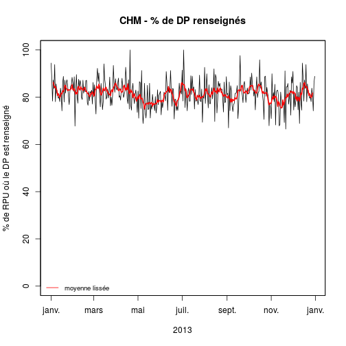

Retour sur les tensions
========================

RPU et DSI
==========

- Strasbourg
- Colmar

CR AG FEDORU du 20 mai 2014
========================================================

Informations générales
----------------------

- COSUI RPU: groupe de travail du ministère de la santé (DGOS, DEDORU, ATIH, InVS): pa se modification du schéma RPU avant longtemps.

- ATIH loue les seveurs de l'ORUMIP pour les mettre à disposition des régions n'ayant pas de collecteur de RPU.

DGOS (Nathalie Cregut)
----------------------
1. Axe 1:

  - COSUI RPU chargé de la généralisation des RPU (DGOS, DEDORU, ATIH, InVS, ARS, DGS)
  - ATIH loue les serveurs de Midi-Pyrénées (SIRIUS)
  - 2.5 M€ fin 2013 pour l'informatisation des SU non informatisés

2. Axe 2:

  - commment utiliser les données ?
  - qualité des données
  - évolution ? (RPU Samu-Smur)
  - recommandations pour créer un ORU

3. Axe 3: quels indicateurs ?

  - indicateurs opérationnels (durée de passage), quel socle d'indicateurs simples pour les ARS ?
  - deux types d'indicateurs:
    - statiques: priorié de la DGOS
    - dynamiques (orientés HET)
  
ATIH (Max Bensadon)
-------------------

- Programme SYRIUS (récupération des concentrateur régionaux)
- vérification des RPU
  - validité du schéma XML
  - cohérence du nombre de RPU transmis
  - en test depuis le 18 avril 2014
- pour le contrôle/accès aux données ont défini 4 rôles dont 2 sont régionaux:
  - gestionnaire de fichier (référent technique)
    - demander un identifiant PLAGE auprès de l'administrateur régional (ARS)
  - un validateur régional
  - En pratique l'ATIH ne gère pas les pb techniques, c'est le rôle du référent technique régional.
- site: syrius@atih.sante.fr
- anonymisation renforcée:
  - suppression du nom de commune
  - date de naissance transformée en age
  - code postal transformé en code PMSI
- Validation des champs: unique ment MONOchamp (pas de validation croisée)
  - production de 16 tableaux:
  - 0 < age <120
  - ZIP existe, etc...
  - durée de passage censurées à 24 h
  - moyennes mobiles pour 3 classes d'age
- encours de discussion: qui a accès à ces tableau de bord

OSCOUR-InVS (Vanina Bousquet)
------------------------------

- les ORU peuvent avor accès aux données régionales et nationales (faire une demande)
- Chiffres pour l'Alsace:
  - 62% des RPU sont remontés par rapport aux données SAE (moyenne nationale 72%)
  - 64% de RPU avec codage diagnostic. Entre 2012-2013 la qualité du codage a diminué probablement pat introduction d'établissements ne codant pas.
  - Exhaustivité diagnostique de 40% (% couverture x % codage). Varie en france de 20% à 100% avec une moyenne à 56%
- 451 établissement transmettent des RPU
- 12 M de RPU et 13.000 DP différents
- L'Alsace se situe dans la moyenne avec une médiane de 56 DP/j

Qualité des données (groupe de travail 1)
-----------------------------------------

Envoi des RPU
-------------
- entre 0 et 4h du matin envoi à la plateforme régionale de la totalité des RPU de la veille (cloturés ou non), ainsi que les RPU des 6 jours précédents.
- tout fichier transmis annule et remplace le fichier précédent, c'est à dire que c'est la totalité de l'information qui est transmise (et pas seulement les mises à jour)

- cependant cette règle est difficile à respecter pour les établissements qui font une saisie différée des RPU (notemment pendant la période de fermeture des secrétariats administratifs).

- les autres recommandations sont énumérées dans la circulaire du 32 juillet 2013.

Critères de rejet RPU
---------------------
- n° FINESS manquant
- date et heure de création manquant
- codage XML non conforme

Devenir des RPU rejetés
-----------------------
- stockage dans une base de données avec le message d'erreur généré
- information de l'établissement émetteur
- tous les RPU (conforme ou pas) sont archivés
  
Cohérence des données
---------------------

#### Respect des Thésaurus
- DP: CIM10
- Motifd de passage: thésaurus SFMU
- Actes: CCAM
- gravité: CCMU

#### Analyse monochamps

- cohérence du champ par rapport au schéma XML: par exemple DP en CIM10, age compris entre 0 et 120 ans, code postal, etc...
- création d'un logiciel local de vérification de la cohérence monochamp.
- alerte de l'émetteur si non conformité.
- production d'un "radar" mensuel.

#### Analyses croisées

- travail en cours InVS FEDORU pour avoir des règles communes.
- pas de recommandations nationale
- contrôle local (périodicité ?)
  - mode entrée ét provenance
  - CCMU et orientation
  - Mode de sortie et orientation

#### Cohérence diagnostique

- sexe et pathologie
- age et pathologie

Définitions des bornes 
----------------------

Sont définis:
- Horaires: jour, semaine, mois, journée, nuit, nuit profonde, PDS semaine, Weekend....
- Tranches d'age
- durée moyenne de passage (0h à 72 heures)
- temps d'attente de prise en charge médicale (interne, sénior)
- Taux de recours aux urgences
- sorties non convenues: regroupe fugue, sortie contre avis médical et parti sans attendre.

A définir;:
- TOP
- Patients en attente de lit d'hospitalisation

et axes d'analyse
-----------------

Nombre total de passages avec répartition par
- région
- département
- type d'établissement (public, privé, PSPH)
- commune de domicile
- année, jour de la semaine, mois, heure, période PDS et non PDS
- sexe
- age
- mode entrée
- mde de transport
- durée de passage
- gravité
- diagnostic principal
- mode de sortie
- mode orientation
- actes CCAM
Taux de recours par région, département (territoire de santé)

SAMU et SMUR

Charte de Qualité de l'Observatoire
===================================

- Charte de qualité régionale précisant les rôles et engagements mutuels des membres de l'ORU
- modèle: charte ORULOR

