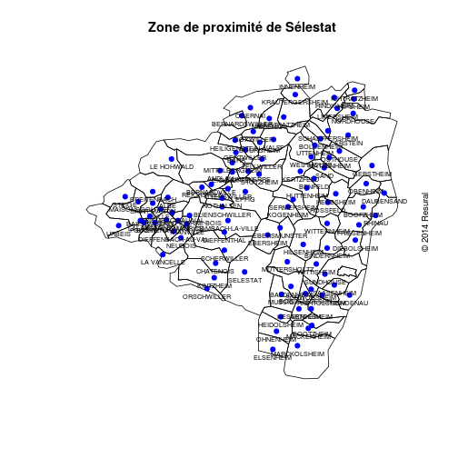

ZP Sélestat
========================================================

2014-03-11: demande Sélestat

Créer une carte du secteur de proximité de Sélestat.

souces nécessaires
------------------

librairies:

```r
library("maptools")
```

```
## Loading required package: foreign
## Loading required package: sp
## Loading required package: grid
## Loading required package: lattice
## Checking rgeos availability: TRUE
```

```r
getwd()
```

```
## [1] "/home/jcb/Documents/Resural/Stat Resural/RPU_2013/doc/cartographie/RPU2013_Carto_Pop/ZP6_Selestat"
```

```r
source("../../../../Routines/mes_fonctions.R")
```

fichiers source:
- Fichier **als** pour les shapes de base (carto_alsace.rda)
- **pop67**: fichier INSEE de 2010 (doc/Demographie)
- **pop68**: fichier INSEE de 2010 (doc/Demographie)
- **zpo**: fichier des zones de proximité (zp.csv)

```r
setwd("~/Documents/Resural/Stat Resural/RPU_2013")
zpo <- read.csv("doc/cartographie/data/zp.csv", header = TRUE, sep = ",")
load("doc/Demographie/pop67.rda")
load("doc/Demographie/pop68.rda")
load("~/Documents/Resural/Stat Resural/RPU_2013/doc/cartographie/carto_alsace.rda")
```


On forme un fichier commun avec
- 
- va: ville d'Alsace (doc/cartographie/RPU2013_Carto_Pop)
de façon a avoir dans une même base les zones de proximité (va) et les populations correspondantes:
- base1: merging de *va* et de *pop67*
- base2: merging de *va* et de *pop68*
base1 et base2 sont fusionné en un seul fichier *base*, puis supprimés.


```r

names(zpo)
```

```
## [1] "CODE.DEP"                         "CODE.COMMUNE"                    
## [3] "LIBELLE.DES.COMMUNES"             "LIBELLE.DES.TERRITOIRES.DE.SANTE"
## [5] "CODE.ZONES.DE.PROXIMITE"          "LIBELLE.DES.ZONES.DE.PROXIMITE"
```

```r
print("Nb de communes par territoire de santé")
```

```
## [1] "Nb de communes par territoire de santé"
```

```r
a <- zpo$LIBELLE.DES.TERRITOIRES.DE.SANTE
summary(a)
```

```
## TERRITOIRE DE SANTE 1 TERRITOIRE DE SANTE 2 TERRITOIRE DE SANTE 3 
##                   306                   144                   213 
## TERRITOIRE DE SANTE 4 
##                   241
```

```r
print("Nb de communes par territoire de proximité")
```

```
## [1] "Nb de communes par territoire de proximité"
```

```r
a <- zpo$LIBELLE.DES.ZONES.DE.PROXIMITE
summary(a)
```

```
##           ALTKIRCH             COLMAR         GUEBWILLER 
##                111                 94                 42 
##           HAGUENAU MOLSHEIM SCHIRMECK           MULHOUSE 
##                 90                 92                 40 
##   OBERNAI-SELESTAT        SAINT-LOUIS            SAVERNE 
##                101                 40                162 
##         STRASBOURG              THANN        WISSEMBOURG 
##                 28                 50                 54
```


```r
setwd("~/Documents/Resural/Stat Resural/RPU_2013")

base1 <- merge(zpo, pop67, by.x = "CODE.COMMUNE", by.y = "insee")
base2 <- merge(zpo, pop68, by.x = "CODE.COMMUNE", by.y = "insee")
base <- rbind(base1, base2)
rm(base1, base2)
names(base)
```

```
##  [1] "CODE.COMMUNE"                     "CODE.DEP"                        
##  [3] "LIBELLE.DES.COMMUNES"             "LIBELLE.DES.TERRITOIRES.DE.SANTE"
##  [5] "CODE.ZONES.DE.PROXIMITE"          "LIBELLE.DES.ZONES.DE.PROXIMITE"  
##  [7] "Code.région"                      "Nom.de.la.région"                
##  [9] "Code.département"                 "Code.arrondissement"             
## [11] "Code.canton"                      "Code.commune"                    
## [13] "Nom.de.la.commune"                "Population.municipale"           
## [15] "Population.comptée.à.part"        "Population.totale"
```


Zone de proximité de Sélestat:


```r
zip6 <- base$CODE.COMMUNE[base$CODE.ZONES.DE.PROXIMITE == 6]
b <- paste(zip6, sep = ",")
zp6 <- als[als@data$INSEE_COM %in% b, ]
plot(zp6)
title(main = "Zone de proximité de Sélestat")
copyright(2014)
```

 

```r

contour6 <- unionSpatialPolygons(zp6, IDs = zp6@data$CODE_DEPT)
```

```
## Loading required package: rgeos
## rgeos version: 0.3-3, (SVN revision 437)
##  GEOS runtime version: 3.3.3-CAPI-1.7.4 
##  Polygon checking: TRUE
```

```r
plot(contour6)

zp6$STATUT <- gsub("\xe9", "e", zp6$STATUT, fixed = F)
a <- zp6@data
sp <- a[a$STATUT == "Sous-prefecture", ]
x <- sp$X_CHF_LIEU * 100
y <- sp$Y_CHF_LIEU * 100
nom <- sp$NOM_COMM
points(x, y, pch = 19, col = 1)
text(x, y, labels = nom, cex = 0.8, pos = 1)
plot(contour6, add = T)
title(main = "Zone de proximité de Sélestat")
copyright(2014)
```

 

Dataframe des communes de la zone de proximité de sélestat

```r
a <- zp6@data
head(a)
```

```
##     ID_GEOFLA CODE_COMM INSEE_COM  NOM_COMM         STATUT X_CHF_LIEU
## 74         75       329     67329 NIEDERNAI Commune simple      10337
## 197       198       055     67055 BOOFZHEIM Commune simple      10467
## 267       268       010     67010    ANDLAU Commune simple      10269
## 428       429       073     67073 CHATENOIS Commune simple      10263
## 453       454       233     67233 KERTZFELD Commune simple      10380
## 454       455       336     67336 NORDHOUSE Commune simple      10453
##     Y_CHF_LIEU X_CENTROID Y_CENTROID Z_MOYEN SUPERFICIE POPULATION
## 74       68259      10336      68252     161       1127        1.2
## 197      68137      10464      68140     158       1205        1.2
## 267      68187      10244      68190     461       2409        1.8
## 428      68059      10251      68068     220       1451        4.1
## 453      68186      10370      68190     158        930        1.3
## 454      68266      10463      68266     150       1141        1.6
##     CODE_CANT CODE_ARR CODE_DEPT NOM_DEPT CODE_REG NOM_REGION
## 74         16        5        67 BAS-RHIN       42     ALSACE
## 197        02        5        67 BAS-RHIN       42     ALSACE
## 267        01        5        67 BAS-RHIN       42     ALSACE
## 428        24        5        67 BAS-RHIN       42     ALSACE
## 453        02        5        67 BAS-RHIN       42     ALSACE
## 454        07        5        67 BAS-RHIN       42     ALSACE
```


```r
plot(zp6)
title(main = "Zone de proximité de Sélestat")
copyright(2014)
points(a$X_CHF_LIEU * 100, a$Y_CHF_LIEU * 100, pch = 19, col = "blue")
text(a$X_CHF_LIEU * 100, a$Y_CHF_LIEU * 100, labels = a$NOM_COMM, cex = 0.6, 
    pos = 1)
```

 


Pour que la carte soit plus lisible, on remplace le nom de la commune par son code, positionné au centre de la commune.

```r
plot(zp6)
title(main = "Zone de proximité de Sélestat")
copyright(2014)
text(a$X_CENTROID * 100, a$Y_CENTROID * 100, labels = a$CODE_COMM, cex = 0.6)
```

 

```r

code <- a[, c("INSEE_COM", "CODE_COMM", "NOM_COMM")]
rownames(code) <- NULL
code
```

```
##     INSEE_COM CODE_COMM           NOM_COMM
## 1       67329       329          NIEDERNAI
## 2       67055       055          BOOFZHEIM
## 3       67010       010             ANDLAU
## 4       67073       073          CHATENOIS
## 5       67233       233          KERTZFELD
## 6       67336       336          NORDHOUSE
## 7       67397       397             RHINAU
## 8       67210       210         LE HOHWALD
## 9       67445       445        SCHERWILLER
## 10      67019       019         BALDENHEIM
## 11      67462       462           SELESTAT
## 12      67266       266         LIMERSHEIM
## 13      67116       116       EBERSMUNSTER
## 14      67154       154          GERSTHEIM
## 15      67486       486          SUNDHOUSE
## 16      67239       239          KINTZHEIM
## 17      67155       155         GERTWILLER
## 18      67545       545        WITTERNHEIM
## 19      67021       021               BARR
## 20      67362       362        ORSCHWILLER
## 21      67499       499             URBEIS
## 22      67092       092 DIEFFENBACH-AU-VAL
## 23      67526       526          WESTHOUSE
## 24      67164       164          GOXWILLER
## 25      67310       310             MUSSIG
## 26      67557       557         ZELLWILLER
## 27      67031       031     BERNARDSWILLER
## 28      67146       146        FRIESENHEIM
## 29      67501       501          UTTENHEIM
## 30      67433       433               SAND
## 31      67084       084   DAMBACH-LA-VILLE
## 32      67338       338           OBENHEIM
## 33      67320       320       NEUVE-EGLISE
## 34      67227       227       ITTERSWILLER
## 35      67051       051     BLIENSCHWILLER
## 36      67120       120         EICHHOFFEN
## 37      67028       028            BENFELD
## 38      67200       200           HIPSHEIM
## 39      67196       196         HILSENHEIM
## 40      67090       090        DIEBOLSHEIM
## 41      67125       125              EPFIG
## 42      67248       248    KRAUTERGERSHEIM
## 43      67086       086         DAUBENSAND
## 44      67464       464        SERMERSHEIM
## 45      67280       280      MAISONSGOUTTE
## 46      67493       493   TRIEMBACH-AU-VAL
## 47      67364       364           OSTHOUSE
## 48      67216       216         HUTTENHEIM
## 49      67387       387         REICHSFELD
## 50      67195       195         HESSENHEIM
## 51      67317       317            NEUBOIS
## 52      67121       121          ELSENHEIM
## 53      67189       189      HEILIGENSTEIN
## 54      67422       422         SAASENHEIM
## 55      67507       507              VILLE
## 56      67011       011         ARTOLSHEIM
## 57      67094       094        DIEFFENTHAL
## 58      67223       223          INNENHEIM
## 59      67003       003               ALBE
## 60      67062       062          BREITENAU
## 61      67438       438     SCHAEFFERSHEIM
## 62      67246       246          KOGENHEIM
## 63      67192       192          HERBSHEIM
## 64      67053       053       BOESENBIESEN
## 65      67054       054         BOLSENHEIM
## 66      67461       461        SCHWOBSHEIM
## 67      67477       477             STEIGE
## 68      67255       255             LALAYE
## 69      67490       490          THANVILLE
## 70      67348       348            OBERNAI
## 71      67547       547         WITTISHEIM
## 72      67295       295     MITTELBERGHEIM
## 73      67187       187        HEIDOLSHEIM
## 74      67360       360          OHNENHEIM
## 75      67217       217       ICHTRATZHEIM
## 76      67143       143             FOUCHY
## 77      67426       426       SAINT-MARTIN
## 78      67032       032       BERNARDVILLE
## 79      67311       311       MUTTERSHOLTZ
## 80      67277       277         MACKENHEIM
## 81      67130       130            ERSTEIN
## 82      67286       286      MEISTRATZHEIM
## 83      67427       427      SAINT-MAURICE
## 84      67197       197         HINDISHEIM
## 85      67412       412           ROSSFELD
## 86      67040       040        BINDERNHEIM
## 87      67429       429       SAINT-PIERRE
## 88      67060       060          BOURGHEIM
## 89      67285       285         MATZENHEIM
## 90      67337       337          NOTHALTEN
## 91      67115       115          EBERSHEIM
## 92      67022       022         BASSEMBERG
## 93      67063       063        BREITENBACH
## 94      67453       453           SCHOENAU
## 95      67481       481          STOTZHEIM
## 96      67430       430  SAINT-PIERRE-BOIS
## 97      67056       056          BOOTZHEIM
## 98      67281       281       MARCKOLSHEIM
## 99      67504       504              VALFF
## 100     67505       505        LA VANCELLE
## 101     67398       398       RICHTOLSHEIM
```

```r
write.table(code, file = "liste_communes_zp6.csv")
```


