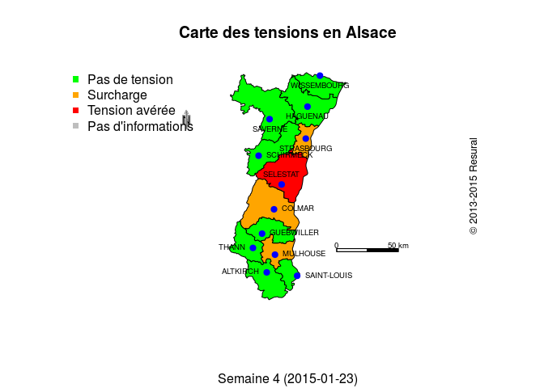

# Carte des tensions
JcB  
24/01/2014  

Carte des tensions
========================================================

A partir des tensions déclarées par les établissements d'Alsace, une carte de situation est dessinée.

Elements nécessaires:

- un fond de carte rprésentant les douze secteurs de proximité
- le fichier des villes siège de SU (coordonnées en Lambert étendu)
- le fichier des tensions

Le fichier des tensions, __tensions.csv__, comptabiise les tensions hebdomadaires pour chacun des 12 territoires de proximité. La tension est mesurée par une échelle allant de 1 à 3. La somme des 12 territoires varie de 12 à 36.


```r
library("maptools")
```

```
## Loading required package: foreign
## Loading required package: sp
## Loading required package: grid
## Loading required package: lattice
## Checking rgeos availability: TRUE
```

```r
library("lubridate")

# load("doc/cartographie/RPU2013_Carto_Pop/zone_proximite.Rda")    # czps
load("../RPU2013_Carto_Pop/zone_proximite.Rda")    # czps

load("../RPU2013_Carto_Pop/zp_villes.Rda")         # d

score <- read.csv("tensions.csv") # lecture du fichier des tensions

source("../../../Routines/mes_fonctions.R")       # copyright

# couleur du territoire de santé (par défaut tout est vert):
col <- rep("green",12)

# 1 = Wissembourg
# 2 = Mulhouse
# 3 = Altkirch
# 4 = St Louis
# 5 = Haguenau
# 6 = Saverne
# 7 = Strasbourg
# 8 = Schirmeck
# 9 = Selestat
# 10 = Colmar
# 11 = Guebwiller
# 12 = Thann

# pour un test
# j <- today()  # date d'aujourd'hui
# date <- format(Sys.time(), "%A %d %B %Y %H:%M:%S")
# tension <- c(1,1,1,1,1,1,1,1,2,1,1,1)
# subtitle <- "Semaine 5 (27-2 février 2014)"

# nouvelle formulation: utilise tension.R
source("tensions.R")
ligne <- 13 # ligne du fichier score correspondant à la date du jour
carte_tension(ligne, score, czps, d)
```

 

```r
# Ancienne version remplacée par tensions.R
# ligne <- 11 # ligne du fichier score correspondant à la date du jour
# date <- as.Date(score[ligne, 1]) # récupère la date (1ère colonne)
# s <- week(date) # détermine le n° de la semaine
# subtitle <- paste0("Semaine ", s, " (", date, ")")
# 
# tension <- score[ligne, c(2:13)] # liste des tensions
# 
# col <- rep("grey",12) # par défaut toutes les territoires sont gris
# for(i in 1:12){
#   if(tension[i] == 1){
#     col[i] = "green"}
#   else if(tension[i] == 2){
#     col[i] = "orange"}
#   else if(tension[i] == 3){
#     col[i] = "red"}
# }
# 
# # dessin de la carte
# plot(czps, col=col, axes=F)
# 
# # dessin des villes
# for(i in 1:nrow(d)){
#   points(d[i,2], d[i,3], pch=19, col="blue")
#   text(x=as.numeric(d[i,2]), y=as.numeric(d[i,3]), labels=d[i,1], cex=0.6, pos=d[i,4])
# }
# 
# # rose des vents
# SpatialPolygonsRescale(layout.north.arrow(1), offset= c(950000,6850000), scale = 15000, col="grey",plot.grid=F)
# 
# # échelle
# x_scale = 1075000
# SpatialPolygonsRescale(layout.scale.bar(), offset=c(x_scale,6750000), height = 0.05, scale=50000, fill=c("transparent","black"), plot.grid=F)
# text(x_scale,6750000 + 5000, "0", cex=0.6)
# text(x_scale + 50000, 6753387+2000, "50 km", cex=0.6)
# 
# # Legende
# legend("topleft", legend=c("Pas de tension","Surcharge","Tension avérée","Pas d'informations"), col=c("green","orange","red","grey"), pch=15, bty="n")
# 
# # title
# # subtitle <- format(Sys.time(), "%A %d %B %Y %H:%M:%S")
# # subtitle <- "Semaine n°__ (du __/__/____ au __/__/____)"
# 
# title("Carte des tensions en Alsace", sub = subtitle)
# 
# copyright(an ="2013-2015", line=-3)
```
