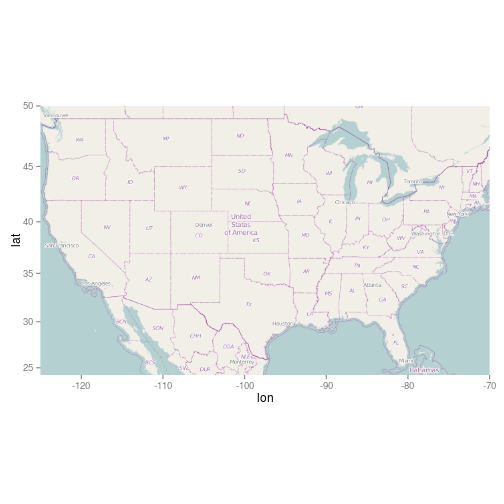
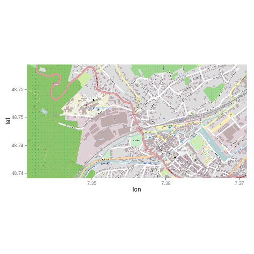
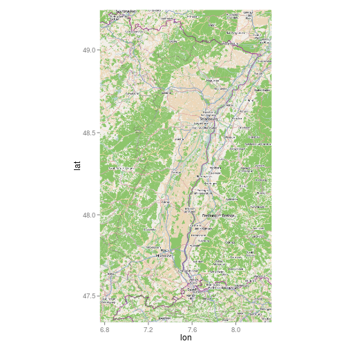
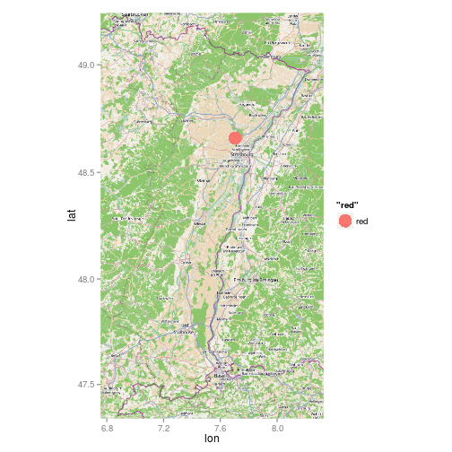

Carto avec OSM
========================================================

source: http://www.r-bloggers.com/short-tales-of-two-ncaa-basketball-conferences-big-12-and-west-coast-using-graphs/

Utilisation d'OSM comme fond de carte et projection de points définis par l"utilisateur. Nécessite de connaître le rectangle englobant une région.


```r
library(XML)
library(ggmap)
```

```
## Loading required package: ggplot2
```

```r
library(ggplot2)
library(plyr)
location = c(-125, 24.207, -70, 50)
map = get_map(location = location, maptype = "roadmap", source = "osm")
usmap = ggmap(map)
usmap
```

 

Hôpital Saint-Jacques
---------------------
Les coordonnées ont été récupérées via JOSM et se mettent dans l'ordre left, bottom, right, top ou log minimale, latitude minimale, long maximale, latitude maximale

```r
location = c(7.3412275, 48.7395924, 7.3709893, 48.7497235)
map = get_map(location = location, maptype = "roadmap", source = "osm")
ggmap(map)
```

 

geocode {ggmap}
-------
geocodes a location using Google Maps. Note that in most cases by using this function you are agreeing to the Google Maps API Terms of Service at https://developers.google.com/maps/terms.


```r
geocode("8 rue des noyers, Vendenheim", output = "latlon")
```

```
##     lon   lat
## 1 7.704 48.66
```

```r
geocode("8 rue des noyers, Vendenheim", output = "latlona")
```

```
##     lon   lat                                    address
## 1 7.704 48.66 8 rue des noyers, 67550 vendenheim, france
```

```r
geocode("8 rue des noyers, Vendenheim", output = "more")
```

```
##     lon   lat           type            loctype
## 1 7.704 48.66 street_address range_interpolated
##                                      address north south  east  west
## 1 8 rue des noyers, 67550 vendenheim, france 48.67 48.66 7.705 7.702
##   postal_code country administrative_area_level_2
## 1       67550  france                    bas-rhin
##   administrative_area_level_1   locality         street streetNo
## 1                      alsace vendenheim rue des noyers        8
##   point_of_interest                        query
## 1              <NA> 8 rue des noyers, Vendenheim
```


Alsace
------

```r
location = c(6.7565918, 47.3388227, 8.3276367, 49.2391208)
map = get_map(location = location, maptype = "roadmap", source = "osm")
save(map, file = "alsace_osm.R")
als_map <- ggmap(map)
als_map
```

 

```r
# Dessine la carte + un point rouge pour Vendenheim
als_map + geom_point(aes(x = 7.704, y = 48.66, colour = "red"), size = 7)
```

 

